# Factorio Benchmark Results

**Platform:** windows-x86_64  
**Factorio Version:** 2.0.55  

## Scenario
A belt fed with stacked stack inserters will be picked up every 120 ticks by 15 legendary stack inserters.
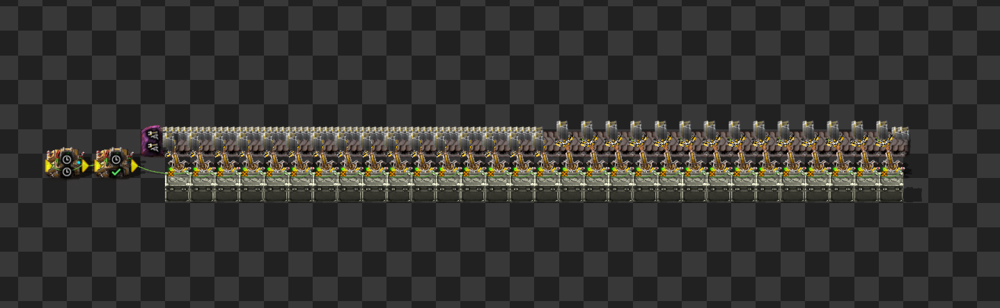

Each inserter will be enabled for exactly 8 ticks out of every 120 seconds to pick up items off the belt. 
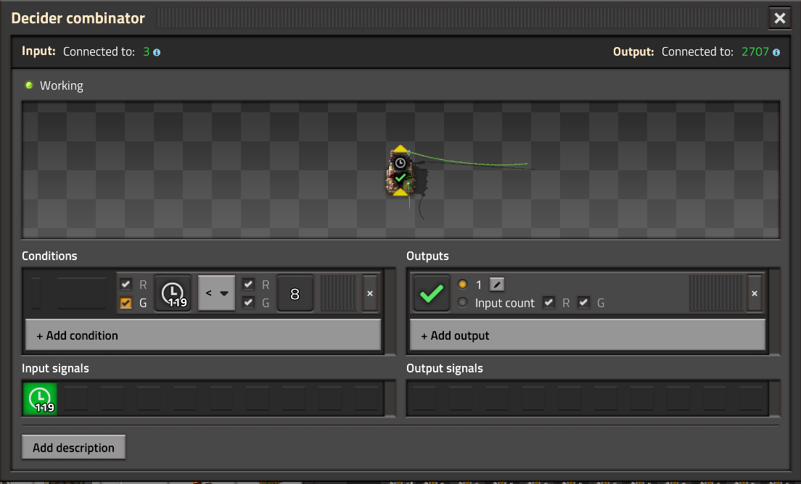
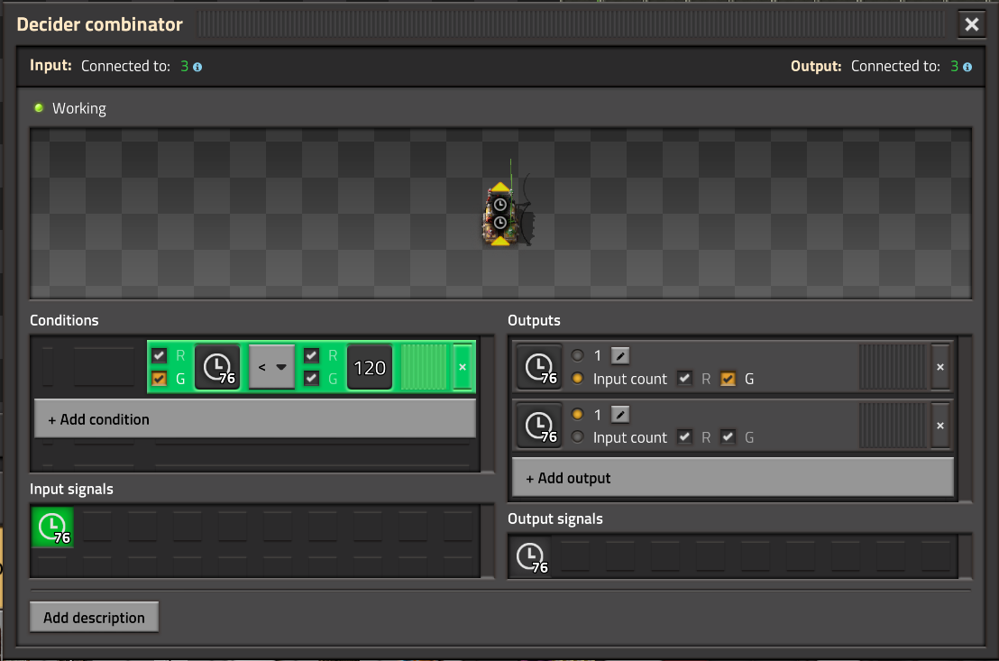

This test is intended to test if having multiple networks operating on the same clock, multiple clocks with the exact same starting value, or staggered inserters is better for UPS.

Each test is setup to have 16 columns of 92 copies of the above shown example for a total of 44160 legendary stack inserters per test file.

The following section will outline in detail each of the test save files.

### Scenario 1: 1 Clock
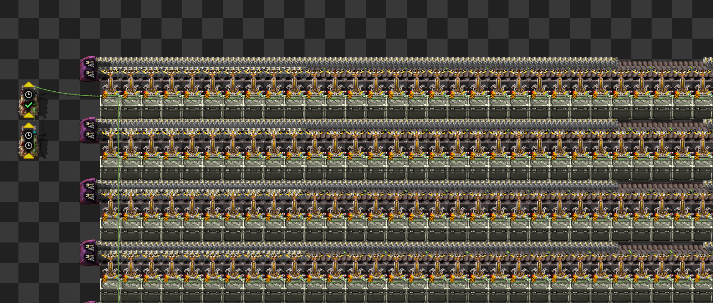

All inserters are activated for the same 8 ticks

### Scenario 2: 1 Clock 16 Offsets
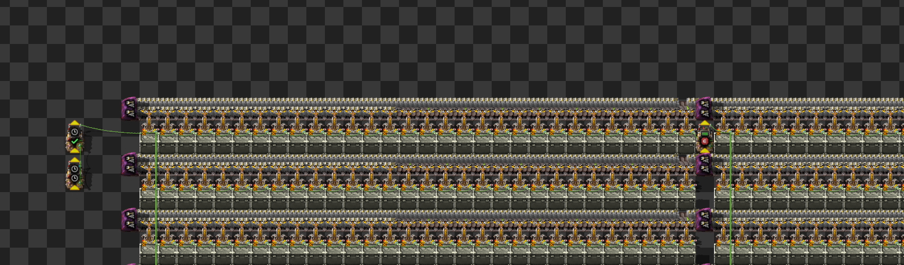

Each column is separated by a decider combinator that delays the input naturally by 1 tick

### Scenario 3: 16 Clocks
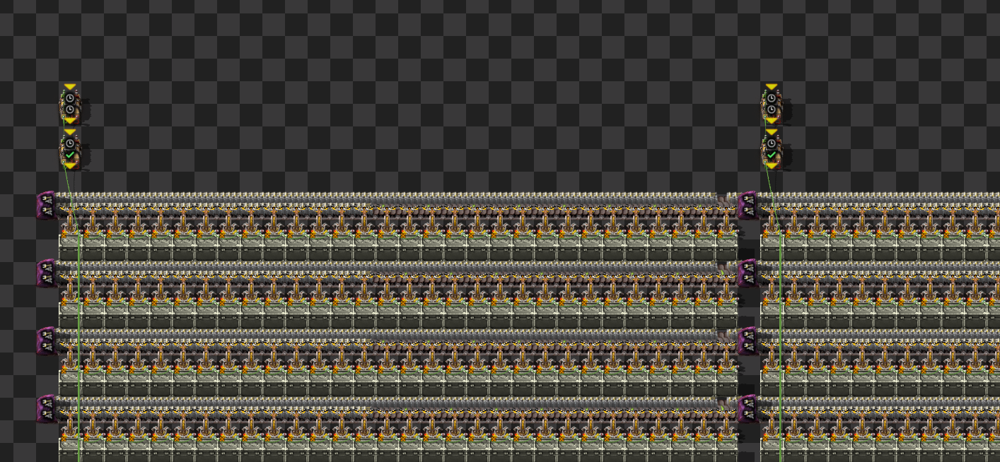
Game is paused and 16 clocks are connected to 16 independent columns so that all clocks are started at the same time with the same internal values in each combinator.

### Scenario 4: 16 Clocks 92 Offsets
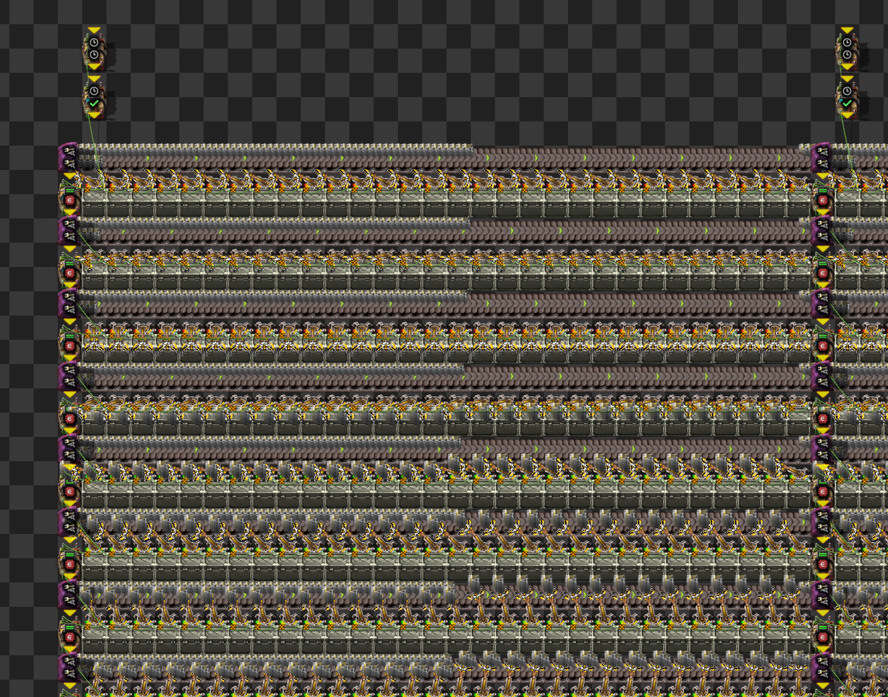
Game is paused and 16 clocks are connected to 16 independent columns so that all clocks are started at the same time with the same internal values in each combinator. Each row is separated by a decider combinator that delays the input naturally by 1 tick.

### Scenario 5: 92 Clocks
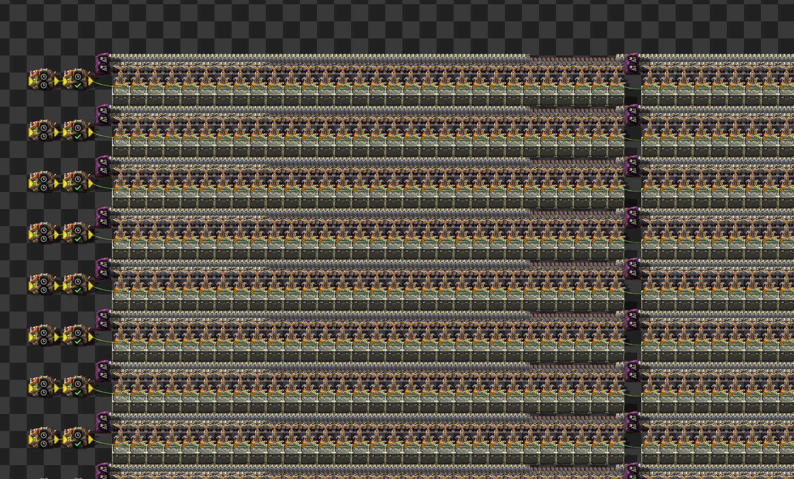
Game is paused and 92 clocks are connected to 92 independent rows so that all clocks are started at the same time with the same internal values in each combinator.

### Scenario 6: 92 Clocks 16 Offsets
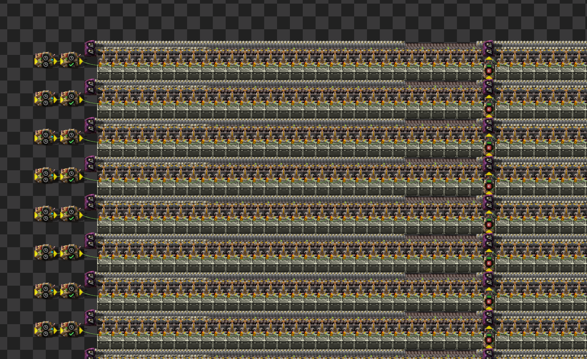
Game is paused and 92 clocks are connected to 92 independent rows so that all clocks are started at the same time with the same internal values in each combinator. Each column is separated by a decider combinator that delays the input naturally by 1 tick.

## Number of Circuit Networks

The following lists the number of circuit networks excluding the circuit networks for each clock. 

The tick spread is how many 1 tick delays there are from the source clock to the last block of 30 inserters in the circuit network daisy chain. In other words, The inserters directly connected to the clock activate at tick 0 and the last block of inserters are active N ticks after that.

| Save                          | Circuit Networks | Tick Spread |
| ----------------------------- | ---------------- | ----------- |
| bench_44k_01_clock            | 1                | 0           |
| bench_44k_01_clock_16_offset  | 16               | 15          |
| bench_44k_16_clock            | 16               | 0           |
| bench_44k_16_clock_92_offsets | 1472             | 91          |
| bench_44k_92_clock            | 92               | 0           |
| bench_44k_92_clock_16_offset  | 1472             | 15          |

## Results
| Metric            | Description                           |
| ----------------- | ------------------------------------- |
| **Mean UPS**      | Updates per second - higher is better |
| **Mean Avg (ms)** | Average frame time - lower is better  |
| **Mean Min (ms)** | Minimum frame time - lower is better  |
| **Mean Max (ms)** | Maximum frame time - lower is better  |

> All saves were run sequentially one save file after the other 10 times for a duration of 6000 ticks each. This resulted in a total of 60 total benchmark runs.

| Save                          | Avg (ms) | Min (ms) | Max (ms) | UPS     | Execution Time (ms) |
| ----------------------------- | -------- | -------- | -------- | ------- | ------------------- |
| bench_44k_16_clock            | 1.897    | 0.544    | 35.262   | 527     | 113817              |
| bench_44k_92_clock            | 1.888    | 0.556    | 32.200   | 529     | 113307              |
| bench_44k_01_clock            | 1.872    | 0.554    | 32.525   | 534     | 112311              |
| bench_44k_92_clock_16_offset  | 1.854    | 0.735    | 12.965   | 539     | 111224              |
| bench_44k_01_clock_16_offset  | 1.811    | 0.712    | 12.519   | 552     | 108657              |
| bench_44k_16_clock_92_offsets | 1.790    | 0.758    | 10.967   | **558** | 107423              |

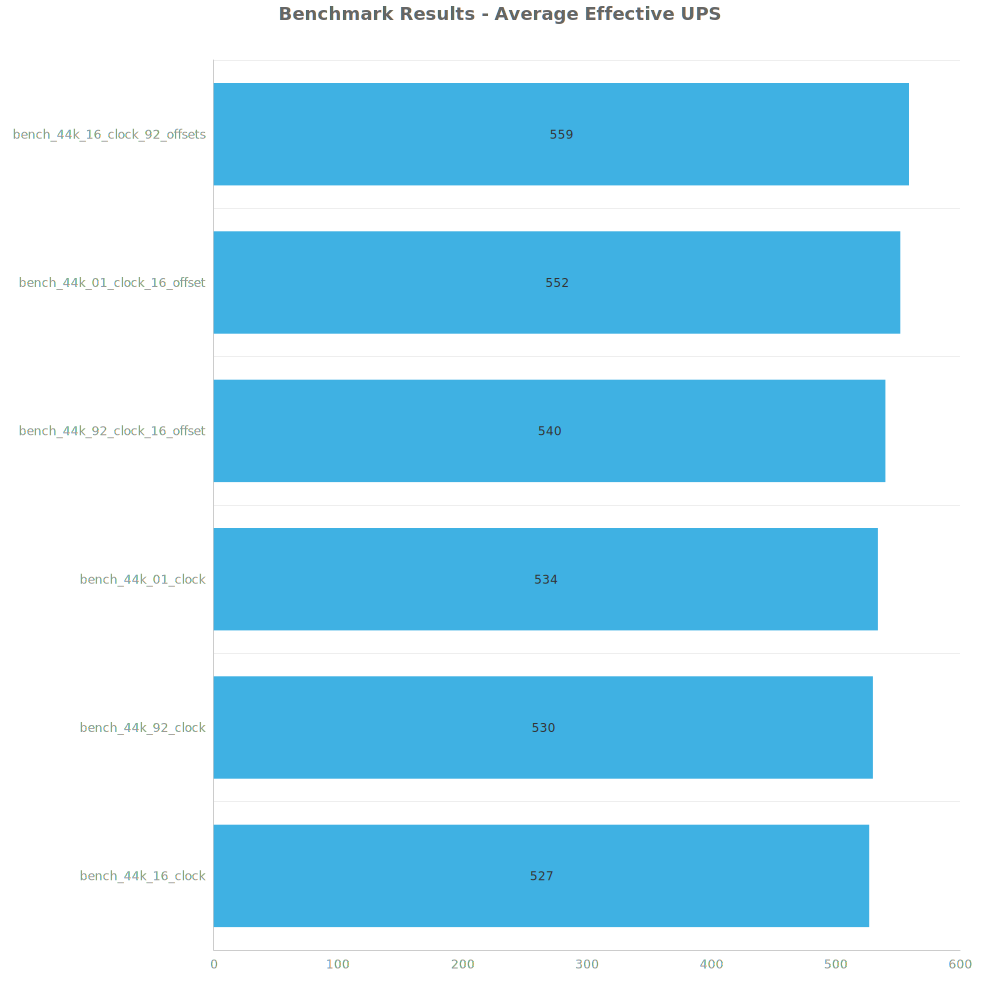

Box and Whisker Plot:
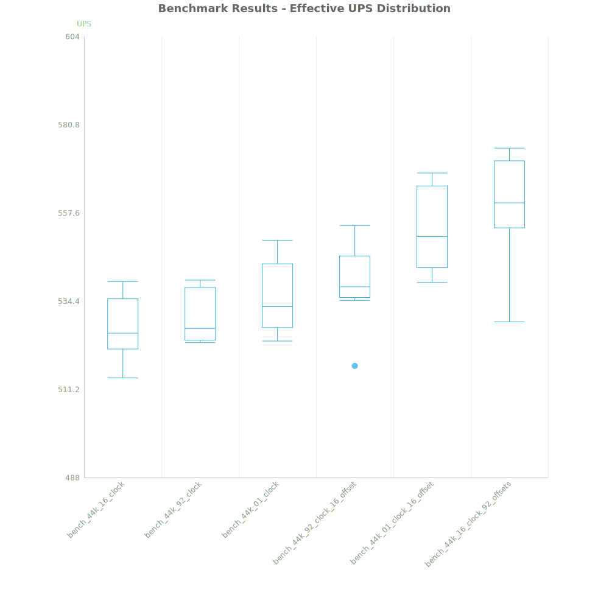

| Save                          | % Difference from base |
| ----------------------------- | ---------------------- |
| bench_44k_16_clock            | 0.00%                  |
| bench_44k_92_clock            | 0.44%                  |
| bench_44k_01_clock            | 1.35%                  |
| bench_44k_92_clock_16_offset  | 2.34%                  |
| bench_44k_01_clock_16_offset  | 4.76%                  |
| bench_44k_16_clock_92_offsets | 5.99%                  |

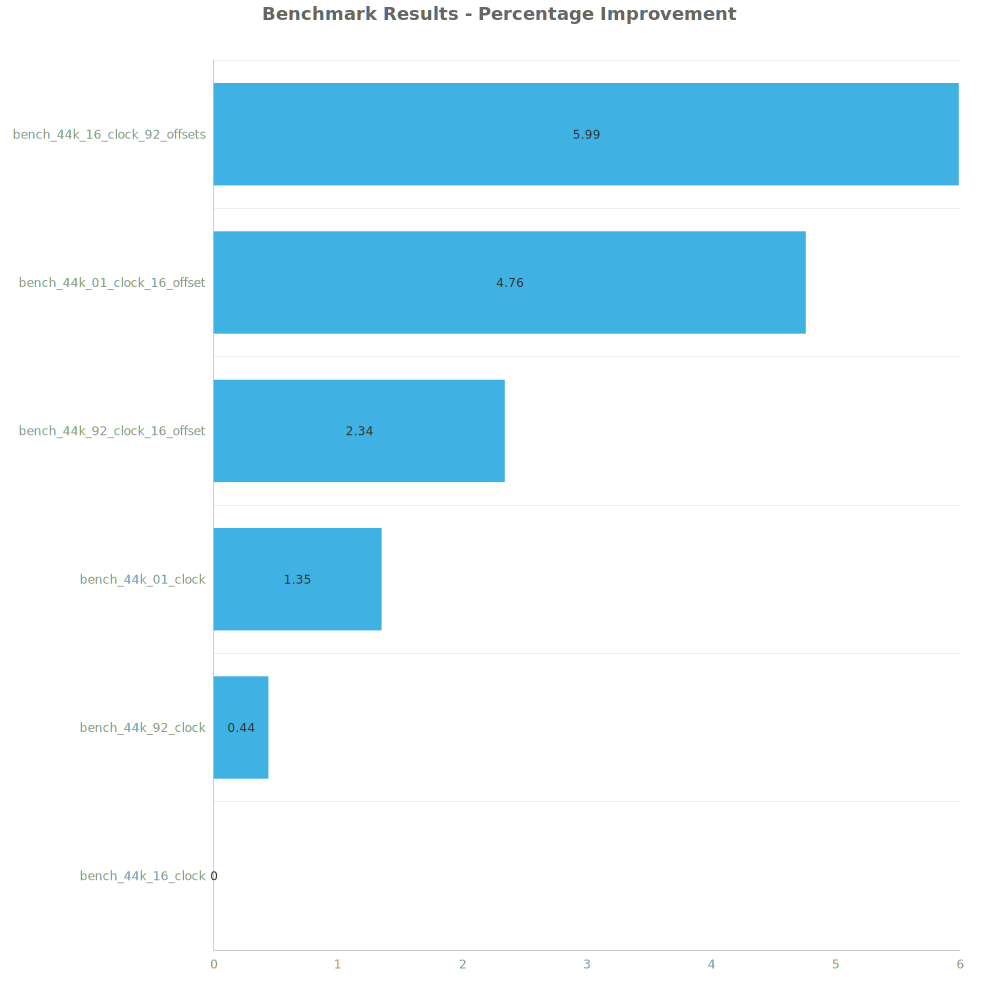

## Conclusion
The benchmark results clearly show that staggering inserter activity across ticks significantly improves UPS performance. The worst-performing configuration was `Scenario 1: 1 Clock`, where all 44,160 inserters were activated in perfect synchronization over the same 8 ticks. This scenario resulted in the lowest average UPS (534) and the highest maximum frame time (32.525 ms), indicating severe update spikes.

By contrast, introducing staggered activation patterns—either through offset delays or distributed clocks—helped spread out the computational workload more evenly across game ticks. The best-performing setup was `Scenario 6: 16 Clocks with 92 Offsets`, which yielded the highest UPS (558) and the lowest maximum frame time (10.967 ms), a 6% improvement over the baseline.

The results indicate two key performance optimization strategies:
1. Offsetting inserter activations, even by just 1 tick per group, helps flatten performance spikes and improve consistency.
2. Distributing the control logic across multiple independent circuit networks, rather than concentrating all logic through a single source, yields better UPS scalability as the number of entities grows.

In summary, evenly distributing logic timing and avoiding synchronous operations across massive entity counts is crucial for maximizing UPS in high-performance Factorio megabases. For circuit-heavy builds, using delayed activation schemes and multiple clocks with offsets is a highly effective approach.