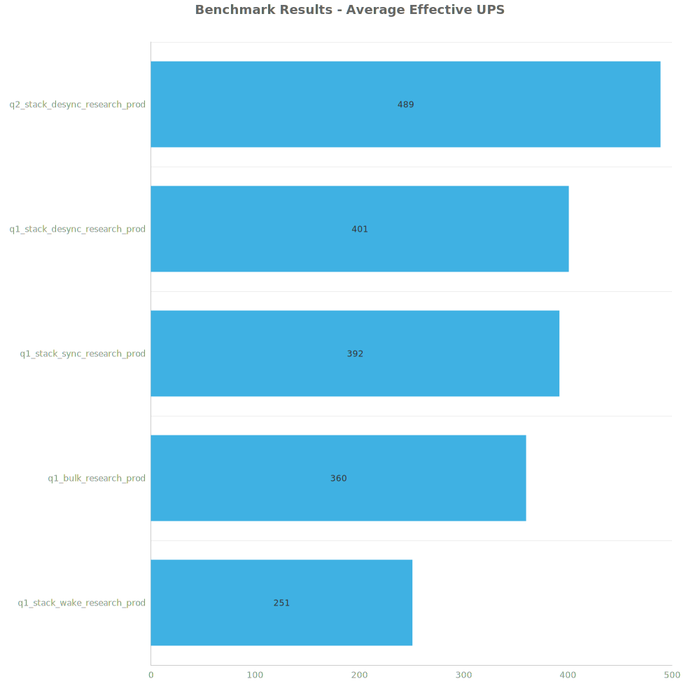
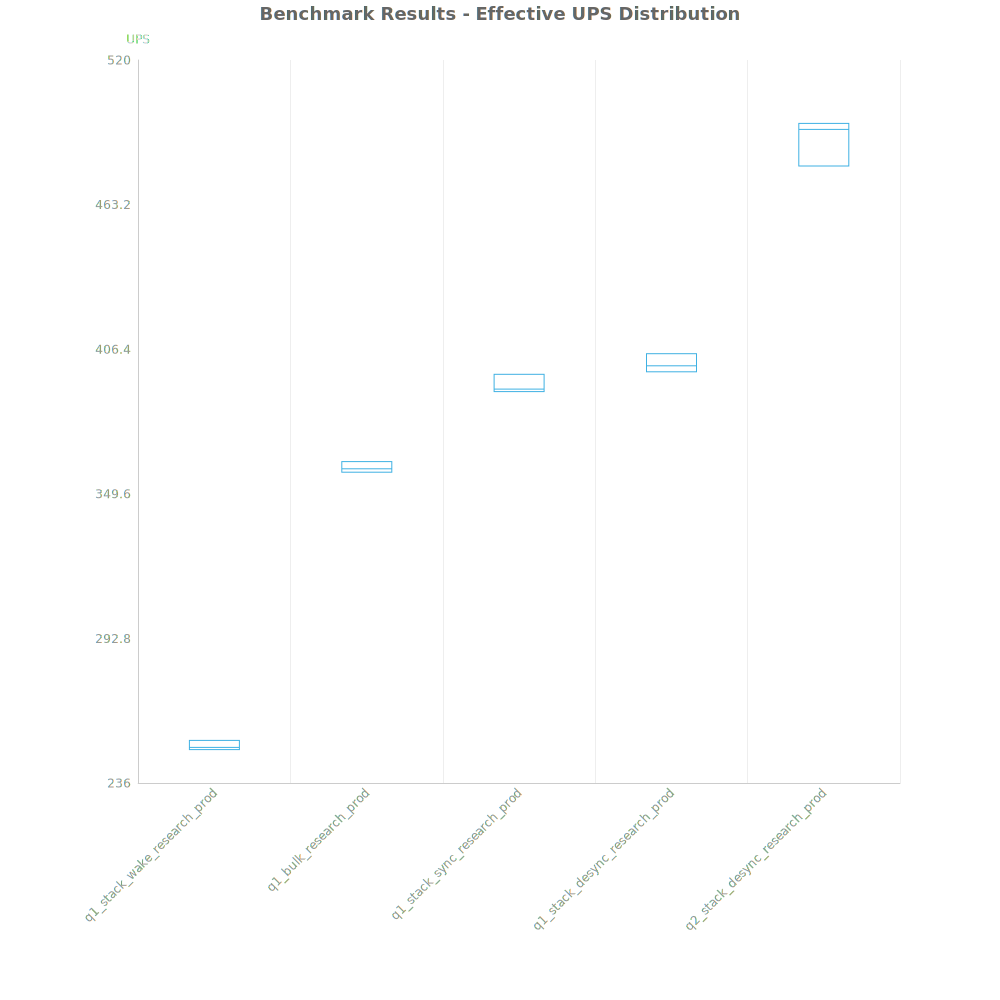
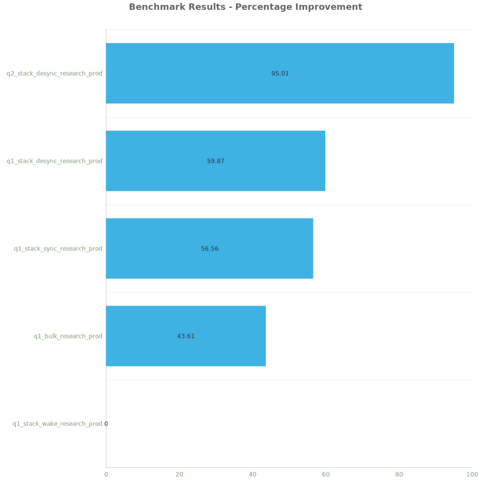

# Factorio Benchmark Results

**Platform:** windows-x86_64  
**Factorio Version:** 2.0.60  

## Scenario
4096 labs running research productivity

## Results
| Metric            | Description                           |
| ----------------- | ------------------------------------- |
| **Mean UPS**      | Updates per second - higher is better |
| **Mean Avg (ms)** | Average frame time - lower is better  |
| **Mean Min (ms)** | Minimum frame time - lower is better  |
| **Mean Max (ms)** | Maximum frame time - lower is better  |

| Save                          | Avg (ms) | Min (ms) | Max (ms) | UPS     | Execution Time (ms) |
| ----------------------------- | -------- | -------- | -------- | ------- | ------------------- |
| q1_stack_wake_research_prod   | 3.990    | 1.169    | 30.721   | 250     | 574606              |
| q1_bulk_research_prod         | 2.779    | 0.919    | 43.318   | 359     | 400101              |
| q1_stack_sync_research_prod   | 2.549    | 0.901    | 38.620   | 392     | 367037              |
| q1_stack_desync_research_prod | 2.496    | 0.902    | 12.856   | 400     | 359419              |
| q2_stack_desync_research_prod | 2.047    | 0.894    | 10.911   | **488** | 294714              |

Box and Whisker Plot:

| Save                          | % Difference from base |
| ----------------------------- | ---------------------- |
| q1_stack_wake_research_prod   | 0.00%                  |
| q1_bulk_research_prod         | 43.61%                 |
| q1_stack_sync_research_prod   | 56.56%                 |
| q1_stack_desync_research_prod | 59.87%                 |
| q2_stack_desync_research_prod | 95.01%                 |

