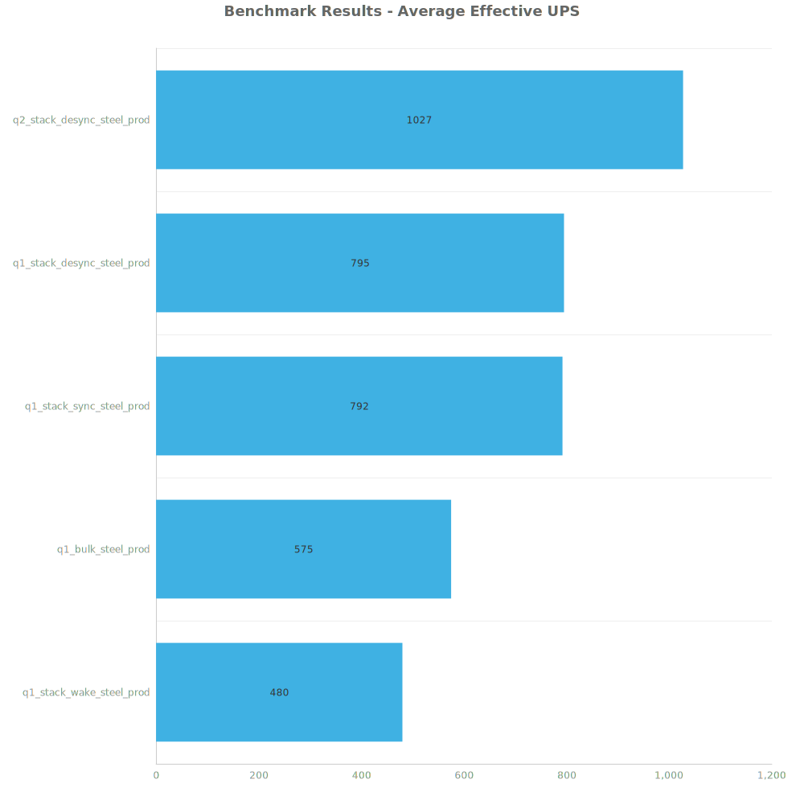
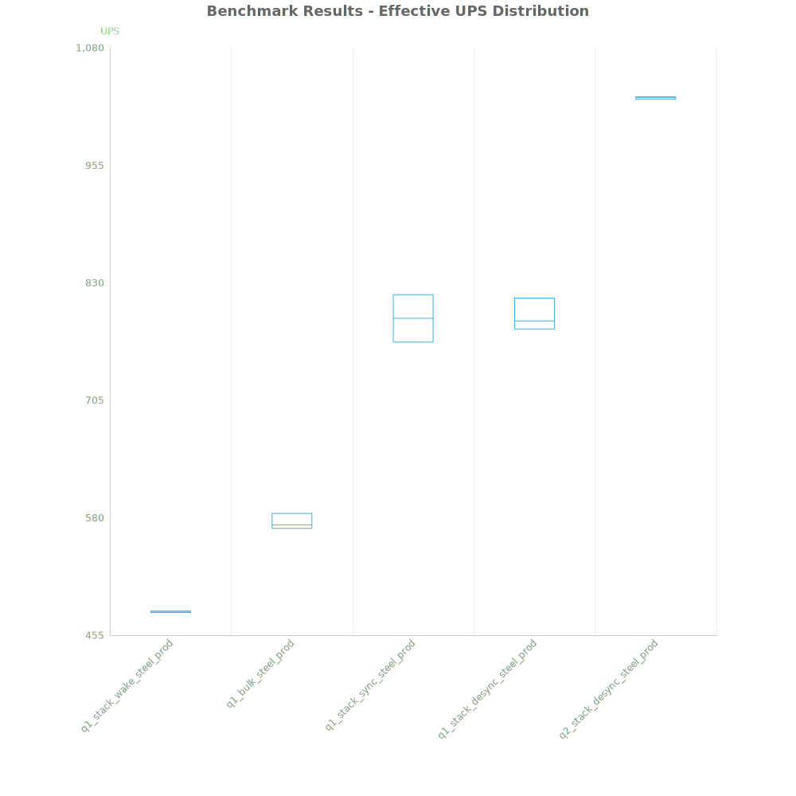
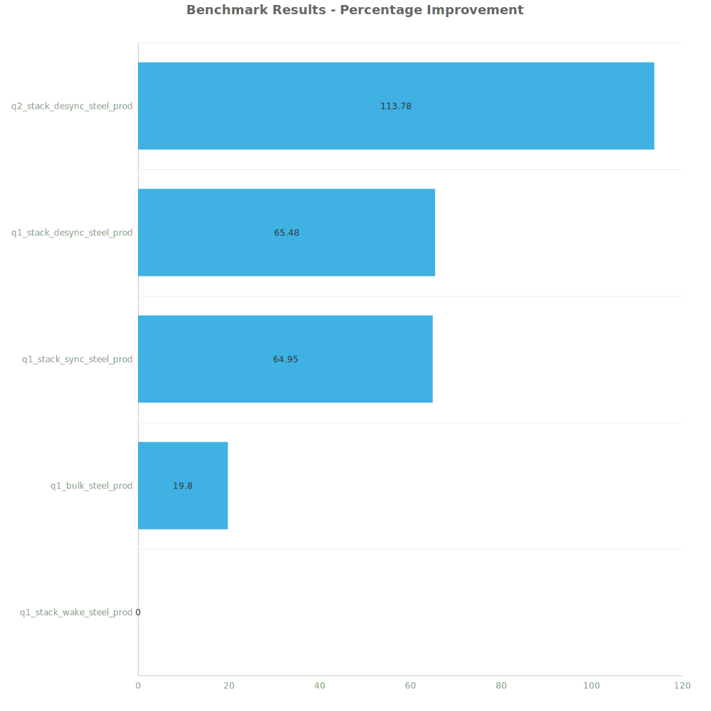

# Factorio Benchmark Results

**Platform:** windows-x86_64  
**Factorio Version:** 2.0.60  

## Scenario
4096 labs running steel plate productivity

## Results
| Metric            | Description                           |
| ----------------- | ------------------------------------- |
| **Mean UPS**      | Updates per second - higher is better |
| **Mean Avg (ms)** | Average frame time - lower is better  |
| **Mean Min (ms)** | Minimum frame time - lower is better  |
| **Mean Max (ms)** | Maximum frame time - lower is better  |

| Save                       | Avg (ms) | Min (ms) | Max (ms) | UPS      | Execution Time (ms) |
| -------------------------- | -------- | -------- | -------- | -------- | ------------------- |
| q1_stack_wake_steel_prod   | 2.082    | 0.754    | 29.802   | 480      | 299864              |
| q1_bulk_steel_prod         | 1.738    | 0.659    | 33.410   | 575      | 250342              |
| q1_stack_sync_steel_prod   | 1.263    | 0.674    | 14.188   | 792      | 181911              |
| q1_stack_desync_steel_prod | 1.259    | 0.692    | 4.924    | 794      | 181261              |
| q2_stack_desync_steel_prod | 0.974    | 0.533    | 5.421    | **1026** | 140270              |

Box and Whisker Plot:

| Save                       | % Difference from base |
| -------------------------- | ---------------------- |
| q1_stack_wake_steel_prod   | 0.00%                  |
| q1_bulk_steel_prod         | 19.80%                 |
| q1_stack_sync_steel_prod   | 64.95%                 |
| q1_stack_desync_steel_prod | 65.48%                 |
| q2_stack_desync_steel_prod | 113.78%                |

