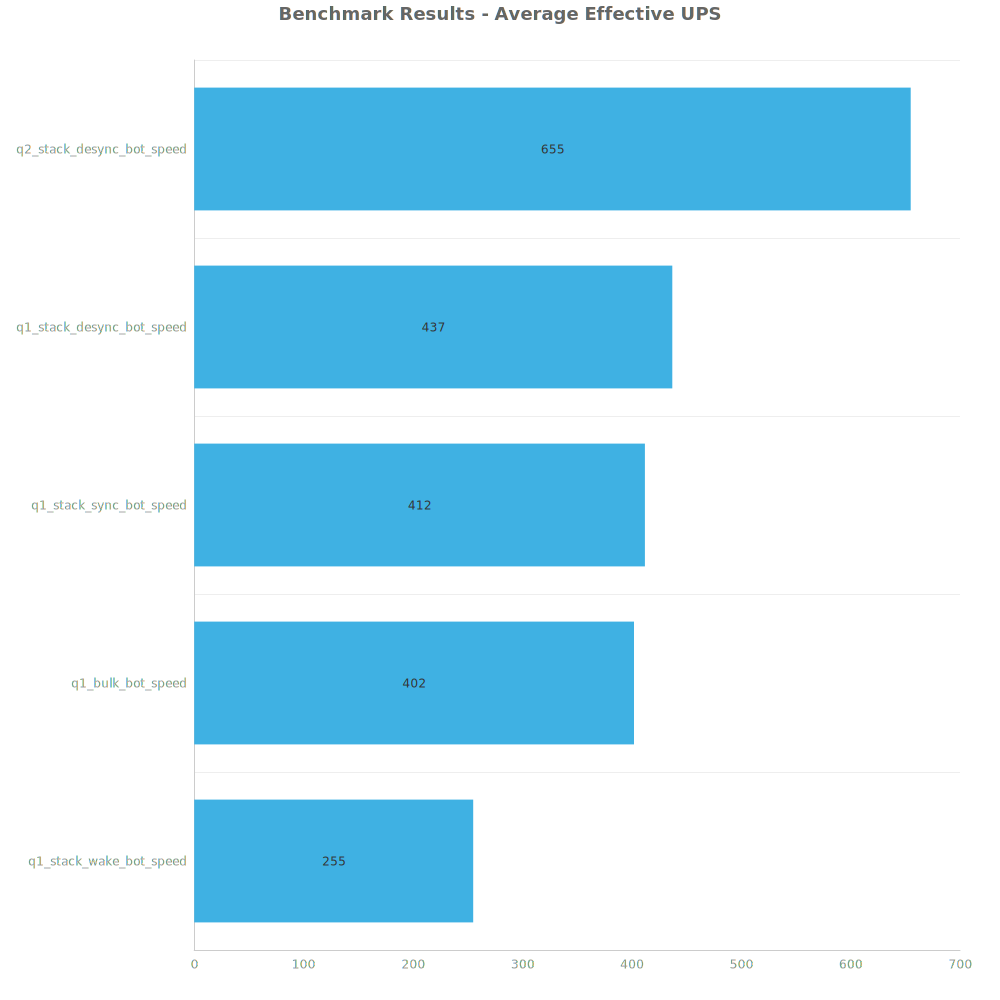
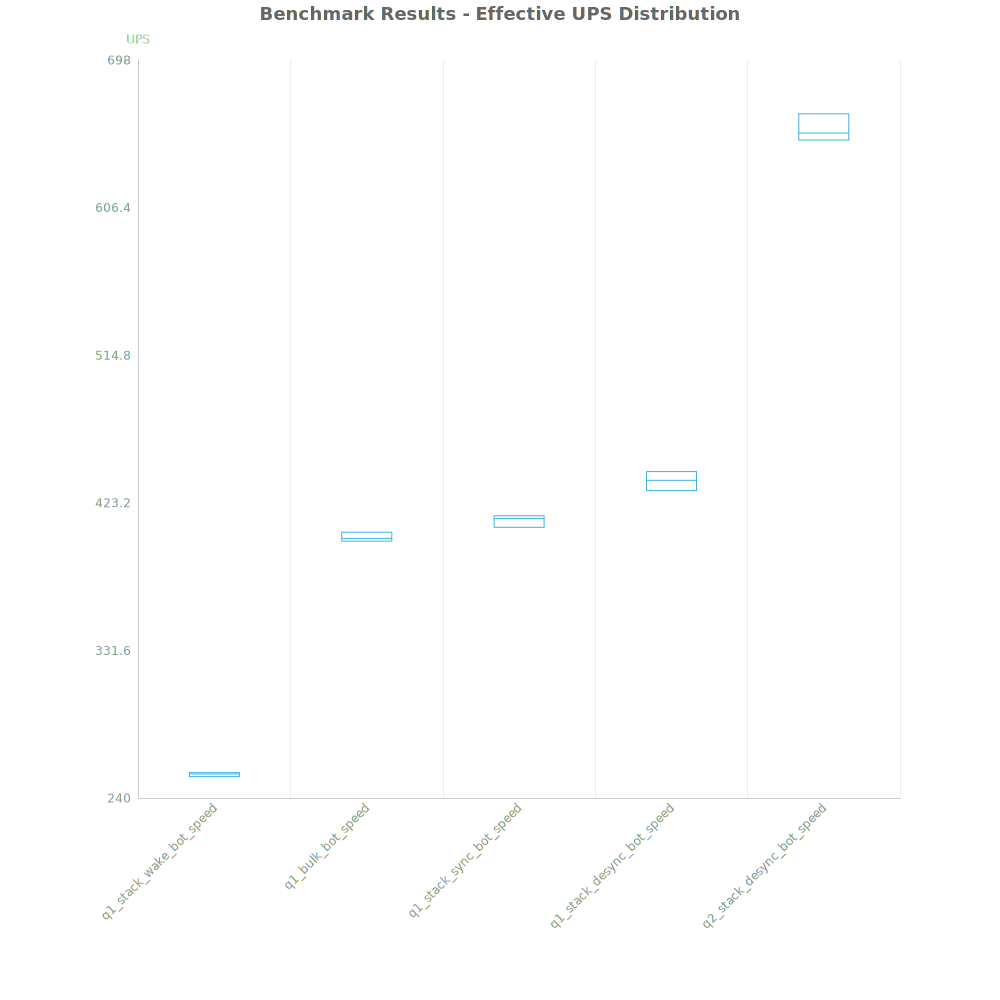
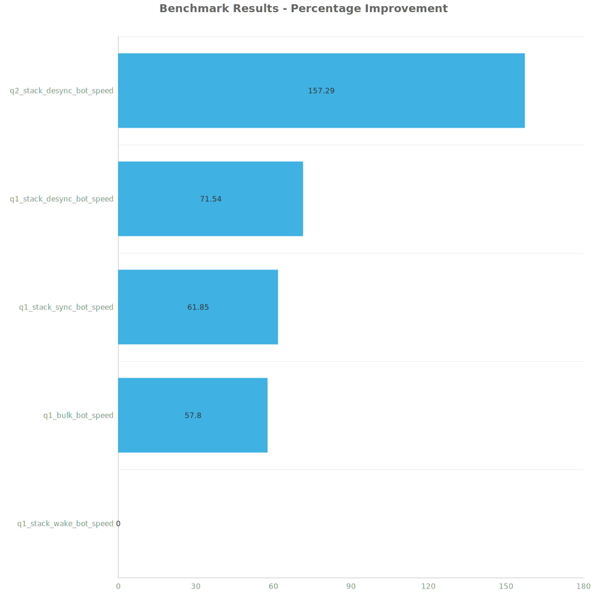

# Factorio Benchmark Results

**Platform:** windows-x86_64  
**Factorio Version:** 2.0.60  

## Scenario
4096 labs running bot speed

## Results
| Metric            | Description                           |
| ----------------- | ------------------------------------- |
| **Mean UPS**      | Updates per second - higher is better |
| **Mean Avg (ms)** | Average frame time - lower is better  |
| **Mean Min (ms)** | Minimum frame time - lower is better  |
| **Mean Max (ms)** | Maximum frame time - lower is better  |

| Save                      | Avg (ms) | Min (ms) | Max (ms) | UPS     | Execution Time (ms) |
| ------------------------- | -------- | -------- | -------- | ------- | ------------------- |
| q1_stack_wake_bot_speed   | 3.927    | 1.187    | 30.560   | 254     | 565456              |
| q1_bulk_bot_speed         | 2.489    | 0.884    | 35.371   | 401     | 358353              |
| q1_stack_sync_bot_speed   | 2.426    | 0.899    | 27.020   | 412     | 349374              |
| q1_stack_desync_bot_speed | 2.289    | 1.044    | 8.012    | 436     | 329673              |
| q2_stack_desync_bot_speed | 1.526    | 0.647    | 7.853    | **655** | 219795              |

Box and Whisker Plot:

| Save                      | % Difference from base |
| ------------------------- | ---------------------- |
| q1_stack_wake_bot_speed   | 0.00%                  |
| q1_bulk_bot_speed         | 57.80%                 |
| q1_stack_sync_bot_speed   | 61.85%                 |
| q1_stack_desync_bot_speed | 71.54%                 |
| q2_stack_desync_bot_speed | 157.29%                |

