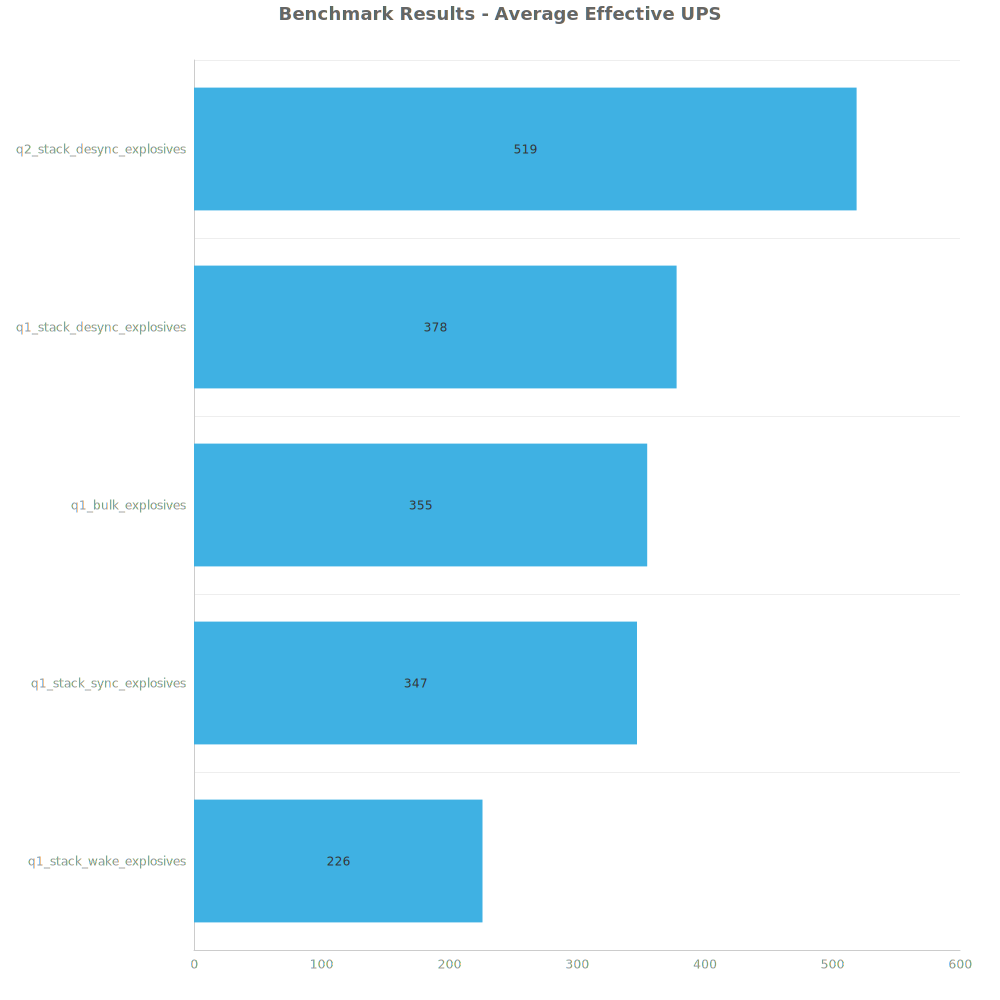
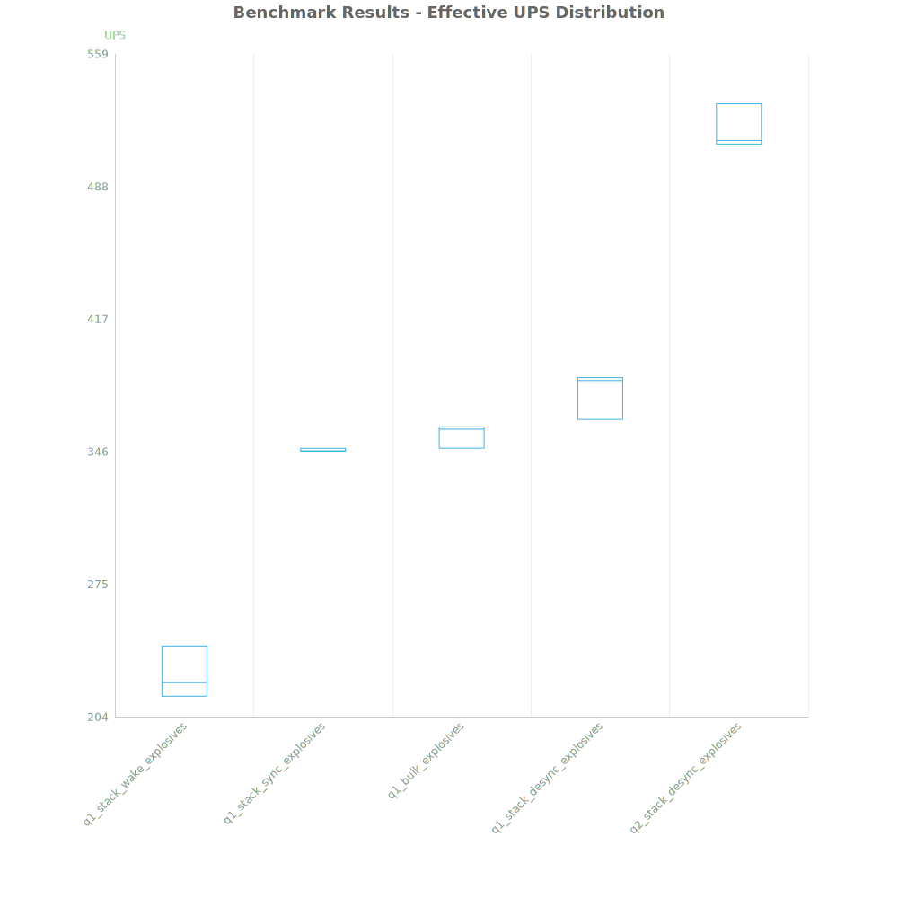
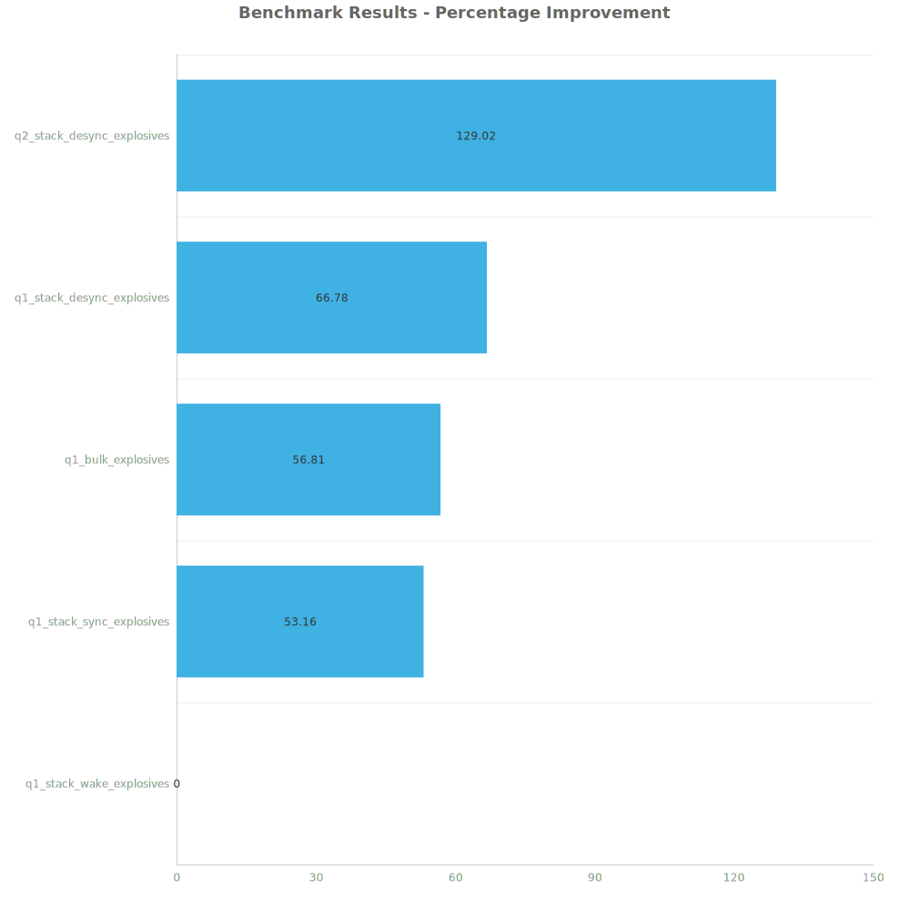

# Factorio Benchmark Results

**Platform:** windows-x86_64  
**Factorio Version:** 2.0.60  

## Scenario
4096 labs running stronger explosives

## Results
| Metric            | Description                           |
| ----------------- | ------------------------------------- |
| **Mean UPS**      | Updates per second - higher is better |
| **Mean Avg (ms)** | Average frame time - lower is better  |
| **Mean Min (ms)** | Minimum frame time - lower is better  |
| **Mean Max (ms)** | Maximum frame time - lower is better  |

| Save                       | Avg (ms) | Min (ms) | Max (ms) | UPS     | Execution Time (ms) |
| -------------------------- | -------- | -------- | -------- | ------- | ------------------- |
| q1_stack_wake_explosives   | 4.427    | 1.444    | 24.998   | 226     | 637568              |
| q1_stack_sync_explosives   | 2.884    | 0.903    | 31.192   | 346     | 415249              |
| q1_bulk_explosives         | 2.817    | 0.943    | 33.815   | 355     | 405669              |
| q1_stack_desync_explosives | 2.650    | 0.909    | 9.206    | 377     | 381614              |
| q2_stack_desync_explosives | 1.929    | 0.734    | 8.051    | **518** | 277799              |

Box and Whisker Plot:

| Save                       | % Difference from base |
| -------------------------- | ---------------------- |
| q1_stack_wake_explosives   | 0.00%                  |
| q1_stack_sync_explosives   | 53.16%                 |
| q1_bulk_explosives         | 56.81%                 |
| q1_stack_desync_explosives | 66.78%                 |
| q2_stack_desync_explosives | 129.02%                |

## Conclusion