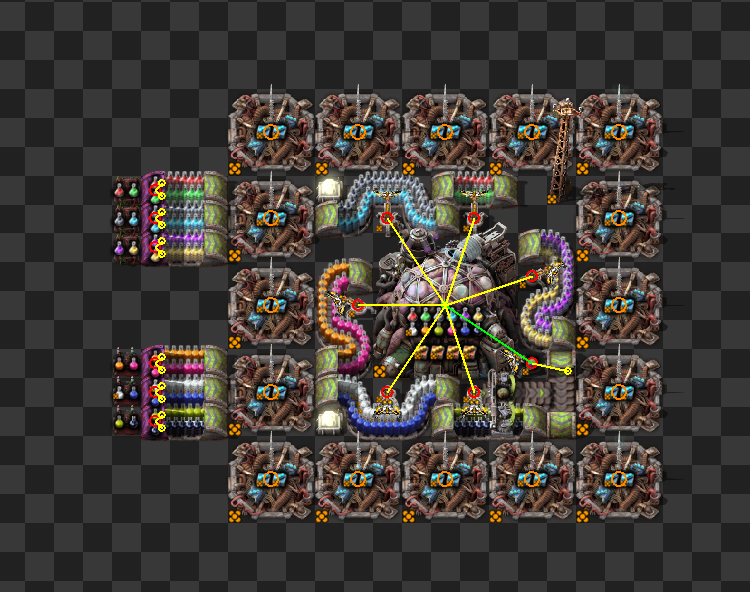
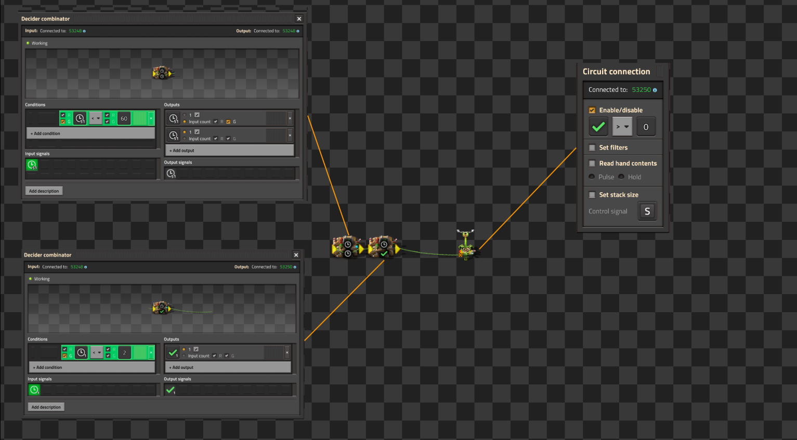
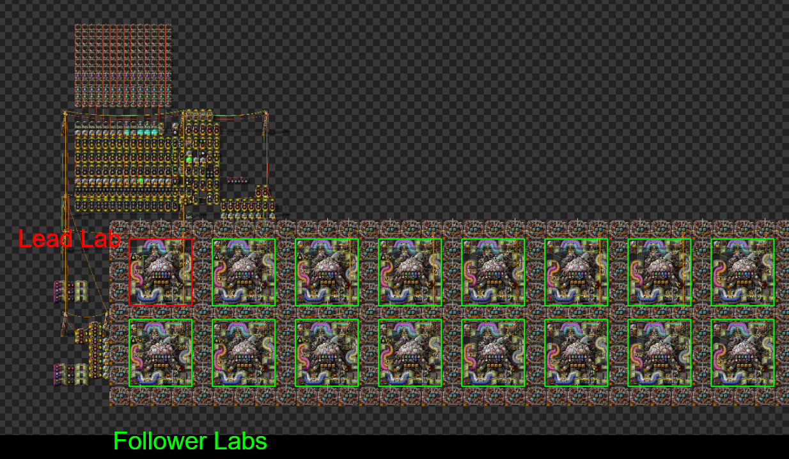
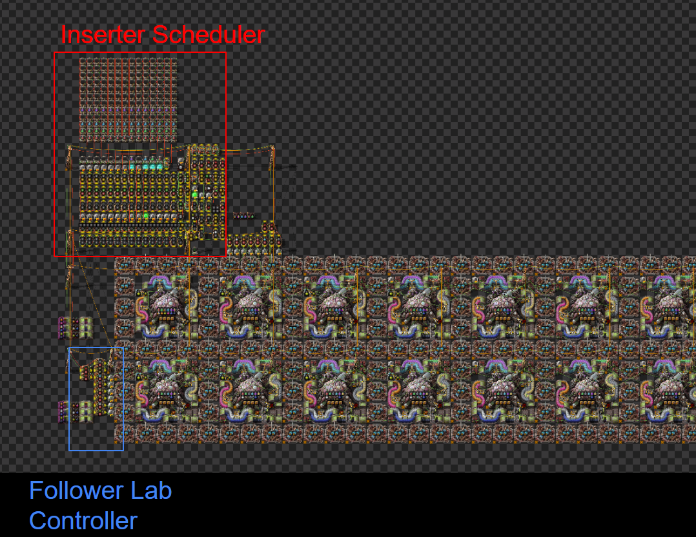
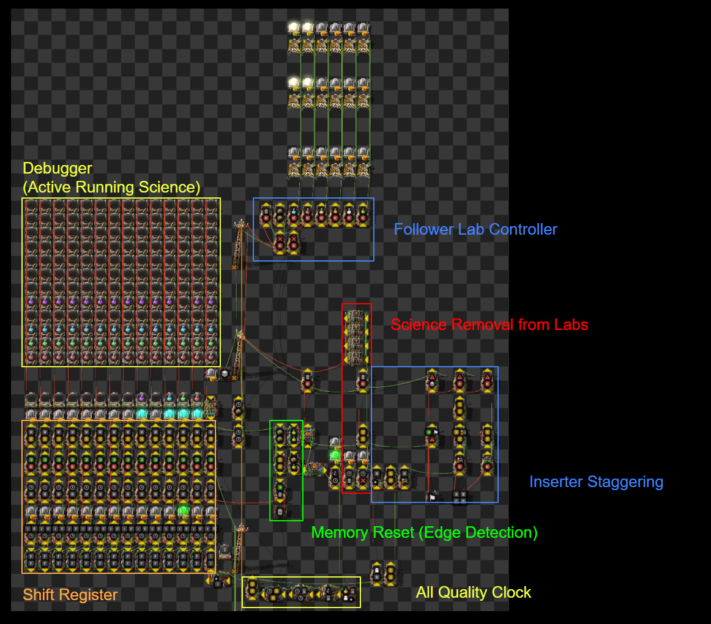
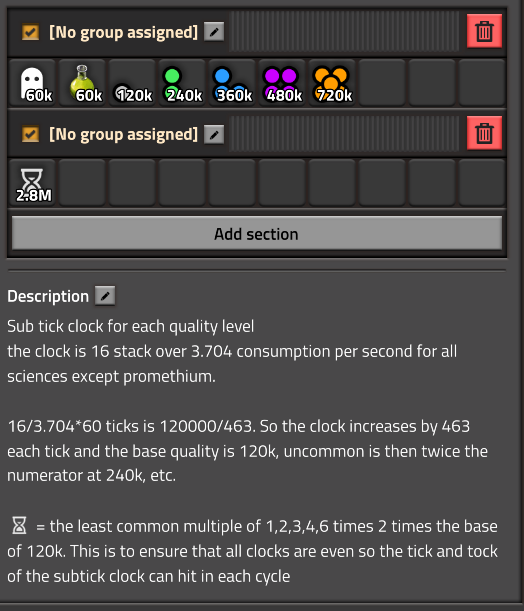
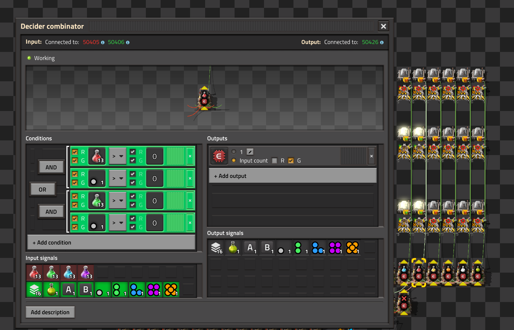
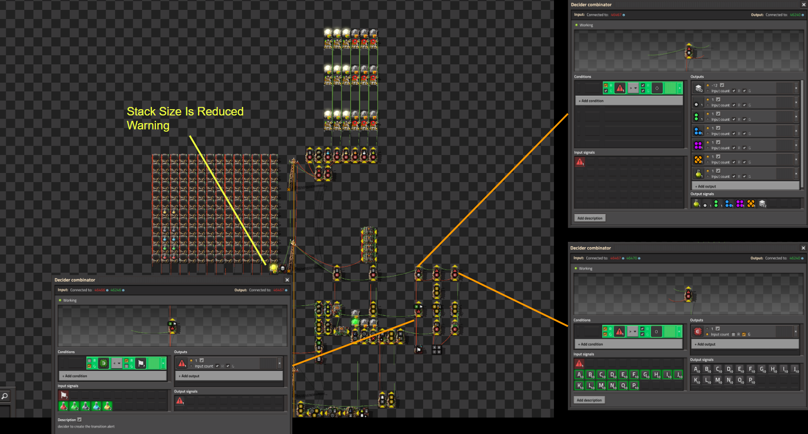

# Factorio Benchmark Results

**Platform:** windows-x86_64
**Factorio Version:** 2.0.60

## Scenario
- 4096 bio labs are controlled with varying control methods
- The main test is to compare two things:
  - the benefit of using uncommon science (Q2) for everything other than agriculture science and promethium science
  - the benefit of using stack 16 inserters with the new control method created over clocked bulk inserters which is the typical optimization done 

## Control Methods

### Wake List Only

Stack inserters set to stack 16 and all inserters are relying on wake lists to swing. This is more optimal over bulk inserters as they can swing with 16 items at once compared to 12 items.

### Clocked Bulk Inserters

Every 60 ticks, enabling the bulk inserter for 2 ticks is enough to trigger it to swing once and pick up 12 items every time and insert into the labs.

### Stack 16 Stack Inserters Lead Follower

One lab is monitored and reads the inserter hand contents set to pulse mode. These feed into the circuit matrix shown above the designated lead lab shown below:

The lead stores 14 previous cycles of time. A cycle is defined as the period of time required for an inserter to insert 16 items into the lab. This period is 259.17 ticks in practice or 120000/463 as a fraction.

The following section shows the breakdown of the responsibilities of each section.

**shift register**:
stores the last 14 cycles of science inserted into the lead lab for each quality type. When a new science is inserted into the lab for two cycles, it will clear the memory of the active running science to trigger a rebalance early.

**all quality clock**:
a subtick clock that increases by 463 each tick. The clock increases by 463 each tick and the base quality is 120k, uncommon is then twice the numerator at 240k, etc.

**science removal from labs**
when promethium is detected in the shift register for 4 cycles, it starts a timer that after 300 ticks will stop science being inserted into the labs and after an additional 300 ticks, it removes all science from the follower labs by cycling through all science that has been inserted into the lead lab since the beginning of time.

**inserter staggering**
inserters are active for 20 ticks and offset by 6 ticks. This helps smooth out the active time on the inserters to have a more stable UPS value across all the inserters. The follower can listen to 16 values (A-P) and when its specific signal is active, it will swing for 20 ticks.

**follower lab controller**

Each inserter should be independently wired onto its own dedicated wire per split science belt. The controller simply selects a normalized signal for each science that is on that belt. The quality is specified in the second parameter of either a normal, uncommon, rare, epic, or legendary signal. By default, these are set to normal quality but can be altered. When the quality clock hits the interval for normal in the above case, it will pass through the values from the inserter staggering controller and only activate the inserters downstream for 20 ticks for each inserter. 

The above screenshot demonstrates only A and B inserters being active, denoted by the active lights. This will continue to cycle through until it gets to finally P, so it can support up to 16 inserters. For labs, each section should be A, A, B, B so pairs of inserters per signal to get up to 32 limit in a row.

Additionally, this section will reduce the stack size to 4 for all inserters when a transition is detected.

**fallback to wake lists on transition**

When a transition is detected, the memory is cleared. After it is cleared, an alert signal is sent for 7 cycles.

While the alert signal is active, the stack size is reduced by 12 to only have it at 4 stack size for all inserters. All inserters are also active by sending both all letters A-P at a value of 10 so they will always be enabled. Additionally, all quality signals will be continuously sent to bypass the clock interval. This helps to keep the science within 1 science of each other for all active sciences so that the inserters can always insert when the automated insertion limit is under 9 for all researches other than promethium which has an automated insertion limit of 5.

Since promethium has an automated insertion limit of 5, you cannot use the above fallback alone to transition unless you reduced the stack size to 1 which would cause an imbalance on all the belts that are stacked to the max of 4.

## Results

10 Runs at 3600 ticks per save
- [control-comparison-4-science-results](control-comparison-4-science-results/results.md)
- [control-comparison-7-science-results](control-comparison-7-science-results/results.md)
- [control-comparison-12-science-results](control-comparison-12-science-results/results.md)
- [control-comparison-agri-science-results](control-comparison-agri-science-results/results.md)
- [control-comparison-sync-method](control-comparison-sync-method/results.md)

3 Runs at 48000 ticks per save
- [48k-control-comparison-4-science-results](48k-control-comparison-4-science-results/results.md)
- [48k-control-comparison-7-science-results](48k-control-comparison-7-science-results/results.md)
- [48k-control-comparison-12-science-results](48k-control-comparison-12-science-results/results.md)
- [48k-control-comparison-agri-science-results](48k-control-comparison-agri-science-results/results.md)