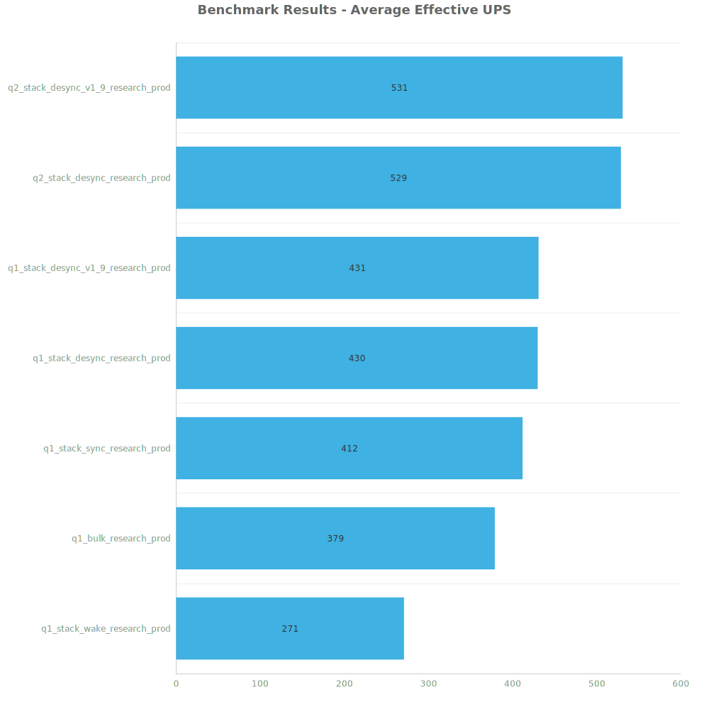
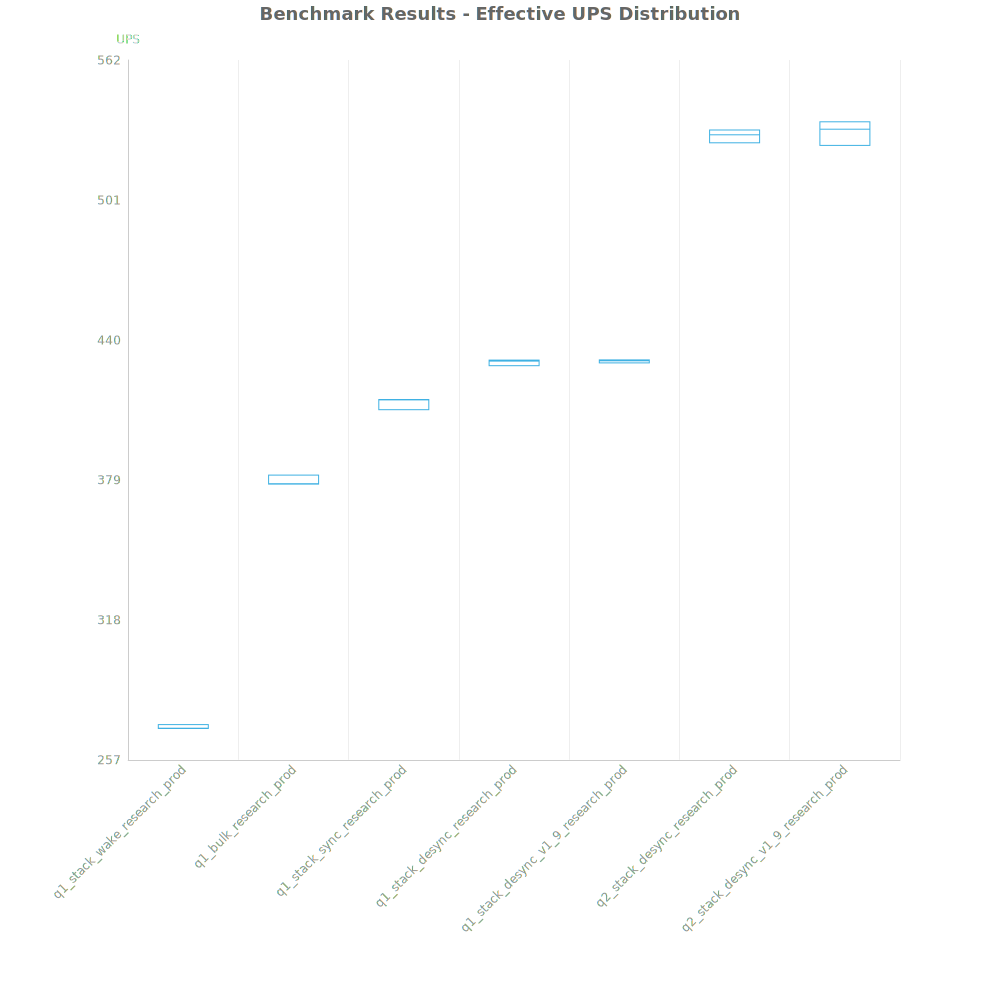
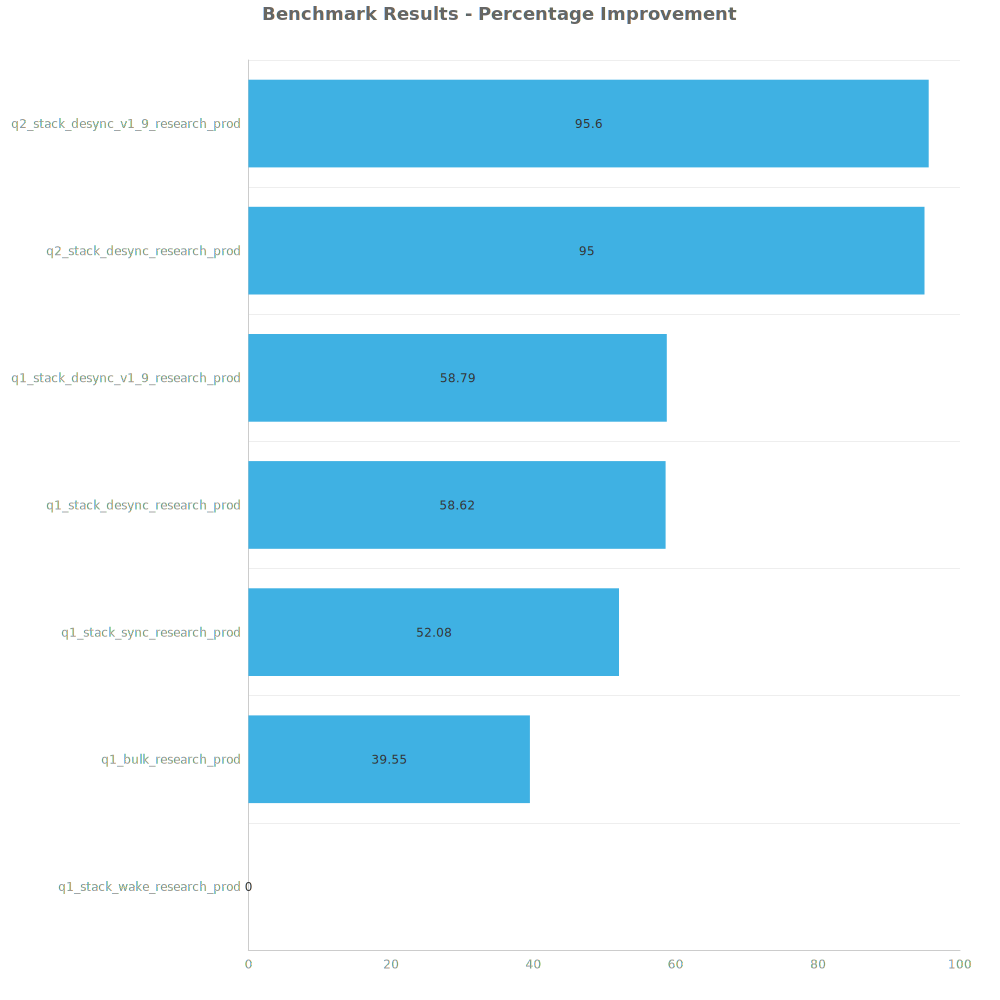

# Factorio Benchmark Results

**Platform:** windows-x86_64  
**Factorio Version:** 2.0.60  

## Scenario
* Each save was tested for 48000 tick(s) and 3 run(s)

## Results
| Metric            | Description                           |
| ----------------- | ------------------------------------- |
| **Mean UPS**      | Updates per second - higher is better |
| **Mean Avg (ms)** | Average frame time - lower is better  |
| **Mean Min (ms)** | Minimum frame time - lower is better  |
| **Mean Max (ms)** | Maximum frame time - lower is better  |

| Save | Avg (ms) | Min (ms) | Max (ms) | UPS | Execution Time (ms) |
|------|----------|----------|----------|-----|---------------------|
| q1_stack_wake_research_prod | 3.687 | 1.176 | 28.262 | 271 | 530897 |
| q1_bulk_research_prod | 2.642 | 0.903 | 38.486 | 378 | 380434 |
| q1_stack_sync_research_prod | 2.424 | 0.886 | 32.901 | 412 | 349107 |
| q1_stack_desync_research_prod | 2.324 | 0.894 | 9.120 | 430 | 334705 |
| q1_stack_desync_v1_9_research_prod | 2.322 | 0.930 | 8.521 | 430 | 334329 |
| q2_stack_desync_research_prod | 1.891 | 0.877 | 9.277 | 528 | 272253 |
| q2_stack_desync_v1_9_research_prod | 1.885 | 0.910 | 10.669 | **530** | 271428 |

Box and Whisker Plot:

| Save | % Difference from base |
|------|------------------------|
| q1_stack_wake_research_prod | 0.00% |
| q1_bulk_research_prod | 39.55% |
| q1_stack_sync_research_prod | 52.08% |
| q1_stack_desync_research_prod | 58.62% |
| q1_stack_desync_v1_9_research_prod | 58.79% |
| q2_stack_desync_research_prod | 95.00% |
| q2_stack_desync_v1_9_research_prod | 95.60% |

## Conclusion