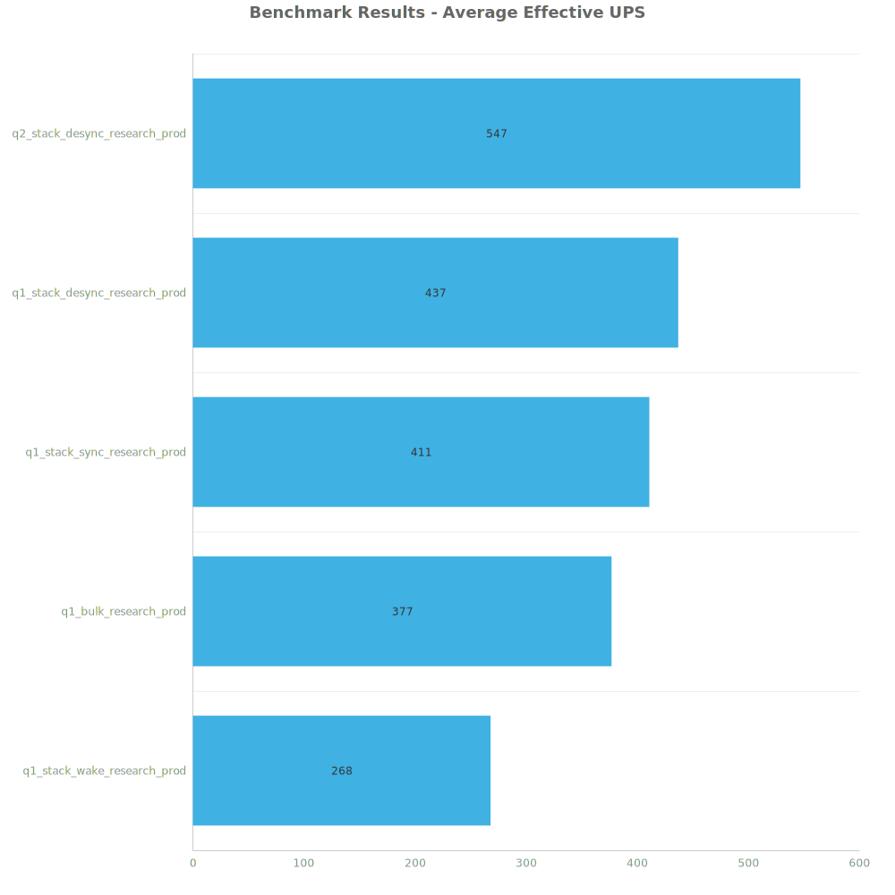
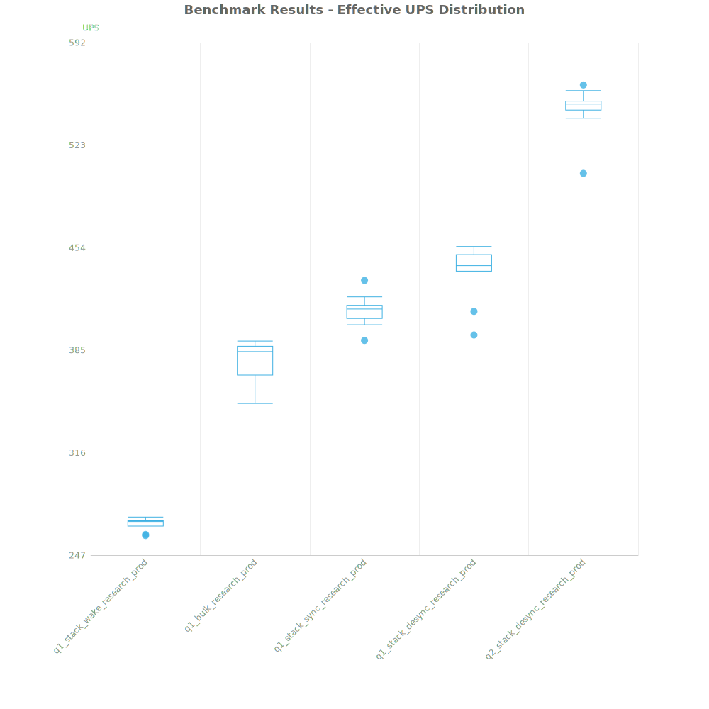
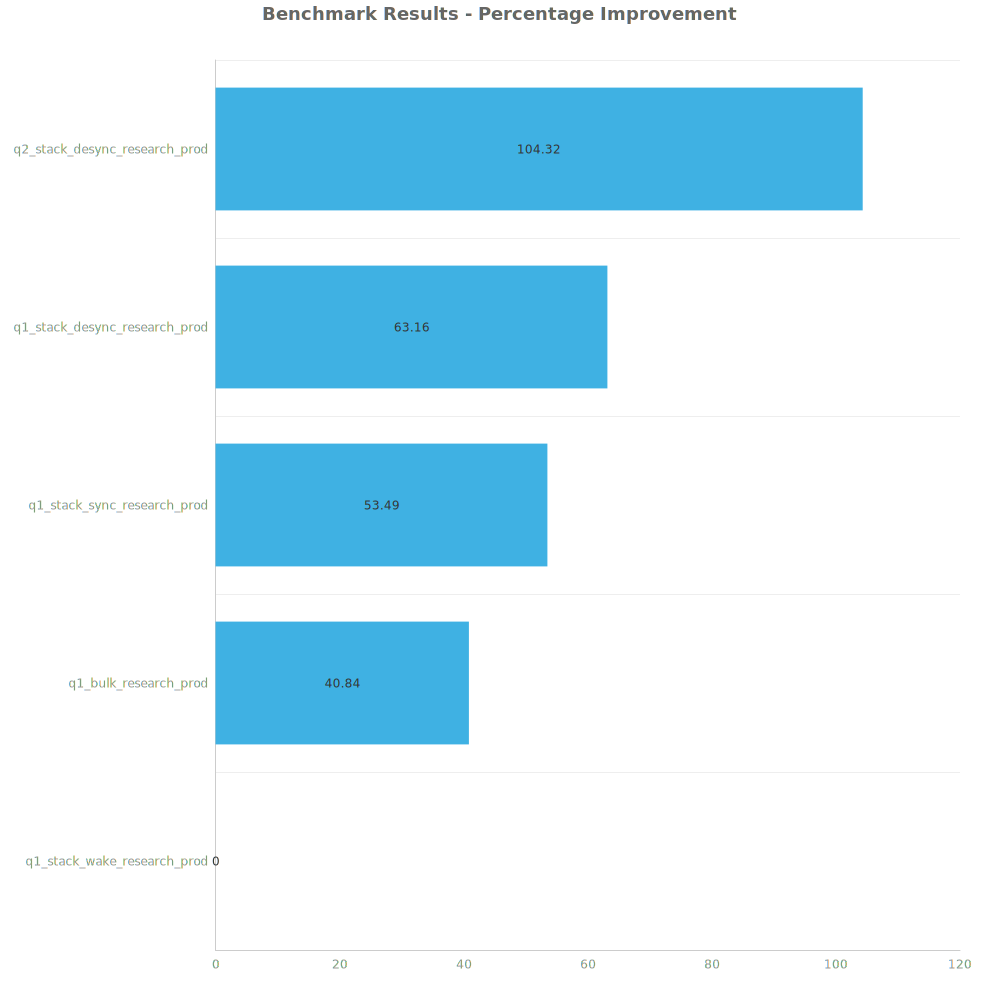

# Factorio Benchmark Results

**Platform:** windows-x86_64  
**Factorio Version:** 2.0.60  

## Scenario
4096 labs running research productivity

## Results
| Metric            | Description                           |
| ----------------- | ------------------------------------- |
| **Mean UPS**      | Updates per second - higher is better |
| **Mean Avg (ms)** | Average frame time - lower is better  |
| **Mean Min (ms)** | Minimum frame time - lower is better  |
| **Mean Max (ms)** | Maximum frame time - lower is better  |

| Save                          | Avg (ms) | Min (ms) | Max (ms) | UPS     | Execution Time (ms) |
| ----------------------------- | -------- | -------- | -------- | ------- | ------------------- |
| q1_stack_wake_research_prod   | 3.737    | 1.197    | 27.121   | 267     | 134550              |
| q1_bulk_research_prod         | 2.657    | 0.904    | 35.739   | 376     | 95643               |
| q1_stack_sync_research_prod   | 2.436    | 0.885    | 36.539   | 410     | 87695               |
| q1_stack_desync_research_prod | 2.294    | 0.868    | 10.846   | 436     | 82595               |
| q2_stack_desync_research_prod | 1.831    | 0.860    | 9.475    | **546** | 65893               |

Box and Whisker Plot:

| Save                          | % Difference from base |
| ----------------------------- | ---------------------- |
| q1_stack_wake_research_prod   | 0.00%                  |
| q1_bulk_research_prod         | 40.84%                 |
| q1_stack_sync_research_prod   | 53.49%                 |
| q1_stack_desync_research_prod | 63.16%                 |
| q2_stack_desync_research_prod | 104.32%                |

