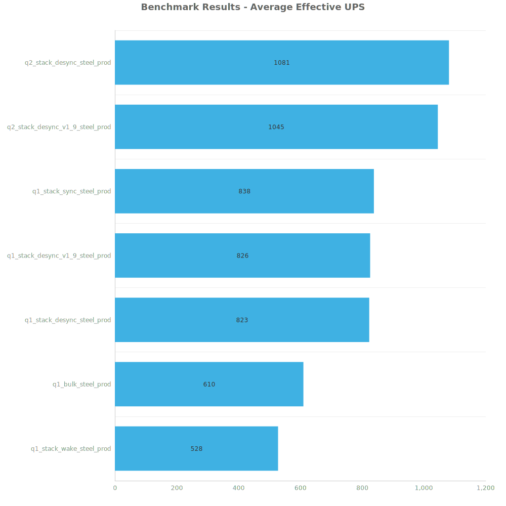
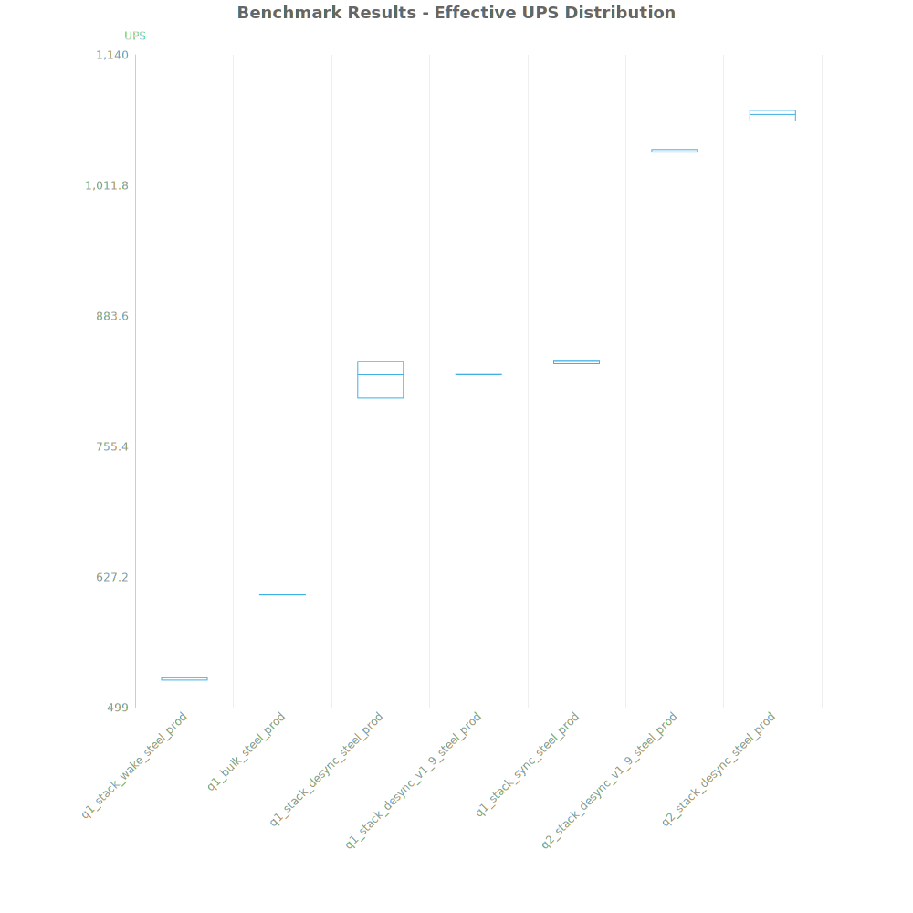
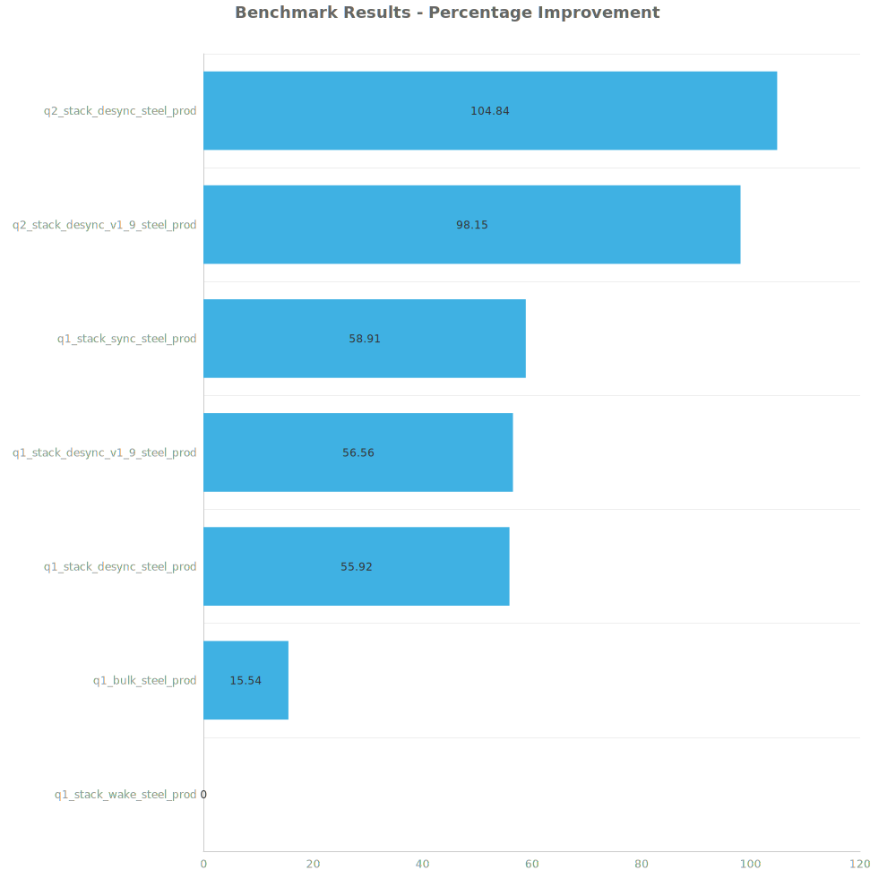

# Factorio Benchmark Results

**Platform:** windows-x86_64  
**Factorio Version:** 2.0.60  

## Scenario
* Each save was tested for 48000 tick(s) and 3 run(s)

## Results
| Metric            | Description                           |
| ----------------- | ------------------------------------- |
| **Mean UPS**      | Updates per second - higher is better |
| **Mean Avg (ms)** | Average frame time - lower is better  |
| **Mean Min (ms)** | Minimum frame time - lower is better  |
| **Mean Max (ms)** | Maximum frame time - lower is better  |

| Save | Avg (ms) | Min (ms) | Max (ms) | UPS | Execution Time (ms) |
|------|----------|----------|----------|-----|---------------------|
| q1_stack_wake_steel_prod | 1.896 | 0.748 | 23.824 | 527 | 272971 |
| q1_bulk_steel_prod | 1.641 | 0.674 | 28.703 | 609 | 236250 |
| q1_stack_desync_steel_prod | 1.216 | 0.704 | 5.196 | 822 | 175129 |
| q1_stack_desync_v1_9_steel_prod | 1.211 | 0.693 | 4.375 | 825 | 174359 |
| q1_stack_sync_steel_prod | 1.193 | 0.681 | 11.342 | 838 | 171776 |
| q2_stack_desync_v1_9_steel_prod | 0.957 | 0.555 | 5.399 | 1045 | 137757 |
| q2_stack_desync_steel_prod | 0.925 | 0.535 | 4.219 | **1080** | 133264 |

Box and Whisker Plot:

| Save | % Difference from base |
|------|------------------------|
| q1_stack_wake_steel_prod | 0.00% |
| q1_bulk_steel_prod | 15.54% |
| q1_stack_desync_steel_prod | 55.92% |
| q1_stack_desync_v1_9_steel_prod | 56.56% |
| q1_stack_sync_steel_prod | 58.91% |
| q2_stack_desync_v1_9_steel_prod | 98.15% |
| q2_stack_desync_steel_prod | 104.84% |

## Conclusion