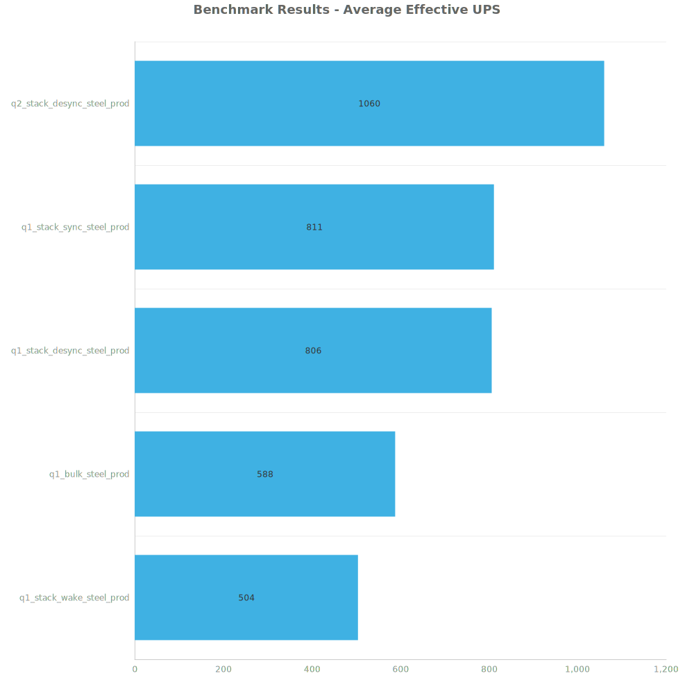
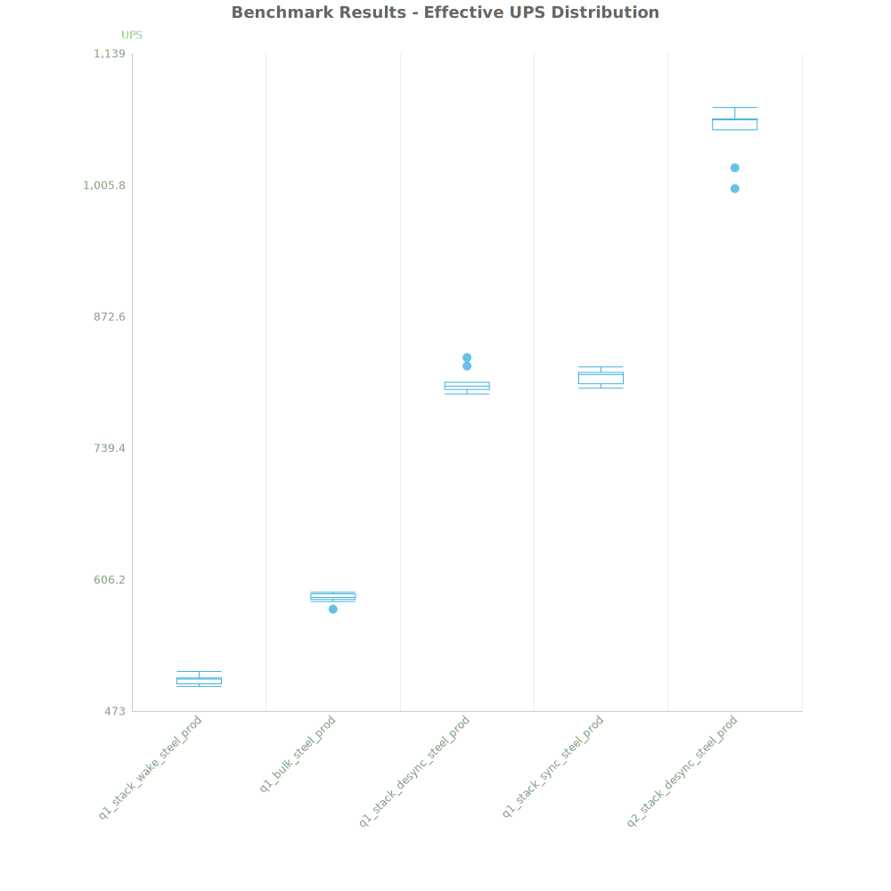
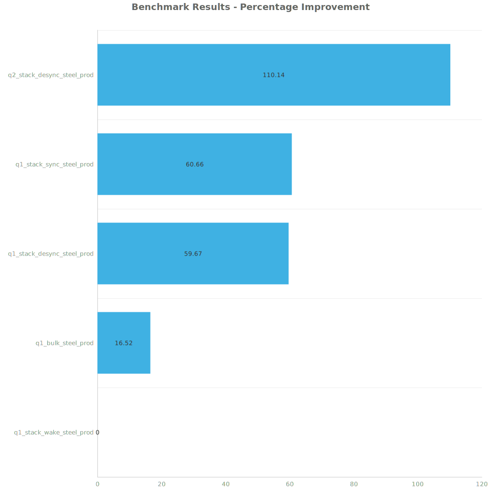

# Factorio Benchmark Results

**Platform:** windows-x86_64  
**Factorio Version:** 2.0.60  

## Scenario
4096 labs running steel plate productivity

## Results
| Metric            | Description                           |
| ----------------- | ------------------------------------- |
| **Mean UPS**      | Updates per second - higher is better |
| **Mean Avg (ms)** | Average frame time - lower is better  |
| **Mean Min (ms)** | Minimum frame time - lower is better  |
| **Mean Max (ms)** | Maximum frame time - lower is better  |

| Save                       | Avg (ms) | Min (ms) | Max (ms) | UPS      | Execution Time (ms) |
| -------------------------- | -------- | -------- | -------- | -------- | ------------------- |
| q1_stack_wake_steel_prod   | 1.982    | 0.745    | 24.520   | 504      | 71364               |
| q1_bulk_steel_prod         | 1.701    | 0.676    | 27.607   | 587      | 61248               |
| q1_stack_desync_steel_prod | 1.242    | 0.692    | 4.819    | 805      | 44700               |
| q1_stack_sync_steel_prod   | 1.234    | 0.693    | 14.031   | 810      | 44418               |
| q2_stack_desync_steel_prod | 0.944    | 0.532    | 5.067    | **1060** | 33977               |

Box and Whisker Plot:

| Save                       | % Difference from base |
| -------------------------- | ---------------------- |
| q1_stack_wake_steel_prod   | 0.00%                  |
| q1_bulk_steel_prod         | 16.52%                 |
| q1_stack_desync_steel_prod | 59.67%                 |
| q1_stack_sync_steel_prod   | 60.66%                 |
| q2_stack_desync_steel_prod | 110.14%                |

