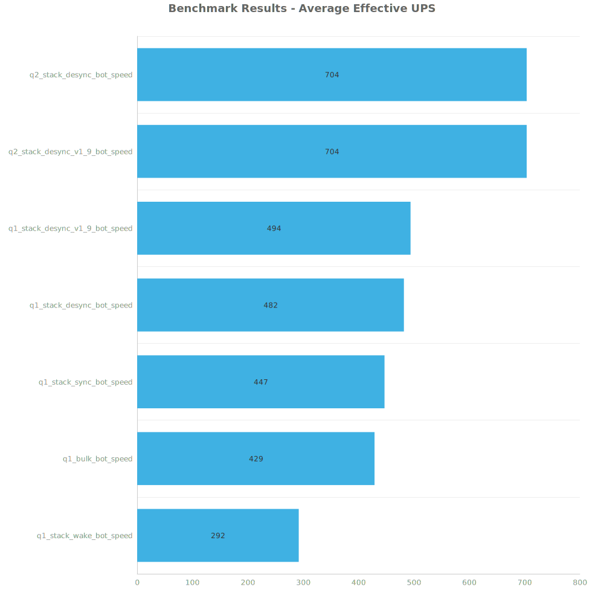
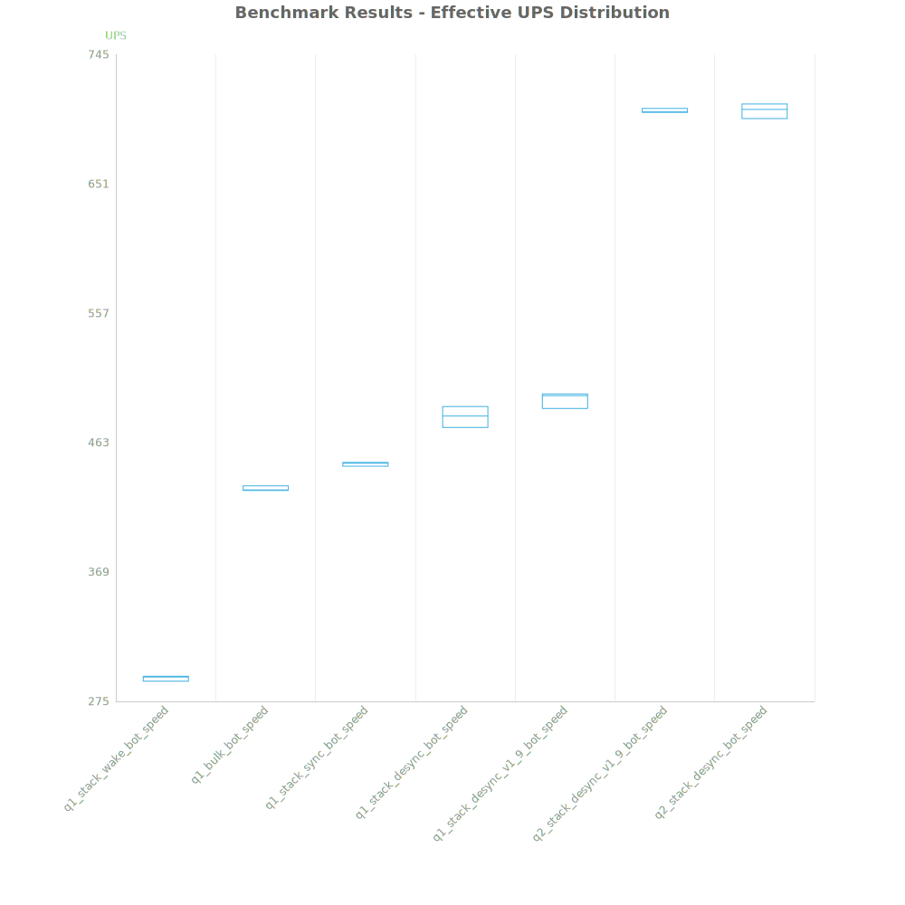
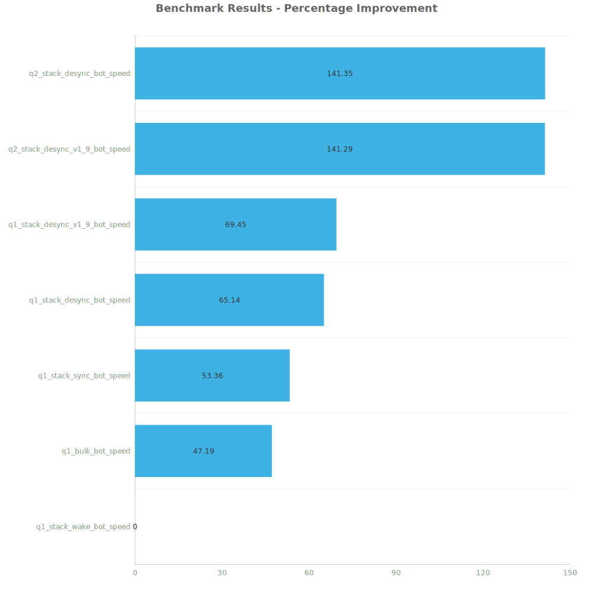

# Factorio Benchmark Results

**Platform:** windows-x86_64  
**Factorio Version:** 2.0.60  

## Scenario
* Each save was tested for 48000 tick(s) and 3 run(s)

## Results
| Metric            | Description                           |
| ----------------- | ------------------------------------- |
| **Mean UPS**      | Updates per second - higher is better |
| **Mean Avg (ms)** | Average frame time - lower is better  |
| **Mean Min (ms)** | Minimum frame time - lower is better  |
| **Mean Max (ms)** | Maximum frame time - lower is better  |

| Save | Avg (ms) | Min (ms) | Max (ms) | UPS | Execution Time (ms) |
|------|----------|----------|----------|-----|---------------------|
| q1_stack_wake_bot_speed | 3.428 | 1.106 | 26.570 | 291 | 493641 |
| q1_bulk_bot_speed | 2.329 | 0.873 | 35.869 | 429 | 335373 |
| q1_stack_sync_bot_speed | 2.235 | 0.868 | 26.186 | 447 | 321868 |
| q1_stack_desync_bot_speed | 2.076 | 1.050 | 10.450 | 481 | 298963 |
| q1_stack_desync_v1_9_bot_speed | 2.023 | 0.897 | 5.691 | 494 | 291343 |
| q2_stack_desync_v1_9_bot_speed | 1.421 | 0.649 | 6.147 | 703 | 204576 |
| q2_stack_desync_bot_speed | 1.420 | 0.637 | 7.323 | **704** | 204532 |

Box and Whisker Plot:

| Save | % Difference from base |
|------|------------------------|
| q1_stack_wake_bot_speed | 0.00% |
| q1_bulk_bot_speed | 47.19% |
| q1_stack_sync_bot_speed | 53.36% |
| q1_stack_desync_bot_speed | 65.14% |
| q1_stack_desync_v1_9_bot_speed | 69.45% |
| q2_stack_desync_v1_9_bot_speed | 141.29% |
| q2_stack_desync_bot_speed | 141.35% |

## Conclusion