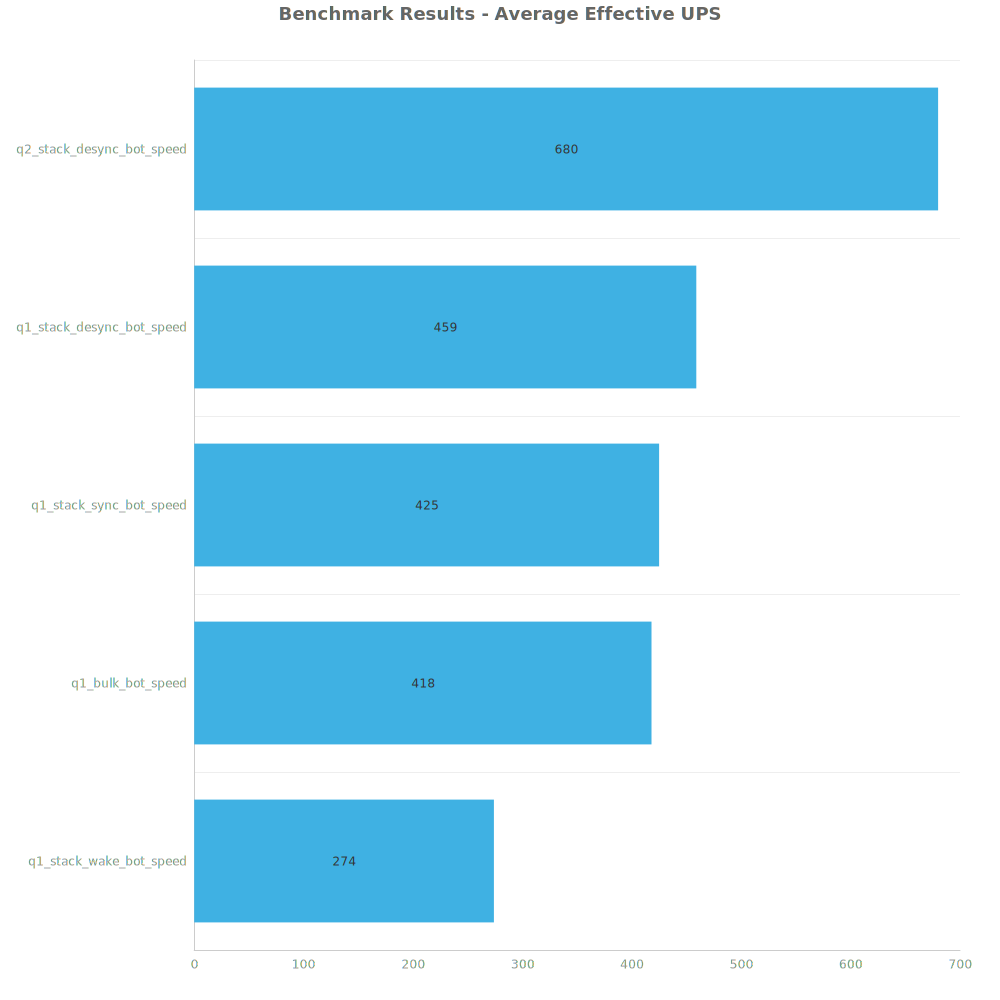
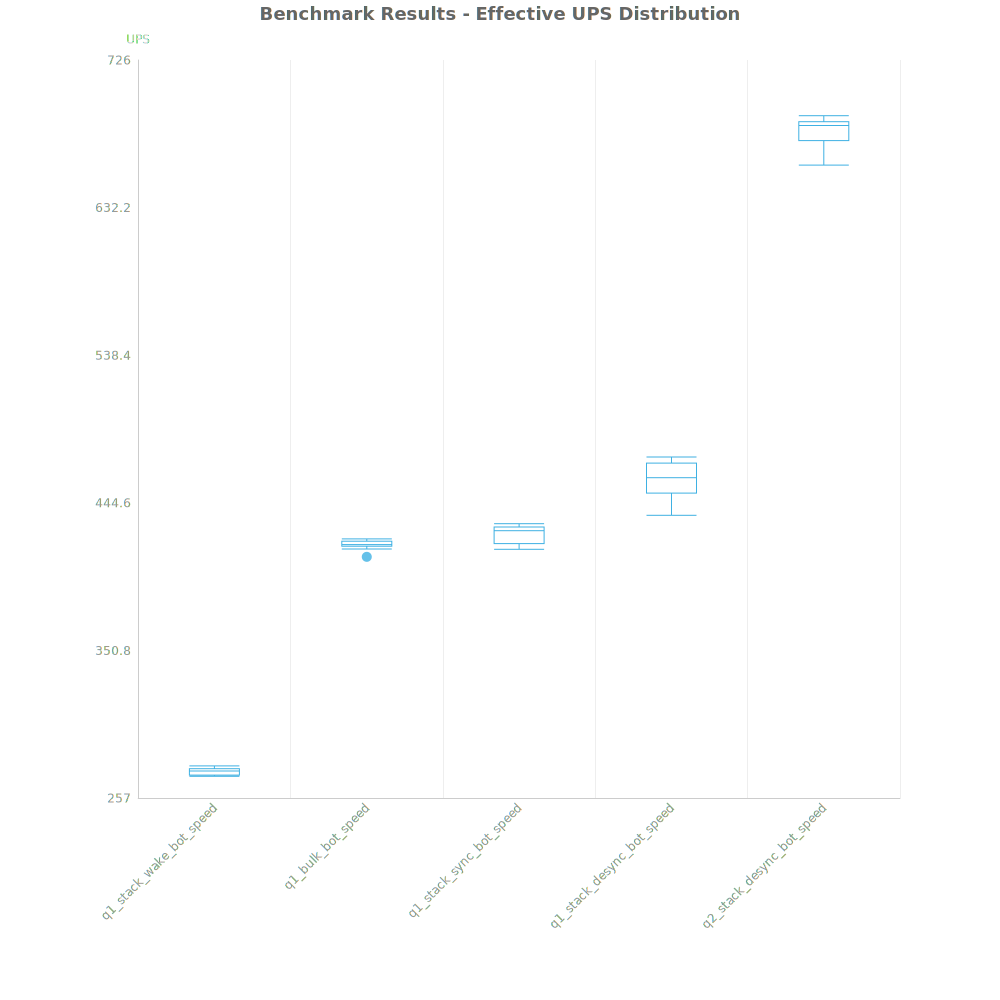
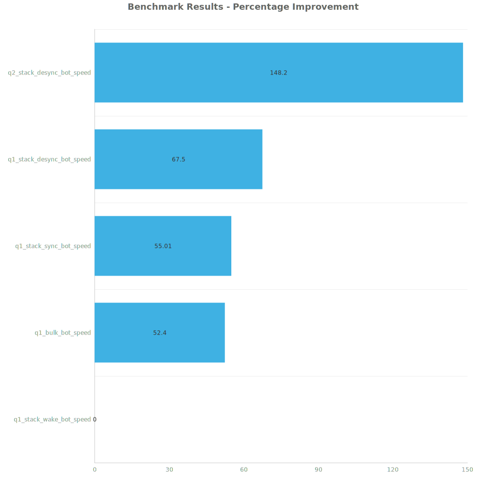

# Factorio Benchmark Results

**Platform:** windows-x86_64  
**Factorio Version:** 2.0.60  

## Scenario
4096 labs running bot speed

## Results
| Metric            | Description                           |
| ----------------- | ------------------------------------- |
| **Mean UPS**      | Updates per second - higher is better |
| **Mean Avg (ms)** | Average frame time - lower is better  |
| **Mean Min (ms)** | Minimum frame time - lower is better  |
| **Mean Max (ms)** | Maximum frame time - lower is better  |

| Save                      | Avg (ms) | Min (ms) | Max (ms) | UPS     | Execution Time (ms) |
| ------------------------- | -------- | -------- | -------- | ------- | ------------------- |
| q1_stack_wake_bot_speed   | 3.650    | 1.154    | 30.145   | 273     | 131408              |
| q1_bulk_bot_speed         | 2.395    | 0.884    | 34.149   | 417     | 86221               |
| q1_stack_sync_bot_speed   | 2.355    | 0.882    | 26.088   | 424     | 84782               |
| q1_stack_desync_bot_speed | 2.180    | 1.046    | 9.271    | 458     | 78489               |
| q2_stack_desync_bot_speed | 1.471    | 0.642    | 9.280    | **680** | 52949               |

Box and Whisker Plot:

| Save                      | % Difference from base |
| ------------------------- | ---------------------- |
| q1_stack_wake_bot_speed   | 0.00%                  |
| q1_bulk_bot_speed         | 52.40%                 |
| q1_stack_sync_bot_speed   | 55.01%                 |
| q1_stack_desync_bot_speed | 67.50%                 |
| q2_stack_desync_bot_speed | 148.20%                |

