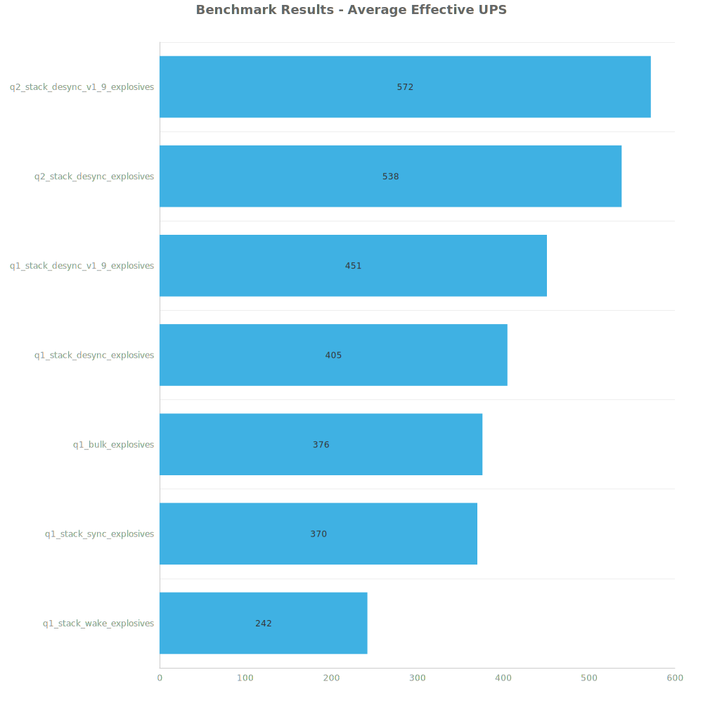
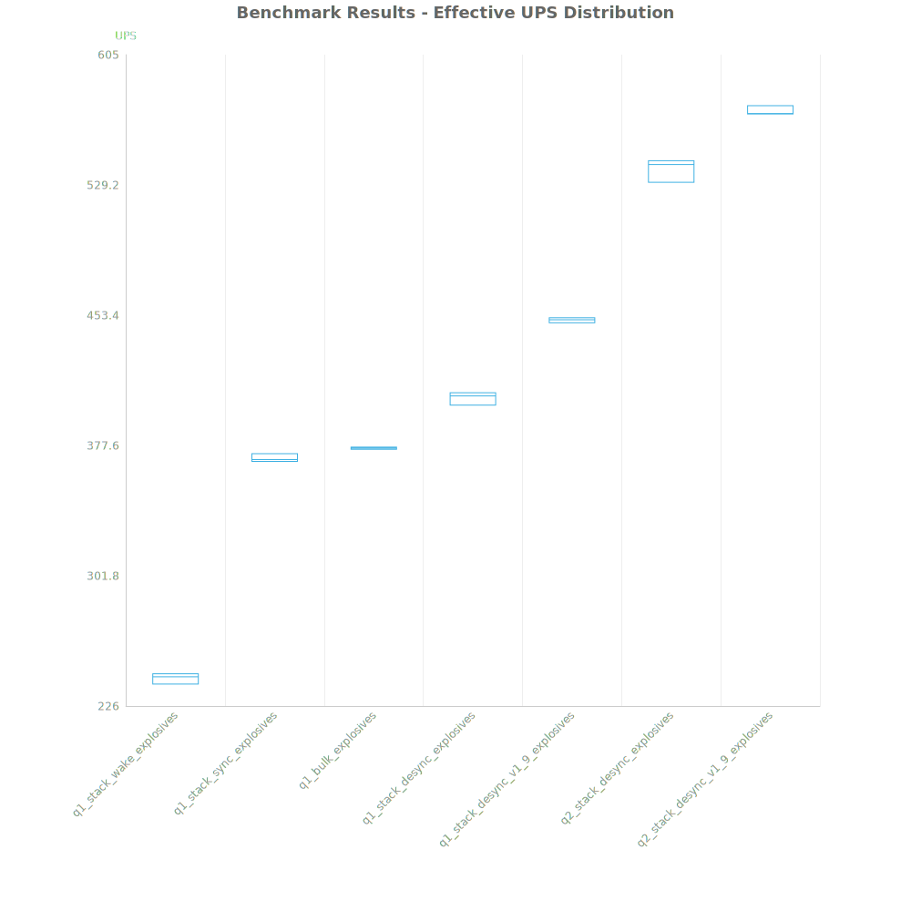
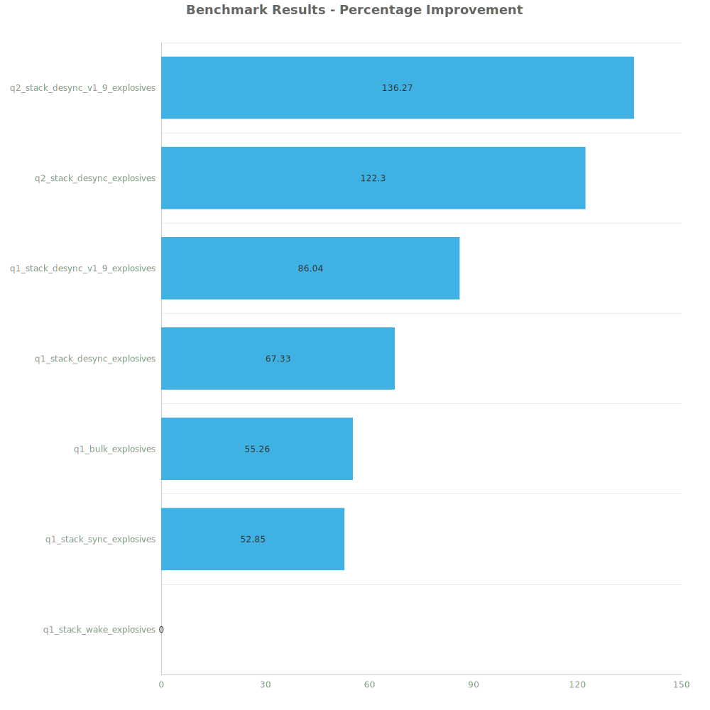

# Factorio Benchmark Results

**Platform:** windows-x86_64  
**Factorio Version:** 2.0.60  

## Scenario
* Each save was tested for 48000 tick(s) and 3 run(s)

## Results
| Metric            | Description                           |
| ----------------- | ------------------------------------- |
| **Mean UPS**      | Updates per second - higher is better |
| **Mean Avg (ms)** | Average frame time - lower is better  |
| **Mean Min (ms)** | Minimum frame time - lower is better  |
| **Mean Max (ms)** | Maximum frame time - lower is better  |

| Save | Avg (ms) | Min (ms) | Max (ms) | UPS | Execution Time (ms) |
|------|----------|----------|----------|-----|---------------------|
| q1_stack_wake_explosives | 4.130 | 1.471 | 27.616 | 242 | 594666 |
| q1_stack_sync_explosives | 2.701 | 0.886 | 25.697 | 370 | 389028 |
| q1_bulk_explosives | 2.659 | 0.922 | 30.292 | 376 | 382965 |
| q1_stack_desync_explosives | 2.468 | 0.874 | 10.680 | 405 | 355366 |
| q1_stack_desync_v1_9_explosives | 2.220 | 1.033 | 6.318 | 450 | 319619 |
| q2_stack_desync_explosives | 1.858 | 0.730 | 8.980 | 538 | 267500 |
| q2_stack_desync_v1_9_explosives | 1.748 | 0.743 | 6.141 | **572** | 251670 |

Box and Whisker Plot:

| Save | % Difference from base |
|------|------------------------|
| q1_stack_wake_explosives | 0.00% |
| q1_stack_sync_explosives | 52.85% |
| q1_bulk_explosives | 55.26% |
| q1_stack_desync_explosives | 67.33% |
| q1_stack_desync_v1_9_explosives | 86.04% |
| q2_stack_desync_explosives | 122.30% |
| q2_stack_desync_v1_9_explosives | 136.27% |

## Conclusion