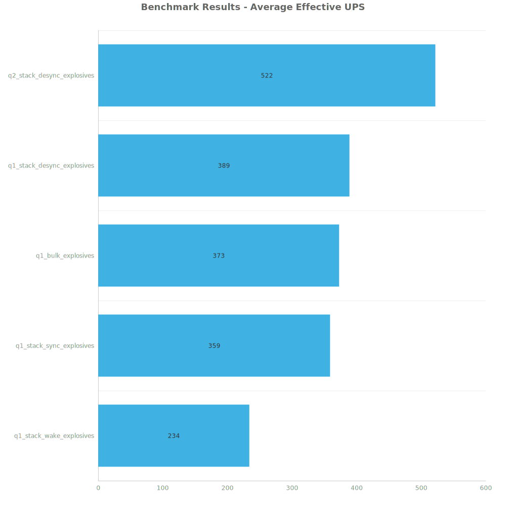
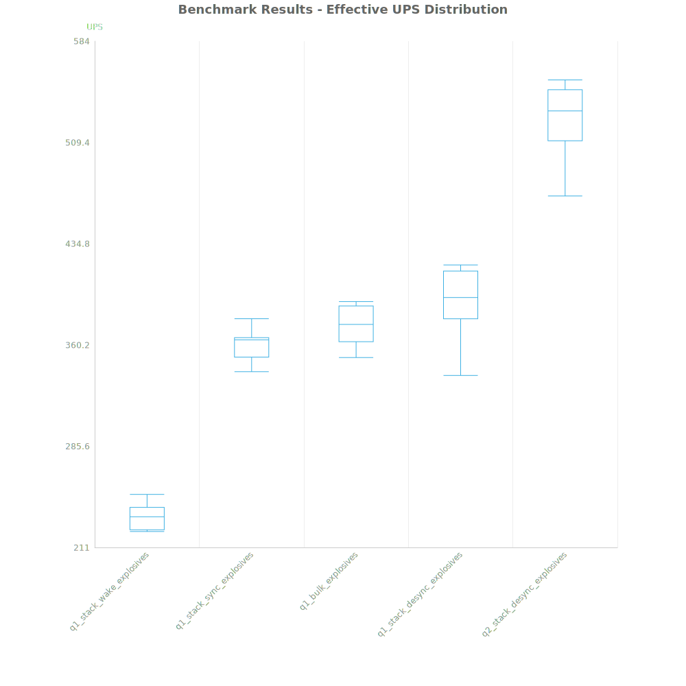
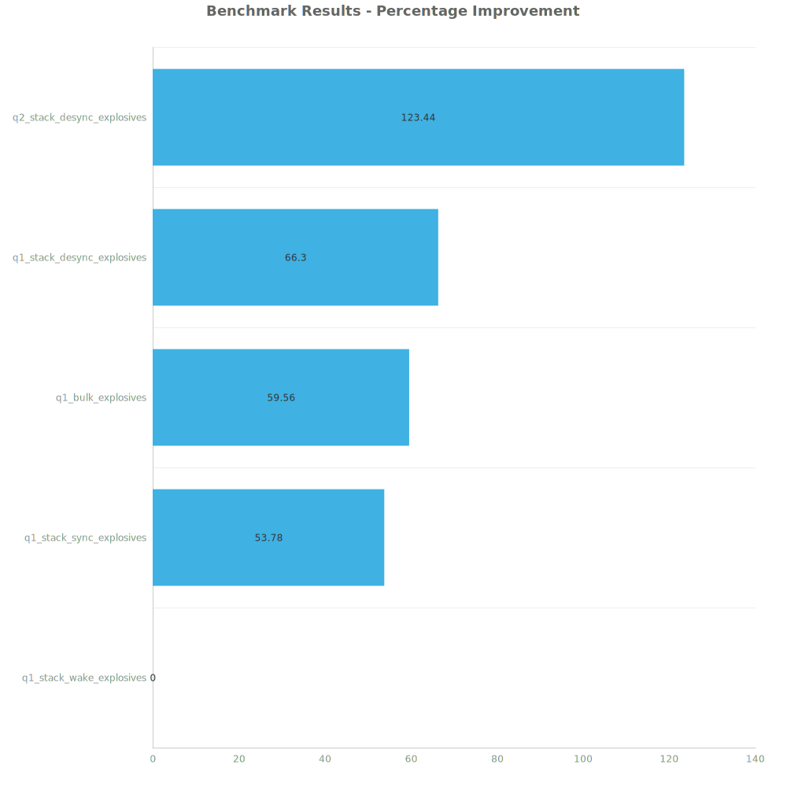

# Factorio Benchmark Results

**Platform:** windows-x86_64  
**Factorio Version:** 2.0.60  

## Scenario
4096 labs running stronger explosives

## Results
| Metric            | Description                           |
| ----------------- | ------------------------------------- |
| **Mean UPS**      | Updates per second - higher is better |
| **Mean Avg (ms)** | Average frame time - lower is better  |
| **Mean Min (ms)** | Minimum frame time - lower is better  |
| **Mean Max (ms)** | Maximum frame time - lower is better  |

| Save | Avg (ms) | Min (ms) | Max (ms) | UPS | Execution Time (ms) |
|------|----------|----------|----------|-----|---------------------|
| q1_stack_wake_explosives | 4.287 | 1.325 | 27.376 | 233 | 154328 |
| q1_stack_sync_explosives | 2.786 | 0.869 | 26.746 | 359 | 100277 |
| q1_bulk_explosives | 2.687 | 0.922 | 32.273 | 372 | 96733 |
| q1_stack_desync_explosives | 2.584 | 0.900 | 9.468 | 388 | 93031 |
| q2_stack_desync_explosives | 1.921 | 0.730 | 11.781 | **522** | 69162 |

Box and Whisker Plot:

| Save | % Difference from base |
|------|------------------------|
| q1_stack_wake_explosives | 0.00% |
| q1_stack_sync_explosives | 53.78% |
| q1_bulk_explosives | 59.56% |
| q1_stack_desync_explosives | 66.30% |
| q2_stack_desync_explosives | 123.44% |

