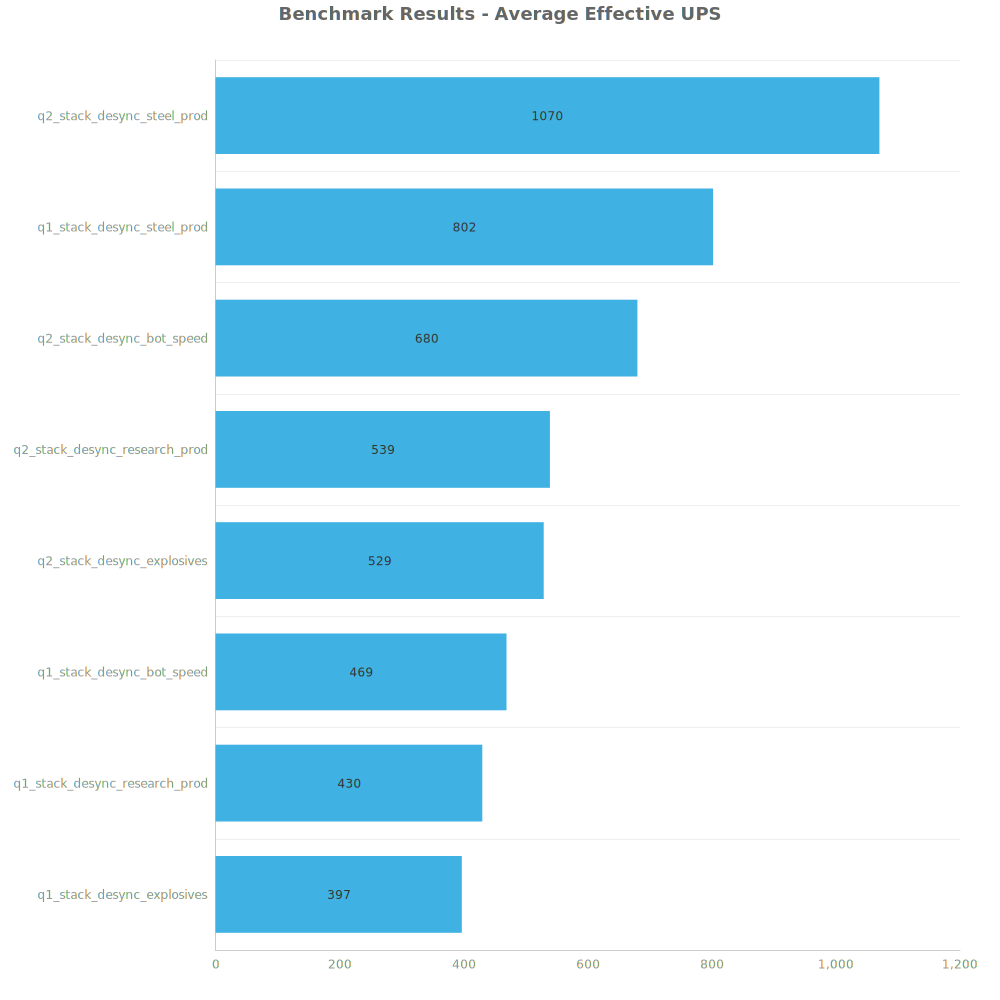
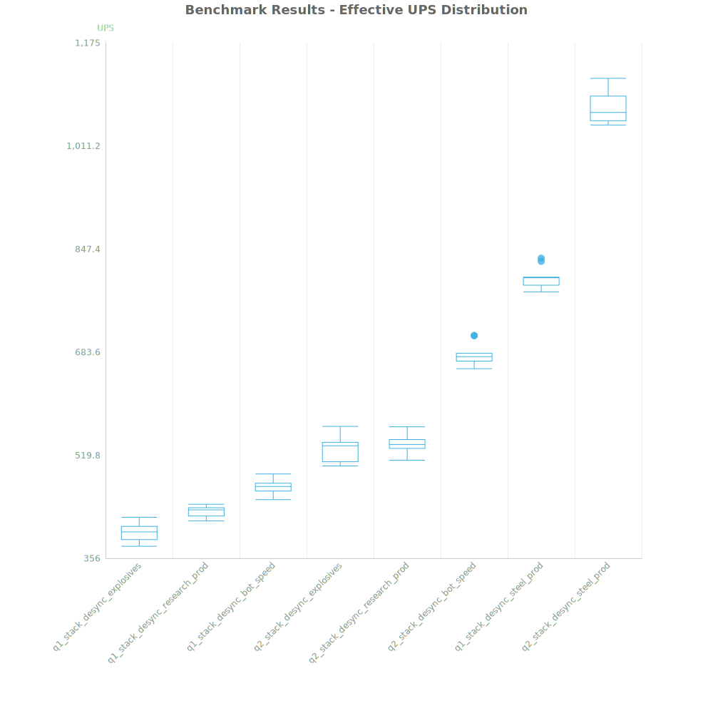
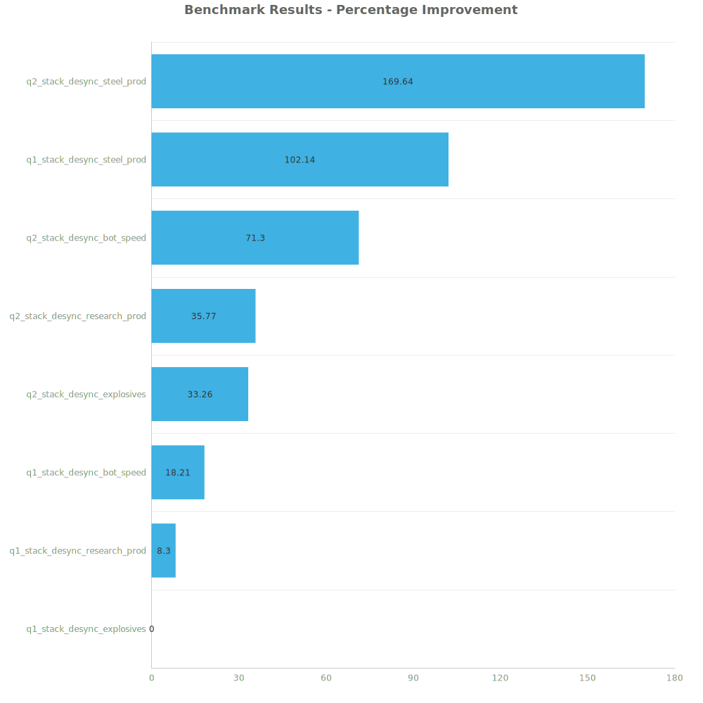

# Factorio Benchmark Results

**Platform:** windows-x86_64  
**Factorio Version:** 2.0.60  

## Scenario
Compares running Q2 science vs Q1 using the 16 stack inserter control method described in the main readme of this benchmark.

## Results
| Metric            | Description                           |
| ----------------- | ------------------------------------- |
| **Mean UPS**      | Updates per second - higher is better |
| **Mean Avg (ms)** | Average frame time - lower is better  |
| **Mean Min (ms)** | Minimum frame time - lower is better  |
| **Mean Max (ms)** | Maximum frame time - lower is better  |

| Save | Avg (ms) | Min (ms) | Max (ms) | UPS | Execution Time (ms) |
|------|----------|----------|----------|-----|---------------------|
| q1_stack_desync_explosives | 2.522 | 0.905 | 9.686 | 396 | 90814 |
| q1_stack_desync_research_prod | 2.327 | 0.865 | 11.798 | 429 | 83775 |
| q1_stack_desync_bot_speed | 2.132 | 1.016 | 8.385 | 469 | 76770 |
| q2_stack_desync_explosives | 1.893 | 0.708 | 8.444 | 528 | 68145 |
| q2_stack_desync_research_prod | 1.857 | 0.859 | 9.994 | 538 | 66853 |
| q2_stack_desync_bot_speed | 1.472 | 0.624 | 9.049 | 679 | 52977 |
| q1_stack_desync_steel_prod | 1.247 | 0.710 | 5.038 | 802 | 44885 |
| q2_stack_desync_steel_prod | 0.935 | 0.526 | 4.233 | **1070** | 33650 |

Box and Whisker Plot:

| Save | % Difference from base |
|------|------------------------|
| q1_stack_desync_explosives | 0.00% |
| q1_stack_desync_research_prod | 8.30% |
| q1_stack_desync_bot_speed | 18.21% |
| q2_stack_desync_explosives | 33.26% |
| q2_stack_desync_research_prod | 35.77% |
| q2_stack_desync_bot_speed | 71.30% |
| q1_stack_desync_steel_prod | 102.14% |
| q2_stack_desync_steel_prod | 169.64% |

