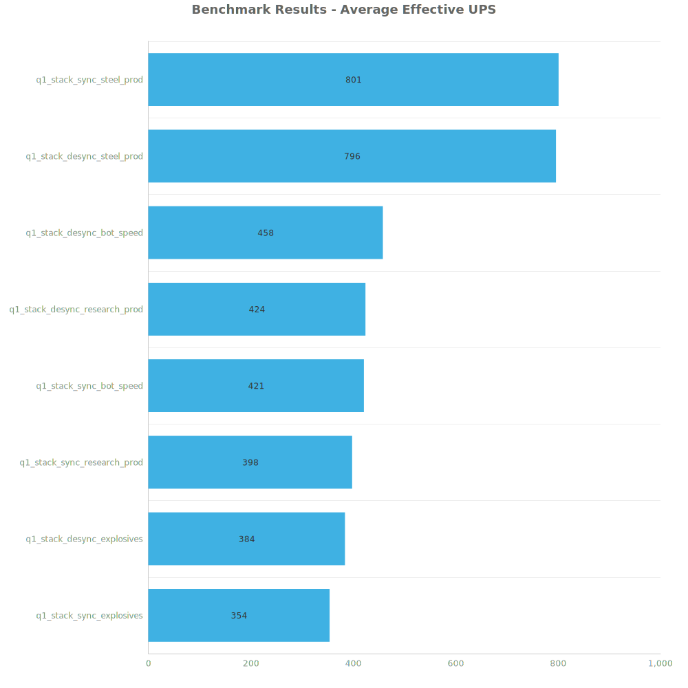
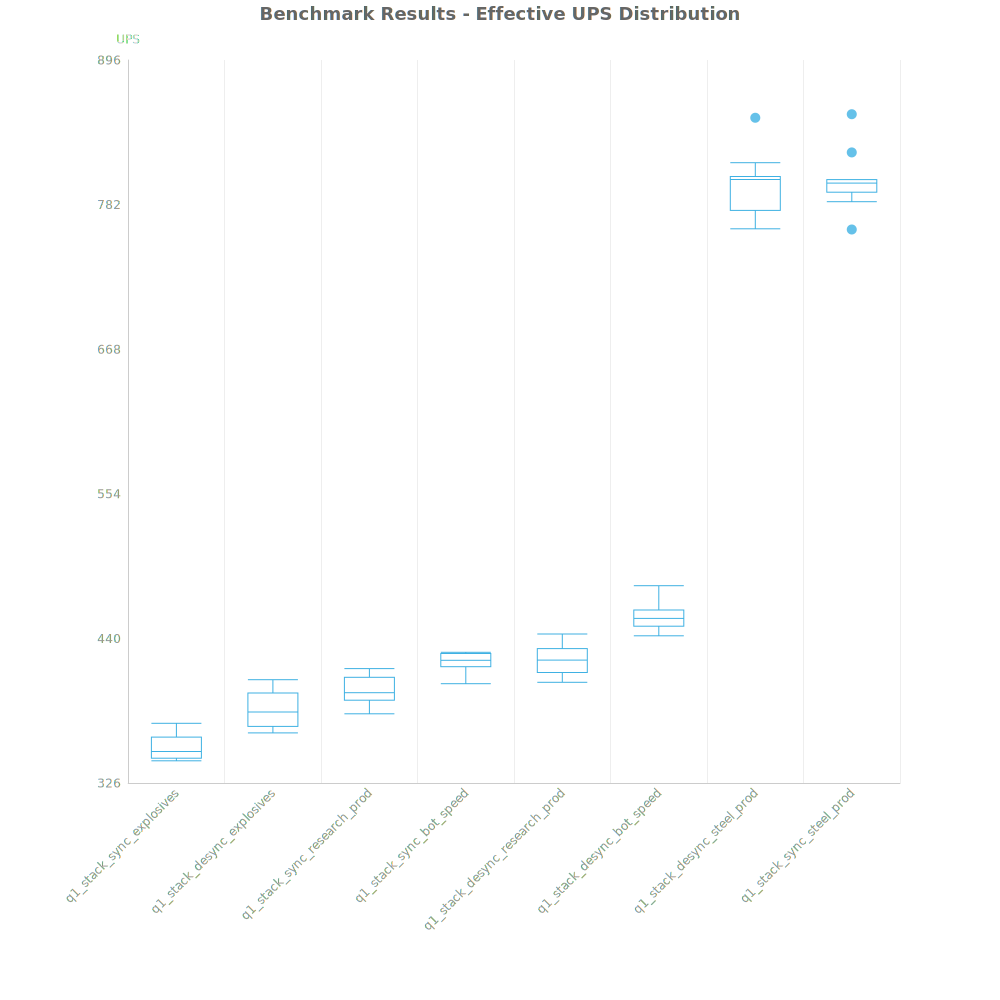
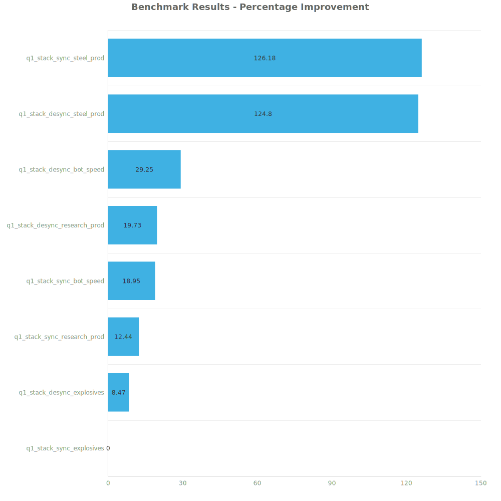

# Factorio Benchmark Results

**Platform:** windows-x86_64  
**Factorio Version:** 2.0.60  

## Scenario
Compares the difference between staggering the inserters across 4096 labs per cycle vs running them synchronously.

## Results
| Metric            | Description                           |
| ----------------- | ------------------------------------- |
| **Mean UPS**      | Updates per second - higher is better |
| **Mean Avg (ms)** | Average frame time - lower is better  |
| **Mean Min (ms)** | Minimum frame time - lower is better  |
| **Mean Max (ms)** | Maximum frame time - lower is better  |

| Save                          | Avg (ms) | Min (ms) | Max (ms) | UPS     | Execution Time (ms) |
| ----------------------------- | -------- | -------- | -------- | ------- | ------------------- |
| q1_stack_sync_explosives      | 2.827    | 0.888    | 27.163   | 354     | 101761              |
| q1_stack_desync_explosives    | 2.608    | 0.910    | 9.219    | 384     | 93877               |
| q1_stack_sync_research_prod   | 2.514    | 0.893    | 38.270   | 398     | 90499               |
| q1_stack_sync_bot_speed       | 2.375    | 0.886    | 24.027   | 421     | 85514               |
| q1_stack_desync_research_prod | 2.361    | 0.871    | 11.338   | 423     | 84999               |
| q1_stack_desync_bot_speed     | 2.187    | 1.041    | 9.288    | 457     | 78731               |
| q1_stack_desync_steel_prod    | 1.257    | 0.705    | 4.866    | 795     | 45273               |
| q1_stack_sync_steel_prod      | 1.250    | 0.680    | 13.038   | **800** | 44993               |

Box and Whisker Plot:

| Save                          | % Difference from base |
| ----------------------------- | ---------------------- |
| q1_stack_sync_explosives      | 0.00%                  |
| q1_stack_desync_explosives    | 8.47%                  |
| q1_stack_sync_research_prod   | 12.44%                 |
| q1_stack_sync_bot_speed       | 18.95%                 |
| q1_stack_desync_research_prod | 19.73%                 |
| q1_stack_desync_bot_speed     | 29.25%                 |
| q1_stack_desync_steel_prod    | 124.80%                |
| q1_stack_sync_steel_prod      | 126.18%                |

