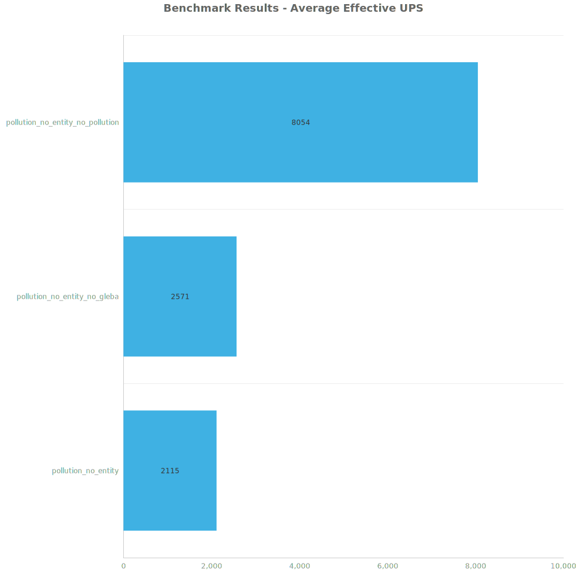
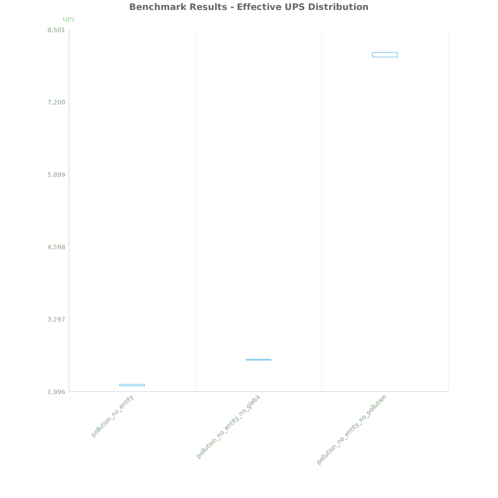
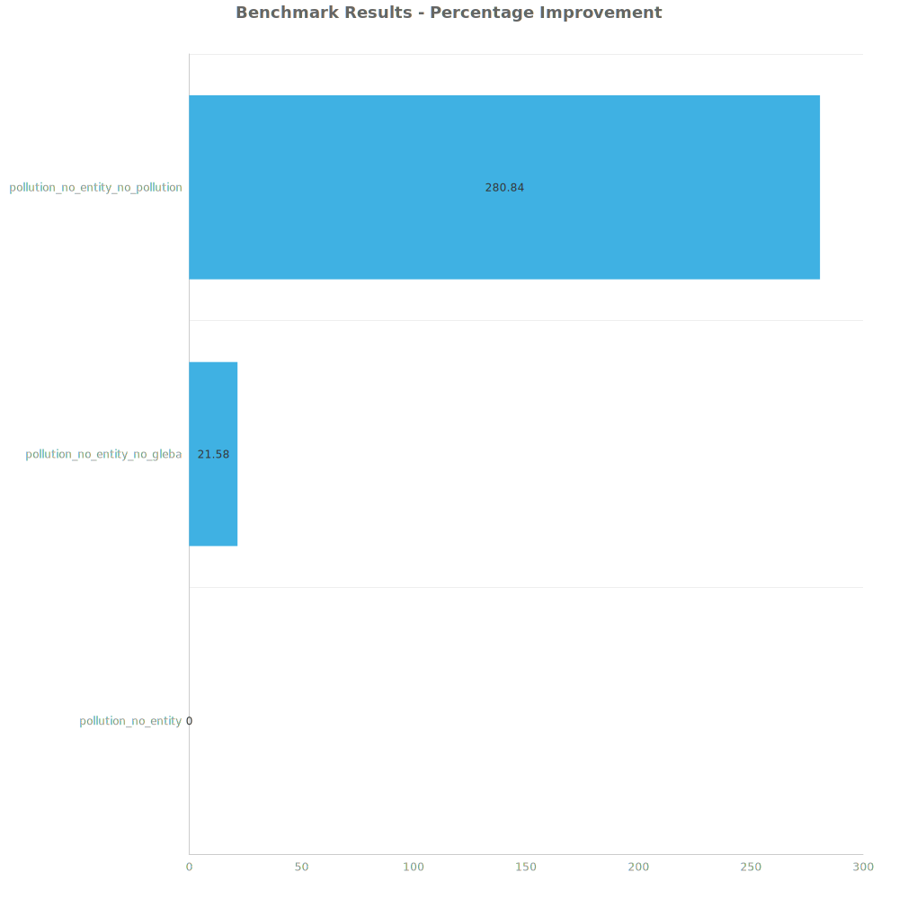

# Factorio Benchmark Results

**Platform:** windows-x86_64  
**Factorio Version:** 2.0.60  

## Scenario
- Took the original megabase that has a pollution cloud that grew from running 1040 labs non stop for hundreds of hours.
  - has roughly a 5100 tile radius on Nauvis
- Removed all entities from all surfaces. 
- Removed all surfaces except for gleba and nauvis. 
- Three save files:
  - `pollution_no_entity`: original pollution cloud on gleba and nauvis but all entities removed
  - `pollution_no_entity_no_gleba`: removed gleba surface
  - `pollution_no_entity_no_pollution`: removes pullution from Nauvis surface and turned off pollution system in game

## Results
| Metric            | Description                           |
| ----------------- | ------------------------------------- |
| **Mean UPS**      | Updates per second - higher is better |
| **Mean Avg (ms)** | Average frame time - lower is better  |
| **Mean Min (ms)** | Minimum frame time - lower is better  |
| **Mean Max (ms)** | Maximum frame time - lower is better  |

| Save                             | Avg (ms) | Min (ms) | Max (ms) | UPS  | Execution Time (ms) |
| -------------------------------- | -------- | -------- | -------- | ---- | ------------------- |
| pollution_no_entity              | 0.473    | 0.277    | 5.512    | 2114 | 34047               |
| pollution_no_entity_no_gleba     | 0.389    | 0.229    | 5.101    | 2571 | 28002               |
| pollution_no_entity_no_pollution | 0.125    | 0.044    | 2.148    | 8053 | 8939                |

Box and Whisker Plot:

| Save                             | % Difference from base |
| -------------------------------- | ---------------------- |
| pollution_no_entity              | 0.00%                  |
| pollution_no_entity_no_gleba     | 21.58%                 |
| pollution_no_entity_no_pollution | 280.84%                |

## Conclusion
Polluted chunks are consuming on average 0.264 ms from polluted chunk updates alone.