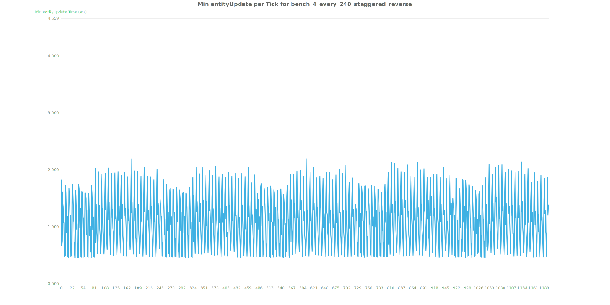
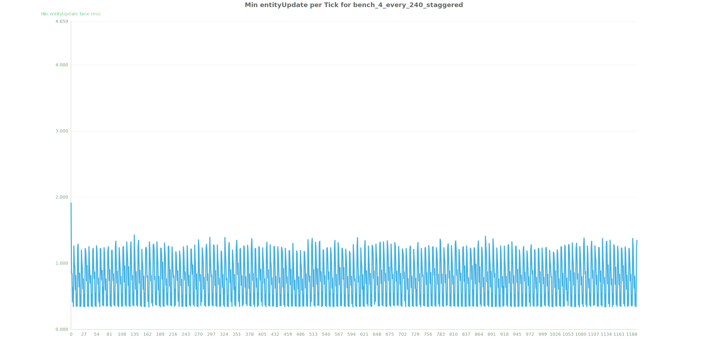
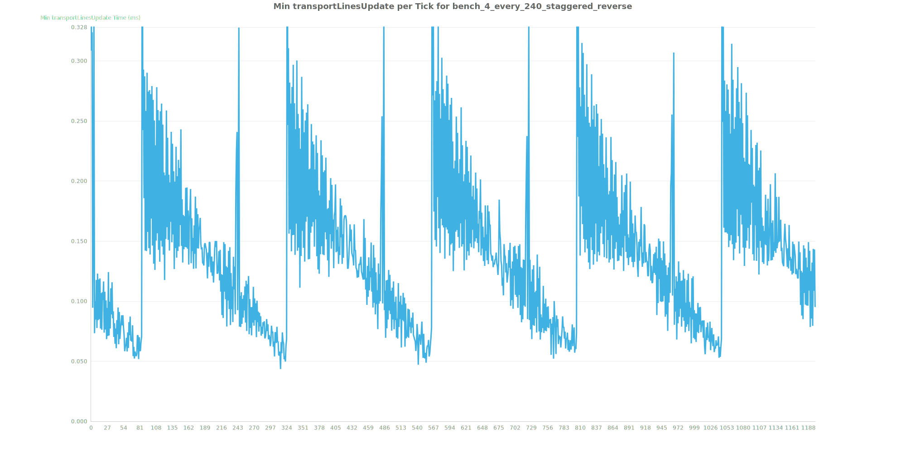
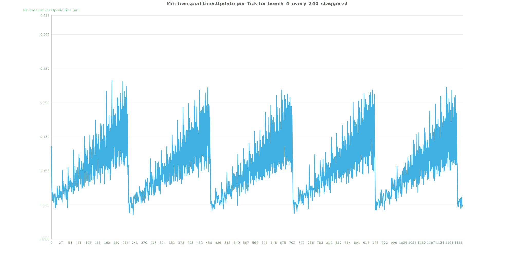
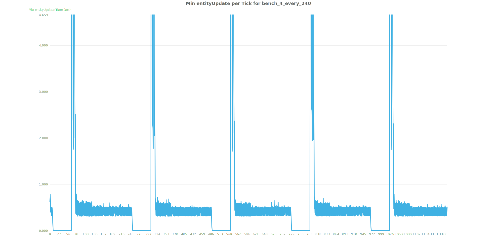

## Scenario
- 30 legendary stack inserters pick up items off a stacked turbo belt in a 240 tick cycle
- the objectives to be tested:
  - out of the control methods used in these tests, is one method superior over another for picking up items from an underground belt
- control methods used:
  - inserters are enabled for 1 tick every 60 grabbing 4 items at a time
  - inserters are enabled for 1 tick every 60 ticks staggered by 8 ticks sequentially
    - staggering methods used: with the direction of the belt and against the direction of belt (reverse)
  - inserters are enabled for 4 ticks every 240 ticks grabbing 16 items
  - inserters are enabled for 4 ticks every 240 ticks staggered by 8 ticks
    - staggering methods used: with the direction of the belt and against the direction of belt (reverse)
- 92 rows and 16 columns of 30 inserters are controlled via a single clock
- 47160 inserters per save file

## Results
- For a small snapshot see [1200 Tick Run Results](results_1200/README.md)
- For a more accurate represenation see [14400 Tick Run Results](results_14400/README.md)

## Conclusion

### Staggering Direction
Staggering with the direction of travel is superior over staggering against the direction of travel. You can see this by comparing the entity update and transport line time between the two control methods.

Against direction of travel entity update time:

With direction of travel entity update time:

Against direction of travel transport line updates:

With direction of travel transport line updates:

### Staggering vs All Together
Staggering with the direction of travel reduces large spikes of entity usage time. The longer the tests run, the more their update time becomes equal.

Staggering:

All Together:

### Other
- staggering against the direction of travel is one of the worst possible options
  - assumption being that each inserter is always interacting with a moving belt

