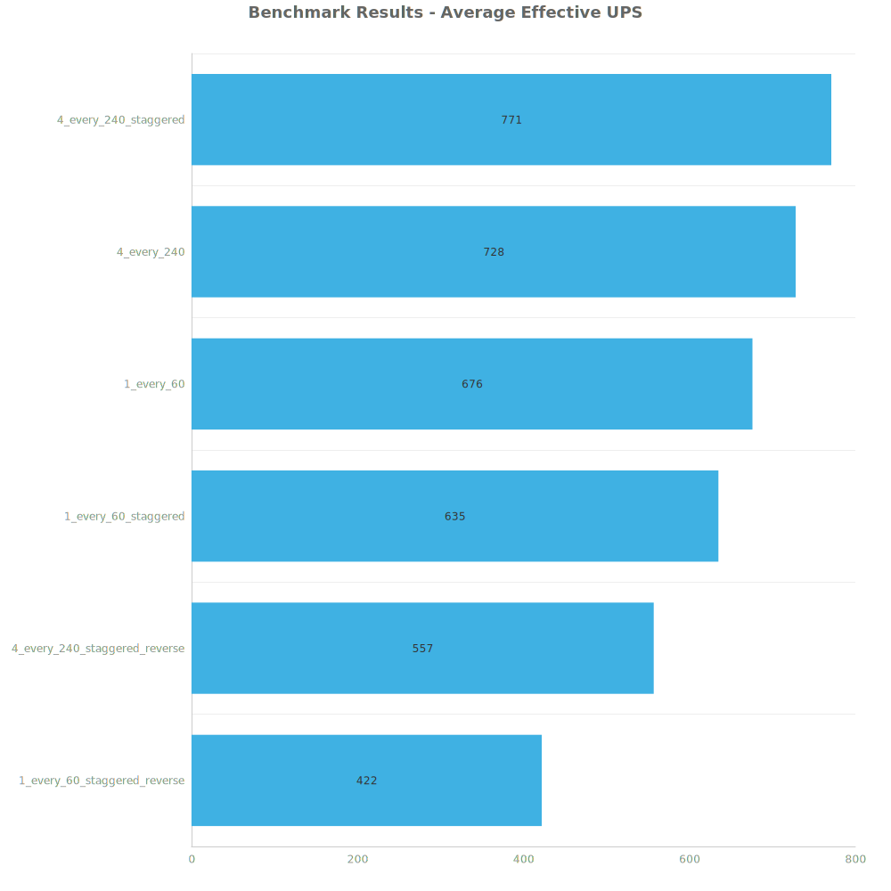
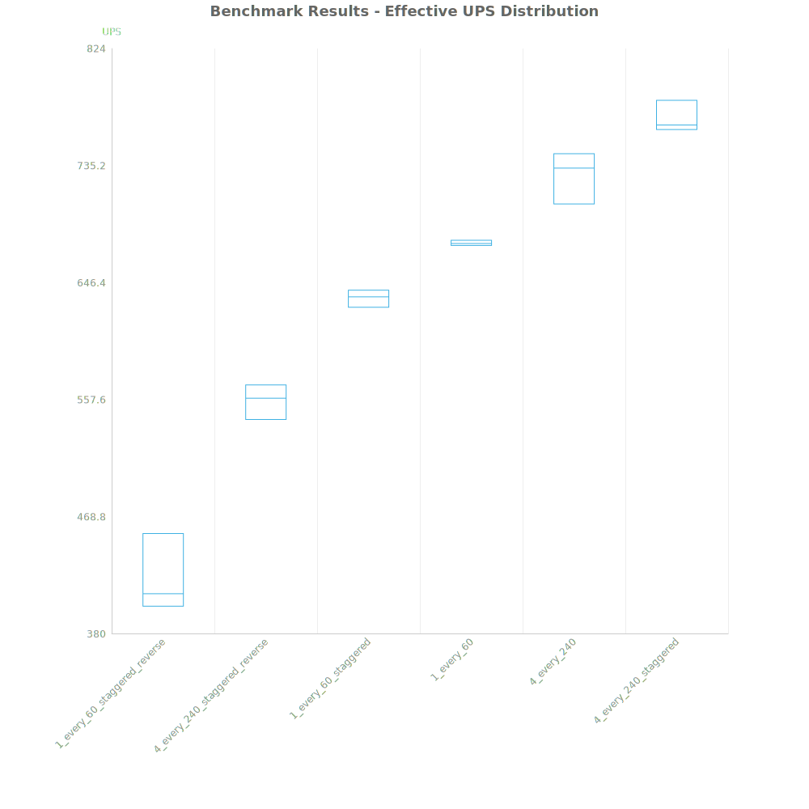
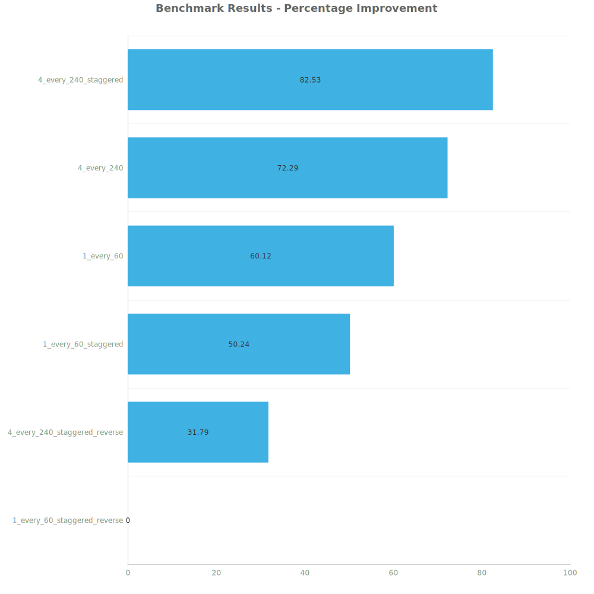

# Factorio Benchmark Results

**Platform:** windows-x86_64  
**Factorio Version:** 2.0.60  

## Scenario
* Each save was tested for 1200 tick(s) and 3 run(s)

## Results
| Metric            | Description                           |
| ----------------- | ------------------------------------- |
| **Mean UPS**      | Updates per second - higher is better |
| **Mean Avg (ms)** | Average frame time - lower is better  |
| **Mean Min (ms)** | Minimum frame time - lower is better  |
| **Mean Max (ms)** | Maximum frame time - lower is better  |

| Save | Avg (ms) | Min (ms) | Max (ms) | UPS | Execution Time (ms) |
|------|----------|----------|----------|-----|---------------------|
| 1_every_60_staggered_reverse | 2.375 | 1.326 | 8.602 | 422 | 8548 |
| 4_every_240_staggered_reverse | 1.797 | 0.816 | 4.364 | 556 | 6468 |
| 1_every_60_staggered | 1.576 | 1.157 | 3.992 | 634 | 5672 |
| 1_every_60 | 1.478 | 0.602 | 30.386 | 676 | 5322 |
| 4_every_240 | 1.375 | 0.231 | 32.318 | 727 | 4948 |
| 4_every_240_staggered | 1.297 | 0.629 | 3.516 | **771** | 4669 |

Box and Whisker Plot:

| Save | % Difference from base |
|------|------------------------|
| 1_every_60_staggered_reverse | 0.00% |
| 4_every_240_staggered_reverse | 31.79% |
| 1_every_60_staggered | 50.24% |
| 1_every_60 | 60.12% |
| 4_every_240 | 72.29% |
| 4_every_240_staggered | 82.53% |

## Conclusion