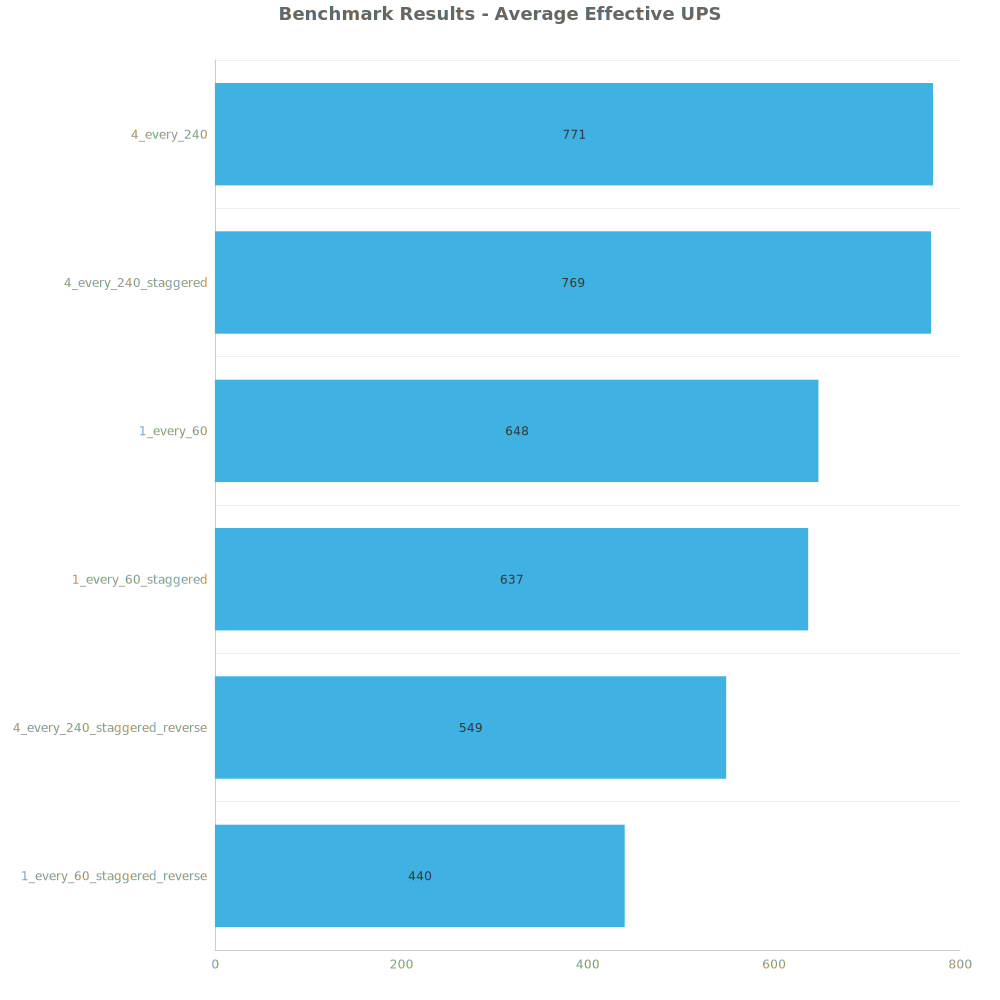
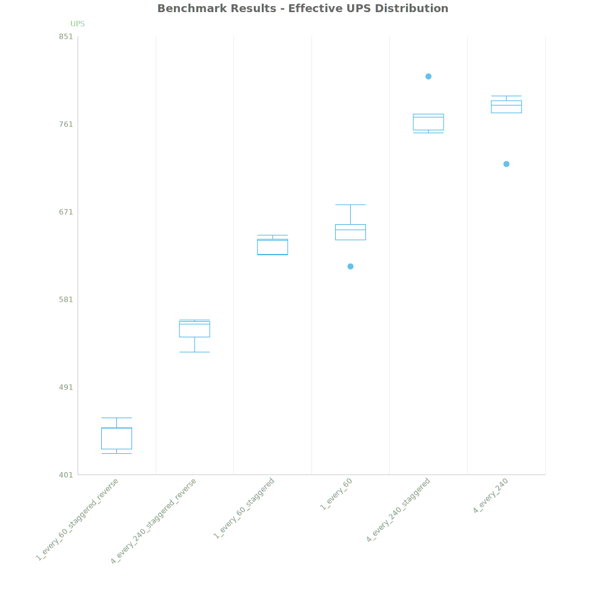
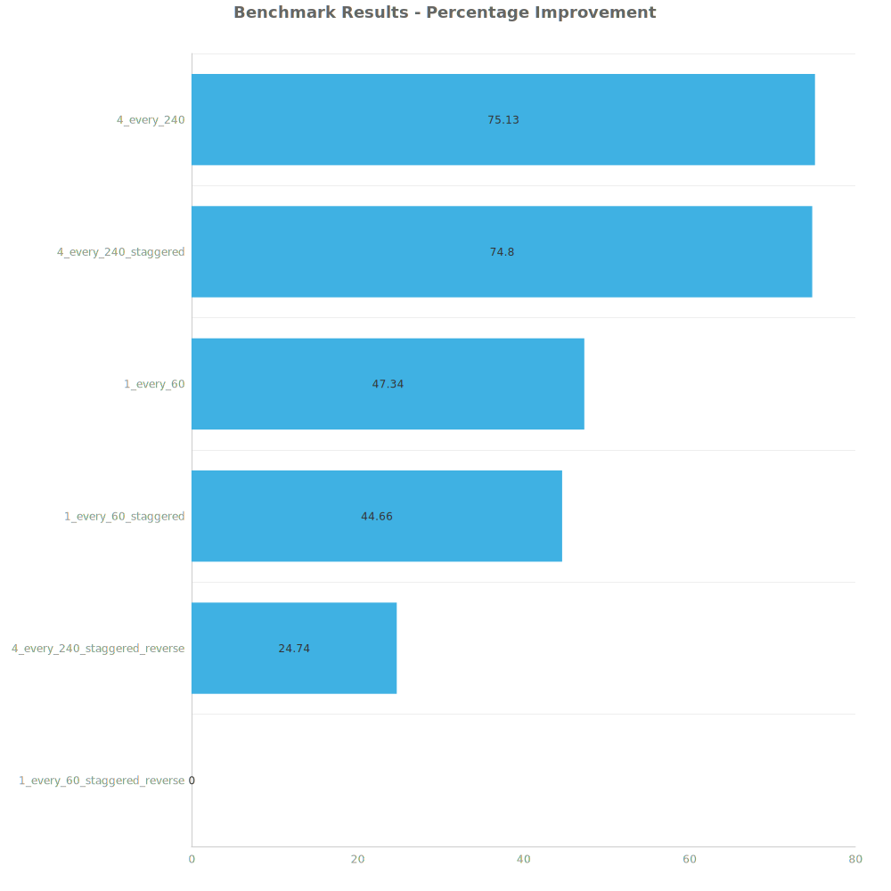

# Factorio Benchmark Results

**Platform:** windows-x86_64  
**Factorio Version:** 2.0.60  

## Scenario
* Each save was tested for 14400 tick(s) and 6 run(s)

## Results
| Metric            | Description                           |
| ----------------- | ------------------------------------- |
| **Mean UPS**      | Updates per second - higher is better |
| **Mean Avg (ms)** | Average frame time - lower is better  |
| **Mean Min (ms)** | Minimum frame time - lower is better  |
| **Mean Max (ms)** | Maximum frame time - lower is better  |

| Save | Avg (ms) | Min (ms) | Max (ms) | UPS | Execution Time (ms) |
|------|----------|----------|----------|-----|---------------------|
| 1_every_60_staggered_reverse | 2.274 | 1.269 | 9.971 | 440 | 196488 |
| 4_every_240_staggered_reverse | 1.822 | 0.801 | 7.103 | 548 | 157449 |
| 1_every_60_staggered | 1.571 | 1.130 | 8.587 | 636 | 135723 |
| 1_every_60 | 1.543 | 0.589 | 47.251 | 648 | 133355 |
| 4_every_240_staggered | 1.301 | 0.618 | 9.815 | 769 | 112376 |
| 4_every_240 | 1.299 | 0.224 | 40.468 | **770** | 112202 |

Box and Whisker Plot:

| Save | % Difference from base |
|------|------------------------|
| 1_every_60_staggered_reverse | 0.00% |
| 4_every_240_staggered_reverse | 24.74% |
| 1_every_60_staggered | 44.66% |
| 1_every_60 | 47.34% |
| 4_every_240_staggered | 74.80% |
| 4_every_240 | 75.13% |

## Conclusion