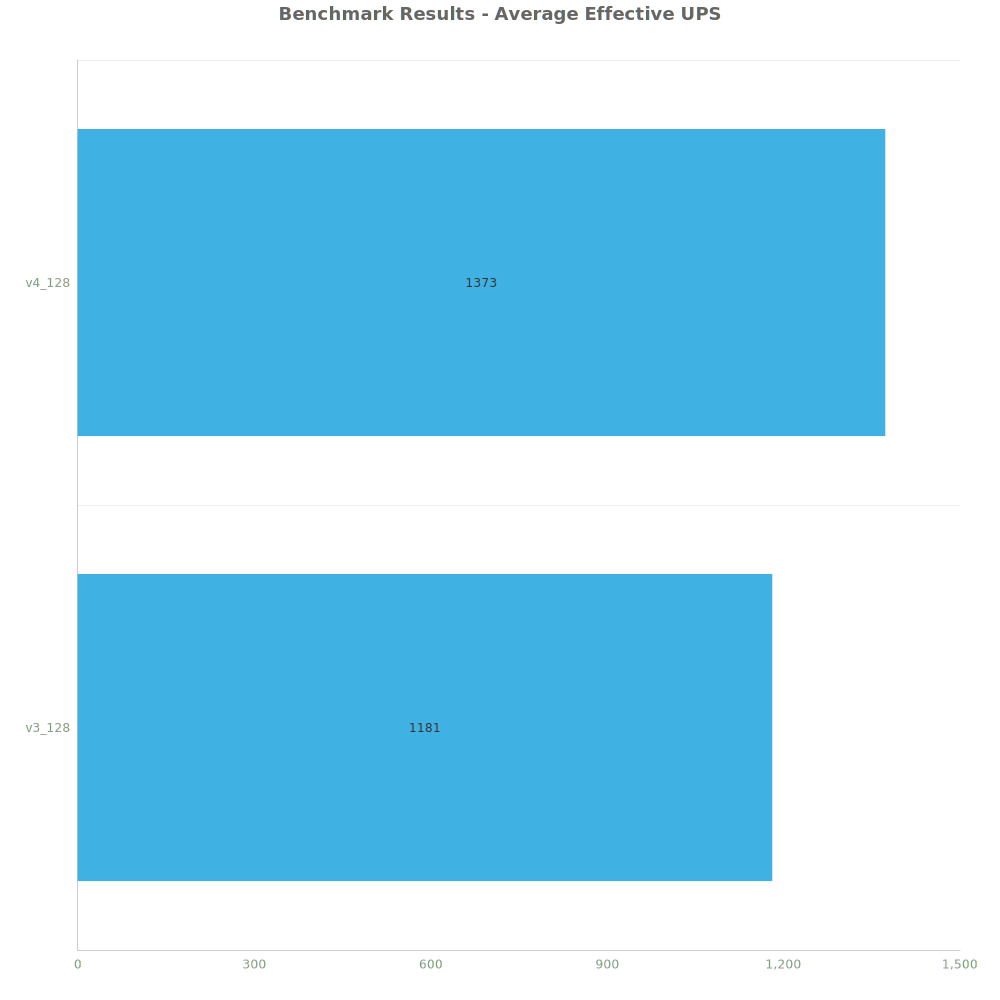
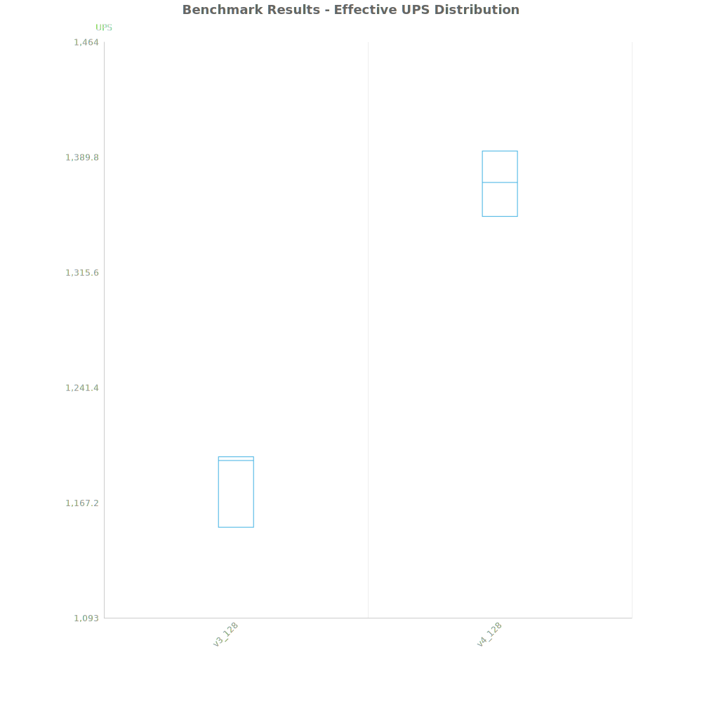
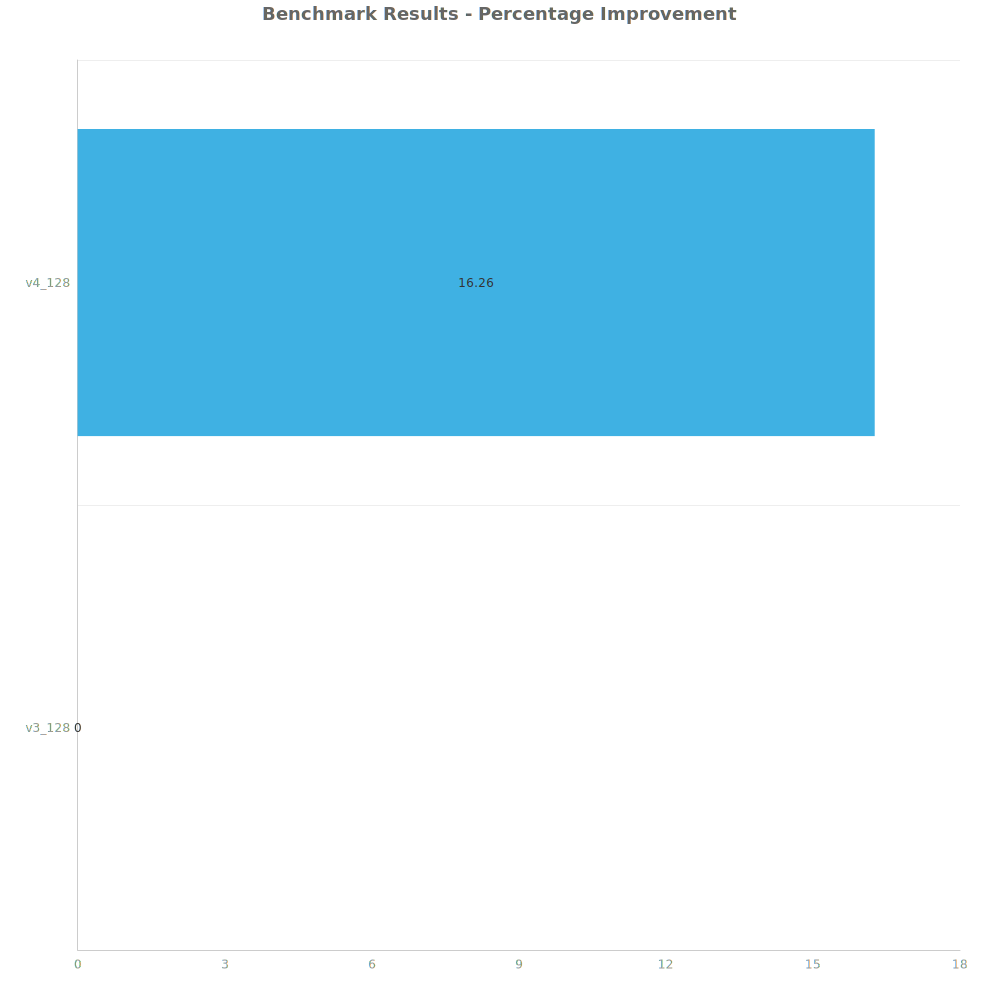
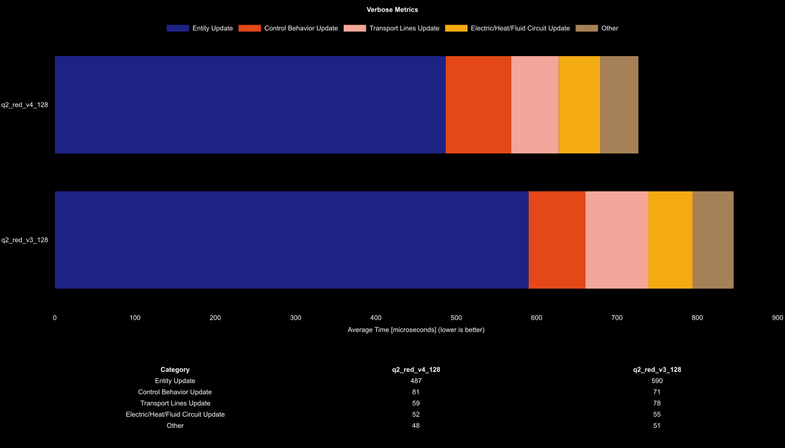

# Factorio Benchmark Results

**Platform:** windows-x86_64  
**Factorio Version:** 2.0.64  

## Scenario
* Each save was tested for 36000 tick(s) and 3 run(s)
* 1_843_200 uncommon science per minute per save
* 128 fully stacked lanes of uncommon red science
* v4 is a direct insertion build, v3 is a belt driven build

## Results
| Metric            | Description                           |
| ----------------- | ------------------------------------- |
| **Mean UPS**      | Updates per second - higher is better |
| **Mean Avg (ms)** | Average frame time - lower is better  |
| **Mean Min (ms)** | Minimum frame time - lower is better  |
| **Mean Max (ms)** | Maximum frame time - lower is better  |

| Save   | Avg (ms) | Min (ms) | Max (ms) | UPS      | Execution Time (ms) |
| ------ | -------- | -------- | -------- | -------- | ------------------- |
| v3_128 | 0.847    | 0.449    | 3.157    | 1180     | 91478               |
| v4_128 | 0.728    | 0.315    | 3.568    | **1373** | 78669               |

Box and Whisker Plot:

| Save   | % Difference from base |
| ------ | ---------------------- |
| v3_128 | 0.00%                  |
| v4_128 | 16.26%                 |

## Conclusion
Direct insertion is superior over higher beacon count and less entities