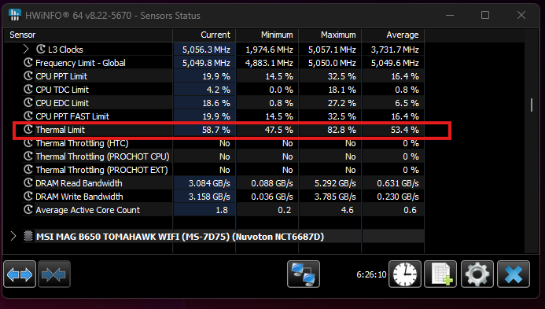
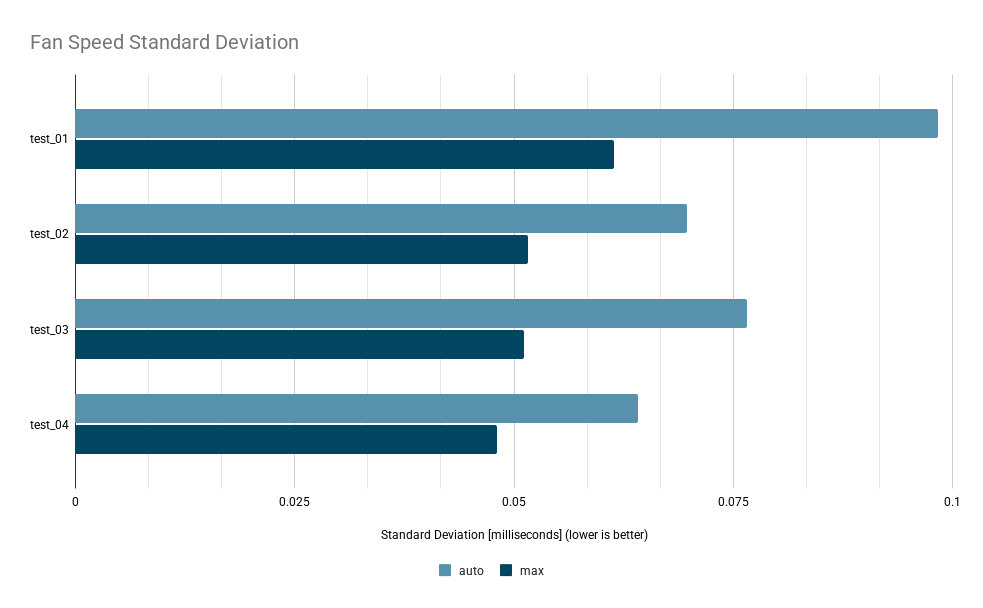
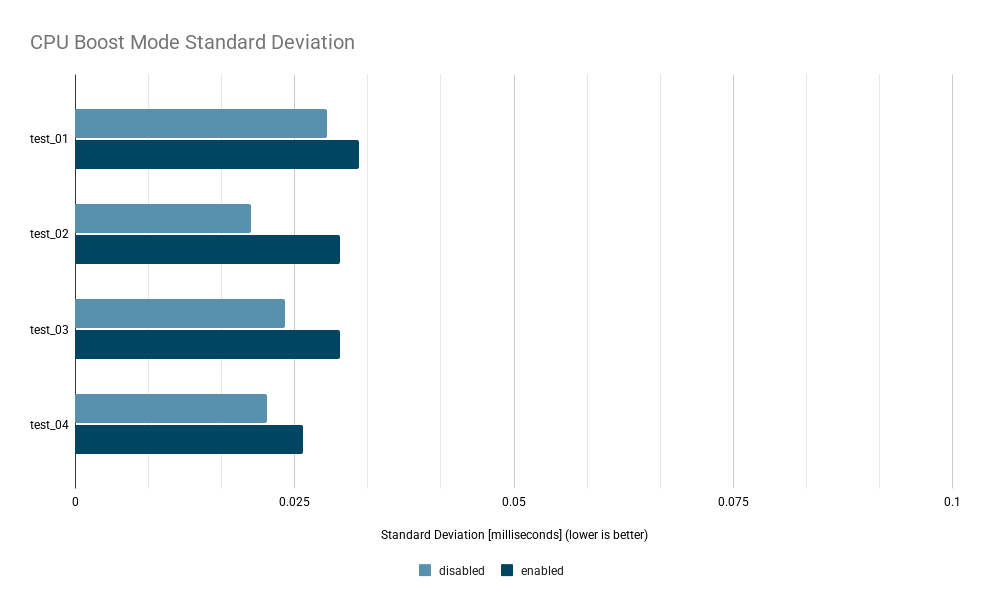
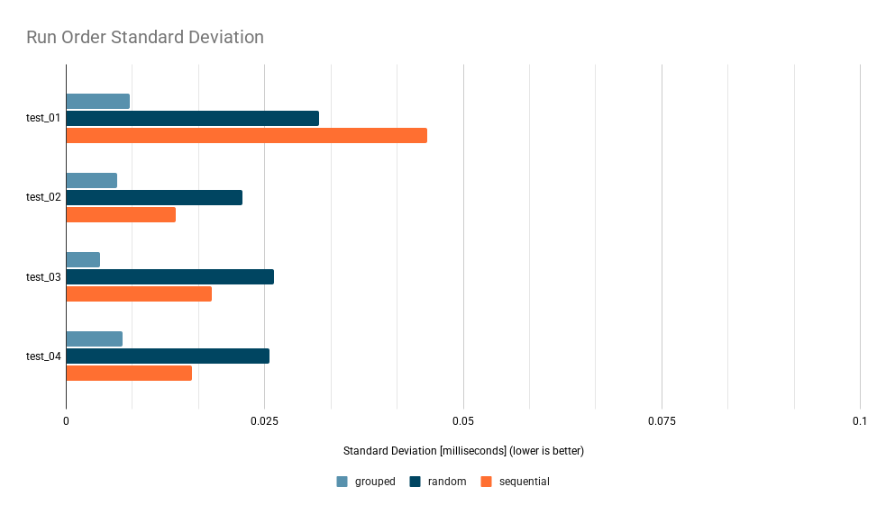
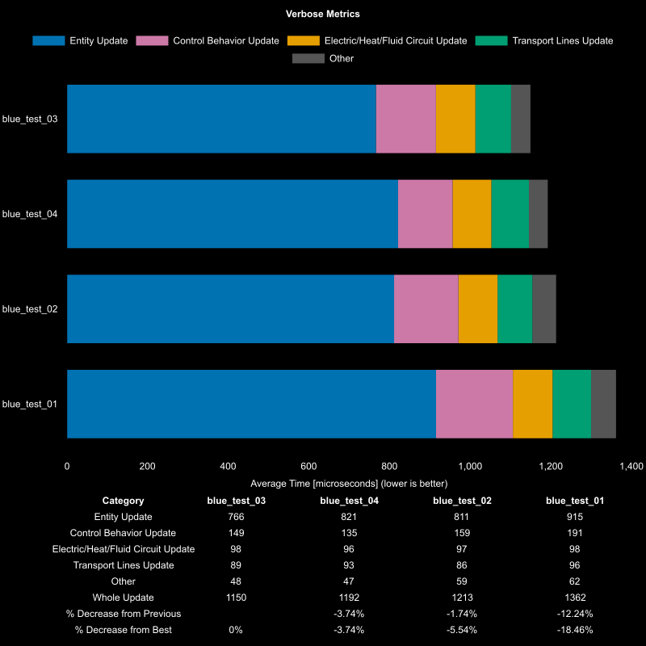
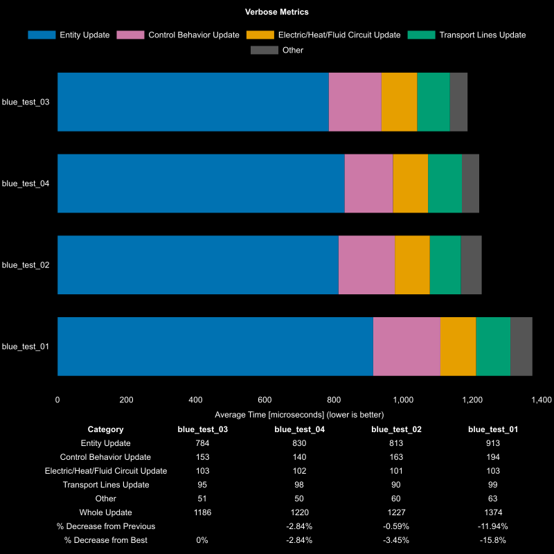

## Table of Contents
- [Table of Contents](#table-of-contents)
- [Overview](#overview)
- [Maps](#maps)
- [Configurations](#configurations)
- [Thermal Throttling Verification using HWiNFO](#thermal-throttling-verification-using-hwinfo)
- [Results](#results)
  - [Impact on Performance](#impact-on-performance)
  - [Impact of Fan Speed](#impact-of-fan-speed)
  - [Impact of CPU Boosting](#impact-of-cpu-boosting)
  - [Run Order](#run-order)
    - [Sequential Run Order](#sequential-run-order)
    - [Grouped Run Order](#grouped-run-order)
    - [Random Run Order](#random-run-order)
- [Conclusion](#conclusion)

## Overview

The goal of this experiment is to observe and test running benchmarks on X3D processors for Factorio.

The objective is to determine if the variance between runs can be reduced by changing operating system settings.

## Maps
The maps that are chosen are work in progress maps for a chemical science design. The objective is to uses these 4 maps to provide varying test maps for the benchmark, but the actual results of map to map is irrelevant.

The maps have 96 copies of the same design per save file producing 96 stacked green belt lanes of chemical science.

Each save file is run for 7200 ticks and 8 runs sequentially.

## Configurations

This test is run on a Ryzen 7800X3D cpu. The goal is to run the following configurations and capture the variantion across 10 runs for each save file.

1. Boost Enabled / Disabled
2. Fans at 100% Speed / Automatic
3. Run order sequential / grouped / random
4. Map order ascending / reversed

To disable boost mode, the following Windows registry edit is performed to enable controlling the boost mode in the power plan settings:
[Enable Processor Boost Mode Control in Windows](https://gist.github.com/ehsan18t/268fa28f581e512a0a0df66b95daab88)

## Thermal Throttling Verification using HWiNFO
HWiNFO was open during all tests.
The CPU never experienced thermal throttling during the test run reaching at maximum 82.8% of the thermal threshold and 53.4% on average.

## Results

### Impact on Performance
Across all runs, the results clearly indicated that the best performing maps were in the following order:
1. `test_03`
2. `test_04`
3. `test_02`
4. `test_01`

Regardless of chosen strategy, the differences were large enough to be consistent across the runs. The strategy chosen had an impact to 

### Impact of Fan Speed

The standard deviation across runs has a direct impact on whether fans are set to max speed or automatic.

Across all runs regardless of control strategy or boost mode, settings the fans to max speed lowered the overall standard deviation of all runs.

**Recommendation**: Set Fans to Max Speed

### Impact of CPU Boosting

Boosting has a smaller impact to the standard deviation, but unpredictable spreads for each map and has a larger impact to AB comparisons between maps.

**Recommendation**: Disable CPU Boost Mode

### Run Order
Run order is configured in three different modes:
1. Sequential: `01,02,03,04,01,02,03,04...`
2. Grouped: `01,01,02,02,03,03,04,04...`
3. Random: `01,04,03,04,02,01...`

**Recommendation**: Use `Random` run order and throw out runs that are outside the 95th percentile (2 standard deviations from the average)

#### Sequential Run Order
Sequential seems to have larger standard deviation for the first test by name ascending. When looking further into that specific run however it is clear that map `test_01` had a clear outlier that fell well outside the 95th percentile as shown below:

This leads to the suggestion to ignore runs that fall outside the 95th percentile range (2 standard deviations from the average).

Below are the verbose metrics with relative differences to use as a comparison to other strategies.

#### Grouped Run Order

For grouped, this strategy has the smallest standard deviation for the same map but can lead to temporal bias. So at first glance, this strategy is superior on a per-map basis as shown below:

However, if any background process on the machine kicks off during a specific maps benchmarks, the standard distribution may be low, but the average of that map may be artificially inflated. Two examples below are the detailed metrics from running the `grouped` order and running the maps in ascending vs descending order.

Ascending:

Descending:

When running the maps in ascending order, the maps that were run first, had better benchmark scores. When running in descending order, the maps that were previously run first had now relatively worse scores than previously. This shows a bias towards maps run earlier in the benchmark compared to those that were run at the end of the benchmark.

**Suggestions:**
1. pause between grouped runs
2. choose sequential run order
3. choose random run order

#### Random Run Order
Random run order had less outliers that other strategies. It had a lower standard distribution compared to sequential order, but a higher standard distribution compared to grouped.

This appears to strike a better balance on the relative differences between maps naturally without having to throw out runs that fall outside the standard deviation as it eliminates temporal bias. However, this could also just be a lucky run where there was no clear outlier runs.

Note that the verbose metrics highlight the relative differences between maps is now greater than grouped, but less than sequential.

## Conclusion
The following would be the recommended approach to getting the most reliable benchmark data:

1. Disable CPU boosting
2. Set Fans manually to 100%
3. Run in random run order
4. Remove all runs that fall outside the 95th percentile per save file