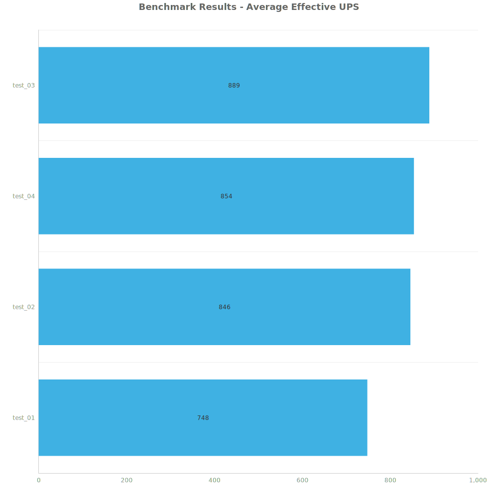
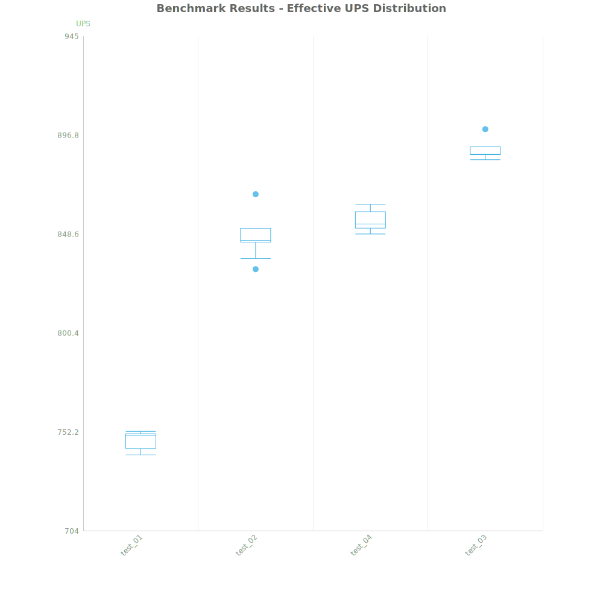
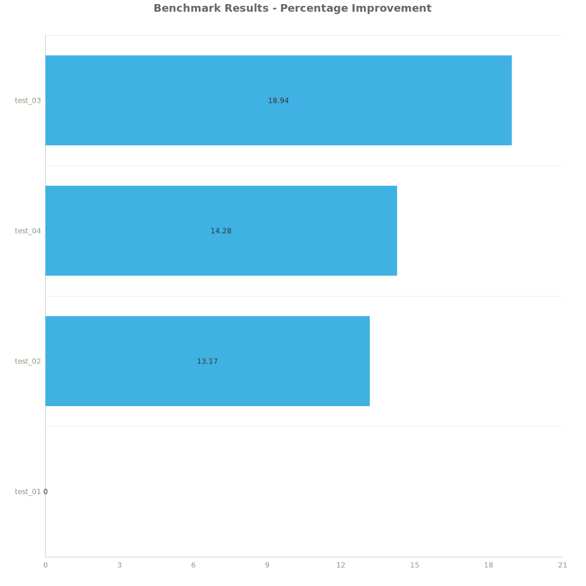

# Factorio Benchmark Results

**Platform:** windows-x86_64
**Factorio Version:** 2.0.64

## Scenario
* Each save was tested for 7200 tick(s) and 8 run(s)

## Results
| Metric | Description |
| ----------------- | ------------------------------------- |
| **Mean UPS** | Updates per second - higher is better |
| **Mean Avg (ms)** | Average frame time - lower is better |
| **Mean Min (ms)** | Minimum frame time - lower is better |
| **Mean Max (ms)** | Maximum frame time - lower is better |

| Save | Avg (ms) | Min (ms) | Max (ms) | UPS | Execution Time (ms) | % Difference from Worst |
|------|----------|----------|----------|-----|---------------------| --- |
| test_01 | 1.338 | 0.815 | 4.282 | 747 | 77042 | 0.00% |
| test_02 | 1.182 | 0.613 | 4.195 | 846 | 68085 | 13.17% |
| test_04 | 1.170 | 0.405 | 5.973 | 854 | 67417 | 14.28% |
| test_03 | 1.125 | 0.426 | 5.207 | **889** | 64774 | 18.94% |

Box and Whisker Plot:

## Conclusion