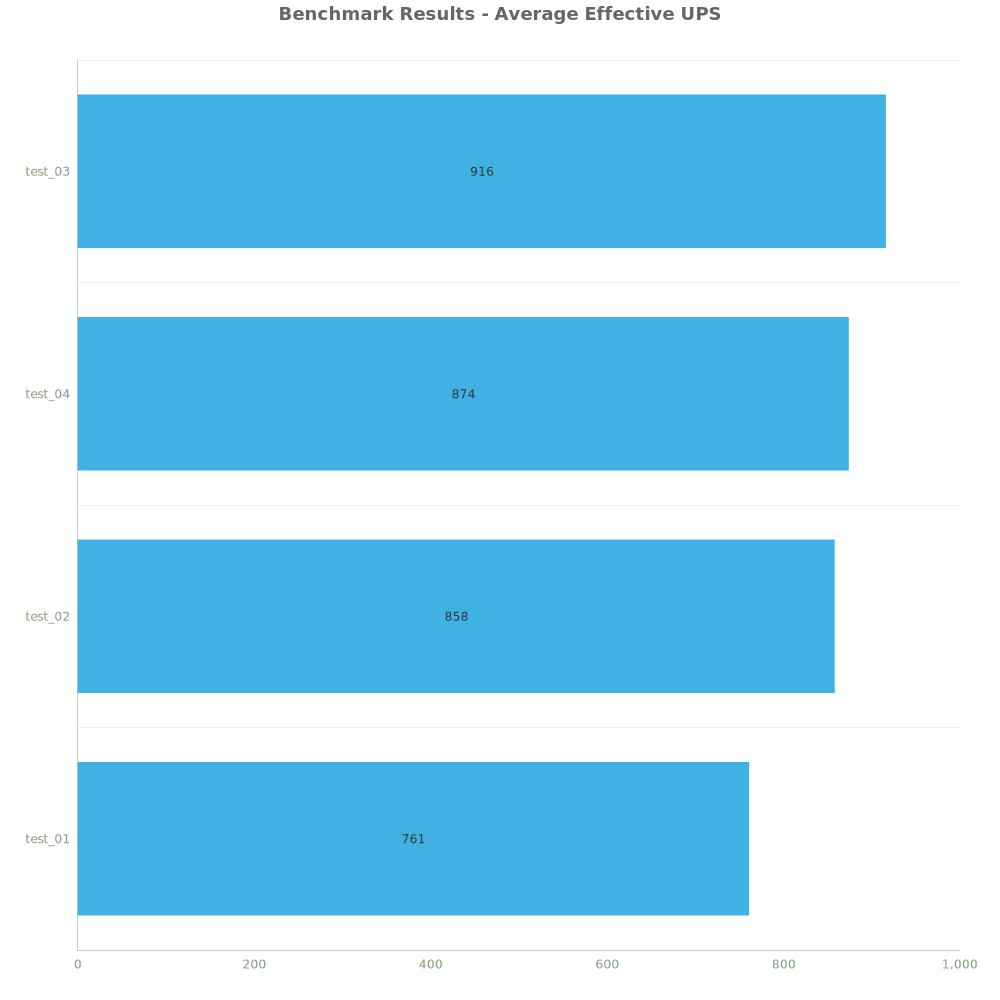
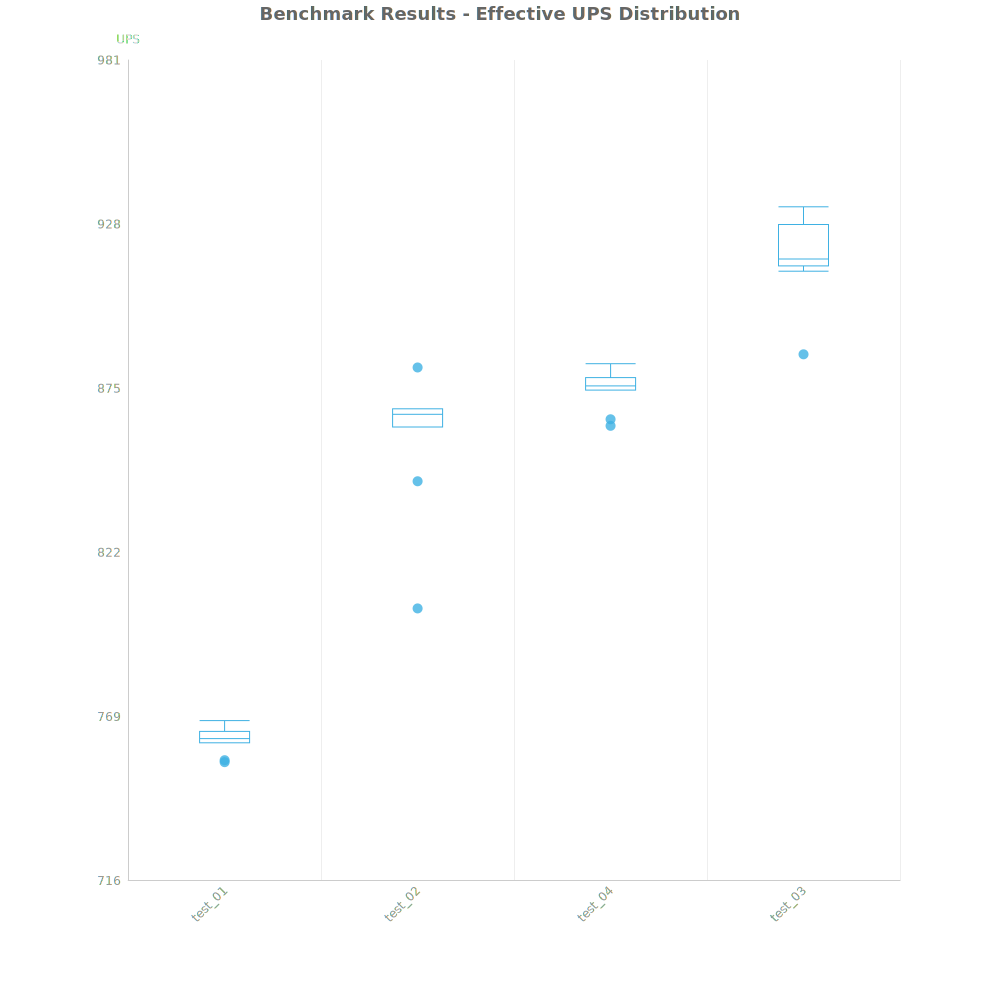
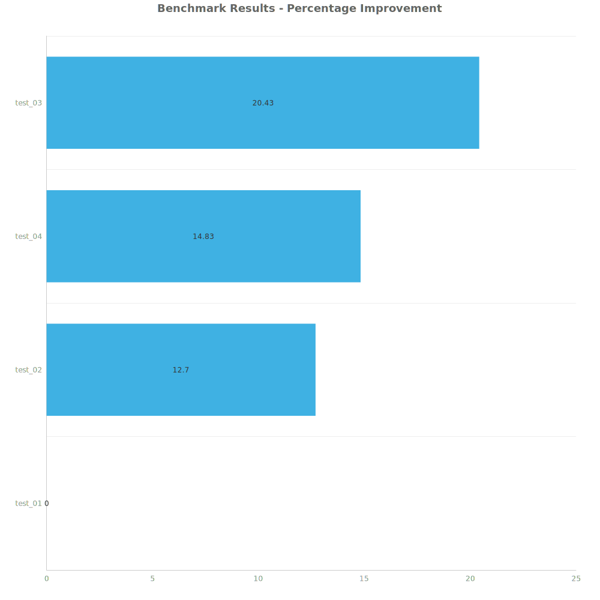

# Factorio Benchmark Results

**Platform:** windows-x86_64
**Factorio Version:** 2.0.64

## Scenario
* Each save was tested for 7200 tick(s) and 8 run(s)

## Results
| Metric | Description |
| ----------------- | ------------------------------------- |
| **Mean UPS** | Updates per second - higher is better |
| **Mean Avg (ms)** | Average frame time - lower is better |
| **Mean Min (ms)** | Minimum frame time - lower is better |
| **Mean Max (ms)** | Maximum frame time - lower is better |

| Save | Avg (ms) | Min (ms) | Max (ms) | UPS | Execution Time (ms) | % Difference from Worst |
|------|----------|----------|----------|-----|---------------------| --- |
| test_01 | 1.315 | 0.797 | 4.345 | 760 | 75701 | 0.00% |
| test_02 | 1.167 | 0.585 | 4.223 | 857 | 67217 | 12.70% |
| test_04 | 1.144 | 0.392 | 4.964 | 873 | 65926 | 14.83% |
| test_03 | 1.092 | 0.414 | 5.571 | **916** | 62871 | 20.43% |

Box and Whisker Plot:

## Conclusion