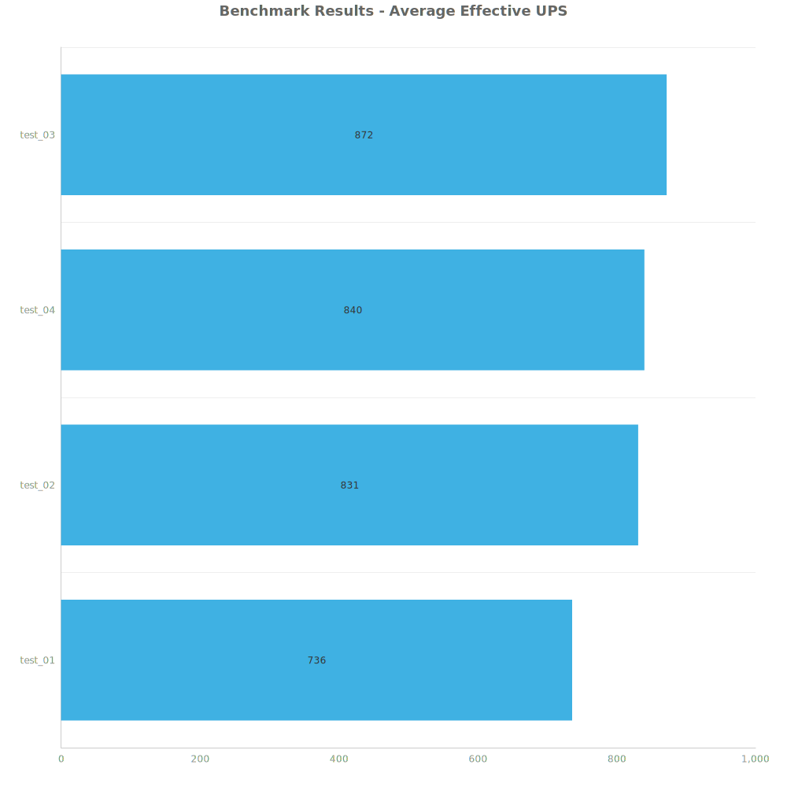
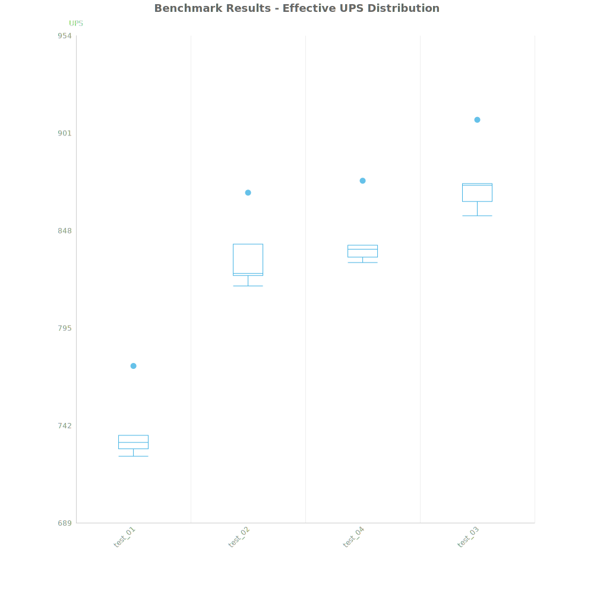
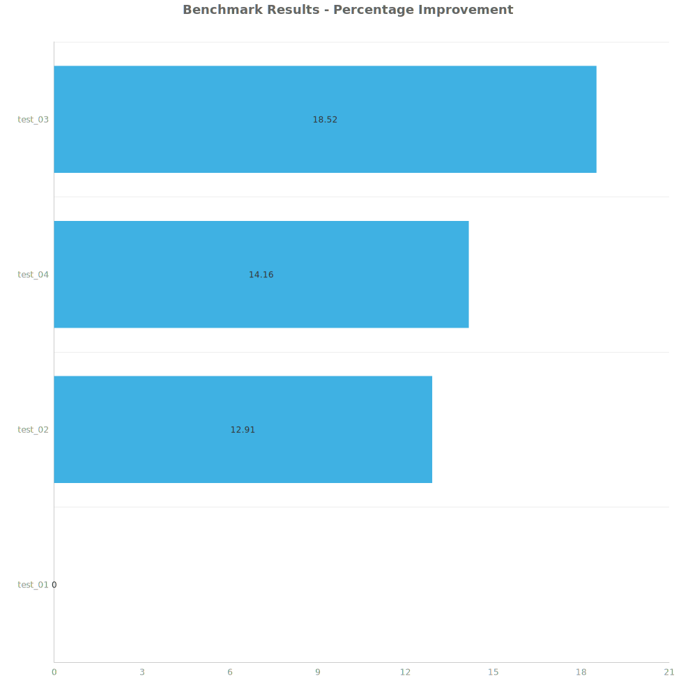

# Factorio Benchmark Results

**Platform:** windows-x86_64
**Factorio Version:** 2.0.64

## Scenario
* Each save was tested for 7200 tick(s) and 8 run(s)

## Results
| Metric | Description |
| ----------------- | ------------------------------------- |
| **Mean UPS** | Updates per second - higher is better |
| **Mean Avg (ms)** | Average frame time - lower is better |
| **Mean Min (ms)** | Minimum frame time - lower is better |
| **Mean Max (ms)** | Maximum frame time - lower is better |

| Save | Avg (ms) | Min (ms) | Max (ms) | UPS | Execution Time (ms) | % Difference from Worst |
|------|----------|----------|----------|-----|---------------------| --- |
| test_01 | 1.359 | 0.811 | 4.700 | 736 | 78282 | 0.00% |
| test_02 | 1.204 | 0.592 | 4.467 | 831 | 69326 | 12.91% |
| test_04 | 1.190 | 0.413 | 5.446 | 840 | 68560 | 14.16% |
| test_03 | 1.147 | 0.426 | 7.999 | **872** | 66043 | 18.52% |

Box and Whisker Plot:

## Conclusion