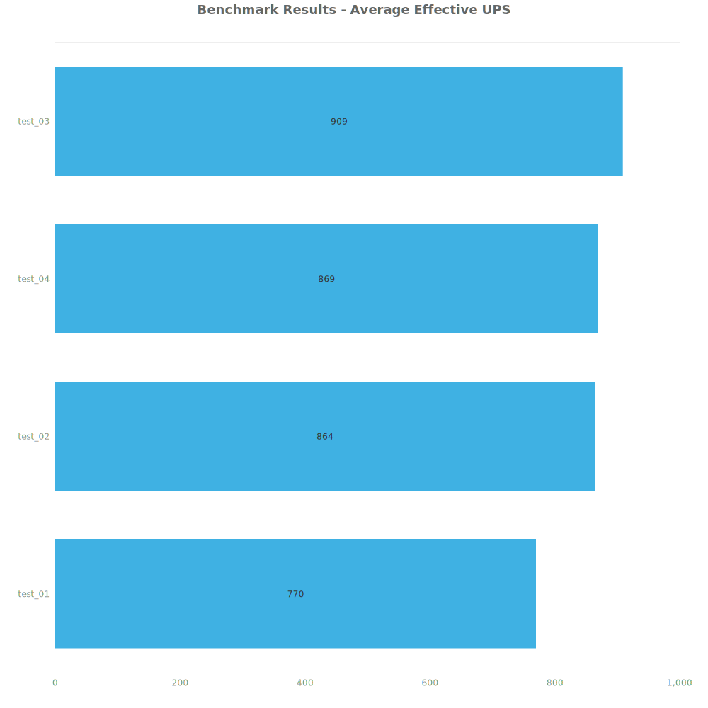
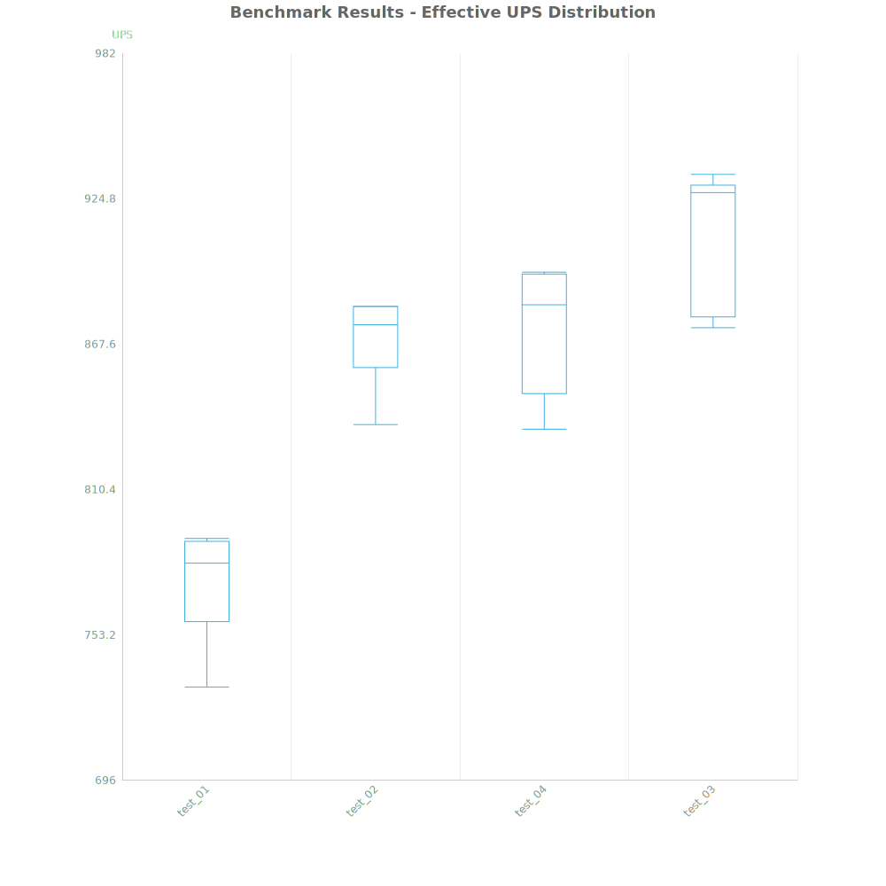
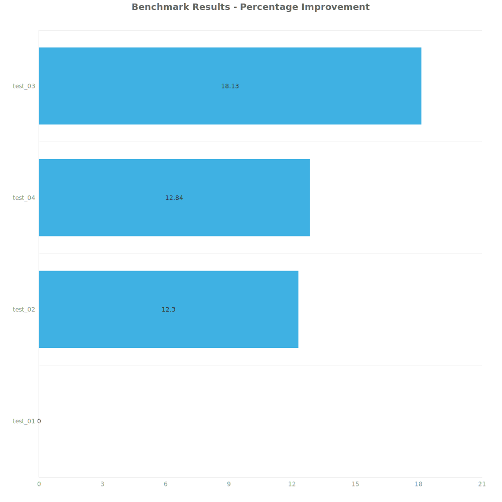

# Factorio Benchmark Results

**Platform:** windows-x86_64
**Factorio Version:** 2.0.64

## Scenario
* Each save was tested for 7200 tick(s) and 8 run(s)

## Results
| Metric | Description |
| ----------------- | ------------------------------------- |
| **Mean UPS** | Updates per second - higher is better |
| **Mean Avg (ms)** | Average frame time - lower is better |
| **Mean Min (ms)** | Minimum frame time - lower is better |
| **Mean Max (ms)** | Maximum frame time - lower is better |

| Save | Avg (ms) | Min (ms) | Max (ms) | UPS | Execution Time (ms) | % Difference from Worst |
|------|----------|----------|----------|-----|---------------------| --- |
| test_01 | 1.300 | 0.789 | 4.904 | 769 | 74876 | 0.00% |
| test_02 | 1.157 | 0.605 | 4.297 | 864 | 66660 | 12.30% |
| test_04 | 1.152 | 0.397 | 6.237 | 868 | 66352 | 12.84% |
| test_03 | 1.101 | 0.419 | 5.869 | **909** | 63393 | 18.13% |

Box and Whisker Plot:

## Conclusion