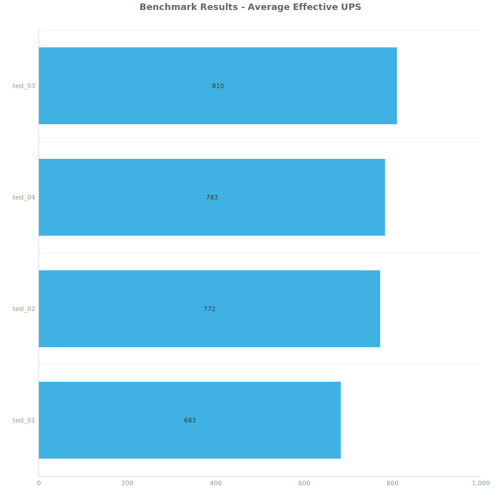
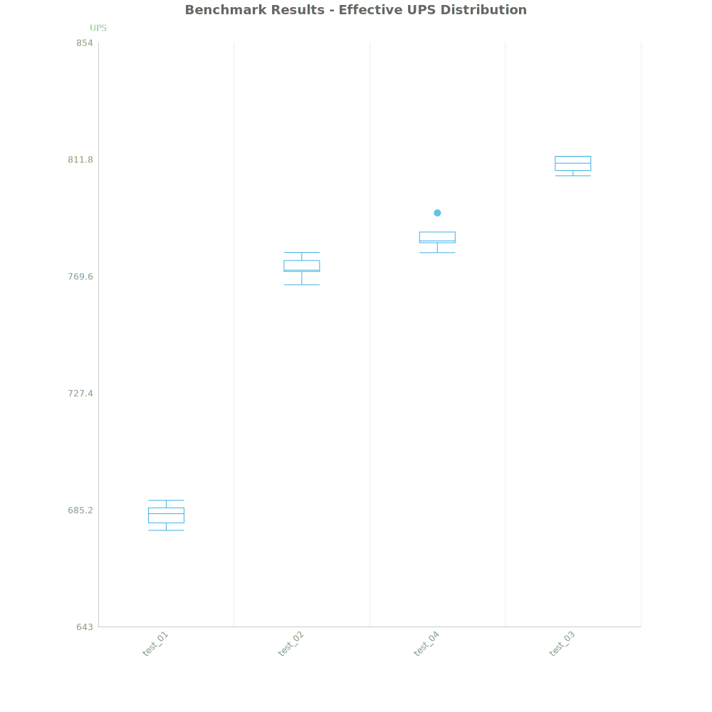
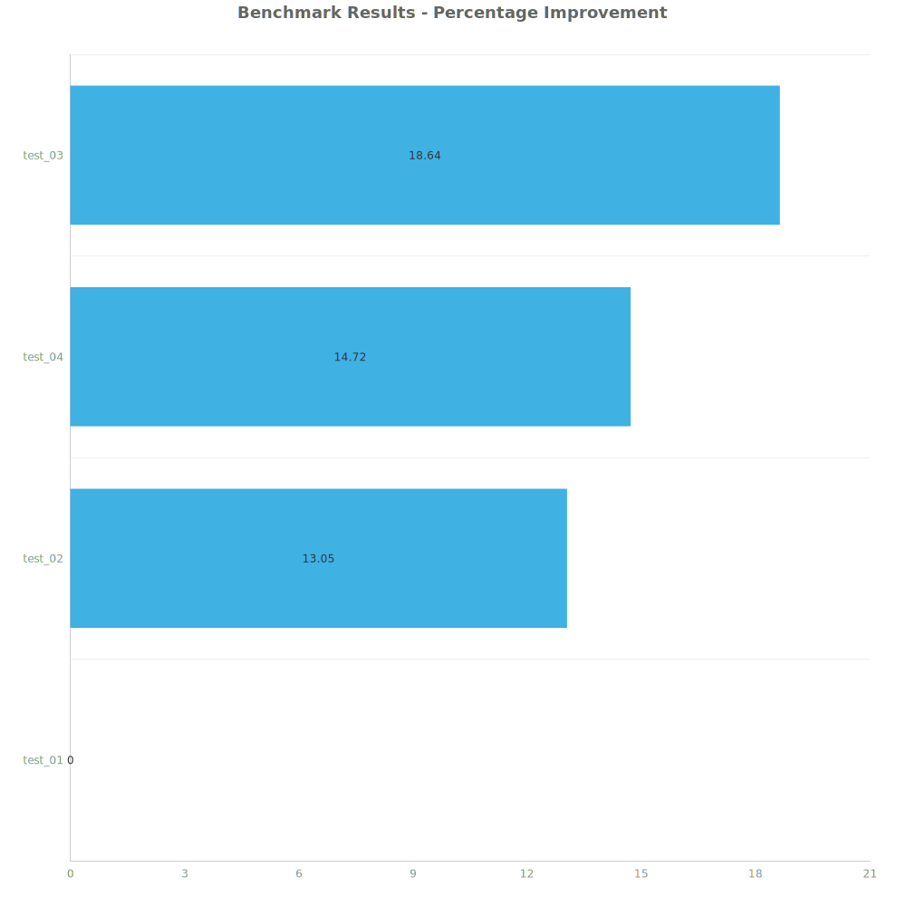

# Factorio Benchmark Results

**Platform:** windows-x86_64
**Factorio Version:** 2.0.64

## Scenario
* Each save was tested for 7200 tick(s) and 8 run(s)

## Results
| Metric | Description |
| ----------------- | ------------------------------------- |
| **Mean UPS** | Updates per second - higher is better |
| **Mean Avg (ms)** | Average frame time - lower is better |
| **Mean Min (ms)** | Minimum frame time - lower is better |
| **Mean Max (ms)** | Maximum frame time - lower is better |

| Save | Avg (ms) | Min (ms) | Max (ms) | UPS | Execution Time (ms) | % Difference from Worst |
|------|----------|----------|----------|-----|---------------------| --- |
| test_01 | 1.465 | 0.939 | 4.615 | 682 | 84379 | 0.00% |
| test_02 | 1.296 | 0.707 | 5.002 | 771 | 74637 | 13.05% |
| test_04 | 1.277 | 0.448 | 6.089 | 783 | 73552 | 14.72% |
| test_03 | 1.235 | 0.476 | 6.270 | **809** | 71120 | 18.64% |

Box and Whisker Plot:

## Conclusion