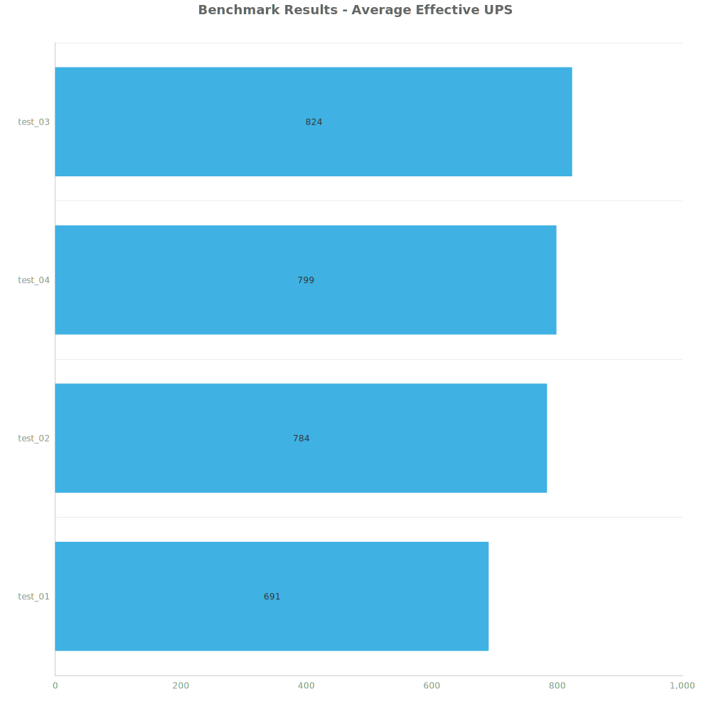
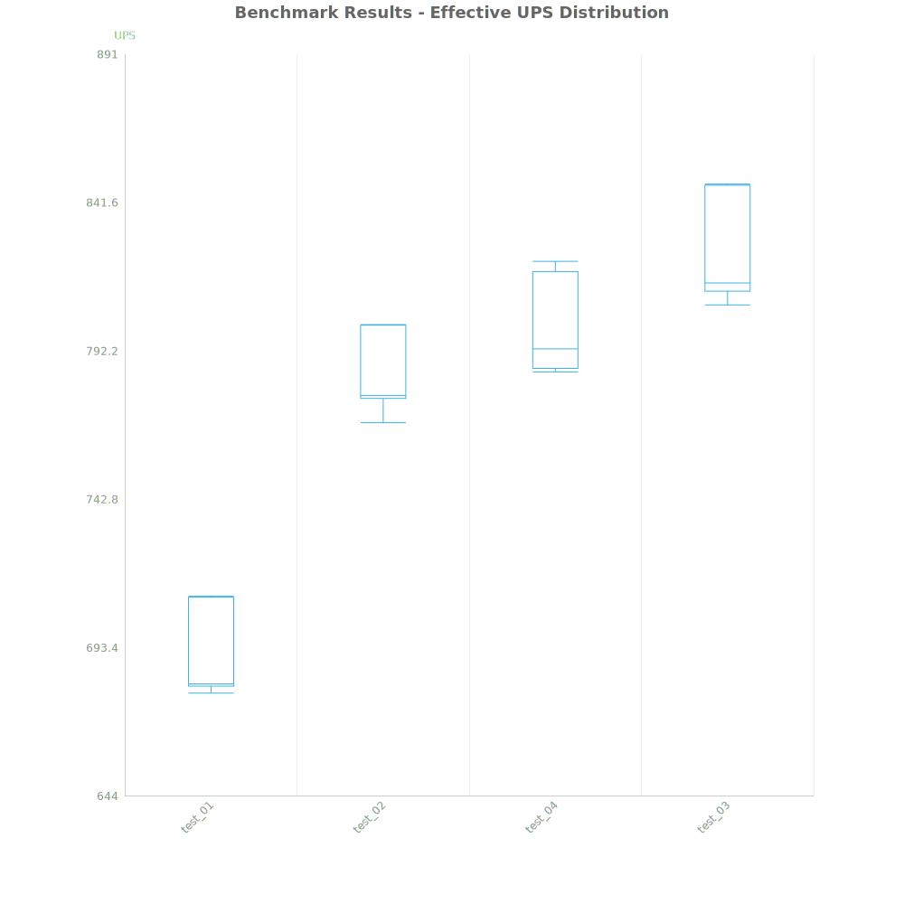
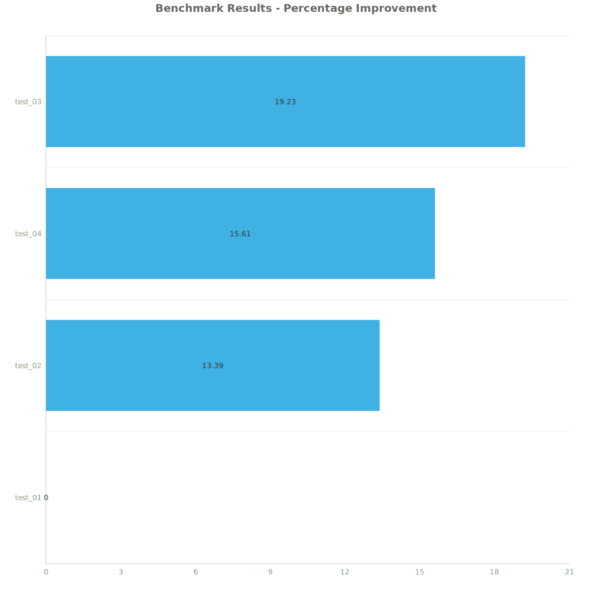

# Factorio Benchmark Results

**Platform:** windows-x86_64
**Factorio Version:** 2.0.64

## Scenario
* Each save was tested for 7200 tick(s) and 8 run(s)

## Results
| Metric | Description |
| ----------------- | ------------------------------------- |
| **Mean UPS** | Updates per second - higher is better |
| **Mean Avg (ms)** | Average frame time - lower is better |
| **Mean Min (ms)** | Minimum frame time - lower is better |
| **Mean Max (ms)** | Maximum frame time - lower is better |

| Save | Avg (ms) | Min (ms) | Max (ms) | UPS | Execution Time (ms) | % Difference from Worst |
|------|----------|----------|----------|-----|---------------------| --- |
| test_01 | 1.447 | 0.890 | 4.581 | 691 | 83350 | 0.00% |
| test_02 | 1.276 | 0.688 | 5.123 | 783 | 73494 | 13.39% |
| test_04 | 1.252 | 0.443 | 6.768 | 799 | 72091 | 15.61% |
| test_03 | 1.214 | 0.480 | 5.901 | **824** | 69906 | 19.23% |

Box and Whisker Plot:

## Conclusion