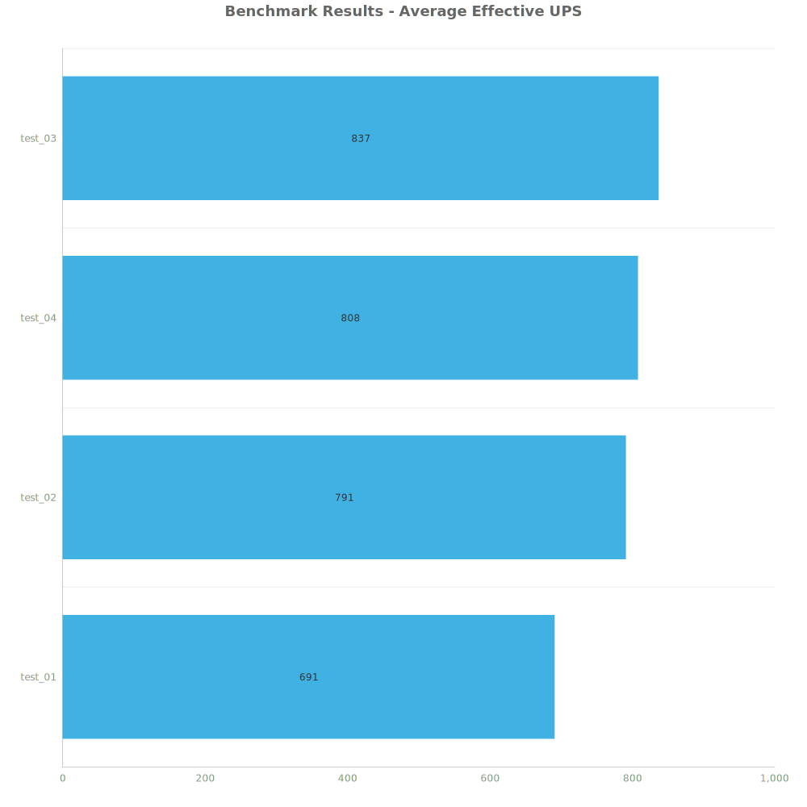
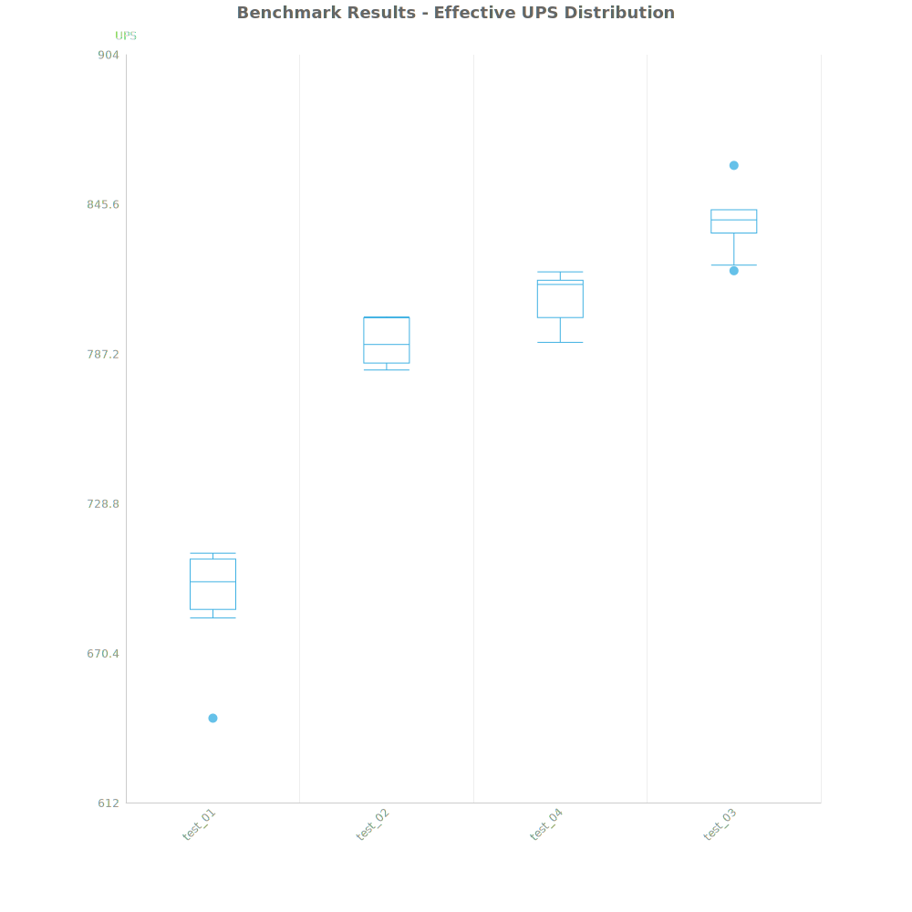
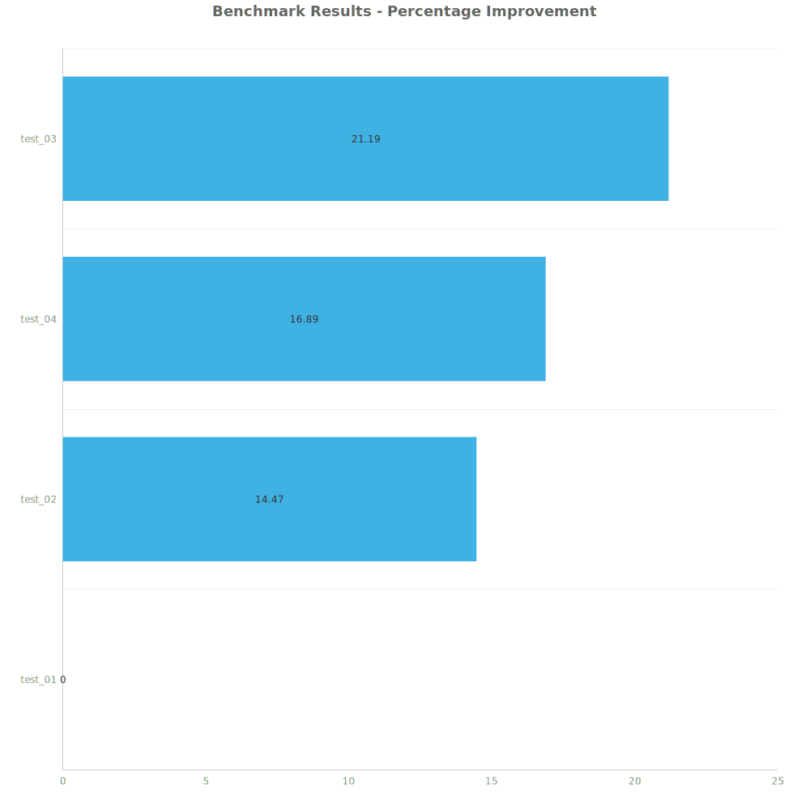

# Factorio Benchmark Results

**Platform:** windows-x86_64
**Factorio Version:** 2.0.64

## Scenario
* Each save was tested for 7200 tick(s) and 8 run(s)

## Results
| Metric | Description |
| ----------------- | ------------------------------------- |
| **Mean UPS** | Updates per second - higher is better |
| **Mean Avg (ms)** | Average frame time - lower is better |
| **Mean Min (ms)** | Minimum frame time - lower is better |
| **Mean Max (ms)** | Maximum frame time - lower is better |

| Save | Avg (ms) | Min (ms) | Max (ms) | UPS | Execution Time (ms) | % Difference from Worst |
|------|----------|----------|----------|-----|---------------------| --- |
| test_01 | 1.449 | 0.901 | 4.547 | 690 | 83447 | 0.00% |
| test_02 | 1.265 | 0.694 | 5.144 | 790 | 72844 | 14.47% |
| test_04 | 1.239 | 0.441 | 5.414 | 807 | 71340 | 16.89% |
| test_03 | 1.195 | 0.457 | 8.127 | **837** | 68815 | 21.19% |

Box and Whisker Plot:

## Conclusion