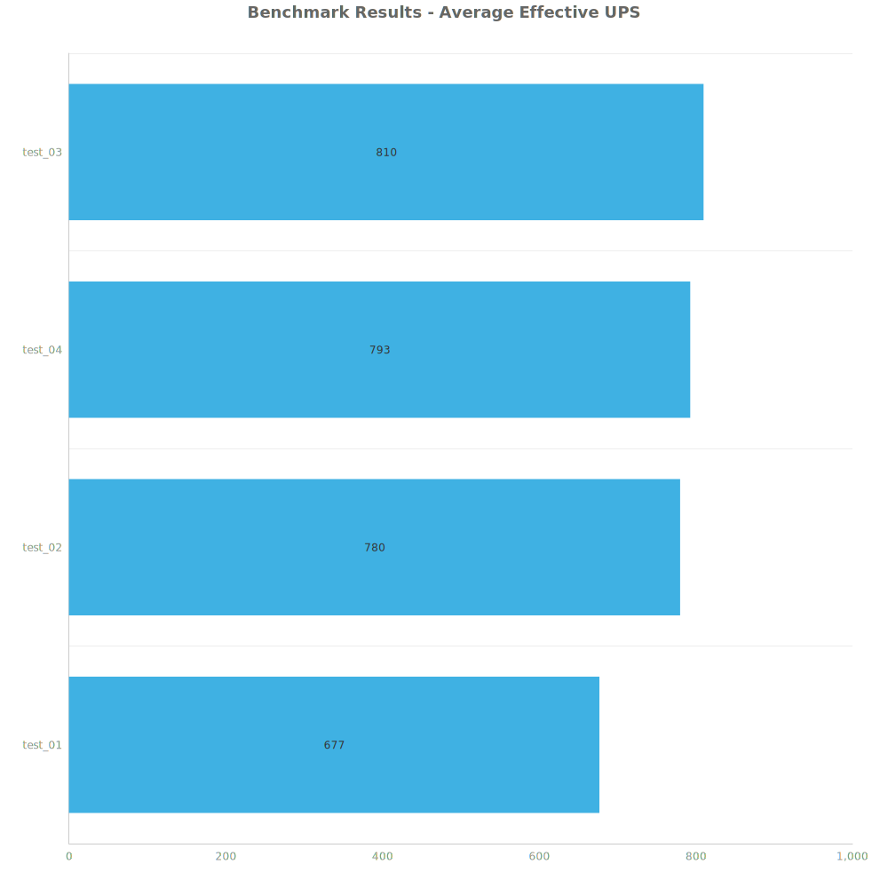
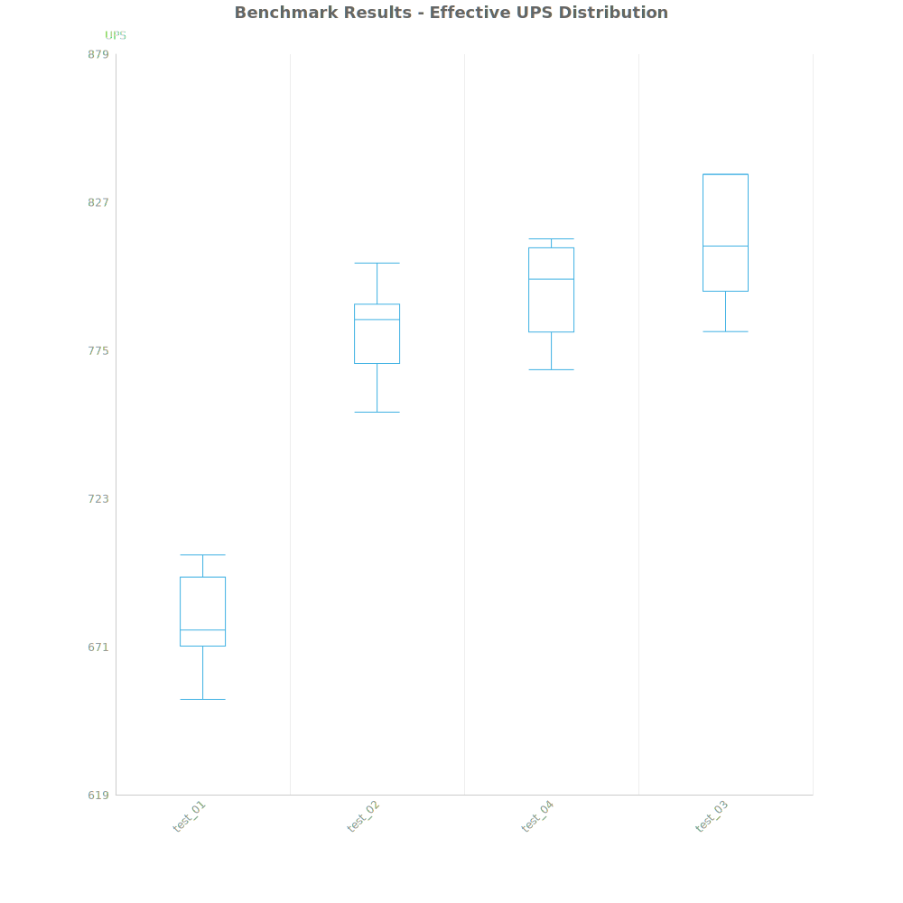
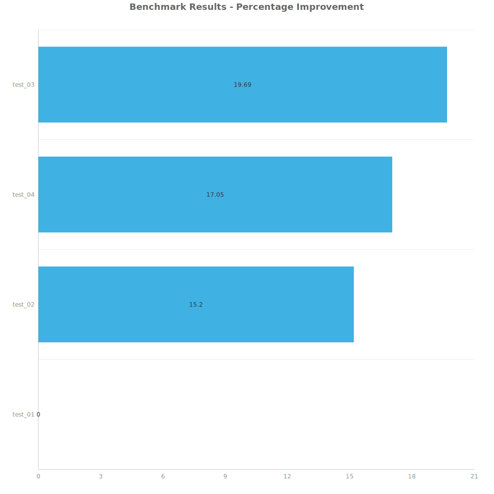

# Factorio Benchmark Results

**Platform:** windows-x86_64
**Factorio Version:** 2.0.64

## Scenario
* Each save was tested for 7200 tick(s) and 8 run(s)

## Results
| Metric | Description |
| ----------------- | ------------------------------------- |
| **Mean UPS** | Updates per second - higher is better |
| **Mean Avg (ms)** | Average frame time - lower is better |
| **Mean Min (ms)** | Minimum frame time - lower is better |
| **Mean Max (ms)** | Maximum frame time - lower is better |

| Save | Avg (ms) | Min (ms) | Max (ms) | UPS | Execution Time (ms) | % Difference from Worst |
|------|----------|----------|----------|-----|---------------------| --- |
| test_01 | 1.478 | 0.920 | 4.618 | 677 | 85110 | 0.00% |
| test_02 | 1.282 | 0.689 | 4.340 | 780 | 73872 | 15.20% |
| test_04 | 1.262 | 0.441 | 5.875 | 792 | 72708 | 17.05% |
| test_03 | 1.235 | 0.469 | 6.882 | **810** | 71118 | 19.69% |

Box and Whisker Plot:

## Conclusion