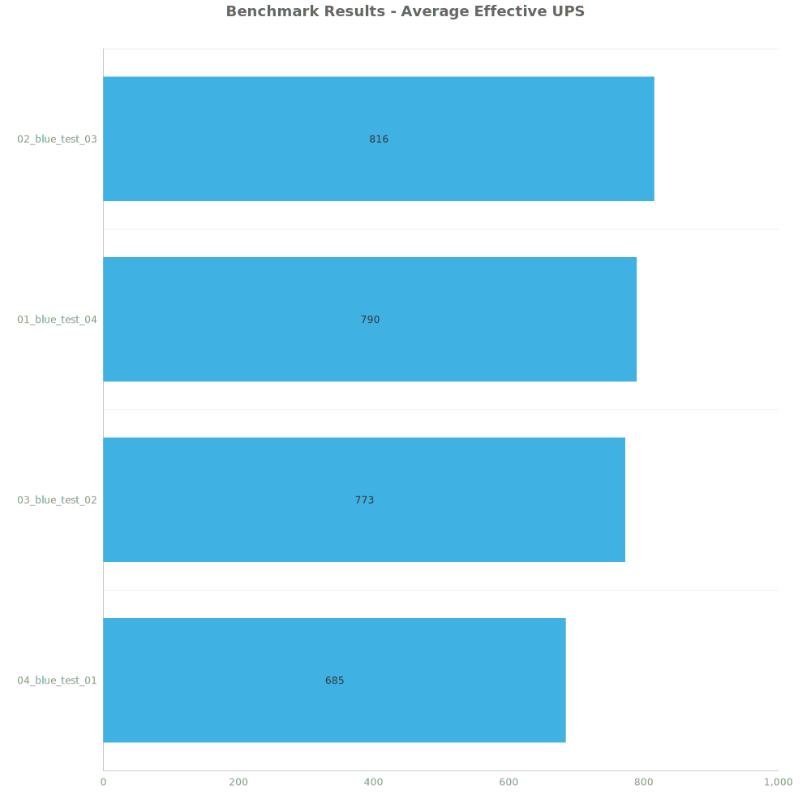
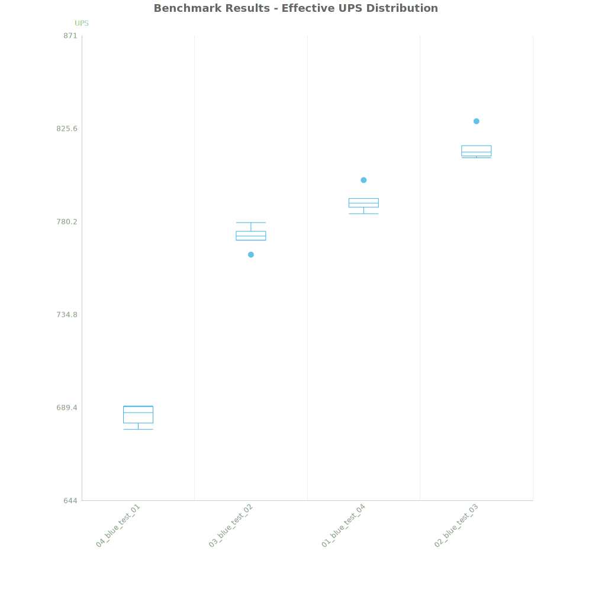
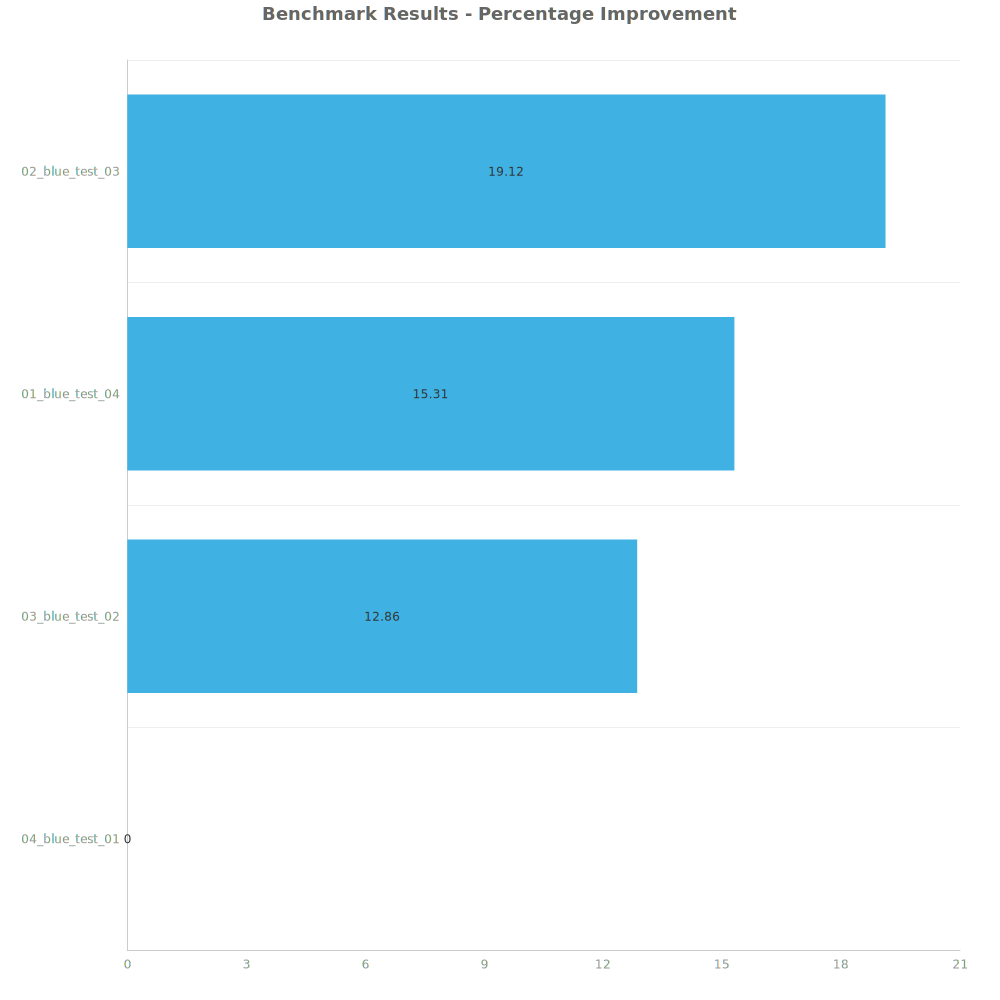

# Factorio Benchmark Results

**Platform:** windows-x86_64
**Factorio Version:** 2.0.64

## Scenario
* Each save was tested for 7200 tick(s) and 8 run(s)

## Results
| Metric | Description |
| ----------------- | ------------------------------------- |
| **Mean UPS** | Updates per second - higher is better |
| **Mean Avg (ms)** | Average frame time - lower is better |
| **Mean Min (ms)** | Minimum frame time - lower is better |
| **Mean Max (ms)** | Maximum frame time - lower is better |

| Save | Avg (ms) | Min (ms) | Max (ms) | UPS | Execution Time (ms) | % Difference from Worst |
|------|----------|----------|----------|-----|---------------------| --- |
| 04_blue_test_01 | 1.461 | 0.913 | 4.515 | 684 | 84121 | 0.00% |
| 03_blue_test_02 | 1.294 | 0.689 | 4.263 | 772 | 74537 | 12.86% |
| 01_blue_test_04 | 1.266 | 0.472 | 6.268 | 789 | 72952 | 15.31% |
| 02_blue_test_03 | 1.226 | 0.493 | 5.887 | **815** | 70620 | 19.12% |

Box and Whisker Plot:

## Conclusion