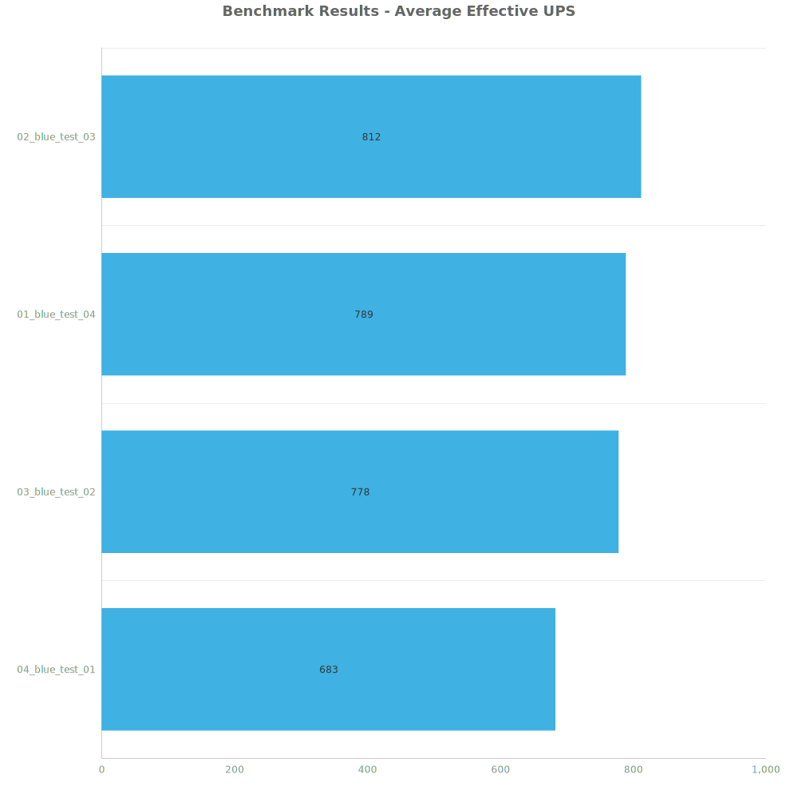
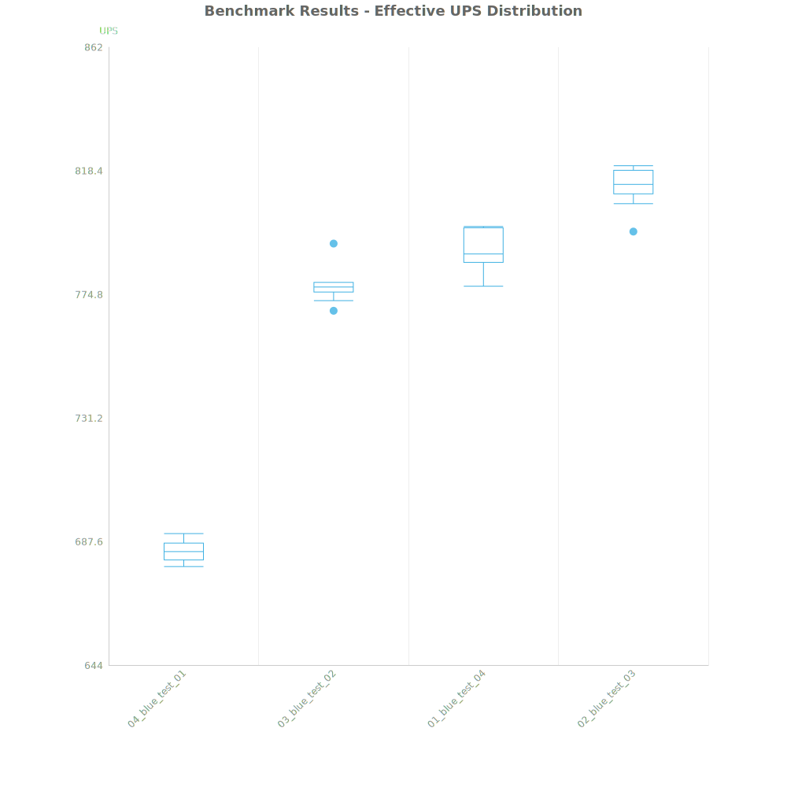
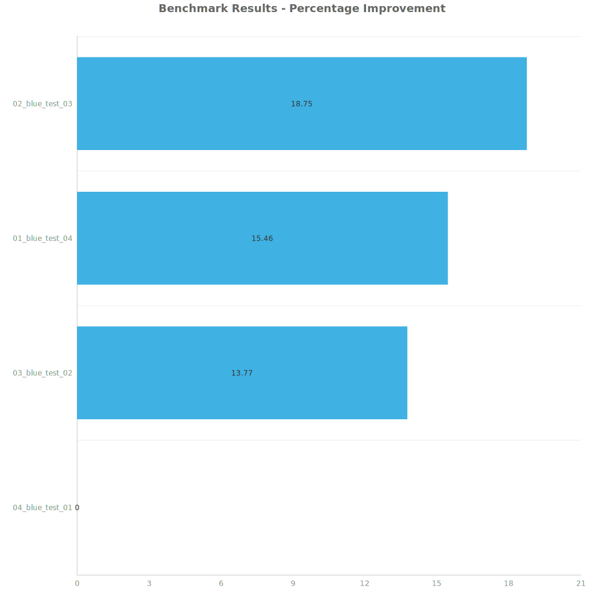

# Factorio Benchmark Results

**Platform:** windows-x86_64
**Factorio Version:** 2.0.64

## Scenario
* Each save was tested for 7200 tick(s) and 8 run(s)

## Results
| Metric | Description |
| ----------------- | ------------------------------------- |
| **Mean UPS** | Updates per second - higher is better |
| **Mean Avg (ms)** | Average frame time - lower is better |
| **Mean Min (ms)** | Minimum frame time - lower is better |
| **Mean Max (ms)** | Maximum frame time - lower is better |

| Save | Avg (ms) | Min (ms) | Max (ms) | UPS | Execution Time (ms) | % Difference from Worst |
|------|----------|----------|----------|-----|---------------------| --- |
| 04_blue_test_01 | 1.463 | 0.909 | 4.875 | 683 | 84275 | 0.00% |
| 03_blue_test_02 | 1.286 | 0.674 | 4.915 | 777 | 74077 | 13.77% |
| 01_blue_test_04 | 1.267 | 0.460 | 7.987 | 789 | 72994 | 15.46% |
| 02_blue_test_03 | 1.232 | 0.482 | 5.834 | **811** | 70970 | 18.75% |

Box and Whisker Plot:

## Conclusion