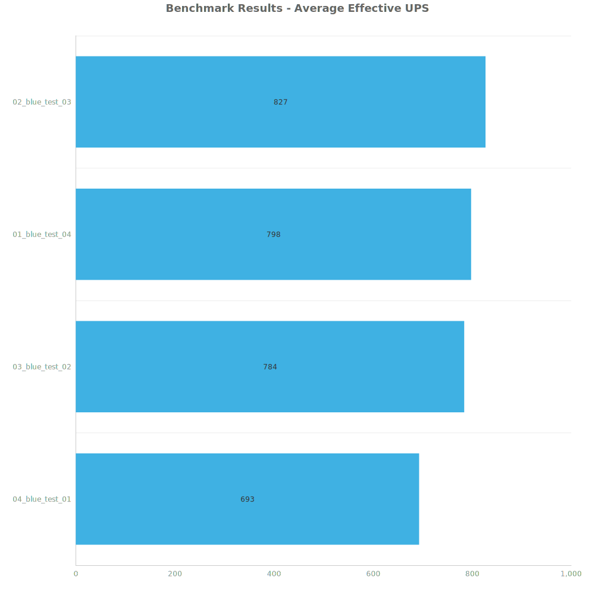
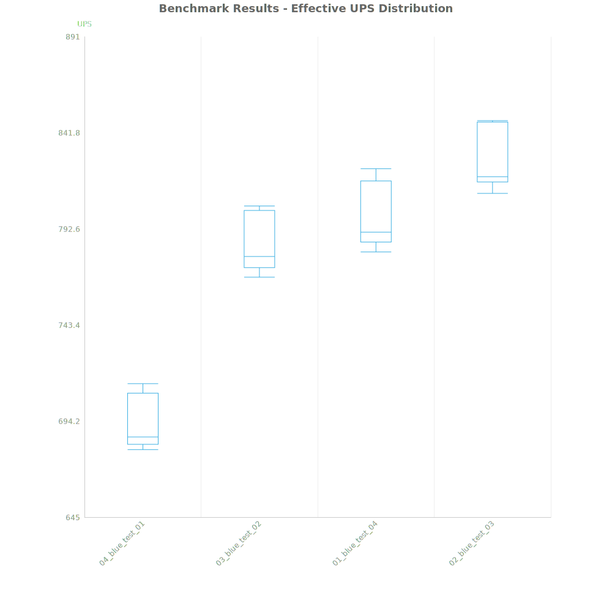
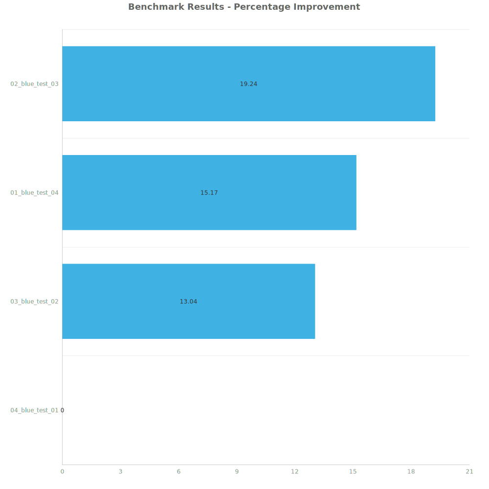

# Factorio Benchmark Results

**Platform:** windows-x86_64
**Factorio Version:** 2.0.64

## Scenario
* Each save was tested for 7200 tick(s) and 8 run(s)

## Results
| Metric | Description |
| ----------------- | ------------------------------------- |
| **Mean UPS** | Updates per second - higher is better |
| **Mean Avg (ms)** | Average frame time - lower is better |
| **Mean Min (ms)** | Minimum frame time - lower is better |
| **Mean Max (ms)** | Maximum frame time - lower is better |

| Save | Avg (ms) | Min (ms) | Max (ms) | UPS | Execution Time (ms) | % Difference from Worst |
|------|----------|----------|----------|-----|---------------------| --- |
| 04_blue_test_01 | 1.443 | 0.922 | 4.539 | 693 | 83116 | 0.00% |
| 03_blue_test_02 | 1.276 | 0.673 | 4.612 | 783 | 73525 | 13.04% |
| 01_blue_test_04 | 1.253 | 0.436 | 5.541 | 798 | 72174 | 15.17% |
| 02_blue_test_03 | 1.210 | 0.478 | 5.631 | **826** | 69702 | 19.24% |

Box and Whisker Plot:

## Conclusion