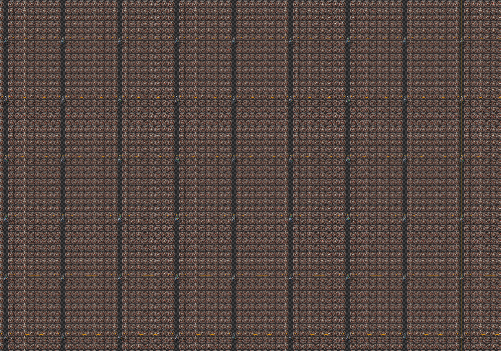
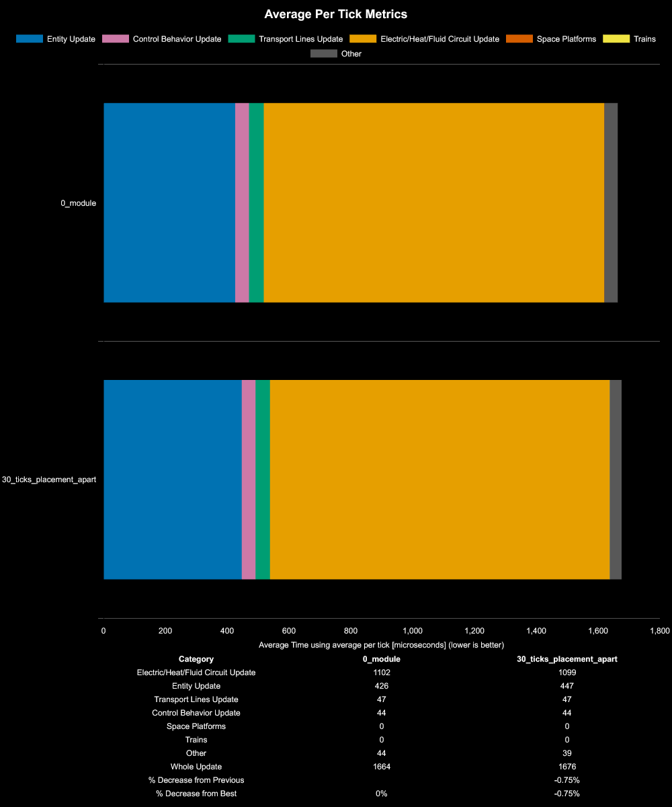
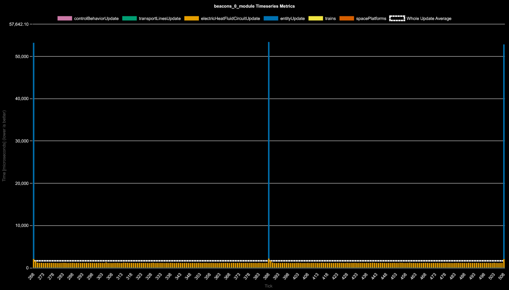
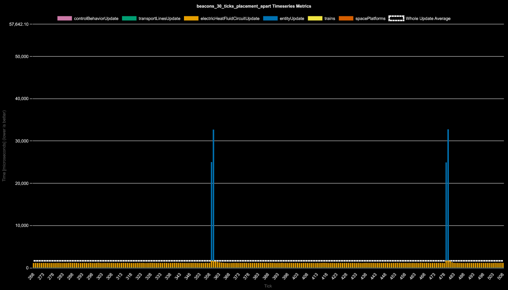

# Beacon Entity Update Time

**Platform:** windows-x86_64

**Factorio Version:** 2.0.66

## Scenario
* Each save was tested for 3600 tick(s) and 3 run(s)
* used to investigate if beacons take up entity update time and how often

The map for these is a cloned copy of 712000 beacons all created at the same time. There is a second map where half the beacons are created 30 ticks offset from the first beacons.

## Results

Both maps are virtually identical with a 0.75% difference.

The per tick charts though show a very obvious 120 tick offset check that the beacons are performing even with no modules:

Although the amplitude of the update time is greatly exaggerated with this many beacons for effect, this shows that the beacons themselves take a noticeable hit to entity update time and a very minor impact to electrical network update during these 120 tick checks.

After speaking with DaveMcW whom has source access, this 120 tick check is a result of the following:
> The 120 tick event is beacons recalculating their bonuses to handle brownouts.

Additionally, there was a second map created where the beacons were created 30 ticks after the first (roughly) half was created. 

This graph shows that the time the beacons are physically created in the map impacts when this check occurs. However, the cadence seems to be close to the original copies and not 30 ticks offset as was assumed. Most likely the beacons are added to a queue in the game sorted by their creation tick but this has not been confirmed.