# Factorio Benchmark Results

**Platform:** windows-x86_64

**Factorio Version:** 2.0.66

## Scenario
* Each save was tested for 3600 tick(s) and 5 run(s)
* Test if constant combinators in any of the 4 possible empty configurations has any impact to update time
* A clock set to update every 60 ticks will send a check mark pulse to control a legendary super inserter (from editor extensions mod) to transfer 12 items from one infinity chest to another
* A super inserter is used to have relatively low entity update time
* A save file with the same number of normal quality power poles is used as a comparison

## Maps
There are 4 combinations of constant combinators used for comparison and an equivalent electric power pole map for comparison. Careful attention was taken to ensure that each map has a single electric network for its surface. Global electric network setting is turned off.

### Constant Combinator Configurations

#### Constant Combinator: Enabled (default)
The constant combinator is enabled and has a null section. This is the default configuration when placing a constant combinator in the game from inventory.

<a href="images/cc_enabled.png">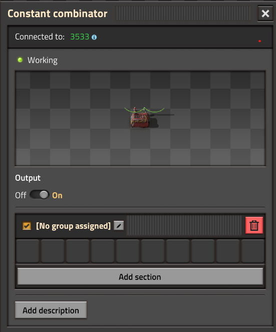</a> 

#### Constant Combinator: Enabled Null Section
The constant combinator is enabled but the default null section is removed.

<a href="images/cc_enabled_null_section.png">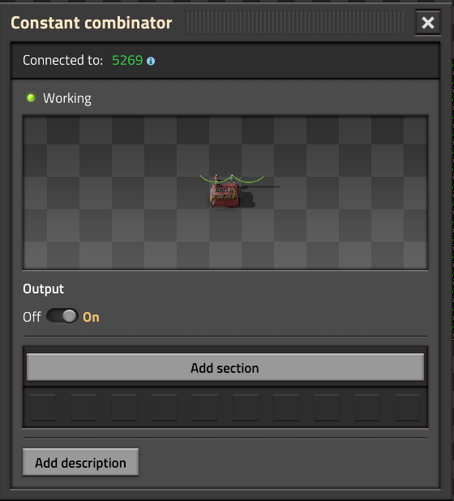</a> 

#### Constant Combinator: Disabled
The constant combinator is disabled and has a null section. This is the default configuration when placing a constant combinator in the game from inventory.

<a href="images/cc_disabled.png">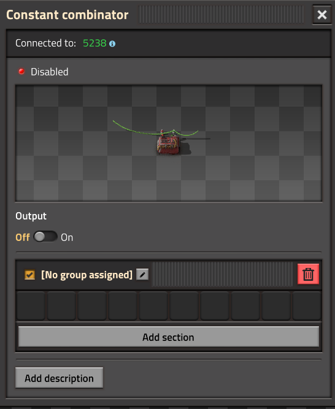</a> 

#### Constant Combinator: Disabled Null Section
The constant combinator is disabled but the default null section is removed.

<a href="images/cc_disabled_null_section.png">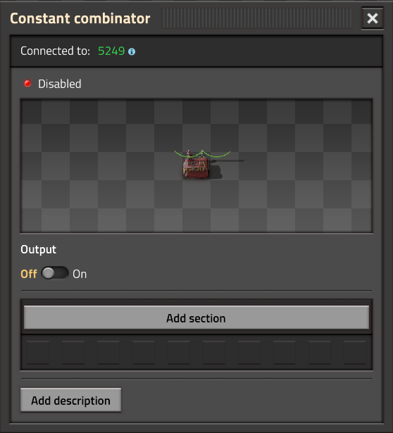</a> 

### Signal Pattern

The signal pattern being sent from the clock is sent weaving across 128 constant combinators for 16 rows alternating.

A total of 2048 constant combinators, the inserter, and clock are connected to each network as shown below:

<a href="images/weaving_pattern.png">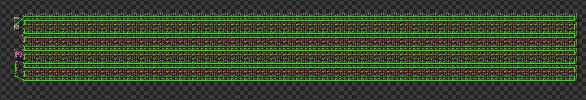</a> 

The same save copy and wire placement was created by editing the blueprint manually and replacing them with normal power poles to ensure
the green circuit network was copied to the same pattern would exist.

<a href="images/weaving_pattern_poles.png">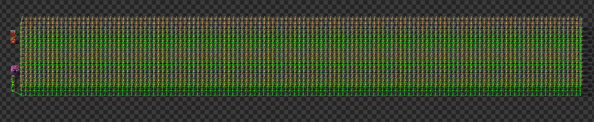</a> 

For power poles additionally, all poles were checked that they belonged to the same electric network:

<a href="images/power_poles_circuit_and_electric_networks.png">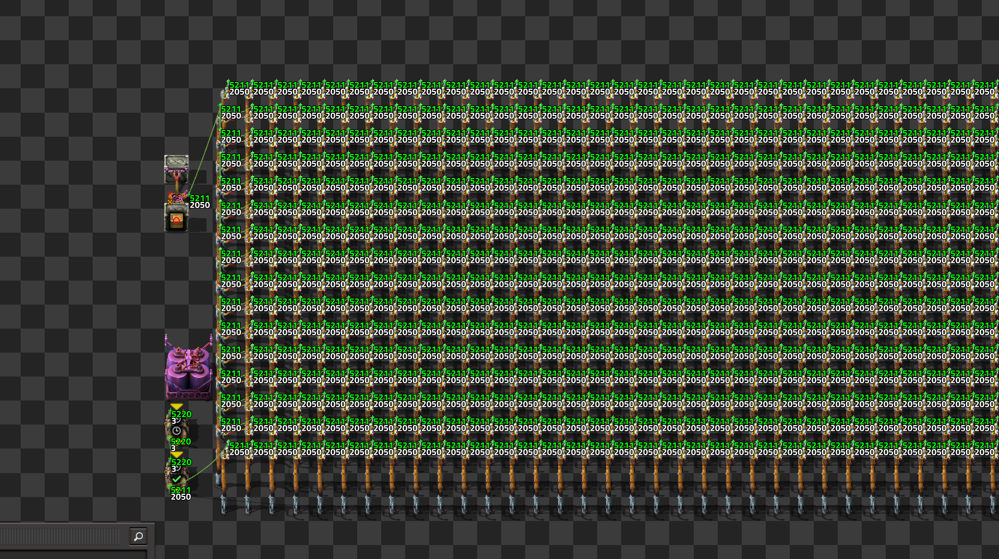</a> 

All constant combinators were checked as well to be connected to the same circuit network:

<a href="images/constant_combinator_circuit_and_electric_networks.png">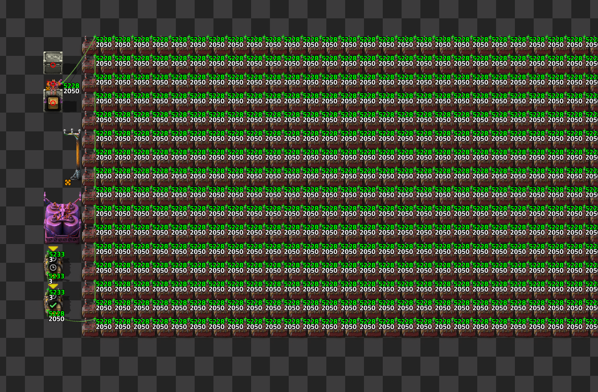</a> 

### Entity Cloning

Each combination of 2048 constant combinators or 2048 power poles were copied 100 times north for a total of 101 copies.

## Results
### Run Update Time Distribution

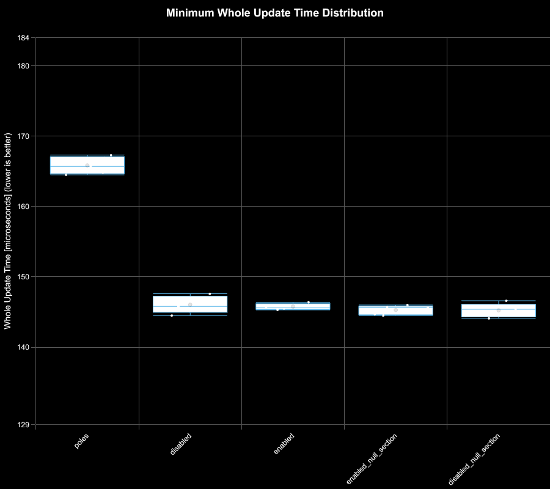

### All Map Average Update Time
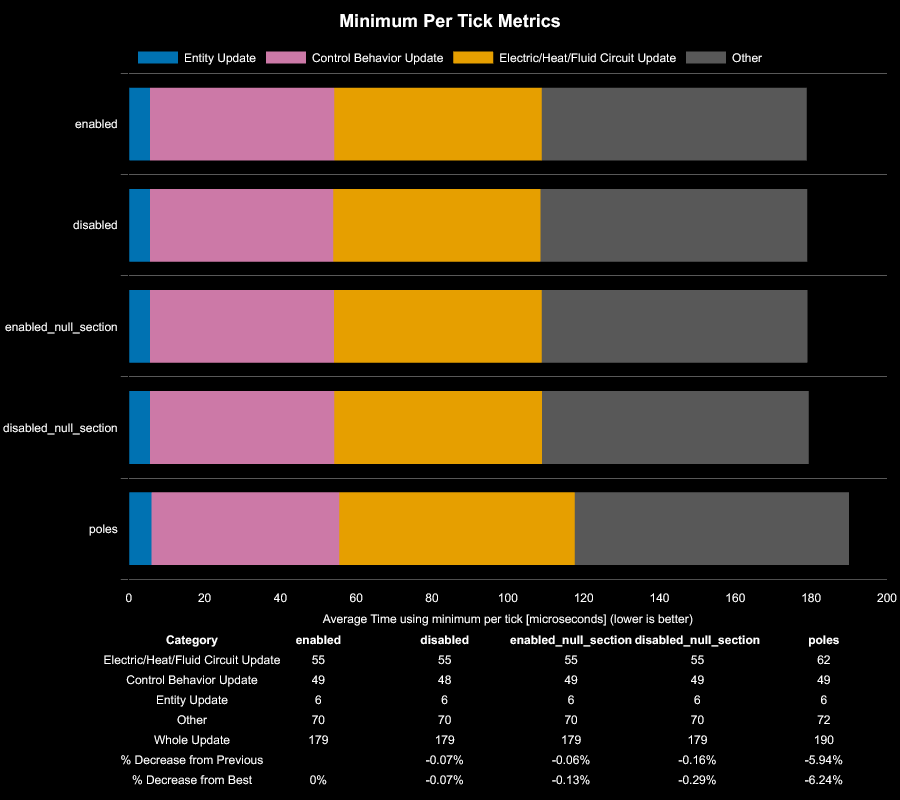

What is interesting in this specific benchmark is that the control behavior update time is effectively identical across all saves. 
This is expected since the same number of total entites are being controlled in all saves.

However, the electric/heat/fluid/circuit (EHFC) update is noticeably elevated on average in the power pole save compared to the constant combinators.

### Timeseries Analysis
>  Note that all timeseries data for each save is available under the [charts](charts) subfolder. For simplicity, since there is no difference in pattern for constant combinators, only the default configuration is shown where the constant combinator is enabled and has an empty section.

When viewing timeseries metrics some interesting patterns emerge.

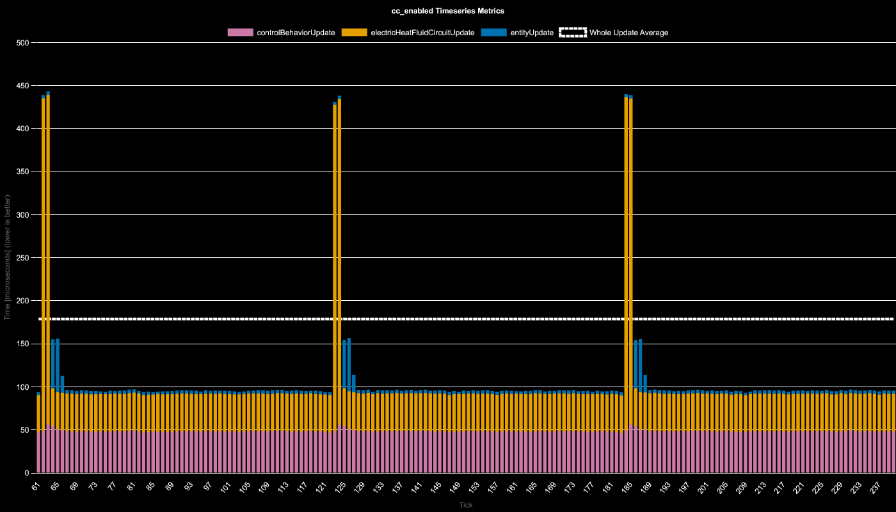

When a signal passes through a chain of constant combinators, the EHFC has a large spike as the signal is sent to all connected entities in the network. However, the overall average signal is lower compared to the power pole graph shown below.

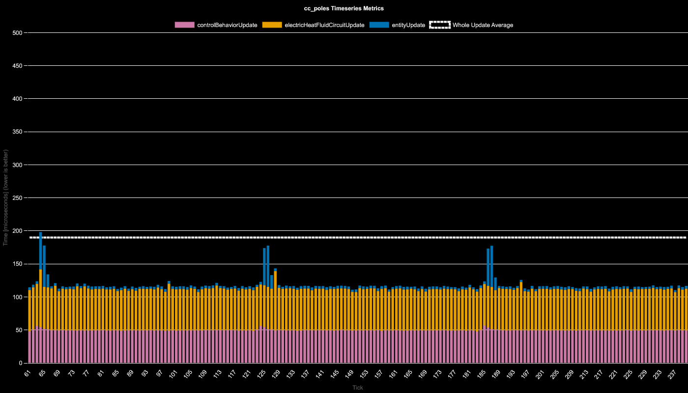

For the power pole save file, the signal doesn't seem to have almost any noticeable impact to the electric circuit update time. It can be observed that the inserters are transfering items due to the small spikes in entity update time. However as can be observed by comparing both charts, the EHFC is on average higher. This explains the average update time being elevated in the summary results.

## Conclusion

It appears that there is a higher peak cost of a signal propogating across constant combinators, The same number of power poles even with no entities to power, appear to have a higher average electric/heat/fluid/circuit (EHFC) update time.

This would generally tend to lead to the conclusion that if signals are adequetly guarded and not updating often across a network, in some cases constant combinators may be favorable over additional power poles when sending control signals.

Disabling a constant combinator and removing the default null section has no impact.