# Space Age Biolabs Impact by Science Quality & Research Type

- **Platform:** windows-x86_64
- **Factorio Version:** 2.0.71

## Table of Contents
- [Space Age Biolabs Impact by Science Quality \& Research Type](#space-age-biolabs-impact-by-science-quality--research-type)
  - [Table of Contents](#table-of-contents)
  - [Scenario](#scenario)
  - [Results](#results)
    - [All Runs](#all-runs)
    - [Mining Productivity](#mining-productivity)
    - [Research Productivty](#research-productivty)
    - [By Research Type](#by-research-type)
  - [Conclusion](#conclusion)

## Scenario

- Each save was tested for 3600 tick(s) and 10 runs
- 10_000 labs are preloaded with 256 science of each pack
- inserters and startup combinators removed before cloning
- all beacons are shared as much as possible when cloned

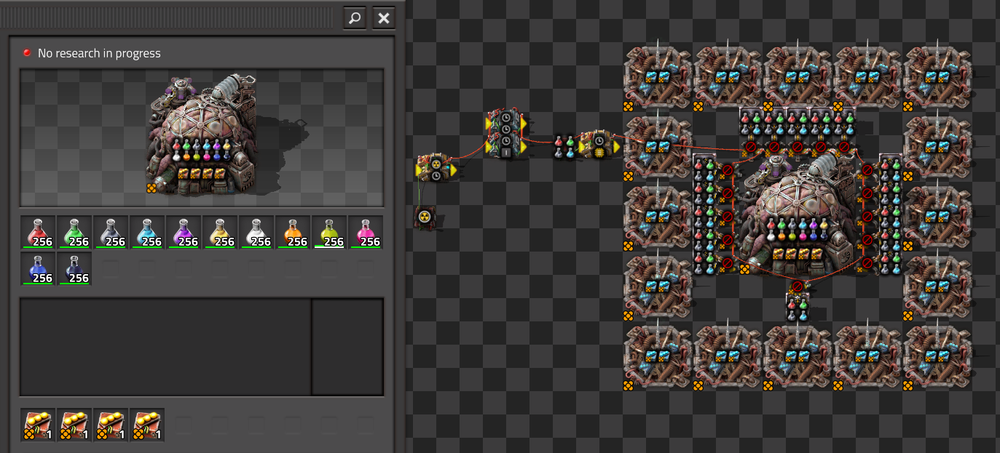

Variations of lab configurations conform to the following naming conventions:

| Name          | Description                                                    |
| ------------- | -------------------------------------------------------------- |
| desync        | The science is at varying levels of remaining science capacity |
| research_prod | Active research is research productivity                       |
| q1            | Normal Quality Science                                         |
| q2            | Uncommon Quality Science                                       |
| q3            | Rare Quality Science                                           |
| q4            | Epic Quality Science                                           |
| q5            | Legendary Quality Science                                      |
| qbuc          | All q2 science, q5 space science, q1 gleba and q1 promethium   |
| empty         | no science packs in lab                                        |

## Results
| Metric            | Description                           |
| ----------------- | ------------------------------------- |
| **Mean UPS**      | Updates per second - higher is better |
| **Mean Avg (ms)** | Average frame time - lower is better  |
| **Mean Min (ms)** | Minimum frame time - lower is better  |
| **Mean Max (ms)** | Maximum frame time - lower is better  |

| Save                         | Avg (ms) | Min (ms) | Max (ms) | UPS  | Execution Time (ms) |
| ---------------------------- | -------- | -------- | -------- | ---- | ------------------- |
| q1_research_prod_desync      | 2.395    | 1.844    | 9.243    | 417  | 86239               |
| q1_research_prod             | 2.386    | 1.848    | 17.031   | 419  | 85901               |
| qbuc_research_prod           | 2.266    | 1.847    | 21.749   | 441  | 81551               |
| q2_research_prod             | 2.257    | 1.842    | 25.291   | 443  | 81235               |
| q3_research_prod             | 2.211    | 1.832    | 20.792   | 452  | 79584               |
| q4_research_prod             | 2.176    | 1.832    | 16.813   | 459  | 78326               |
| q5_research_prod             | 2.148    | 1.829    | 16.842   | 466  | 77311               |
| q1_railgun                   | 1.867    | 1.316    | 13.203   | 535  | 67205               |
| q1_flammables                | 1.831    | 1.324    | 11.395   | 546  | 65937               |
| q1_explosives                | 1.814    | 1.323    | 10.946   | 551  | 65305               |
| q1_robo_speed                | 1.656    | 1.202    | 11.732   | 603  | 59615               |
| q1_lasers                    | 1.521    | 1.103    | 11.272   | 657  | 54763               |
| q1_mining_prod               | 1.227    | 0.923    | 8.073    | 815  | 44165               |
| q1_mining_prod_desync        | 1.211    | 0.923    | 7.486    | 825  | 43611               |
| q1_mining_prod_required_only | 1.208    | 0.904    | 7.081    | 827  | 43500               |
| q2_mining_prod               | 1.130    | 0.923    | 7.229    | 885  | 40686               |
| qbuc_mining_prod             | 1.122    | 0.921    | 8.768    | 891  | 40393               |
| q3_mining_prod               | 1.089    | 0.924    | 7.346    | 918  | 39222               |
| q4_mining_prod               | 1.071    | 0.922    | 8.958    | 933  | 38563               |
| q5_mining_prod               | 1.073    | 0.920    | 6.463    | 935  | 38608               |
| one_active_mining_prod       | 0.235    | 0.164    | 6.300    | 4267 | 8449                |
| empty_mining_prod            | 0.232    | 0.165    | 4.517    | 4313 | 8350                |
| empty_no_research            | 0.231    | 0.163    | 4.499    | 4335 | 8305                |

### All Runs
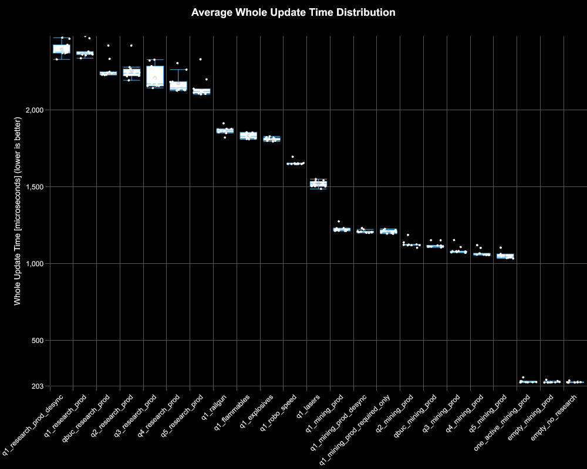

### Mining Productivity
> Note: Run 8 of q5 was three standard deviations outside the mean of this save file, so its result was thrown out.

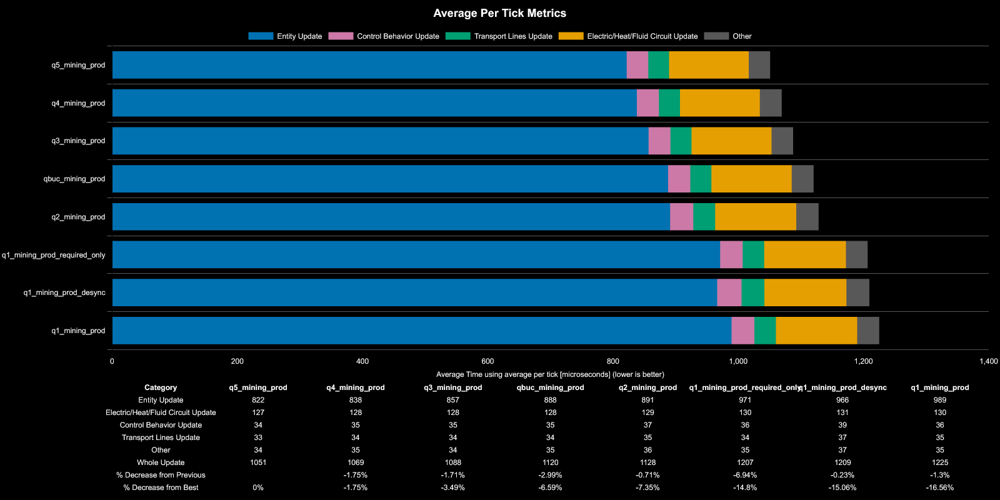
As expected, higher quality science reduces lab update time on average for this category, the largest improvement comes from q1 to q2 science. The rest show relatively smaller improvements, mainly due to how short this benchmark could realistically be run for due to q1 running out.

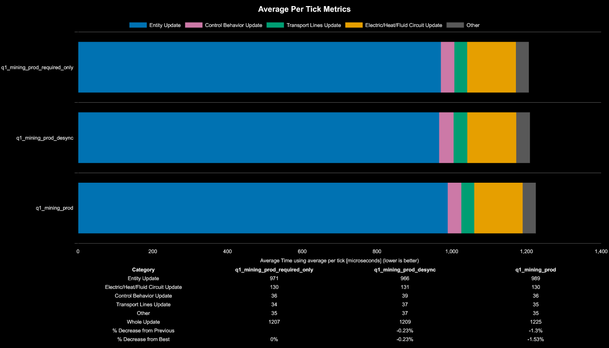

If science has all packs in the lab, varying levels of remaining science capacity, or only the exact required packs made a very small difference to entity update time but practically this difference is so small that it is within the margin of testing error. It appears therefore that the main cost is attributed to the science packs drain being updated every tick. There is a higher inventory cost that happens when a science pack runs out in the lab as can be seen below in the timeseries charts, but it is distributed more evenly when desynced.

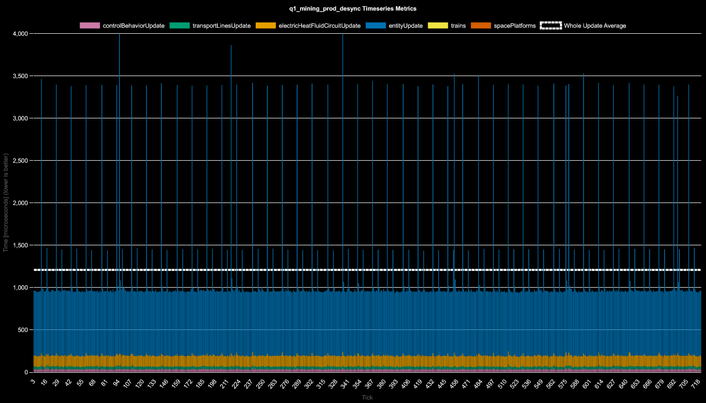

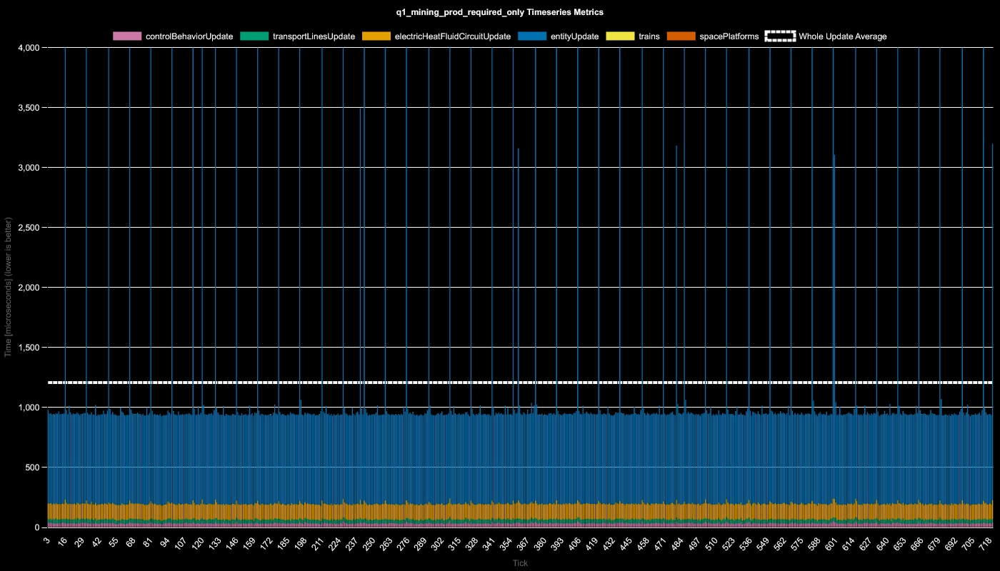

### Research Productivty
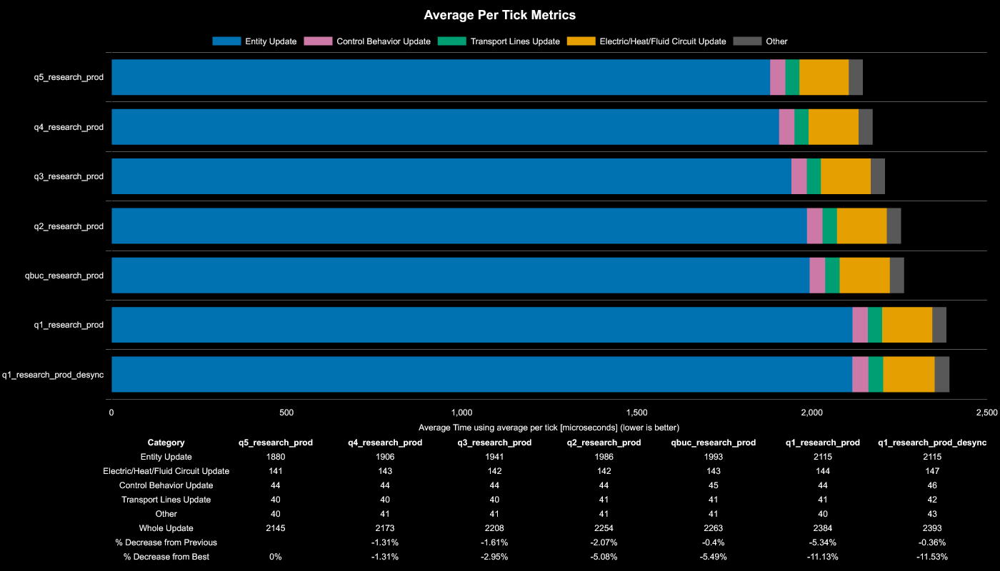

As expected, higher quality science reduces lab update time on average for this category with the largest improvement again coming from q1 to q2. Since there are now 12 packs consumed for research productivity, although more slowly, 12 science packs per lab are now being consumed and their science pack drain is still updated every tick. This shows an average increase from 0.9 ms of update time in mining prod to 2.0 ms of update time on average in between science packs full being consumed. The only difference between qualities is the inventory change events happen more frequently for q1 and the least frequently for q5 due to science packs taking longer to fully consume.

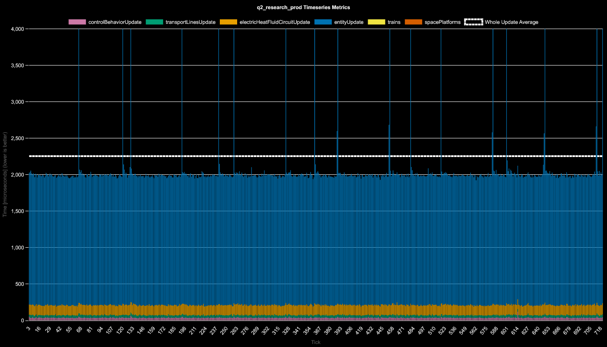

### By Research Type

| Research Type         | Number of Packs         |
| --------------------- | ----------------------- |
| Mining Productivity   | 4                       |
| Laser Weapon Damage   | 6                       |
| Worker Robot Speed    | 7                       |
| Stronger Explosives   | 7 (agriculture science) |
| Refined Flammables    | 7 (agriculture science) |
| Railgun               | 8                       |
| Research Productivity | 12                      |

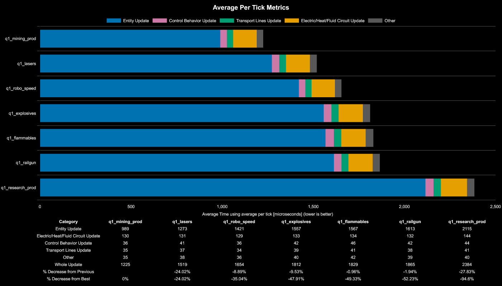

It is expected to see an increase in update time attributed to the number of packs that are being consumed. Outside of agriculture science, there seems to be a linear increase in entity update time consumption as more science packs are consumed.

The outlier here is agriculture science. Even through Refined Flammables and Stronger Explosives have the same number of science packs being consumed as Worker Robot Speed, the performance is 10% worse in comparison. This leads to the conclusion that agriculture science, even when initially loaded with 100% freshness into this test lab, that there is a higher cost attributed to agriculture science packs than any other science type.

The following two graphs comparing worker robot speed and stronger explosives highlight that this is attributed to the ticks where science is draining.

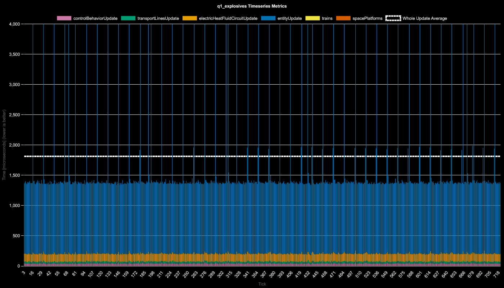

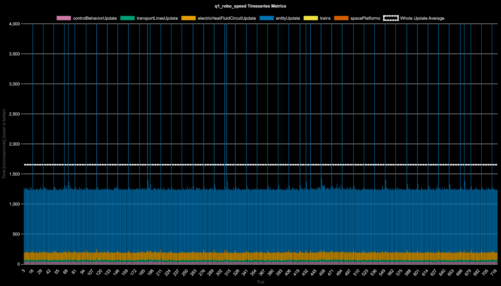

## Conclusion
There are a few costs to labs:
1. high constant cost attributed to pack drain every tick
2. high instantaneous cost when pack runs out due to inventory craft
3. agriculture science has the highest per tick cost when consumed in labs

Science packs running out at varying ticks in a single lab has no noticeable impact. It only reduces entity update time spike magnitude when running out at varying ticks.