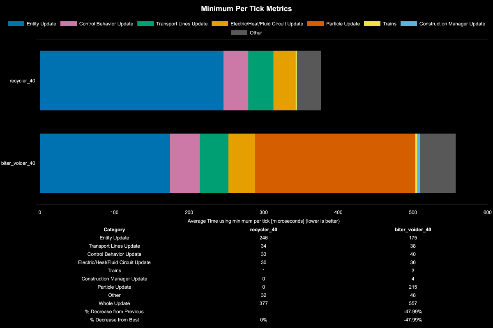
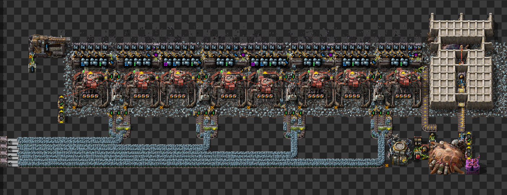
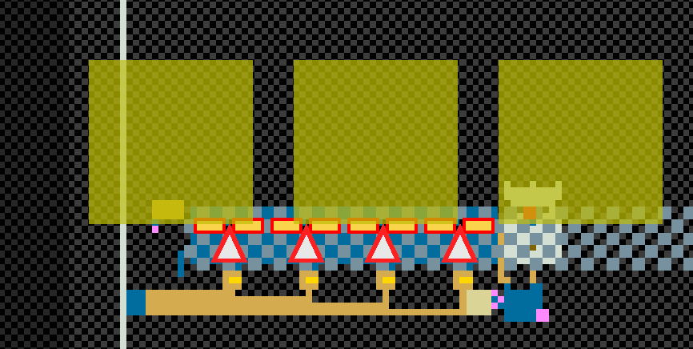
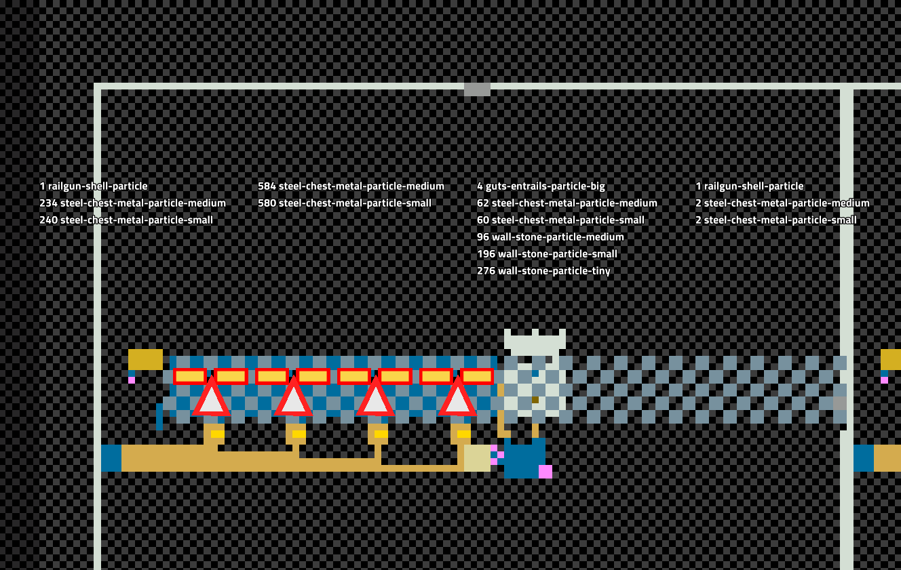
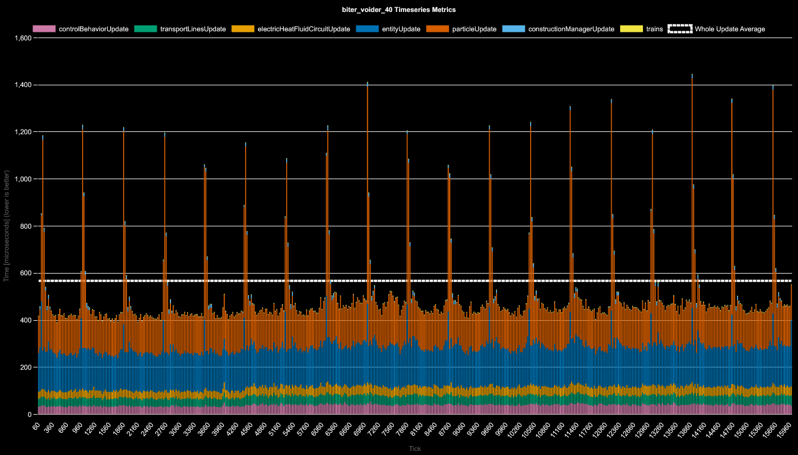
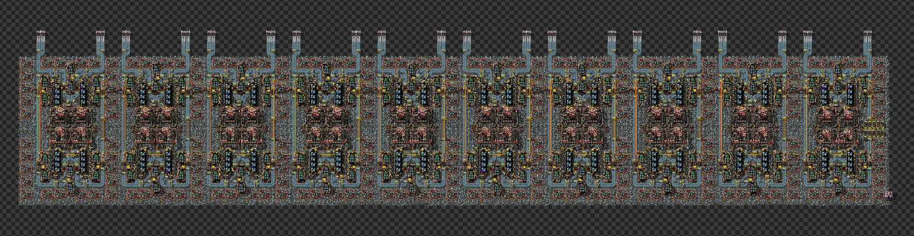
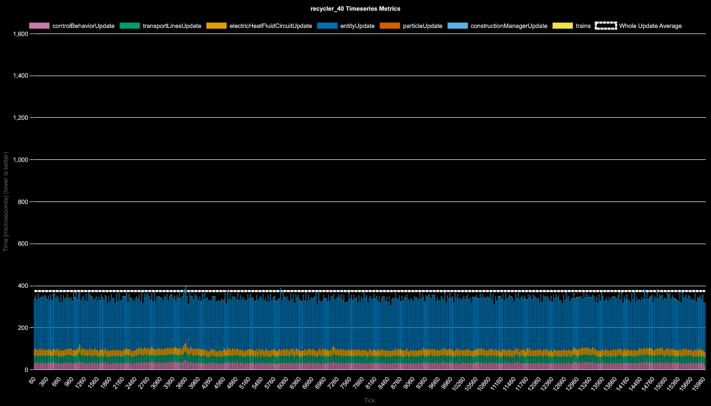

# Railgun Voider

**Platform:** windows-x86_64

**Factorio Version:** 2.0.71

## Scenario
* Each save was tested for 36000 tick(s) and 1 run(s)
* 9600 Uncommon iron ore produced per second in each save file

## Results
| Metric            | Description                           |
| ----------------- | ------------------------------------- |
| **Mean UPS**      | Updates per second - higher is better |
| **Mean Avg (ms)** | Average frame time - lower is better  |
| **Mean Min (ms)** | Minimum frame time - lower is better  |
| **Mean Max (ms)** | Maximum frame time - lower is better  |

| Save            | Avg (ms) | Min (ms) | Max (ms) | UPS      | Execution Time (ms) | % Difference from Worst |
| --------------- | -------- | -------- | -------- | -------- | ------------------- | ----------------------- |
| biter_voider_40 | 0.569    | 0.260    | 7.484    | 1757     | 20484               | 0.00%                   |
| recycler_40     | 0.377    | 0.163    | 0.735    | **2655** | 13556               | 51.10%                  |

### Railgun Voider

Chunks with active particles:

Particle counts per chunk:

Timeseries:

### Recycler Voider

## Conclusion
- the particle update time on destroyed entities slowly decaying over time in normal quality chests makes it not a viable strategy for voiding ore