# Chest Transfer

**Platform:** windows-x86_64

**Factorio Version:** 2.0.72

## Table of Contents
- [Chest Transfer](#chest-transfer)
  - [Table of Contents](#table-of-contents)
  - [Scenario](#scenario)
  - [Terminology](#terminology)
    - [Cars / Tanks / Silos](#cars--tanks--silos)
    - [Container Configurations](#container-configurations)
    - [Input Configurations](#input-configurations)
  - [Results](#results)
    - [All](#all)
    - [Chests](#chests)
    - [Cars](#cars)
    - [Wagons](#wagons)
    - [Tanks](#tanks)
    - [Max Inserters](#max-inserters)
    - [Timeseries Explanation](#timeseries-explanation)
  - [Conclusion](#conclusion)


## Scenario
- Each save was tested for 30 tick(s) and 50 run(s)
- Each save is paused before the transfer takes place
- 80000 inserters transfer 16 items each over a 14 tick window (40k inputs, 40k outputs)

Example of the transfer process:

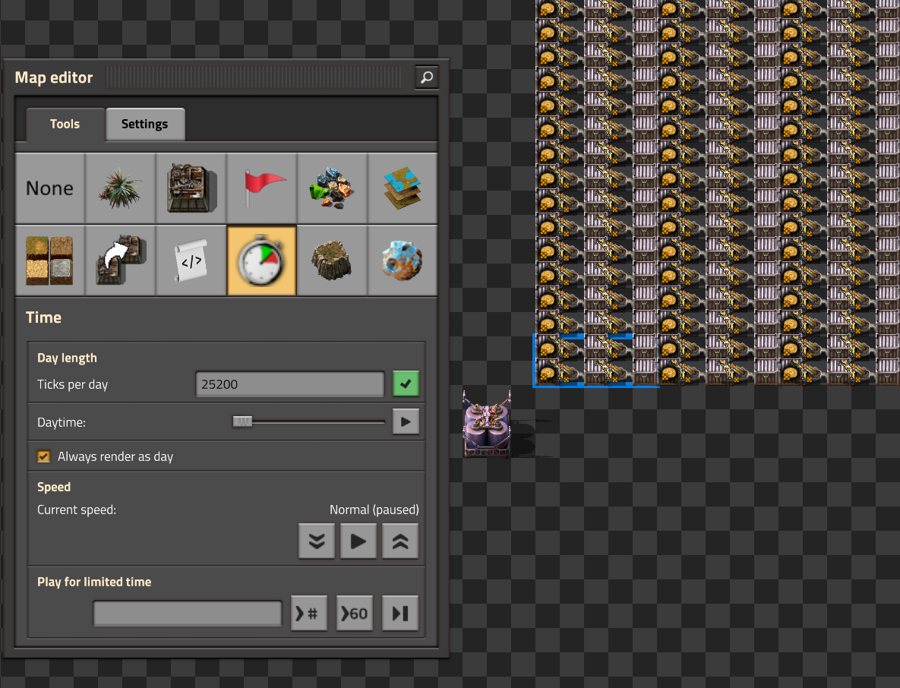

The following types of transfers are tested:

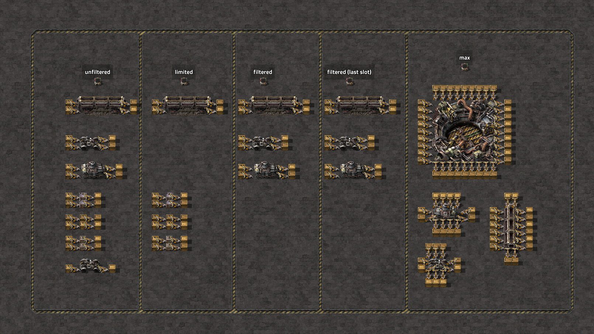

## Terminology

### Cars / Tanks / Silos
`disabled` represents entities that are disabled via a lua console command. The following commands are used for disabling cars, tanks, and silos:

```lua
-- cars & tanks
/c for _, v in pairs(game.player.surface.find_entities_filtered{type="car"}) do
  v.active = false
end
-- silos
/c for _, v in pairs(game.player.surface.find_entities_filtered{type="rocket-silo"}) do
  v.active = false
end
```

### Container Configurations

`filtered` represents a container that supports filtered slots. Example:

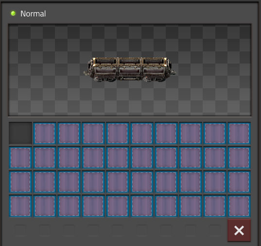

`filtered_last_slot` represents a container that supports filtered slots and the last slot is left unfiltered. Example:


`limited` represents a container that supports limiting the slots. Example:

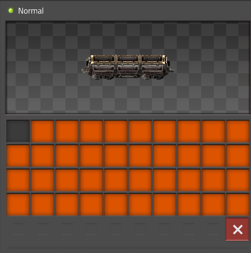

`blank / nothing` if none of the labels above are present, the slots are left in their default configuration. Example:


### Input Configurations

`18_input` refers to the following configuration for a silo chest where 18 inserters are putting in 18 items.

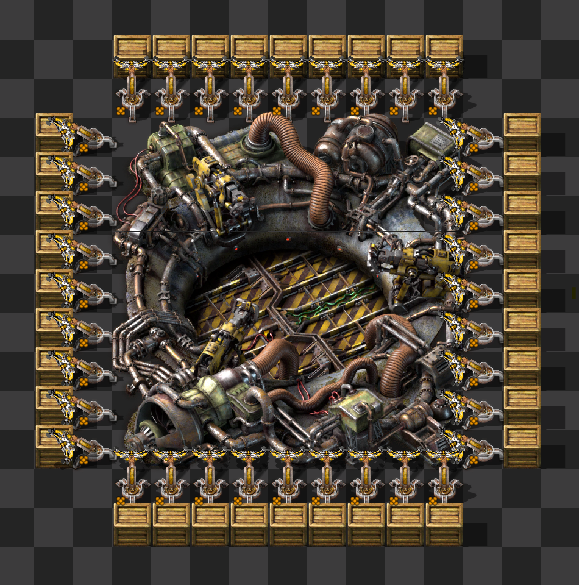

## Results

### All
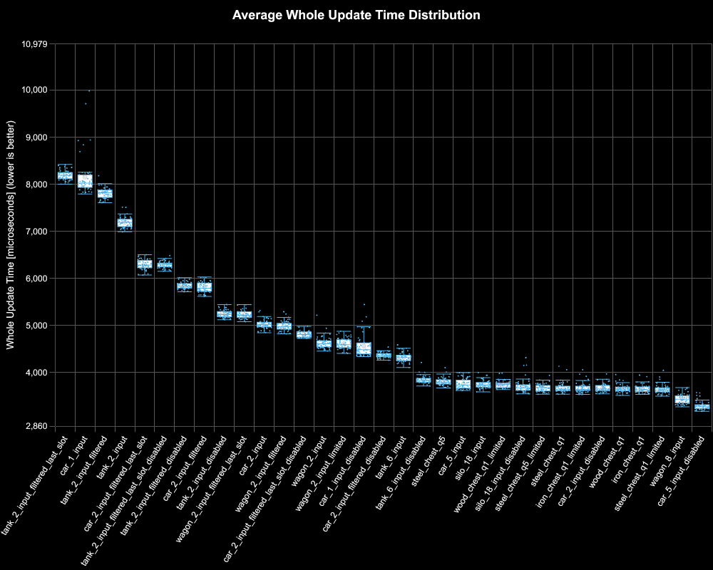
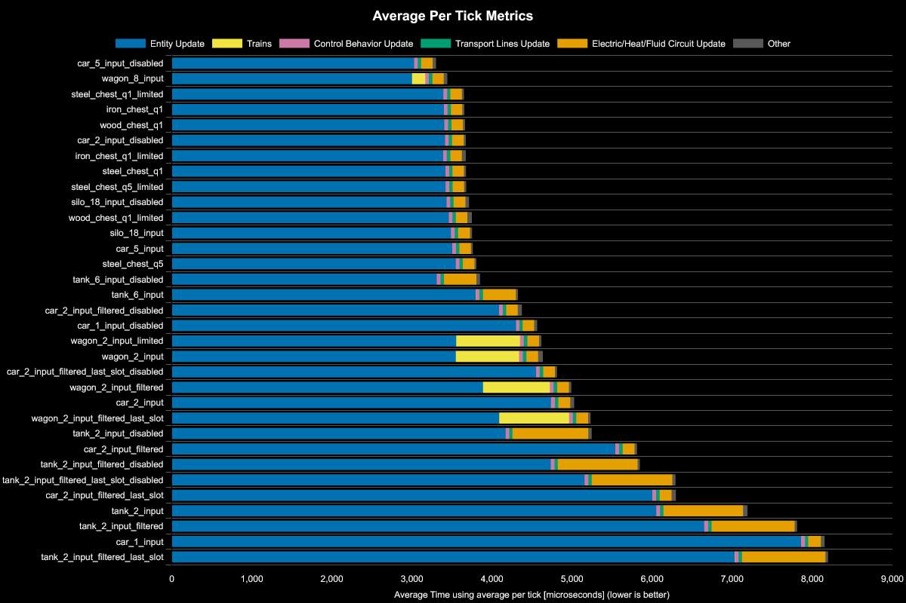

### Chests
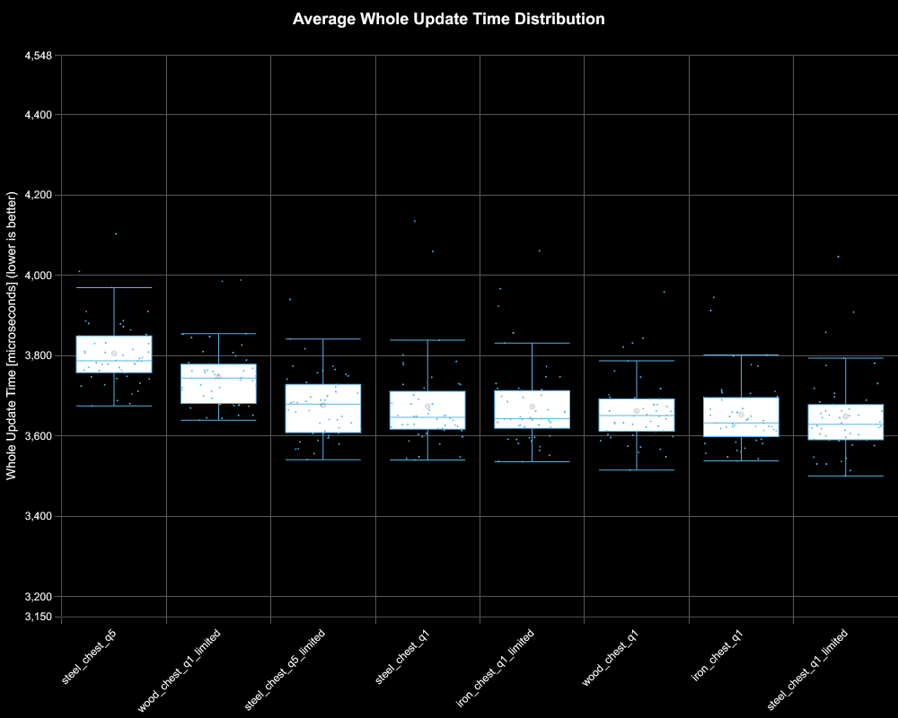
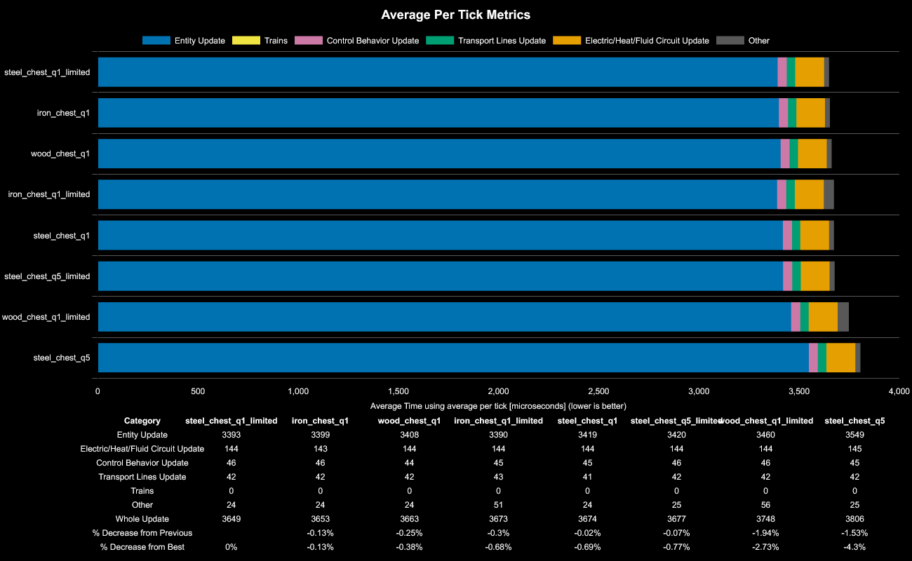

### Cars
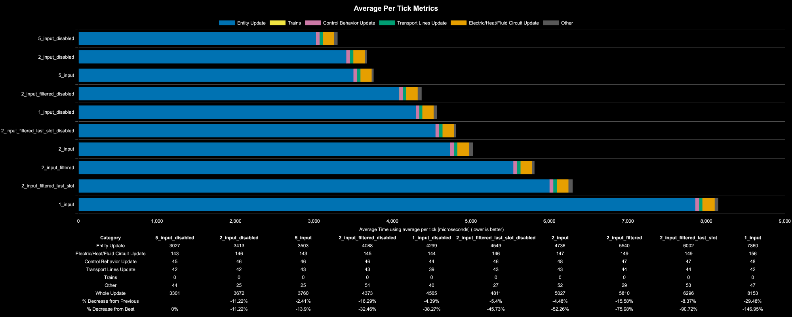

### Wagons
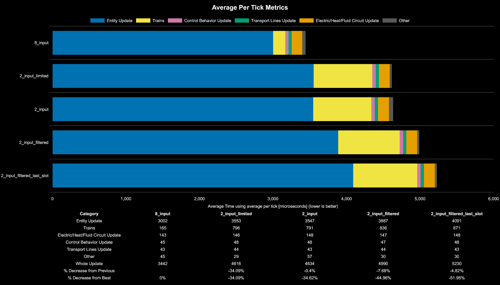

### Tanks
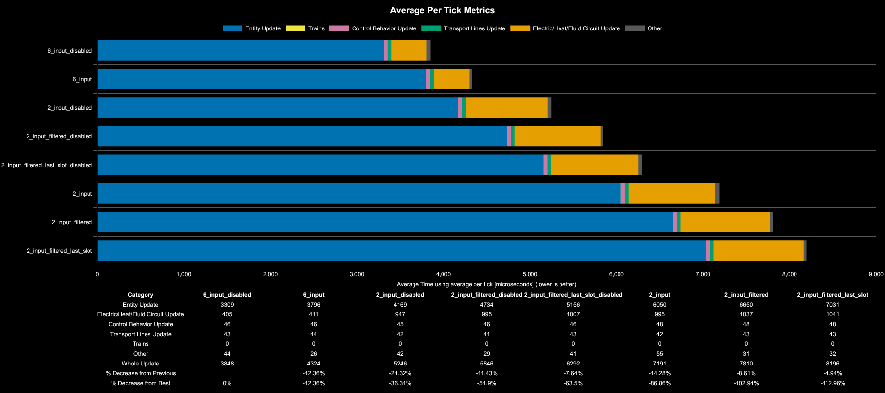

### Max Inserters
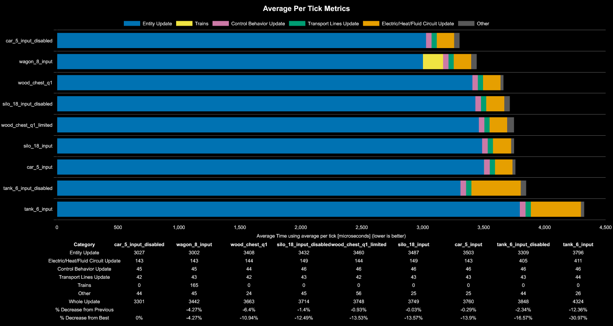

This chart compares the best performing 1:1 chest transfer which is a wooden chest that is limited to all other chest containers with their maximum amount of inserters per type.

### Timeseries Explanation
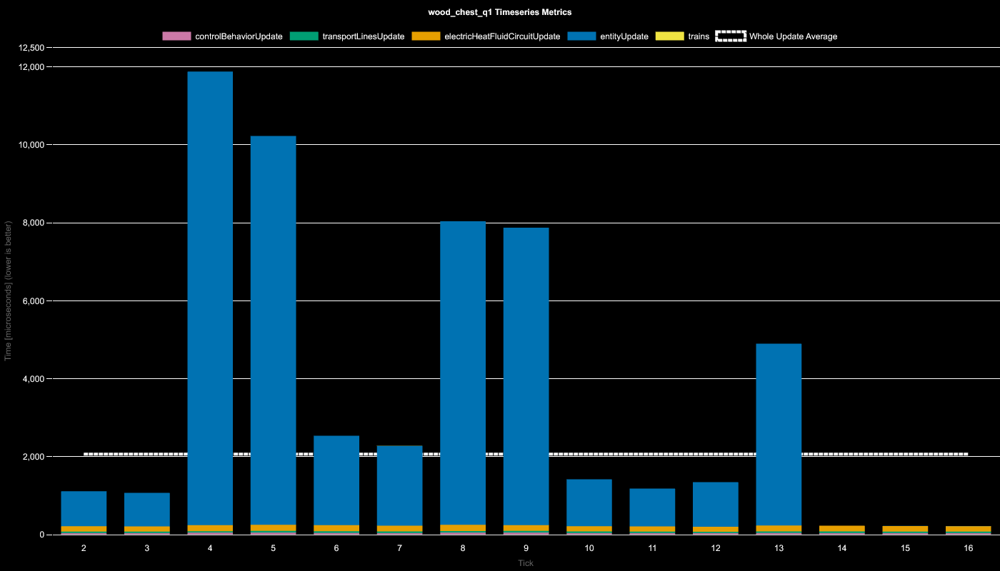

| Tick  | Description                                                            |
| ----- | ---------------------------------------------------------------------- |
| 0     | Loading the save file and initializing power to all entities (omitted) |
| 1     | pickup from chest (omitted)                                            |
| 2-4   | input inserter swing                                                   |
| 5     | transfer into container                                                |
| 7-8   | input / output inserters swinging                                      |
| 6     | pickup from container                                                  |
| 9     | input inserter return to input chest (inventory scan)                  |
| 10    | output inserter transfer to chest                                      |
| 11-13 | output inserter swinging back                                          |
| 14    | output inserter returns to empty chest and performs an inventory scan  |
| 15-59 | nothing                                                                |

## Conclusion

- batching inventory transfers into a single container is better than separate containers
- limiting slots is better than filtered slots
- multiple transfers from one container
  - cars are the best option and can outperform multiple chests when batched at the same time (clocking)
- tanks are the worst option due to their electric network update time constantly updating (as of 2.0.72) due to most likely their equipment grid, but this can be reduced by maximizing the inserters transferring items in and out of the tank