# Chest Transfer

**Platform:** windows-x86_64

**Factorio Version:** 2.0.72

## Table of Contents
- [Chest Transfer](#chest-transfer)
  - [Table of Contents](#table-of-contents)
  - [Scenario](#scenario)
  - [Terminology](#terminology)
    - [Cars / Tanks](#cars--tanks)
    - [Container Configurations](#container-configurations)
  - [5 Tiles](#5-tiles)
    - [5 Tile Results](#5-tile-results)
    - [5 Tile Results Analysis](#5-tile-results-analysis)
  - [7 Tiles](#7-tiles)
    - [7 Tile Results All](#7-tile-results-all)
    - [7 Tile Results Analysis](#7-tile-results-analysis)
  - [9 Tiles](#9-tiles)
    - [9 Tile Results All](#9-tile-results-all)

## Scenario
- Each save was tested for 8020 tick(s) and 3 run(s)
- Each save is paused before the transfer takes place
- 20000 input inserters and 20000 output inserters with wood chest inputs and outputs
- 16k coins are transferred from the input container to the final output container
  - coins are chosen due to their large stack size of 100000

## Terminology

### Cars / Tanks
`disabled` represents entities that are disabled via a lua console command. The following commands are used for disabling cars and tanks:

```lua
-- cars & tanks
/c for _, v in pairs(game.player.surface.find_entities_filtered{type="car"}) do
  v.active = false
end
```

### Container Configurations

`filtered` represents a container that supports filtered slots. Example:


`filtered_last_slot` represents a container that supports filtered slots and the last slot is left unfiltered. Example:

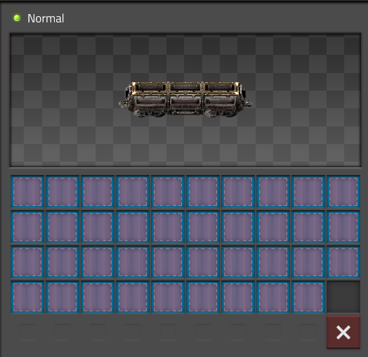

`limited` represents a container that supports limiting the slots. Example:


`filtered_first_slot_coin` represents a container that has the first slot filtered to the actual item being transferred, but the rest are filtered to be blocked with a destruction planner.

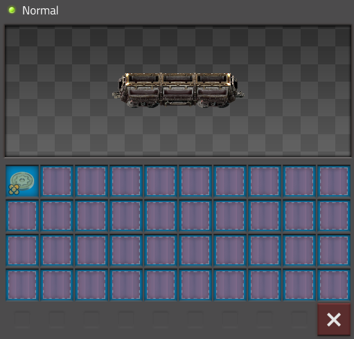


`blank / nothing` if none of the labels above are present, the slots are left in their default configuration. Example:

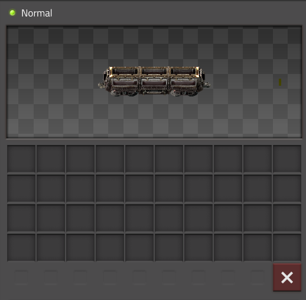


## 5 Tiles
<a href="images/5_tiles.png">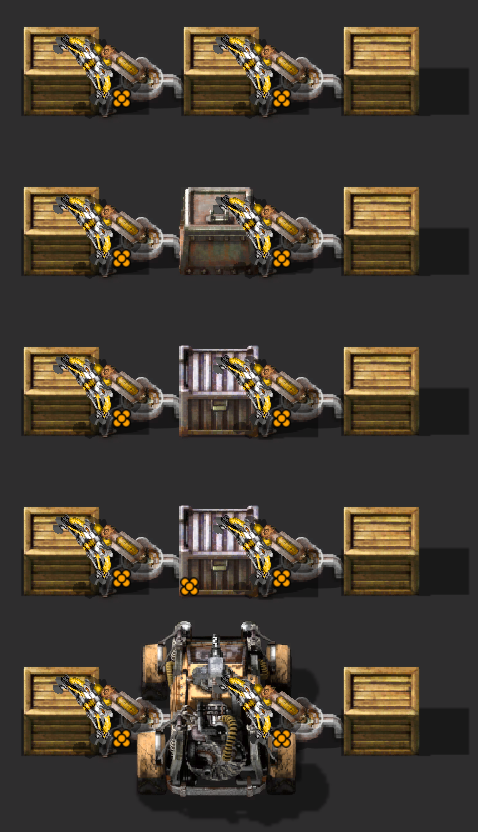</a>

This test compares different chest types, focusing mainly on how that type of chest impacts UPS as there are no differences in inserter counts between these saves.

### 5 Tile Results
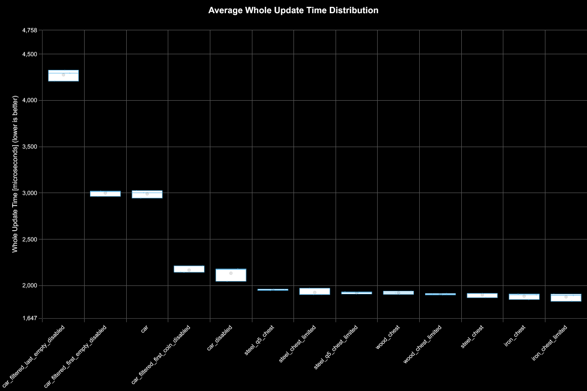
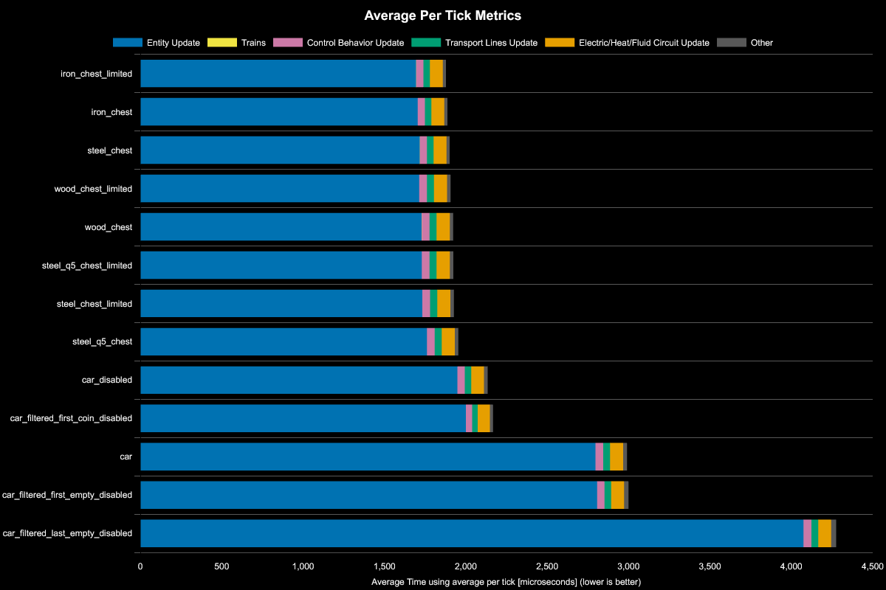

| Save File                         | Entity Update | Electric/Heat/Fluid Circuit Update | Control Behavior Update | Transport Lines Update | Trains | Other | Whole Update | % Decrease from Previous | % Decrease from Best |
| --------------------------------- | ------------- | ---------------------------------- | ----------------------- | ---------------------- | ------ | ----- | ------------ | ------------------------ | -------------------- |
| iron_chest_limited                | 1695          | 79                                 | 44                      | 40                     | 0      | 20    | 1878         |                          |                      |
| iron_chest                        | 1704          | 79                                 | 44                      | 40                     | 0      | 19    | 1887         | -0.48%                   | -0.48%               |
| steel_chest                       | 1717          | 79                                 | 44                      | 40                     | 0      | 20    | 1901         | -0.74%                   | -1.23%               |
| wood_chest_limited                | 1713          | 81                                 | 47                      | 43                     | 0      | 21    | 1906         | -0.26%                   | -1.5%                |
| wood_chest                        | 1729          | 81                                 | 48                      | 43                     | 0      | 21    | 1922         | -0.84%                   | -2.35%               |
| steel_q5_chest_limited            | 1729          | 81                                 | 47                      | 43                     | 0      | 21    | 1923         | -0.05%                   | -2.4%                |
| steel_chest_limited               | 1733          | 81                                 | 48                      | 43                     | 0      | 21    | 1926         | -0.16%                   | -2.56%               |
| steel_q5_chest                    | 1761          | 81                                 | 48                      | 43                     | 0      | 21    | 1954         | -1.45%                   | -4.05%               |
| car_disabled                      | 1948          | 79                                 | 45                      | 40                     | 0      | 22    | 2134         | -9.21%                   | -13.64%              |
| car_filtered_first_coin_disabled  | 2000          | 75                                 | 38                      | 34                     | 0      | 20    | 2168         | -1.59%                   | -15.45%              |
| car                               | 2796          | 80                                 | 48                      | 42                     | 0      | 24    | 2990         | -37.92%                  | -59.22%              |
| car_filtered_first_empty_disabled | 2806          | 80                                 | 46                      | 41                     | 0      | 26    | 2999         | -0.3%                    | -59.7%               |
| car_filtered_last_empty_disabled  | 4074          | 80                                 | 49                      | 42                     | 0      | 30    | 4275         | -42.55%                  | -127.65%             |

### 5 Tile Results Analysis
- the difference between chest container sizes is such a small impact that it registers as noise
  - even with 40000 total inserters actively transferring in and out of a chest, the difference is so small that it doesn't make any impact to register
- disabled cars are a close second to any chest
- setting the filter on the slots is better than leaving it unset
- disabling cars is important for them to be competitive
- order matters in filtered slots
  - slots that are filtered to be the first slot perform better than items at the last slot
  - example use case: for green circuit production, the first slot should be copper wires and the second slot should be iron
- setting limits on chest has no apparent impact

## 7 Tiles

<a href="images/7_tiles.png">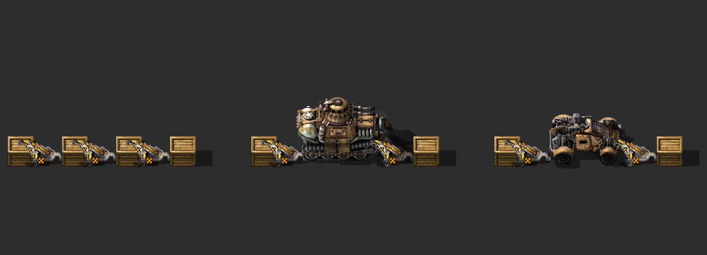</a>

This test focuses on if using a larger chest is better than having an extra inserter to transfer items over a 7 tile distance.

### 7 Tile Results All
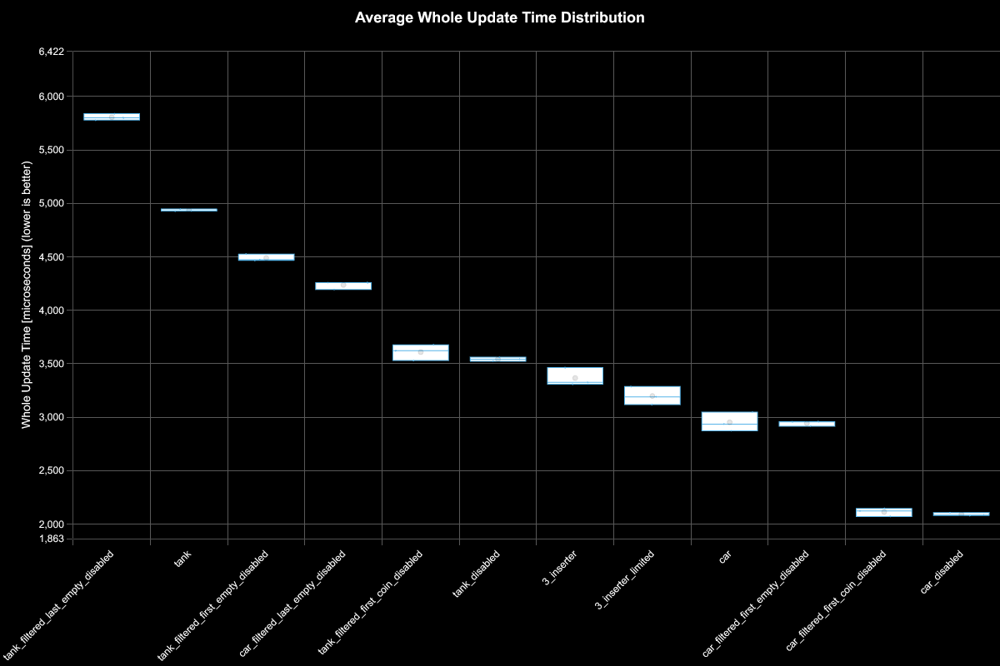
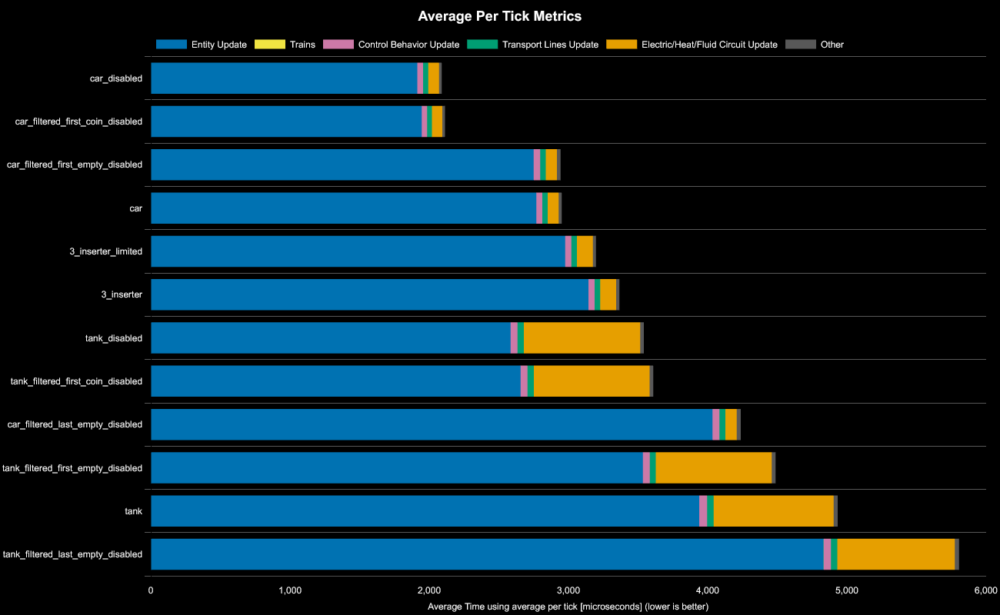

| Save File                          | Entity Update | Electric/Heat/Fluid Circuit Update | Control Behavior Update | Transport Lines Update | Trains | Other | Whole Update | % Decrease from Previous | % Decrease from Best |
| ---------------------------------- | ------------- | ---------------------------------- | ----------------------- | ---------------------- | ------ | ----- | ------------ | ------------------------ | -------------------- |
| car_disabled                       | 1914          | 77                                 | 41                      | 37                     | 0      | 20    | 2090         |                          |                      |
| car_filtered_first_coin_disabled   | 1946          | 75                                 | 38                      | 34                     | 0      | 19    | 2113         | -1.1%                    | -1.1%                |
| car_filtered_first_empty_disabled  | 2750          | 80                                 | 46                      | 41                     | 0      | 26    | 2943         | -39.28%                  | -40.82%              |
| car                                | 2769          | 78                                 | 44                      | 39                     | 0      | 22    | 2951         | -0.27%                   | -41.2%               |
| 3_inserter_limited                 | 2977          | 115                                | 44                      | 39                     | 0      | 23    | 3198         | -8.37%                   | -53.02%              |
| 3_inserter                         | 3143          | 115                                | 45                      | 39                     | 0      | 23    | 3365         | -5.22%                   | -61.01%              |
| tank_disabled                      | 2584          | 837                                | 50                      | 45                     | 0      | 26    | 3542         | -5.26%                   | -69.48%              |
| tank_filtered_first_coin_disabled  | 2655          | 831                                | 50                      | 45                     | 0      | 26    | 3609         | -1.89%                   | -72.69%              |
| car_filtered_last_empty_disabled   | 4035          | 81                                 | 50                      | 42                     | 0      | 29    | 4237         | -17.4%                   | -102.74%             |
| tank_filtered_first_empty_disabled | 3534          | 832                                | 50                      | 44                     | 0      | 29    | 4488         | -5.92%                   | -114.75%             |
| tank                               | 3939          | 863                                | 56                      | 47                     | 0      | 29    | 4934         | -9.94%                   | -136.09%             |
| tank_filtered_last_empty_disabled  | 4833          | 844                                | 52                      | 44                     | 0      | 31    | 5806         | -17.67%                  | -177.81%             |

### 7 Tile Results Analysis
- disabled cars are superior over an extra inserter
- Same as 5 tiles: setting a filter to the item type you are transferring is better than no filter if the rest of the slots are filtered to be not used
- in this test, limiting the slots was better than unlimited slots
- tanks consume electric network update time, even if disabled via the script mentioned in the beginning of this document
- order matters for filters, like other chests

## 9 Tiles

<a href="images/9_tiles.png">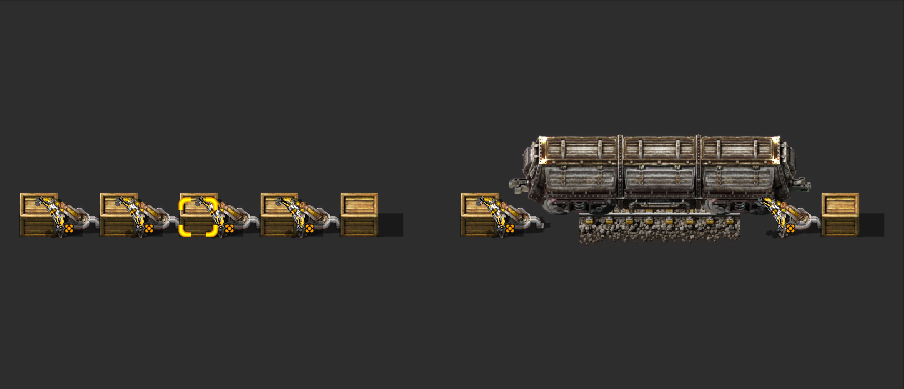</a>

This test focuses on a 9 tile gap of transfer, which is ideal for a cargo wagon. Cargo wagons can technically transfer either a 9 tiles or 10 tile gap, but has been limited to 9 tiles since inserter chains cannot cover even distances.

### 9 Tile Results All
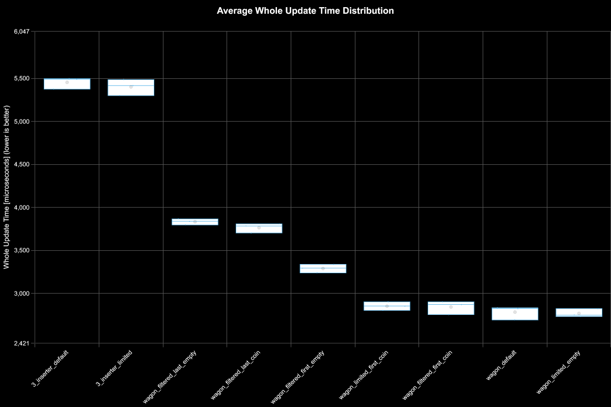
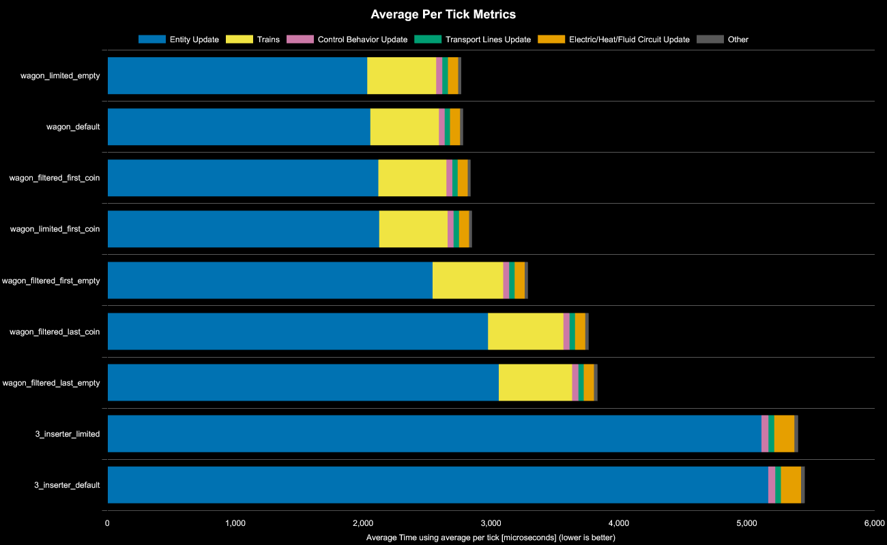

| Save File                  | Entity Update | Trains | Electric/Heat/Fluid Circuit Update | Control Behavior Update | Transport Lines Update | Other | Whole Update | % Decrease from Previous | % Decrease from Best |
| -------------------------- | ------------- | ------ | ---------------------------------- | ----------------------- | ---------------------- | ----- | ------------ | ------------------------ | -------------------- |
| wagon_limited_empty        | 2032          | 539    | 80                                 | 48                      | 43                     | 24    | 2766         |                          |                      |
| wagon_default              | 2056          | 536    | 79                                 | 46                      | 42                     | 23    | 2781         | -0.54%                   | -0.53%               |
| wagon_filtered_first_coin  | 2118          | 533    | 79                                 | 47                      | 42                     | 23    | 2841         | -2.16%                   | -2.7%                |
| wagon_limited_first_coin   | 2125          | 535    | 79                                 | 47                      | 42                     | 23    | 2851         | -0.35%                   | -3.06%               |
| wagon_filtered_first_empty | 2543          | 551    | 79                                 | 47                      | 42                     | 26    | 3289         | -15.36%                  | -18.89%              |
| wagon_filtered_last_coin   | 2977          | 589    | 80                                 | 48                      | 42                     | 27    | 3764         | -14.44%                  | -36.07%              |
| wagon_filtered_last_empty  | 3060          | 574    | 80                                 | 49                      | 42                     | 28    | 3833         | -1.83%                   | -38.56%              |
| 3_inserter_limited         | 5114          | 157    | 55                                 | 45                      | 0                      | 29    | 5401         | -40.91%                  | -95.24%              |
| 3_inserter_default         | 5167          | 158    | 55                                 | 45                      | 0                      | 29    | 5454         | -0.98%                   | -97.16%              |


- using a wagon is better than daisy chain of inserters
- setting a limit is better than filters, even if the first slot is filtered to the target item
- setting a limit of 1 slot is about the same as no limit on cargo wagons
- wagons take up transport line update time
- order matters for filters, like other chests