## Miners

**Platform:** windows-x86_64

**Factorio Version:** 2.0.72  

## Table of Contents
- [Miners](#miners)
- [Table of Contents](#table-of-contents)
- [Scenario](#scenario)
- [Normal Mining Operation](#normal-mining-operation)
  - [Entity Time Associated With Miners](#entity-time-associated-with-miners)
  - [Entity Time Example and Data](#entity-time-example-and-data)
  - [Profiler](#profiler)
- [Miner Modules](#miner-modules)
  - [Quality](#quality)
    - [Quality Per Tick Metrics](#quality-per-tick-metrics)
  - [Conclusion](#conclusion)

## Scenario
- 8800 miners in pairs of 2 are used to unload onto a belt
- performance between them is benchmarked at varying mining productivity levels

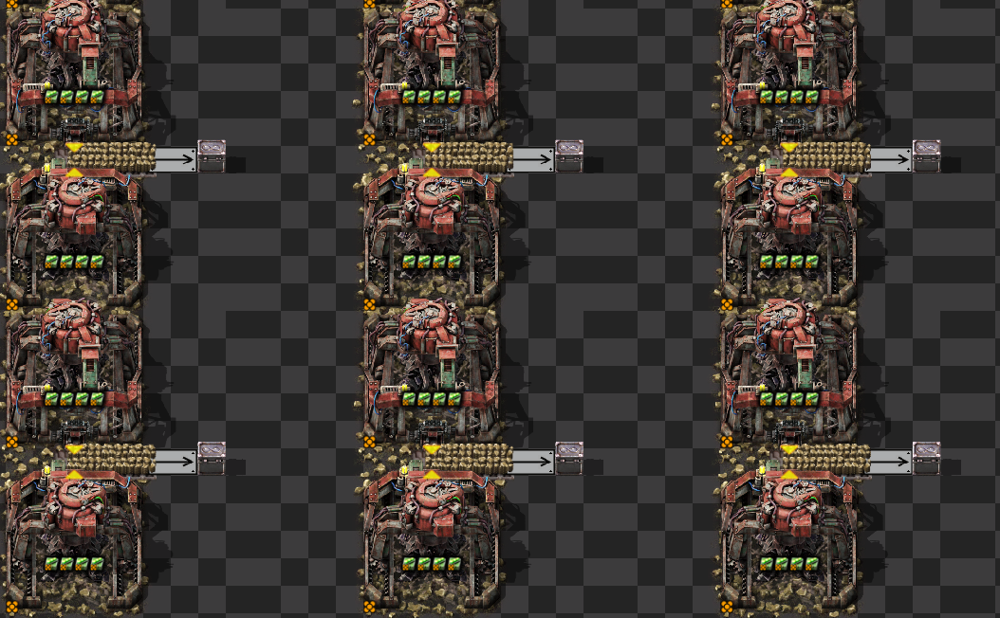

## Normal Mining Operation
### Entity Time Associated With Miners

Miners have an internal buffer. It can reach up to 2^16 slots, but in practice it will never reach that high of an amount.

Miner logic:
- Miners will actually mine resources every tick unless it has items in its internal buffer that need to drain
- If it can produce more items in one tick than it can output it will put the remaining amount in its internal inventory
- The amount it can mine in one tick is dependent on the productivity and speed bonus

### Entity Time Example and Data
Let's say mining prod is 2000. 20000% productivity. At 2.5/s mining speed on big mining drill, it can produce 2.5*(1+20000/100) = 502.5 / second (8.375/tick).

In one tick it will mine either 8 or 9 items depending on its productivity progress bar. A turbo belt can transport a full stack of 4 items every 2 ticks, so on average it should mine for 1 tick and have an internal buffer after mining operation of 6 or 7 items. It will drain that over 3 ticks and then perform a mining operation again once it goes under the limit of 2.

You can see that happen in this chart:
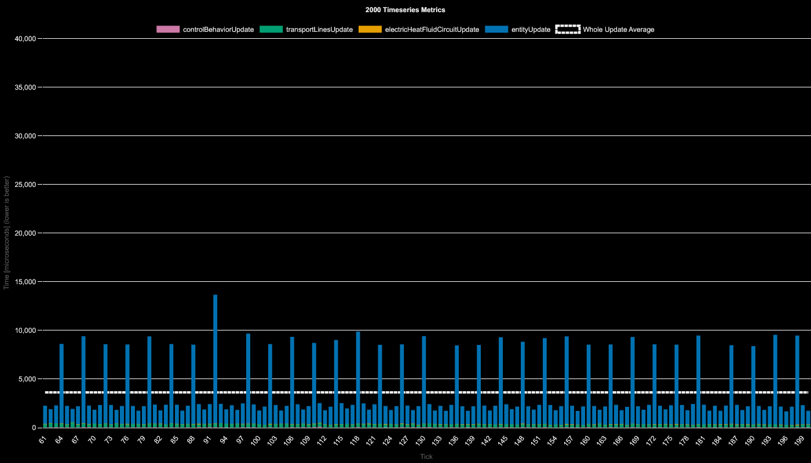

That is also why you see the entity times go up and down since it sometimes mines 8 items and sometimes 9.

Once you scale to 4000, your speed is now 1002.5 or 16.708333... / tick, so the period now increases
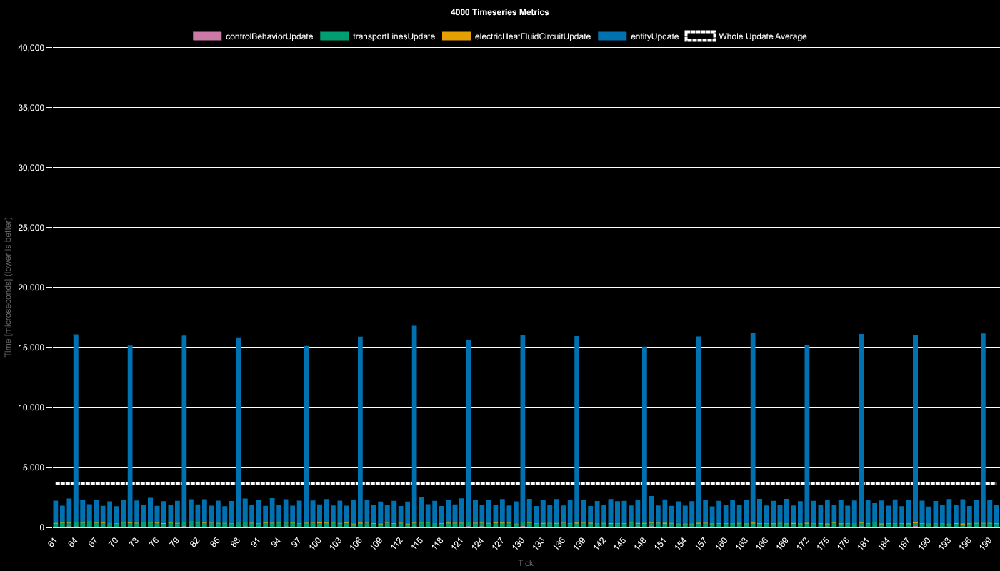

Finally at 8000, your mining speed is 2002.5 (33.375 / tick) so it now activates once every 15 ticks or 16 ticks.
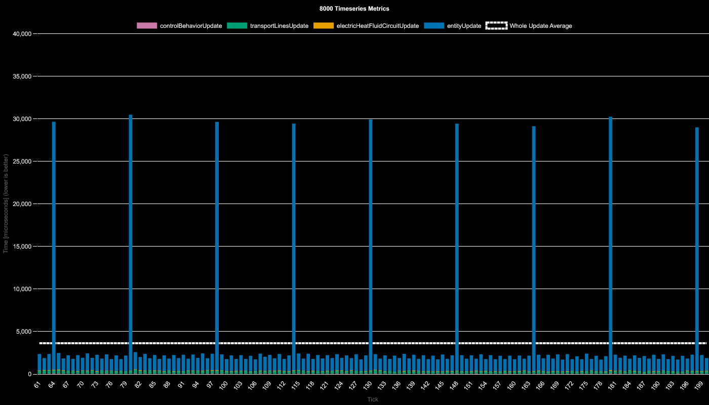

This pattern continues and the following shows for an extreme example what 16k and 32k mining prod looks like:
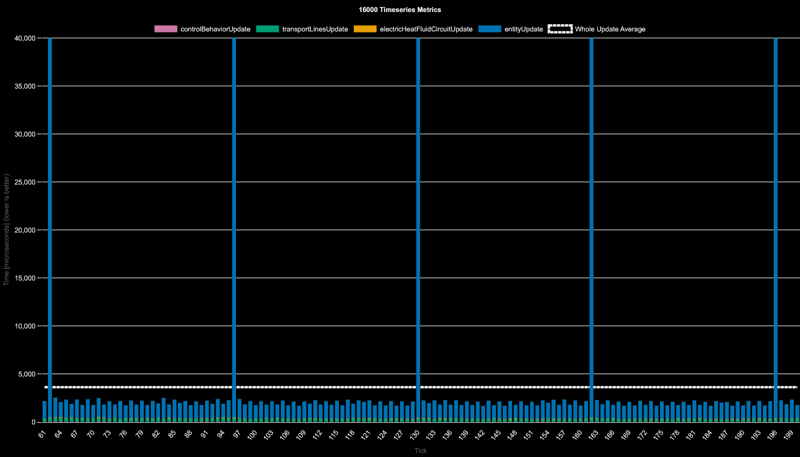
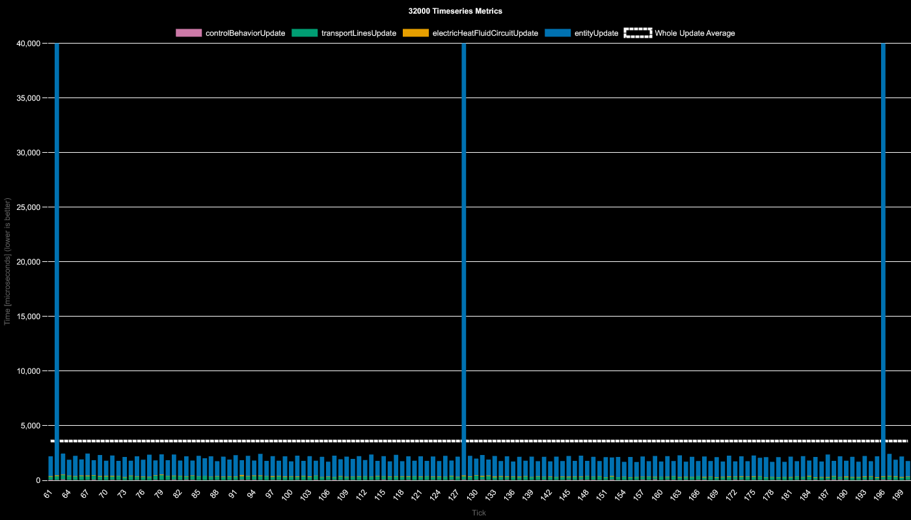

### Profiler
When looking at a cpu profiler we can see the following:
- `MiningDrill::performMining` (actually mining and allocating inventory) is taking up 24.13% of the cpu time but only has 143 samples in this profile.

- `MiningDrill::clearStorageBuffer` (draining its storage buffer onto the belt) consumes 13.98% of cpu time but has 1240 samples.

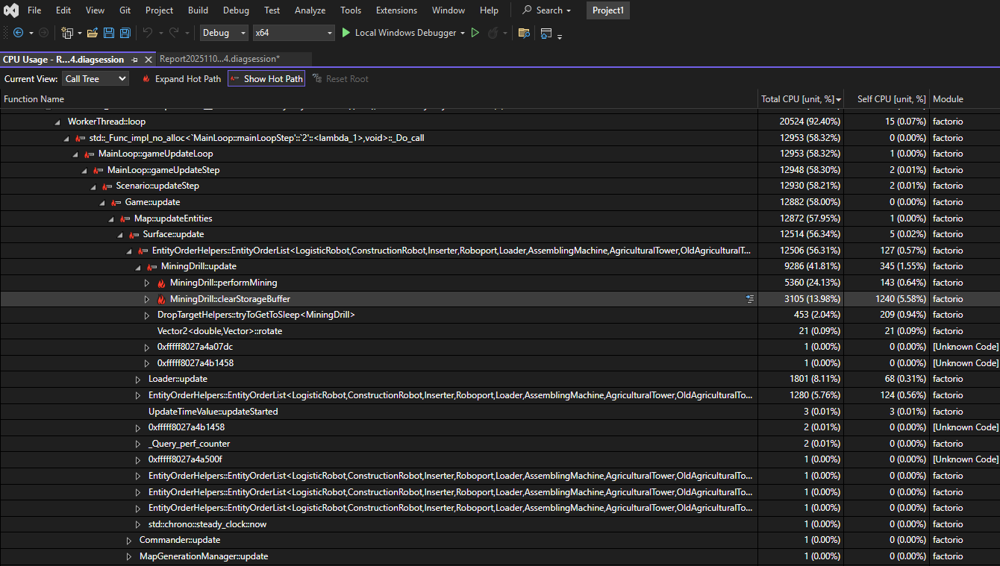

## Miner Modules

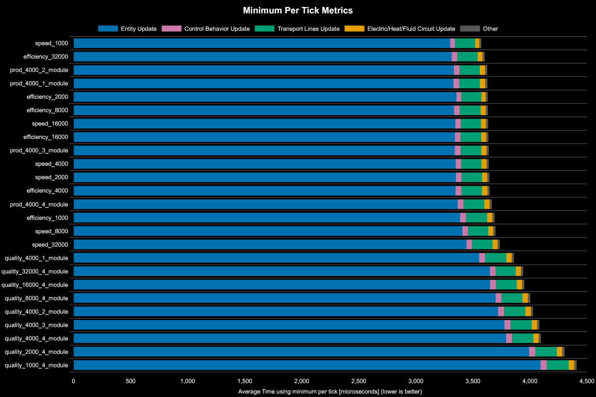

After mining productivity 2000, the mining time is effectively the same for productivity modules, speed modules, and efficiency modules. Only the addition of quality modules has any noticeable impact.

The following is a graphic of only mining productivity level 4000:
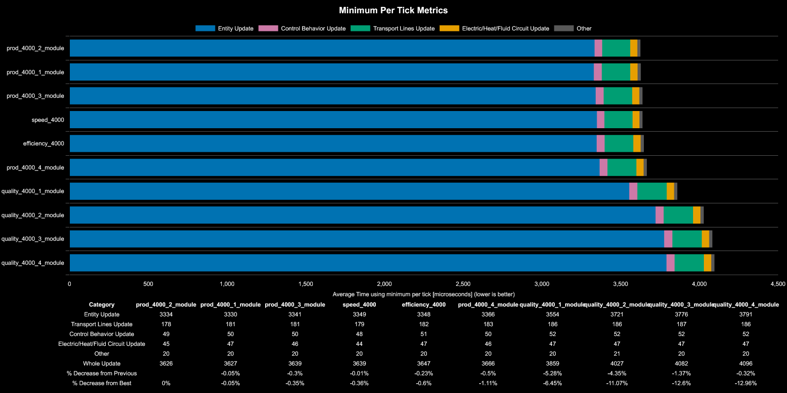

The emphasizes the point that only quality seems to have any noticeable impact. The productivity modules used here are tier 1 modules since they have the same speed penalty that tier 3 quality modules have.

### Quality

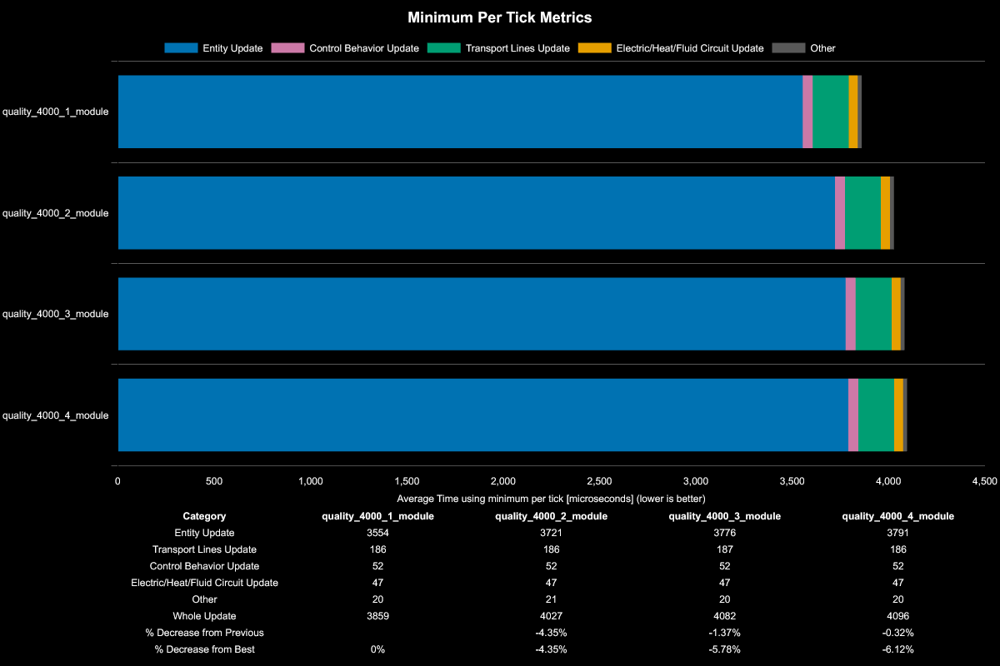

The more quality modules you add, the entity update time for miners increases seemingly logarithmically. Couple things are going on it seems that increase with quality:
1. `FlowStatistics` (production stats)
2. `ItemStack::swapWith` (switching internal slots due to quality)
3. `QualityPrototype::rollQuality`

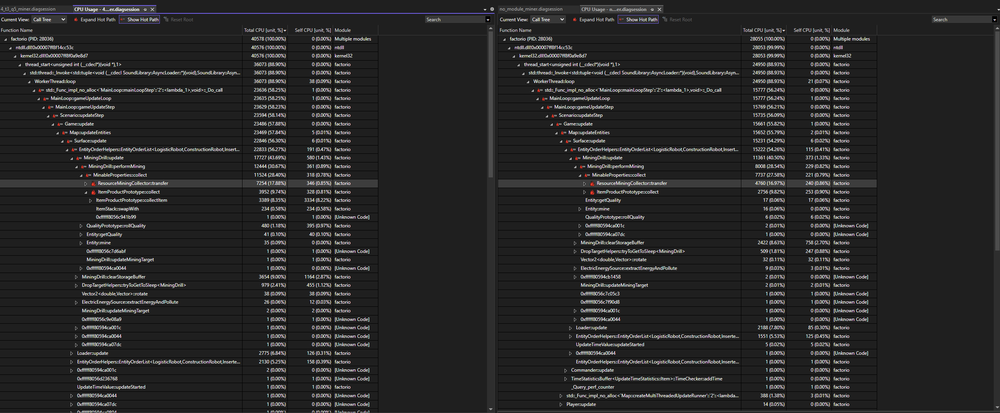

#### Quality Per Tick Metrics
The two following charts compare speed modules, productivity modules, and quality modules. 

- Productivity modules are tier 1 with a 5% speed penalty
- Quality modules are tier 3 with a 5% speed penalty
- Speed modules are tier 3. 
- All are legendary quality.

The baseline is just efficiency modules shown below:

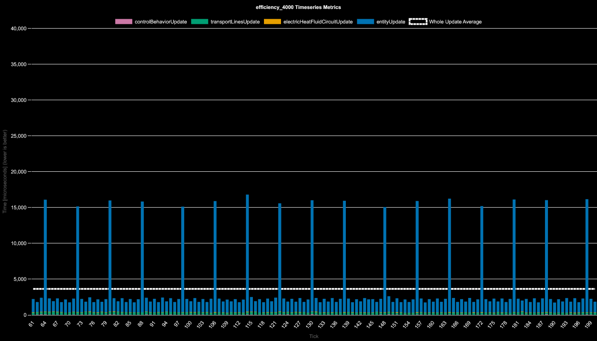

With one productivity module:

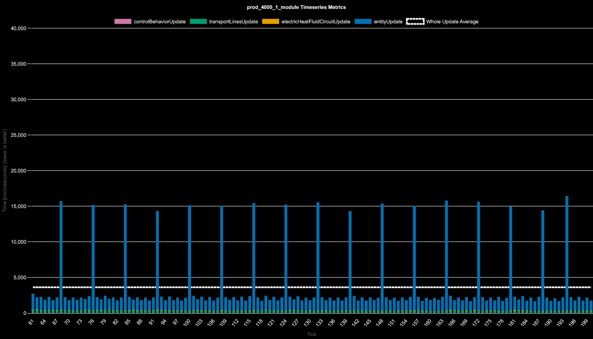

With one quality module:

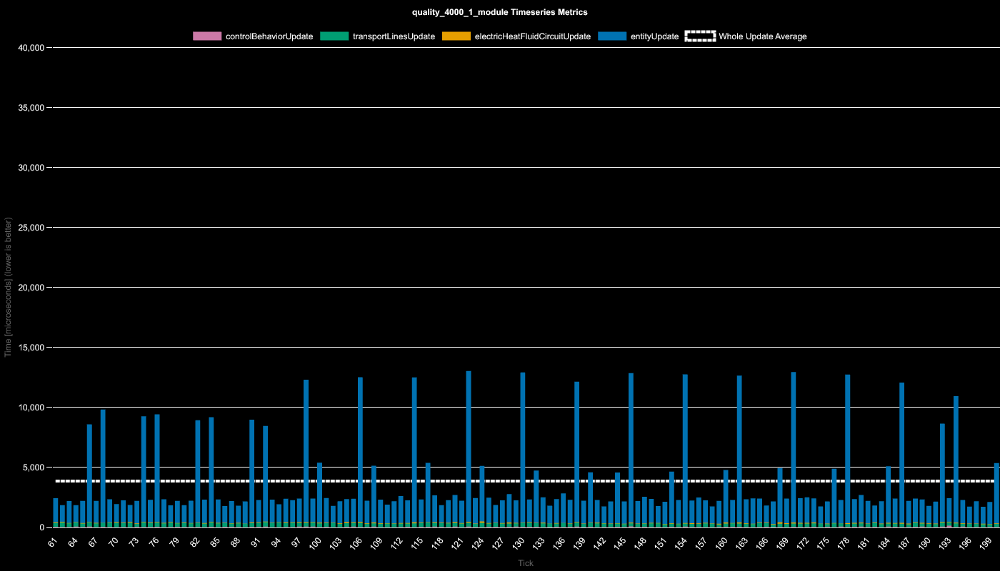

With 4 quality modules:

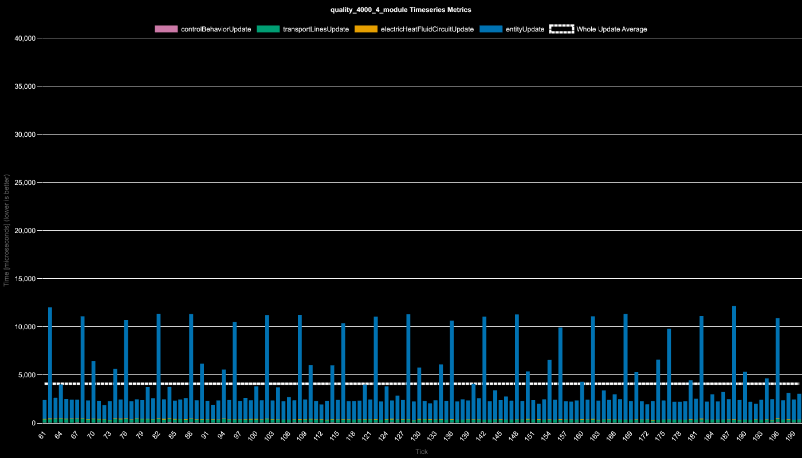

With 4 speed modules:

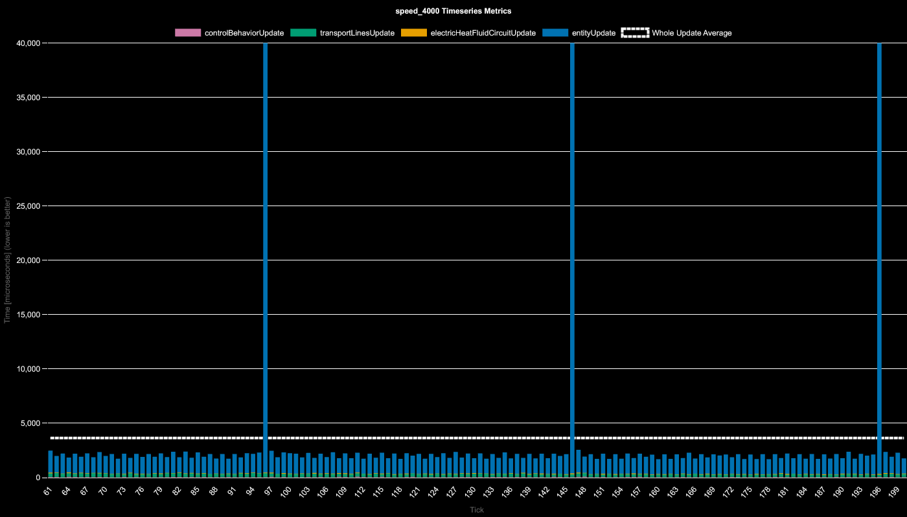

Quality seems to add an additional few smaller entity update time spikes per miner which is presumably when the internal inventory switches slots on what is being outputted between quality ore that is mined.

### Conclusion
- Mining drills entity time is directly proportional to throughput
- With higher levels of research productivity, the entity time update spikes will increase in amplitude and decrease in frequency, however their update time spent is on average the same
- modules
  - quality increases the 