# Circuit Network Cost on Inserters without Pickups

**Platform:** windows-x86_64

**Factorio Version:** 2.0.72

## The Question
- does activating / deactivating inserters incur entity time if no action is able to take place
- do inserters read the contents of the target machine when activated via the circuit network
- does connecting an entity to a network but not sending a signal cost anything

## Scenario
* Each save was tested for 3600 tick(s) and 10 run(s)
* assembly machines crafting gears are positioned in front of inserters
* scenarios tested:
  * no circuit network idle
  * all inserters connected to a circuit network, no signals
  * all inserters with a pulse signal (on for 1 tick every X ticks)
  * all inserters active on / off equally (PWM signal, X ticks on X ticks off)
  * above scenarios with no assembly machines in front of the inserter

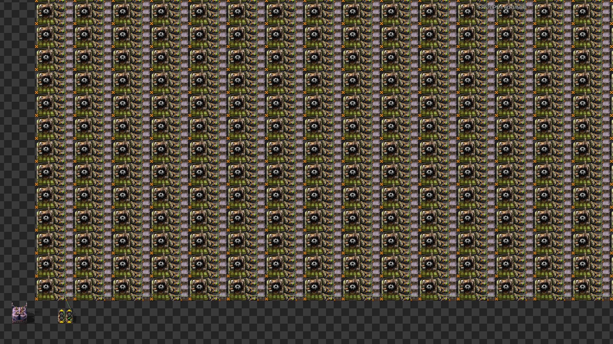

## Results
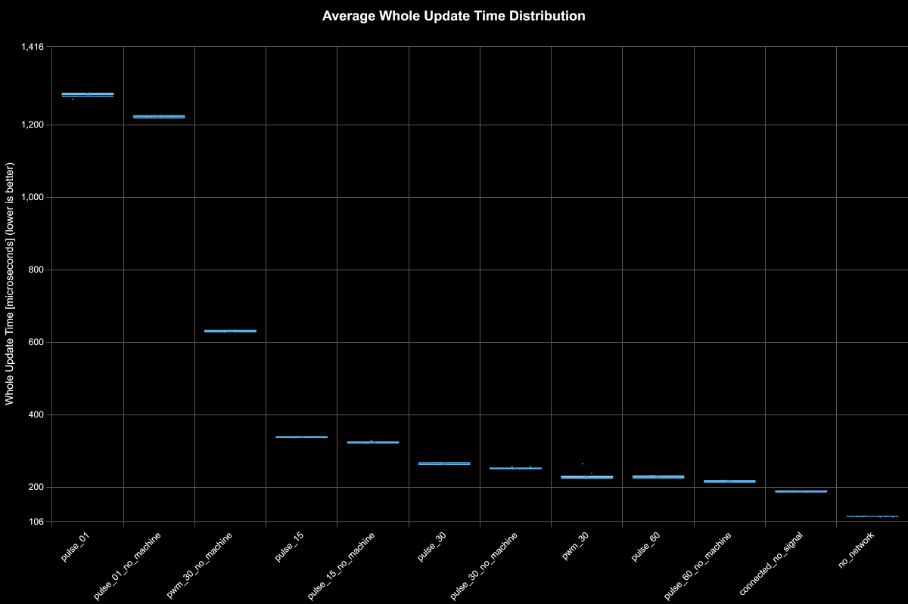
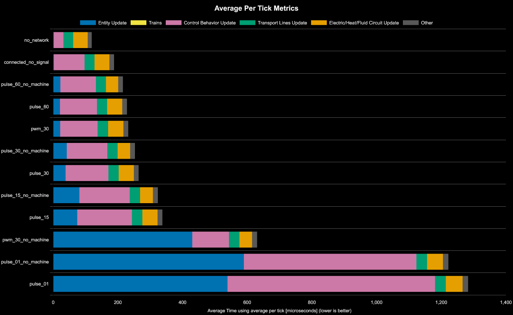

| Save File           | Entity Update | Control Behavior Update | Whole Update | % Decrease from Previous | % Decrease from Best |
| ------------------- | ------------- | ----------------------- | ------------ | ------------------------ | -------------------- |
| no_network          | 45            | 30                      | 119          |                          |                      |
| connected_no_signal | 95            | 46                      | 188          | -57.98%                  | -57.6%               |
| pulse_60_no_machine | 110           | 38                      | 216          | -14.89%                  | -81.07%              |
| pulse_60            | 114           | 47                      | 228          | -5.56%                   | -91.13%              |
| pwm_30              | 115           | 47                      | 232          | -1.75%                   | -94.48%              |
| pulse_30_no_machine | 125           | 42                      | 253          | -9.05%                   | -112.08%             |
| pulse_30            | 132           | 47                      | 264          | -4.35%                   | -121.3%              |
| pulse_15_no_machine | 155           | 82                      | 324          | -22.73%                  | -171.6%              |
| pulse_15            | 169           | 74                      | 338          | -4.32%                   | -183.34%             |
| pwm_30_no_machine   | 430           | 114                     | 631          | -86.69%                  | -428.95%             |
| pulse_01_no_machine | 590           | 534                     | 1222         | -93.66%                  | -924.37%             |
| pulse_01            | 642           | 539                     | 1283         | -4.99%                   | -975.51%             |

### connected_no_signal tick metrics

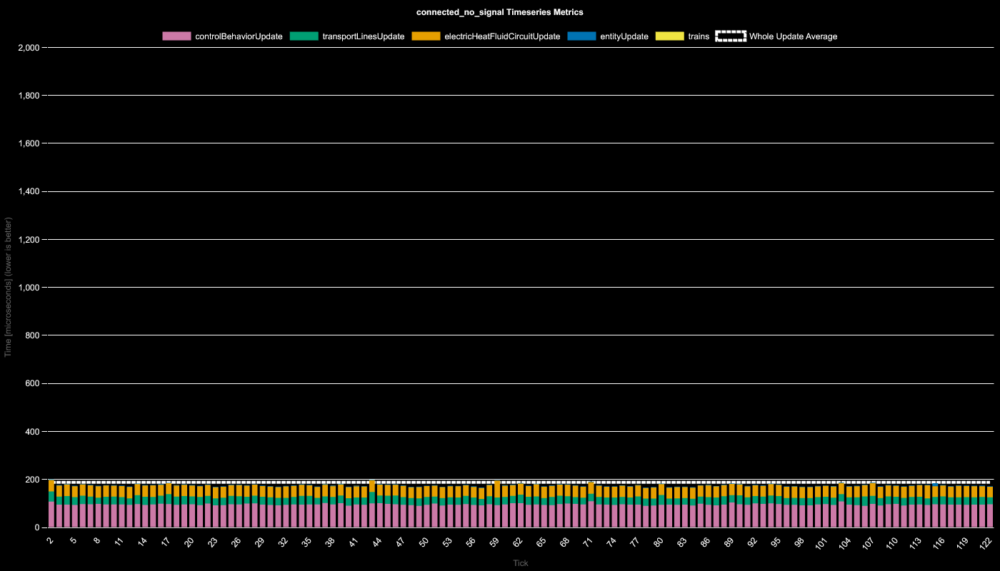 
### no_network tick metrics

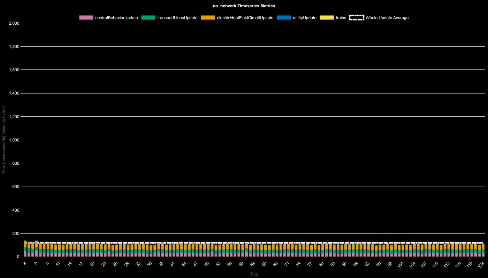 
### pulse_01_no_machine tick metrics

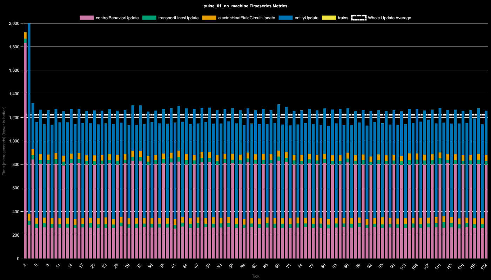 
### pulse_01 tick metrics

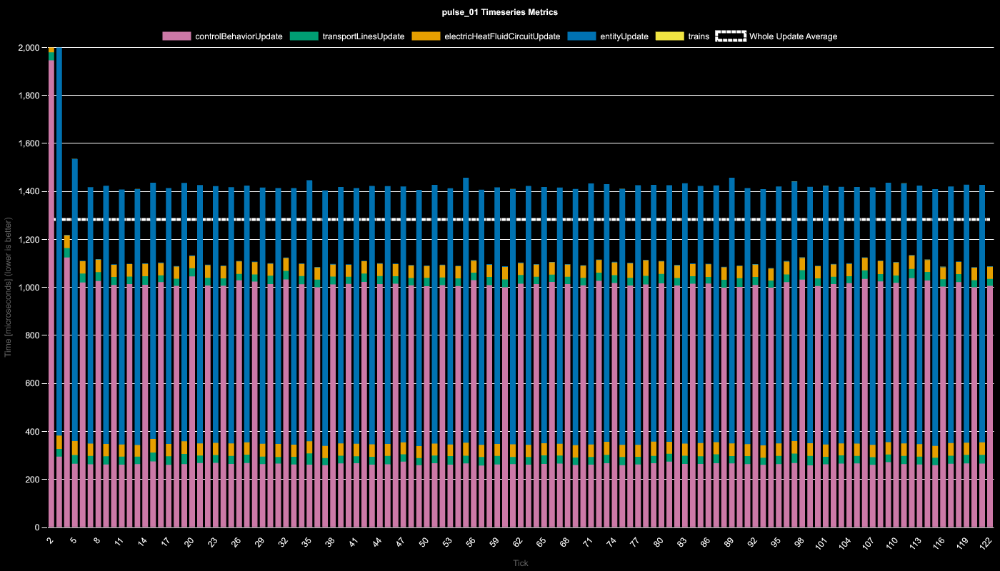 
### pulse_15_no_machine tick metrics

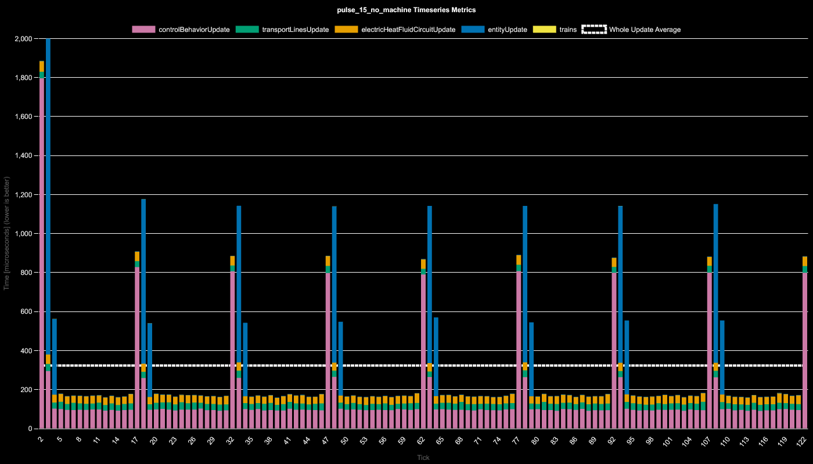 
### pulse_15 tick metrics

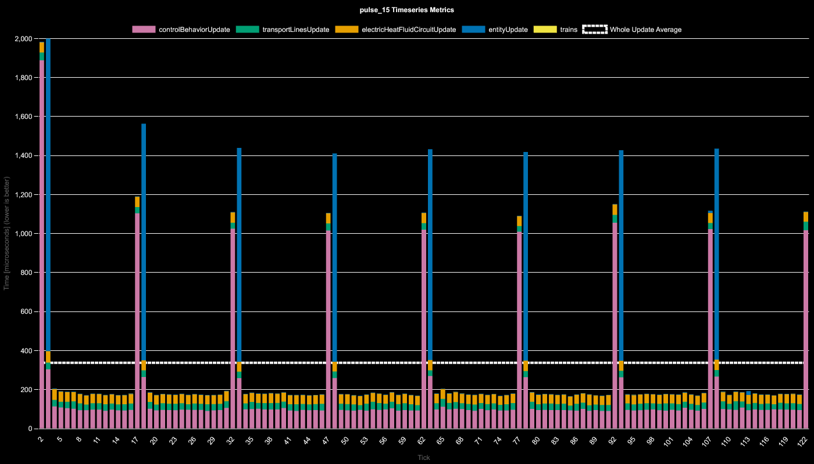 
### pulse_30_no_machine tick metrics

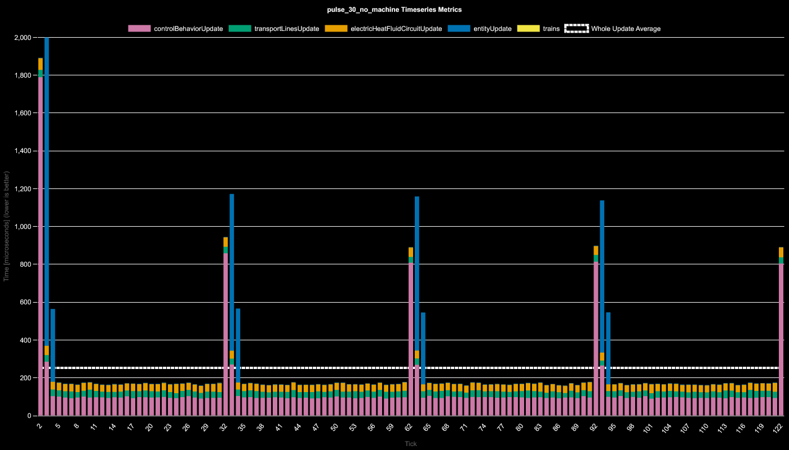 
### pulse_30 tick metrics

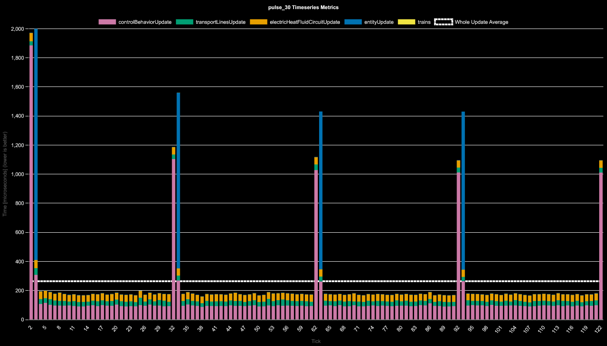 
### pulse_60_no_machine tick metrics

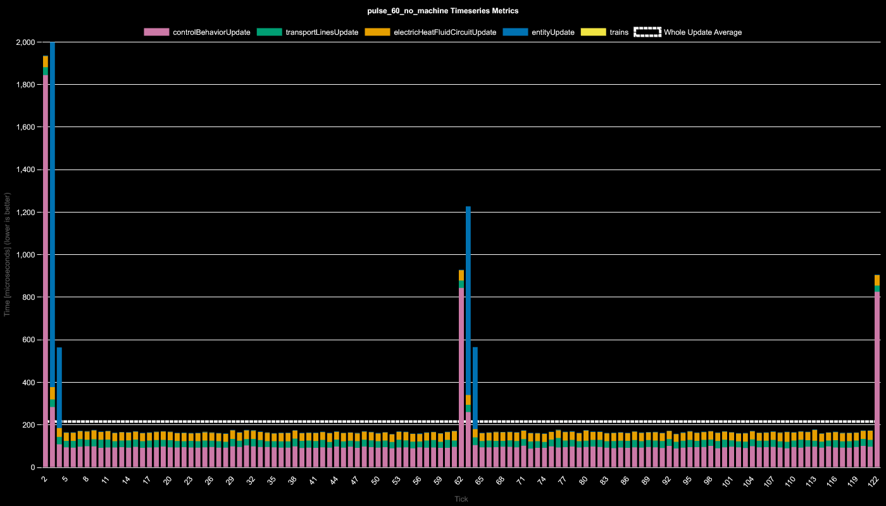 
### pulse_60 tick metrics

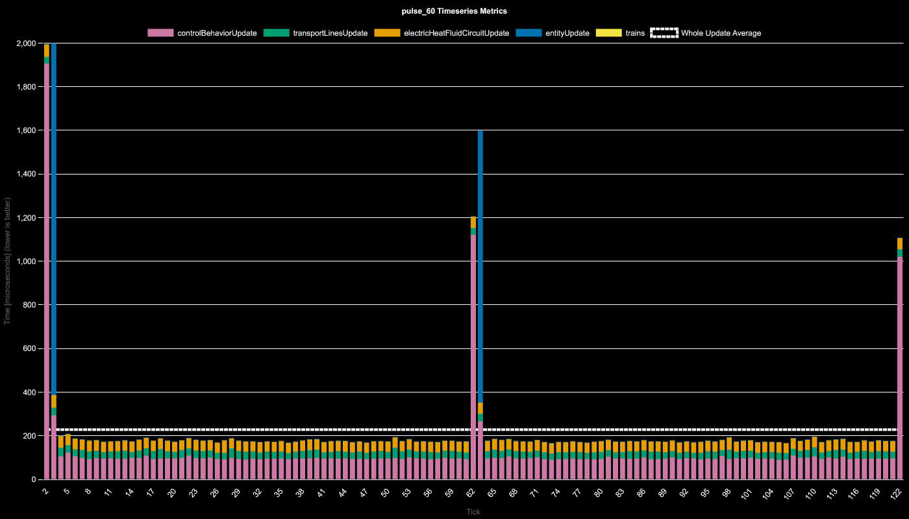 
### pwm_30_no_machine tick metrics

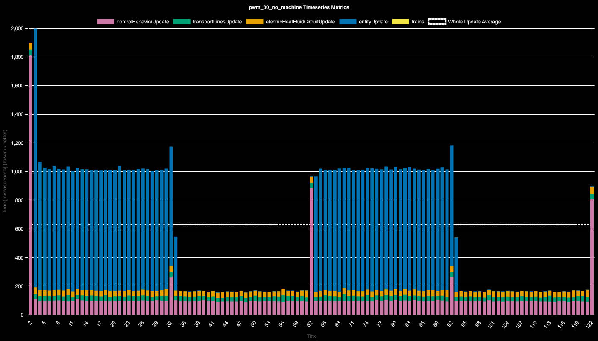 
### pwm_30 tick metrics

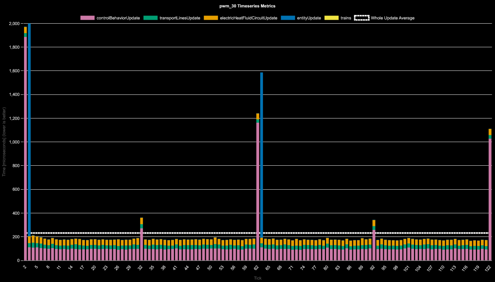