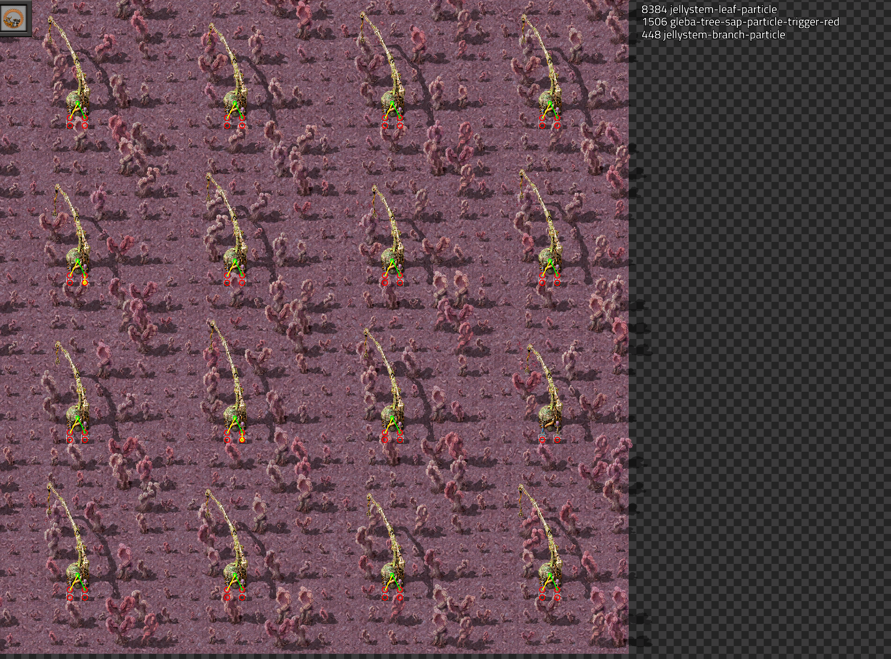
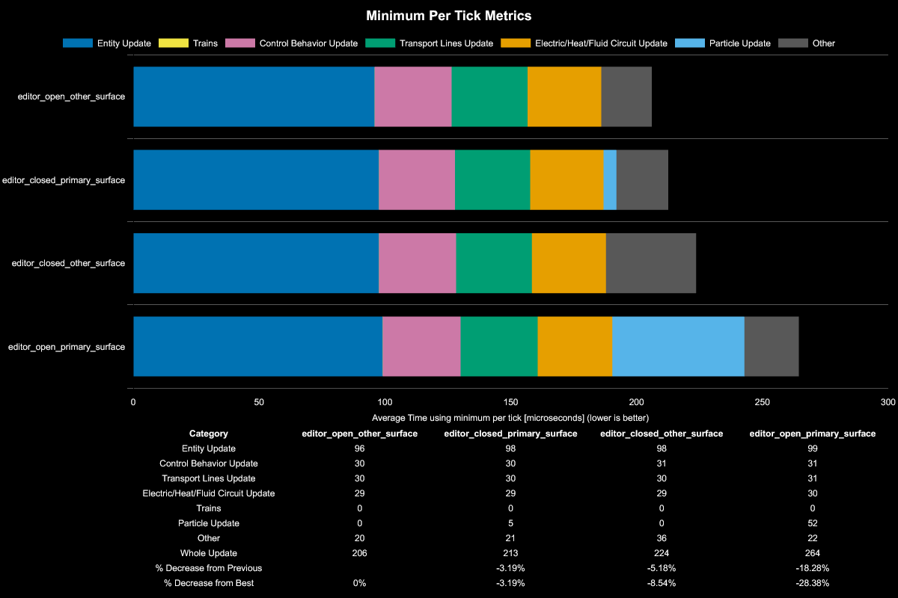
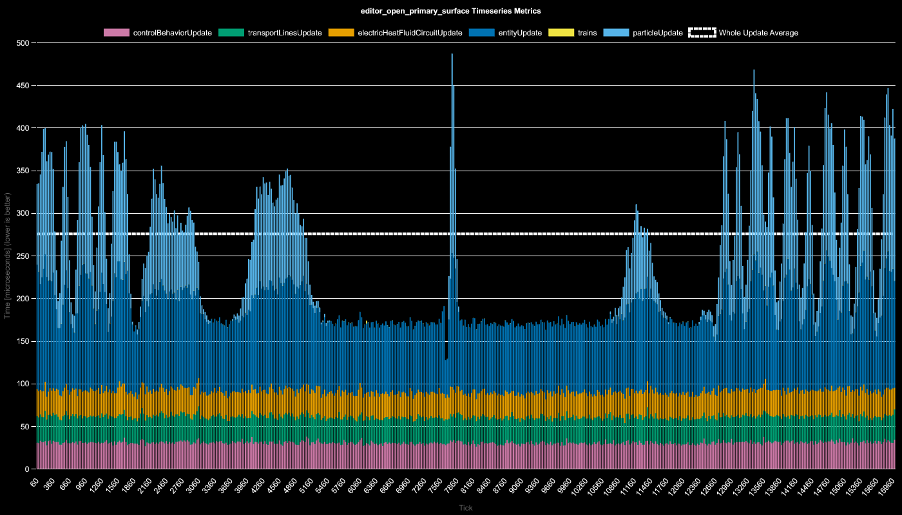
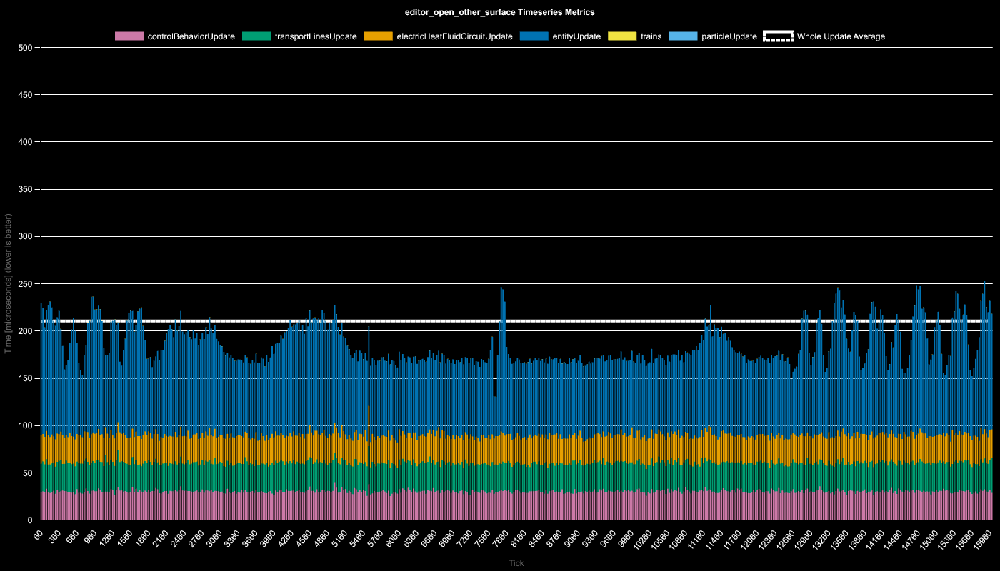

# Particles in Benchmarks

**Platform:** windows-x86_64

**Factorio Version:** 2.0.72

## The Question
- does the characters location in a benchmark impact the particle update time?

## Scenario
* Each save was tested for 36000 tick(s) and 1 run(s)
* game is paused to start at the same tick
* agriculture towers are cloned and harvest trees over the course of 36k ticks

Maps names:
- `editor_open_primary_surface` - editor mode, view finder is on primary surface looking directly at planters
- `editor_open_other_surface` - editor mode, view finder is on other empty surface
- `editor_closed_primary_surface` - editor closed, character is on primary surface near planters
- `editor_closed_other_surface` - editor closed, character is on other empty surface

## Results
| Metric            | Description                           |
| ----------------- | ------------------------------------- |
| **Mean UPS**      | Updates per second - higher is better |
| **Mean Avg (ms)** | Average frame time - lower is better  |
| **Mean Min (ms)** | Minimum frame time - lower is better  |
| **Mean Max (ms)** | Maximum frame time - lower is better  |

| Save                          | Avg (ms) | Min (ms) | Max (ms) | UPS      | Execution Time (ms) | % Difference from Worst |
| ----------------------------- | -------- | -------- | -------- | -------- | ------------------- | ----------------------- |
| editor_open_primary_surface   | 0.277    | 0.110    | 0.730    | 3607     | 9980                | 0.00%                   |
| editor_closed_other_surface   | 0.220    | 0.106    | 1.817    | 4553     | 7906                | 26.23%                  |
| editor_closed_primary_surface | 0.218    | 0.103    | 0.550    | 4586     | 7849                | 27.15%                  |
| editor_open_other_surface     | 0.212    | 0.112    | 0.563    | **4719** | 7627                | 30.84%                  |

## Timeseries Data

The graphs below highlight the impact of the view finder location when observing the planters and when on another surface not observing the planters.

## Conclusion
- the position of the view finder matters for benchmarking in regards to particles