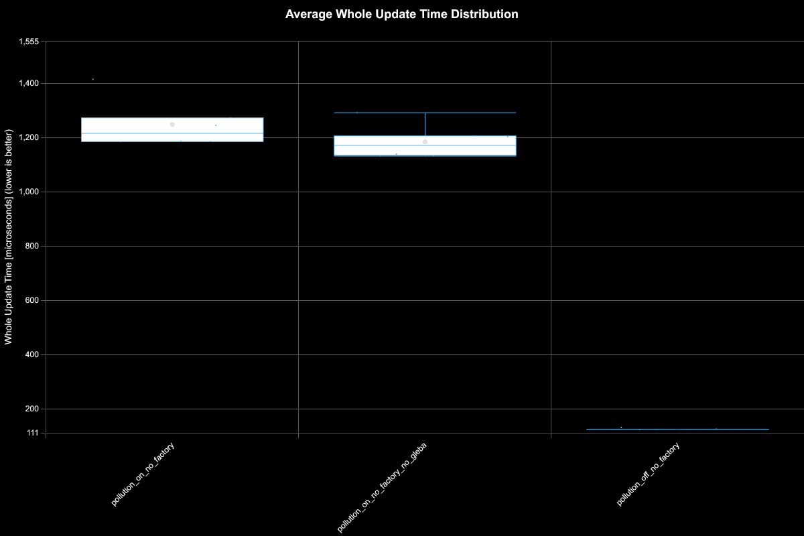
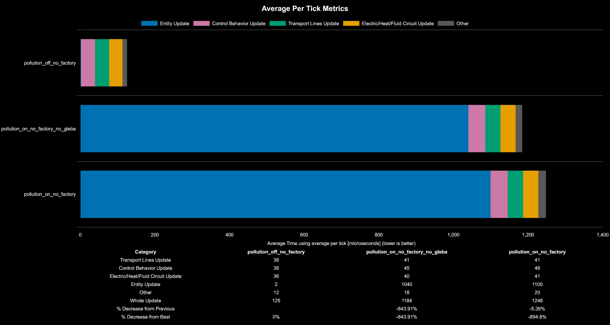
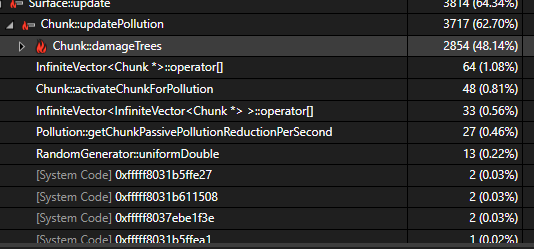

# Impact of Pollution

**Platform:** windows-x86_64

**Factorio Version:** 2.0.72

## Scenario
* Each save was tested for 18000 tick(s) and 6 run(s)

- Took my original megabase that had a pollution cloud that grew from running 1040 labs non stop for hundreds of hours.
  - has roughly a 5100 tile radius on Nauvis
- Removed all entities from all surfaces except rocks & trees
- Removed all surfaces except for gleba and nauvis
- Three save files:
  - `pollution_on_no_factory`: original pollution cloud on gleba and nauvis but all entities removed
  - `pollution_on_no_factory_no_gleba`: removed gleba surface
  - `pollution_off_no_factory`: removes pollution from Nauvis surface and turned off pollution system in game

> Note: Maps are not included on github due to size (250+MB per save file)
> 
> The save files can be found instead here: [google drive folder](https://drive.google.com/drive/folders/15rtMFgF4jmlj3tMFz0tDraRBexUf4KuG?usp=sharing)

## Results
| Metric            | Description                           |
| ----------------- | ------------------------------------- |
| **Mean UPS**      | Updates per second - higher is better |
| **Mean Avg (ms)** | Average frame time - lower is better  |
| **Mean Min (ms)** | Minimum frame time - lower is better  |
| **Mean Max (ms)** | Maximum frame time - lower is better  |

| Save                                | Avg (ms) | Min (ms) | Max (ms) | UPS      | Execution Time (ms) | % Difference from Worst |
| ----------------------------------- | -------- | -------- | -------- | -------- | ------------------- | ----------------------- |
| bm_pollution_on_no_factory          | 1.255    | 0.800    | 4.553    | 799      | 135563              | 0.00%                   |
| bm_pollution_on_no_factory_no_gleba | 1.191    | 0.740    | 3.218    | 841      | 128555              | 5.26%                   |
| bm_pollution_off_no_factory         | 0.127    | 0.059    | 0.835    | **7892** | 13689               | 886.71%                 |

## Conclusion

Over 1ms of update time is being consumed by pollution

Most of the update time is due to calling the `Chunk::damageTrees` function

