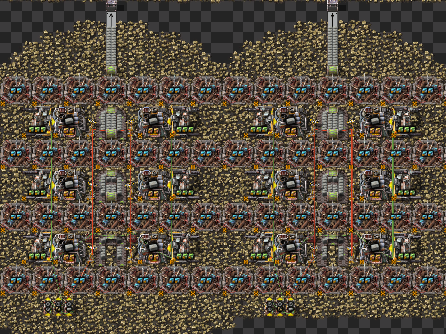
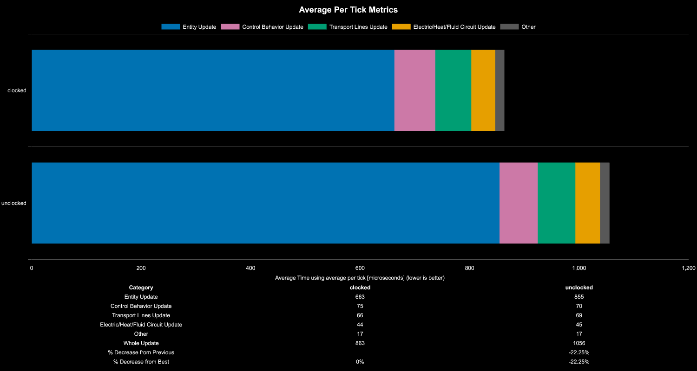
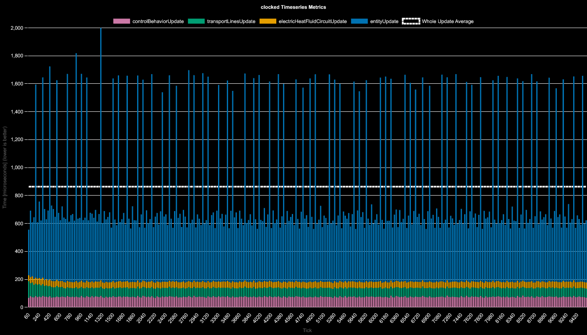
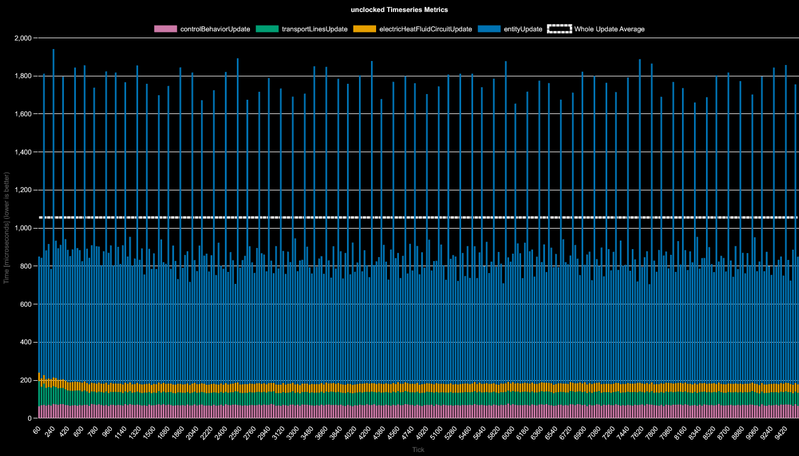

# Factorio Benchmark Results

**Platform:** windows-x86_64

**Factorio Version:** 2.0.72

## The Question
- is it worth to clock mining drills when directly mining into a furnace?

## Conclusion

Clocking is worth it.

- mining drills constantly unload their internal inventory into a furnace every tick when unclocked
- they perform their actual mining operation on the same cadenace regardless of clocking
- clocking the mining drill reduces the micro 2 item transfers that every tick into the furnace

## Scenario
-  Each save was tested for 9600 tick(s) and 3 run(s)
-  400 copies of a design that produces 240/s stone bricks
-  one version has clocked mining drills, the other does not
-  a perfect clock is created to output for 2 ticks into the mining drill
-  mining productivity is set to 8000 and mining drills can craft 108 items in one tick to saturate the furnace

## Results
| Metric            | Description                           |
| ----------------- | ------------------------------------- |
| **Mean UPS**      | Updates per second - higher is better |
| **Mean Avg (ms)** | Average frame time - lower is better  |
| **Mean Min (ms)** | Minimum frame time - lower is better  |
| **Mean Max (ms)** | Maximum frame time - lower is better  |

| Save                      | Avg (ms) | Min (ms) | Max (ms) | UPS      | Execution Time (ms) | % Difference from Worst |
| ------------------------- | -------- | -------- | -------- | -------- | ------------------- | ----------------------- |
| bm_mining_drill_unclocked | 1.063    | 0.192    | 31.229   | 940      | 30614               | 0.00%                   |
| bm_mining_drill_clocked   | 0.869    | 0.197    | 31.107   | **1150** | 25041               | 22.26%                  |

| Save File | Entity Update | Control Behavior Update | Transport Lines Update | Electric/Heat/Fluid Circuit Update | Other | Whole Update | % Decrease from Previous | % Decrease from Best |
| --------- | ------------- | ----------------------- | ---------------------- | ---------------------------------- | ----- | ------------ | ------------------------ | -------------------- |
| clocked   | 663           | 75                      | 66                     | 44                                 | 17    | 863          |                          | 0%                   |
| unclocked | 855           | 70                      | 69                     | 45                                 | 17    | 1056         | -22.25%                  | -22.25%              |

## Timeseries Charts

