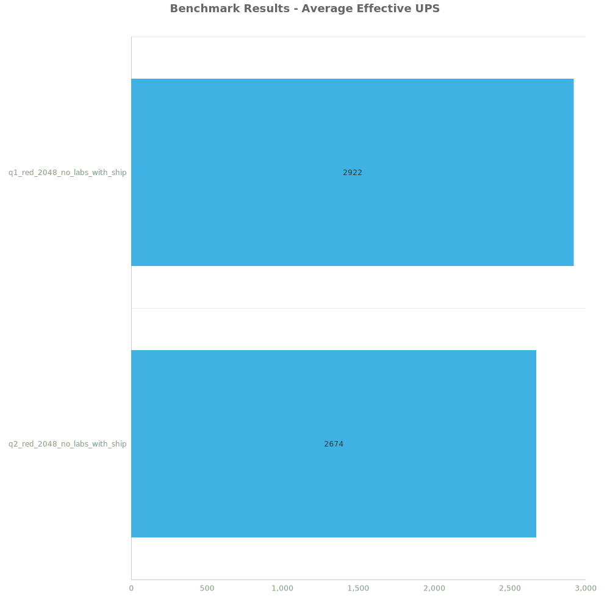
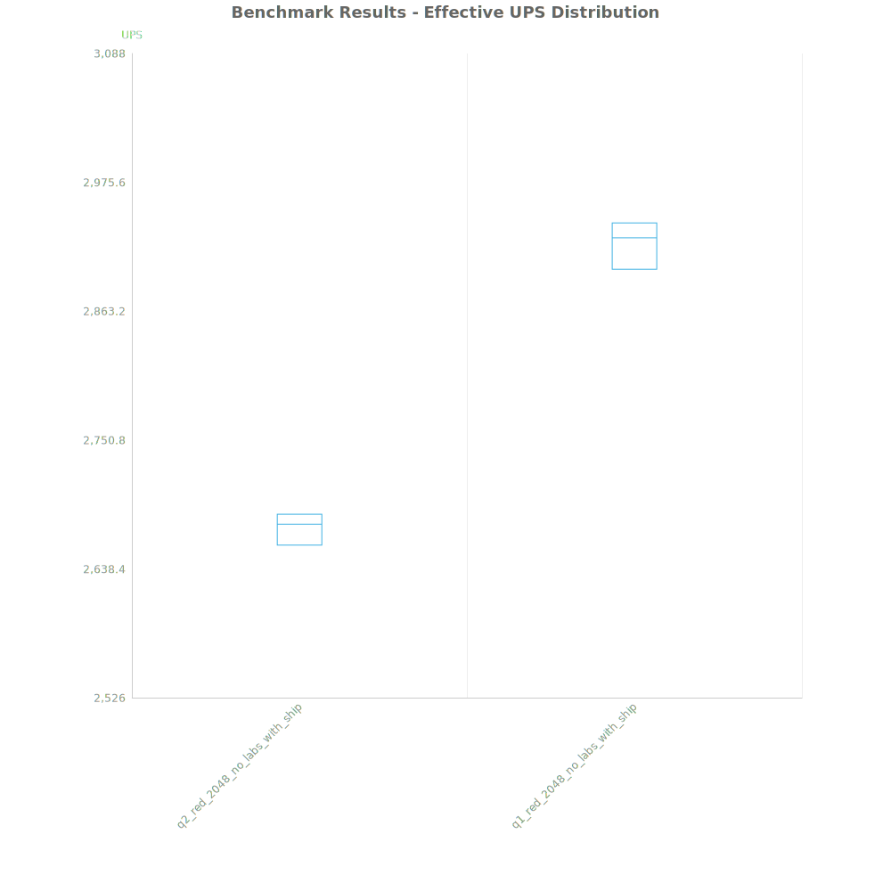
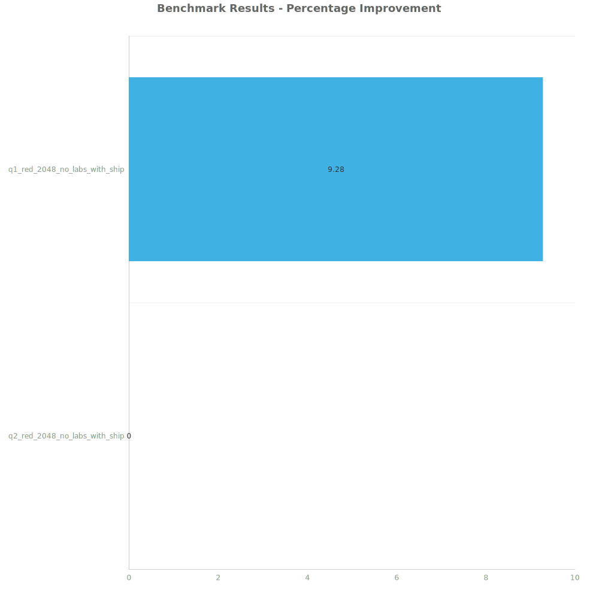
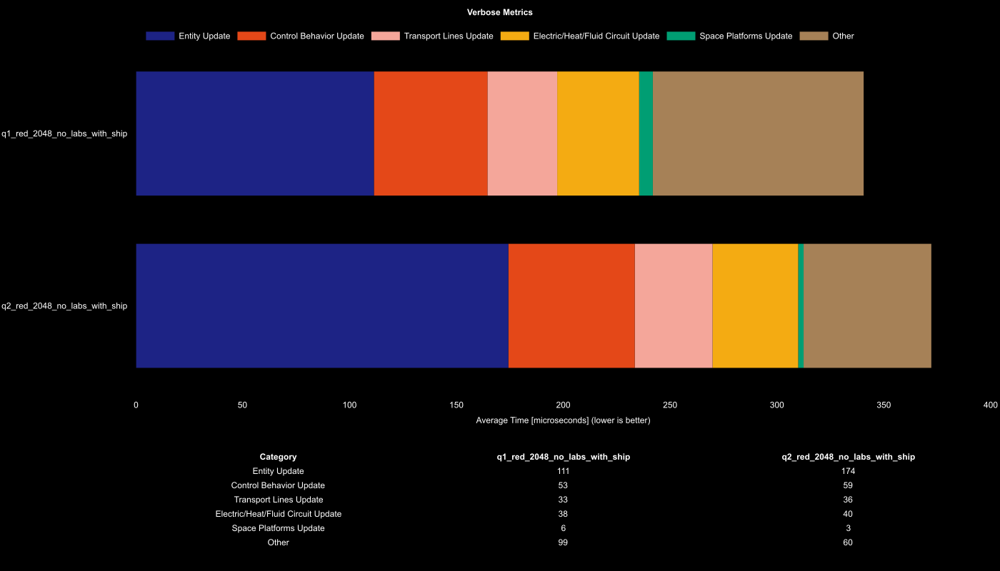

# Factorio Benchmark Results

**Platform:** windows-x86_64  
**Factorio Version:** 2.0.64  

## Scenario
* Each save was tested for 108000 tick(s) and 3 run(s)

## Results
| Metric            | Description                           |
| ----------------- | ------------------------------------- |
| **Mean UPS**      | Updates per second - higher is better |
| **Mean Avg (ms)** | Average frame time - lower is better  |
| **Mean Min (ms)** | Minimum frame time - lower is better  |
| **Mean Max (ms)** | Maximum frame time - lower is better  |

| Save                          | Avg (ms) | Min (ms) | Max (ms) | UPS      | Execution Time (ms) |
| ----------------------------- | -------- | -------- | -------- | -------- | ------------------- |
| q2_red_2048_no_labs_with_ship | 0.374    | 0.225    | 1.663    | 2674     | 121151              |
| q1_red_2048_no_labs_with_ship | 0.342    | 0.183    | 1.960    | **2922** | 110869              |

Box and Whisker Plot:

| Save                          | % Difference from base |
| ----------------------------- | ---------------------- |
| q2_red_2048_no_labs_with_ship | 0.00%                  |
| q1_red_2048_no_labs_with_ship | 9.28%                  |

## Conclusion