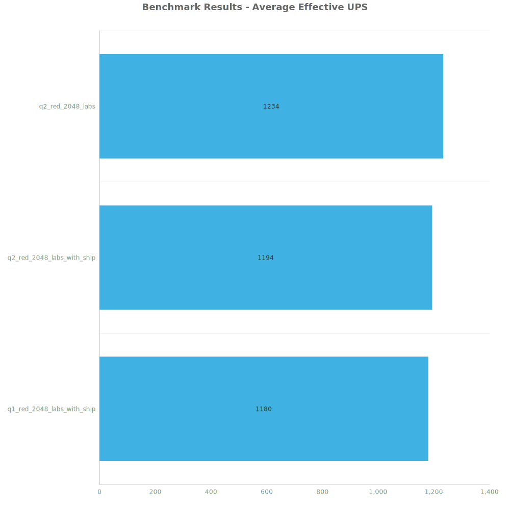
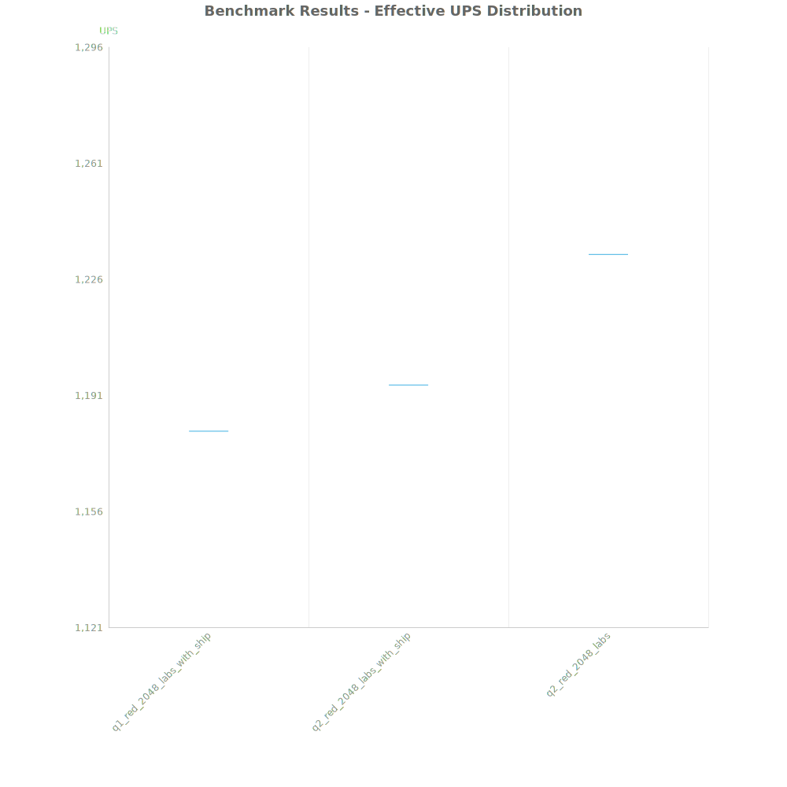
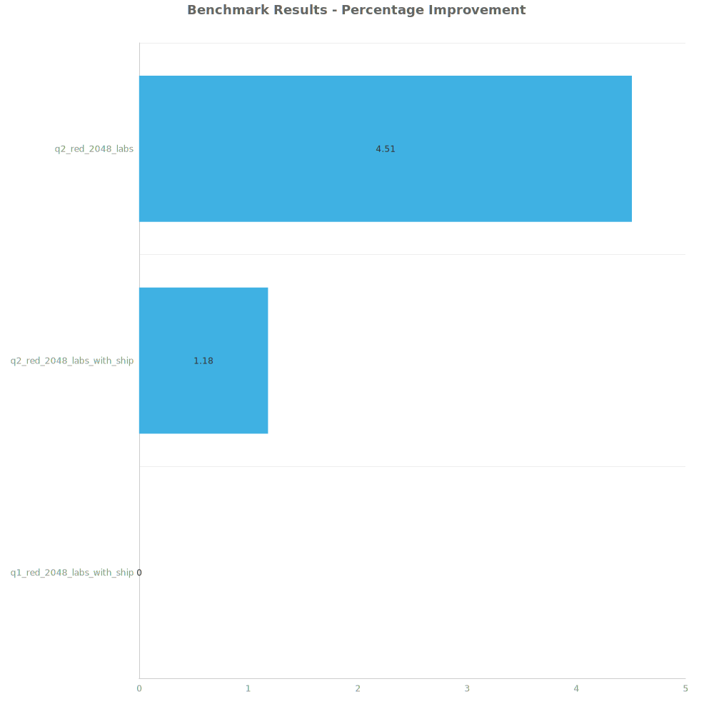

# Factorio Benchmark Results

**Platform:** windows-x86_64  
**Factorio Version:** 2.0.64  

## Scenario
* Each save was tested for 108000 tick(s) and 1 run(s)

## Results
| Metric            | Description                           |
| ----------------- | ------------------------------------- |
| **Mean UPS**      | Updates per second - higher is better |
| **Mean Avg (ms)** | Average frame time - lower is better  |
| **Mean Min (ms)** | Minimum frame time - lower is better  |
| **Mean Max (ms)** | Maximum frame time - lower is better  |

| Save | Avg (ms) | Min (ms) | Max (ms) | UPS | Execution Time (ms) |
|------|----------|----------|----------|-----|---------------------|
| q1_red_2048_labs_with_ship | 0.847 | 0.514 | 3.644 | 1180 | 91505 |
| q2_red_2048_labs_with_ship | 0.837 | 0.459 | 17.450 | 1194 | 90439 |
| q2_red_2048_labs | 0.811 | 0.452 | 2.891 | **1233** | 87554 |

Box and Whisker Plot:

| Save | % Difference from base |
|------|------------------------|
| q1_red_2048_labs_with_ship | 0.00% |
| q2_red_2048_labs_with_ship | 1.18% |
| q2_red_2048_labs | 4.51% |

## Conclusion