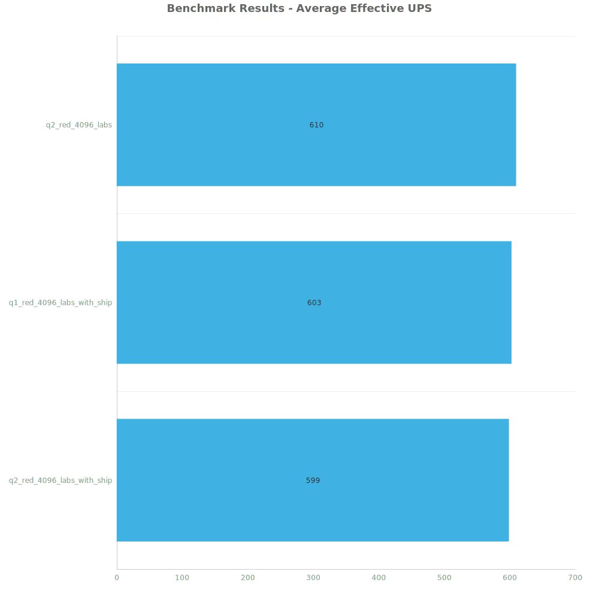
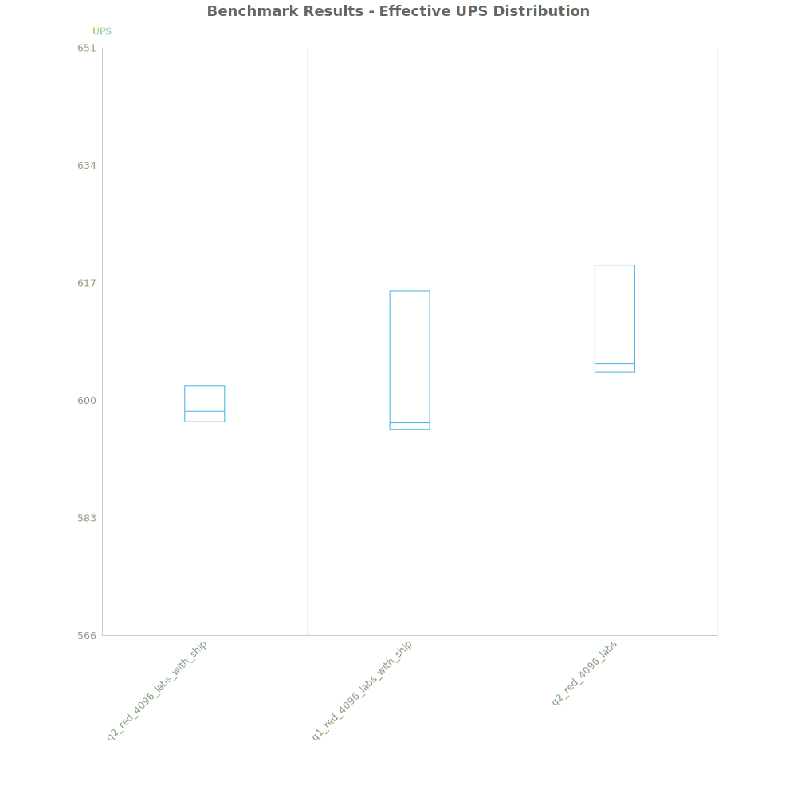
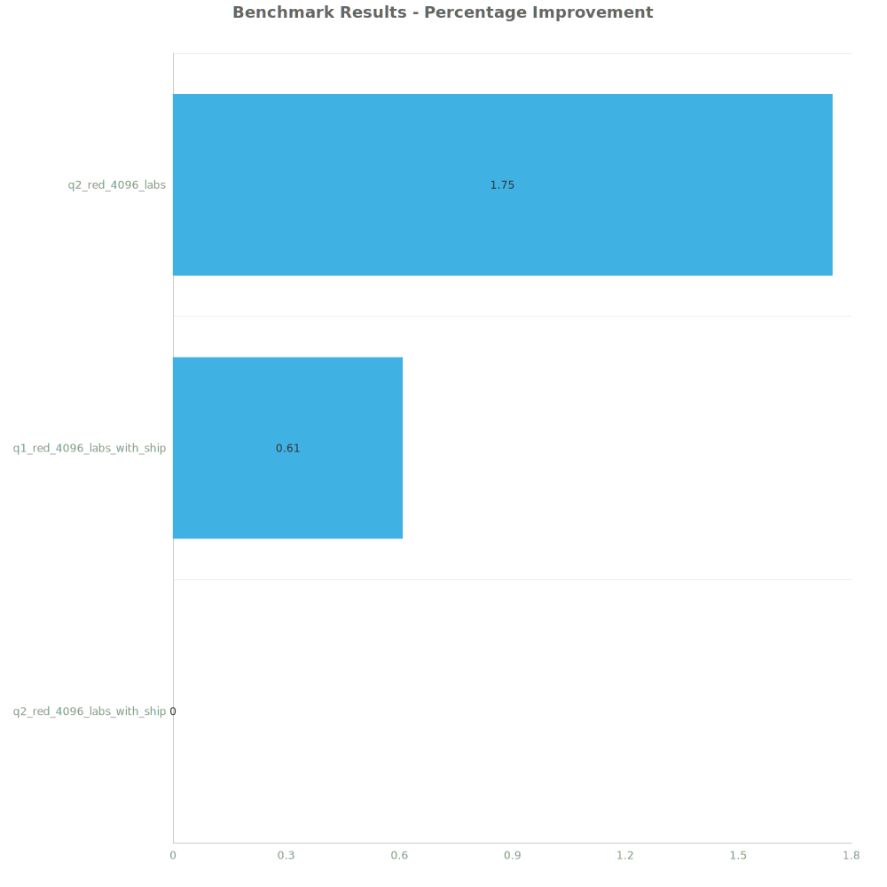

# Factorio Benchmark Results

**Platform:** windows-x86_64  
**Factorio Version:** 2.0.64  

## Scenario
* Each save was tested for 108000 tick(s) and 3 run(s)

## Results
| Metric            | Description                           |
| ----------------- | ------------------------------------- |
| **Mean UPS**      | Updates per second - higher is better |
| **Mean Avg (ms)** | Average frame time - lower is better  |
| **Mean Min (ms)** | Minimum frame time - lower is better  |
| **Mean Max (ms)** | Maximum frame time - lower is better  |

| Save | Avg (ms) | Min (ms) | Max (ms) | UPS | Execution Time (ms) |
|------|----------|----------|----------|-----|---------------------|
| q2_red_4096_labs_with_ship | 1.669 | 0.804 | 6.451 | 599 | 540753 |
| q1_red_4096_labs_with_ship | 1.659 | 0.930 | 5.589 | 602 | 537602 |
| q2_red_4096_labs | 1.640 | 0.831 | 7.750 | **609** | 531520 |

Box and Whisker Plot:

| Save | % Difference from base |
|------|------------------------|
| q2_red_4096_labs_with_ship | 0.00% |
| q1_red_4096_labs_with_ship | 0.61% |
| q2_red_4096_labs | 1.75% |

## Conclusion