# Windows 11 vs Linux (Fedora) Results

## Table of Contents
- [Windows 11 vs Linux (Fedora) Results](#windows-11-vs-linux-fedora-results)
  - [Table of Contents](#table-of-contents)
  - [Overview](#overview)
  - [Test Environment Info](#test-environment-info)
    - [Factorio](#factorio)
    - [Operating Systems](#operating-systems)
    - [Hardware](#hardware)
    - [External Libraries and OS Configurations](#external-libraries-and-os-configurations)
  - [Naming Conventions](#naming-conventions)
  - [Test Scenario](#test-scenario)
  - [Results](#results)
    - [Run Variance](#run-variance)
    - [All Metrics](#all-metrics)
    - [Entity Update Time](#entity-update-time)
    - [Multi Threaded Metrics](#multi-threaded-metrics)
      - [Control Behavior Update Time](#control-behavior-update-time)
      - [Electric / Heat / Fluid / Circuit Update Time](#electric--heat--fluid--circuit-update-time)
      - [Transport Line Update Time](#transport-line-update-time)
    - [Huge Pages Memory Size](#huge-pages-memory-size)
    - [Steam vs Standalone Distributions](#steam-vs-standalone-distributions)
    - [Timeseries Graphs](#timeseries-graphs)
  - [Credits](#credits)


## Overview


The goal of this experiment is to test on the same hardware the differences in performance across the following dimensions:
1. **Operating System**: `windows` vs `linux`
2. **Factorio Distribution**: `steam` vs `standalone`
3. **External Library Overrides**: `mimalloc` vs `malloc`


The primary objective is to compare the average whole update time for the same save file across these dimensions to determine the relative performance characteristics between them.

The secondary objective is to compare the average whole update time variance across runs to determine which combination has the lowest variance between operating systems for benchmarking factorio designs.

## Test Environment Info

### Factorio
```
version: 2.0.73
```

**Factorio Save File**
- save file running research productivity at 100k SPM for an effective 2 million ESPM [Google Drive Link](https://drive.google.com/file/d/1GZeEC00NIrhkuxbWmbTMrJVfuh2UgXSC/view?usp=sharing)
- pollution is enabled
- enemies are enabled

**Mod list:**
| name                       | version |
| -------------------------- | ------- |
| base                       | 2.0.73  |
| elevated-rails             | 2.0.73  |
| quality                    | 2.0.73  |
| space-age                  | 2.0.73  |
| calculator-ui              | 2.0.1   |
| clock-generator-sidecar    | 0.1.1   |
| disable-vehicles           | 1.0.0   |
| disable-vehicles-particles | 1.0.1   |
| ExtraZoom                  | 3.0.1   |
| flib                       | 0.16.5  |
| particle_free_disposal     | 0.1.0   |
| RateCalculator             | 3.3.7   |
| RemoveAsteroidParticles    | 0.1.0   |
| RemoveWeaponParticles      | 0.1.1   |
| some-autoresearch          | 2.0.7   |
| StatsGui                   | 1.6.1   |
| visible-planets            | 1.7.0   |
| YAPR                       | 1.1.2   |

### Operating Systems
**Windows Facts**

```
OS: Windows 11 (Version 25H2)
Power Profile: Max CPU Boost Enabled
```

Additionally, Factorio was set to real time cpu priority for all runs.

**Linux Facts**
```
OS: Fedora Linux 43 (KDE Plasma Desktop Edition) x86_64
Kernel: Linux 6.18.6-200.fc43.x86_64
DE: KDE Plasma 6.5.5
WM: KWin (Wayland)
```

### Hardware
```
Bus info          Device          Class          Description
============================================================
                                  system         MS-7D75 (To be filled by O.E.M.)
                                  bus            MAG B650 TOMAHAWK WIFI (MS-7D75)
                                  memory         64KiB BIOS
                                  memory         512KiB L1 cache
                                  memory         8MiB L2 cache
                                  memory         96MiB L3 cache
cpu@0                             processor      AMD Ryzen 7 7800X3D 8-Core Processor
                                  memory         32GiB System Memory
                                  memory         16GiB DIMM Synchronous Unbuffered (Unregistered) 4800 MHz (0.2 ns)
                                  memory         16GiB DIMM Synchronous Unbuffered (Unregistered) 4800 MHz (0.2 ns)
pci@0000:01:00.0                  display        GA102 [GeForce RTX 3080 Lite Hash Rate]
```

Facts not in above print out:
- RAM hardware model is [CMH32GX5M2B600Z30K](https://www.corsair.com/us/en/p/memory/cmh32gx5m2b6000z30k/vengeance-rgb-32gb-2x16gb-ddr5-dram-6000mt-s-c30-amd-expo-memory-kit-cmh32gx5m2b6000z30k)

### External Libraries and OS Configurations
**Mimalloc**
- compiled from version 3.0 dev branch from hash: [2ab894a](https://github.com/microsoft/mimalloc/tree/2ab894a83d216796b266c91d0beae9ba6666852f)
- info: https://github.com/microsoft/mimalloc


On linux, [execgame](https://github.com/FeralInteractive/gamemode) was used in all instances to execute factorio. The [default configuration](https://github.com/FeralInteractive/gamemode/blob/f0a569a5199974751a4a75ebdc41c8f0b8e4c909/example/gamemode.ini) was used without any overrides.

The following launcher was used to inject the `libmimalloc.so` dynamic library at runtime for each benchmark:
```sh
#!/usr/bin/env bash
LD_PRELOAD="${HOME}/dev/temp/mimalloc/out/release/libmimalloc.so" \
exec gamemoderun ${HOME}/Games/factorio/bin/x64/factorio "$@"
```

**Large Pages**
`mimalloc` can be configured to use large pages (2 MiB or 4 MiB) pages without any extra external configuration. This can be opted into by setting the `MIMALLOC_ALLOW_LARGE_OS_PAGES` to 1 in the environment variables. The following launcher was used for this example.

```sh
#!/usr/bin/env bash
LD_PRELOAD="${HOME}/dev/temp/mimalloc/out/release/libmimalloc.so" \
MIMALLOC_ALLOW_LARGE_OS_PAGES=1 \
exec gamemoderun ${HOME}/Games/factorio/bin/x64/factorio "$@"
```

**Huge Pages**

Documentation:
- https://www.kernel.org/doc/Documentation/vm/hugetlbpage.txt
- https://docs.kernel.org/admin-guide/mm/hugetlbpage.html

The following configuration was applied for huge pages.

Since Fedora is the distribution of Linux that was chosen, the boot loader is grub and the following configurations are applied:

File `/etc/default/grub`

```sh
default_hugepagesz=2M
hugepagesz=1G hugepages=2
```

For the Huge Pages tests, the following commmand was run as root and then during the benchmark, it was verified that the large pages were being used.

Below is the command for allocating 8 pages of 1GiB memory.
```sh
echo 8 > /sys/kernel/mm/hugepages/hugepages-1048576kB/nr_hugepages
```

Below is the verification command:
```sh
grep -R . /sys/kernel/mm/hugepages/hugepages-*/nr_hugepages && grep -R . /sys/kernel/mm/hugepages/hugepages-*/free_hugepages

/sys/kernel/mm/hugepages/hugepages-1048576kB/nr_hugepages:8
/sys/kernel/mm/hugepages/hugepages-2048kB/nr_hugepages:0
/sys/kernel/mm/hugepages/hugepages-1048576kB/free_hugepages:0
/sys/kernel/mm/hugepages/hugepages-2048kB/free_hugepages:0
```


Below is the launcher that was used to let `mimalloc` know which pages to use.

```sh
#!/usr/bin/env bash
set -euo pipefail

# Path to Factorio
FACTORIO_BIN="${HOME}/Games/factorio/bin/x64/factorio"
# Path to mimalloc library
MIMALLOC_SO="${HOME}/dev/temp/mimalloc/out/release/libmimalloc.so"

# MIMALLOC_RESERVE_HUGE_OS_PAGES=N: where N is the number of 1GiB huge OS pages.
export MIMALLOC_RESERVE_HUGE_OS_PAGES=8
# MIMALLOC_PURGE_DELAY=N: the delay in N milli-seconds (by default 10) after which mimalloc will purge OS pages that are not in use.
# Setting to -1 disables purging.
export MIMALLOC_PURGE_DELAY=-1
# Shows stats on program termination
export MIMALLOC_SHOW_STATS=1

FACTORIO_FLAGS=(
  "--cache-sprite-atlas=true"
)

RUNNER=()
if command -v gamemoderun >/dev/null 2>&1; then
  RUNNER=(gamemoderun)
fi

env LD_PRELOAD="${MIMALLOC_SO}" \
  "${RUNNER[@]}" \
  "${FACTORIO_BIN}" \
  "${FACTORIO_FLAGS[@]}" \
  "$@"
```

## Naming Conventions

The following naming conventions are used throughout the results and references to describe configuration combinations across operatings systems, dynamically injected libraries, and distribution verisions of Factorio.

| Short Hand Name                          | Operating System | Factorio Distribution | Memory Allocator | Flags                            |
| ---------------------------------------- | ---------------- | --------------------- | ---------------- | -------------------------------- |
| windows_standalone                       | Windows          | standalone            | malloc           |                                  |
| linux_standalone                         | Linux            | standalone            | malloc           |                                  |
| linux_steam                              | Linux            | steam                 | malloc           |                                  |
| linux_standalone_mimalloc                | Linux            | standalone            | mimalloc         |                                  |
| linux_steam_mimalloc                     | Linux            | steam                 | mimalloc         |                                  |
| linux_standalone_mimalloc_large_pages    | Linux            | standalone            | mimalloc         | MIMALLOC_ALLOW_LARGE_OS_PAGES=1  |
| linux_standalone_mimalloc_huge_pages_2GB | Linux            | standalone            | mimalloc         | MIMALLOC_RESERVE_HUGE_OS_PAGES=2 |
| linux_standalone_mimalloc_huge_pages_4GB | Linux            | standalone            | mimalloc         | MIMALLOC_RESERVE_HUGE_OS_PAGES=4 |
| linux_standalone_mimalloc_huge_pages_8GB | Linux            | standalone            | mimalloc         | MIMALLOC_RESERVE_HUGE_OS_PAGES=8 |

> Note: malloc is the default memory allocator

## Test Scenario
10 runs for 18000 ticks (5 minutes) for each variation

> Note 1: Originally, 1 run for 216k ticks for each variation was benchmarked. These results had identical deltas compared to the multiple run scenario used. Given this, these additional runs are omitted from this test for the sake of focus.

> Note 2: The first 60 ticks from all runs are omitted to reduce the large loading update spike from the first tick across runs.

## Results
### Run Variance
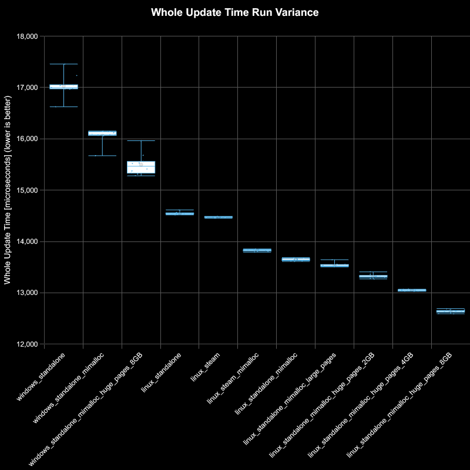

| Configuration                            | Execution Time Range (ms) | Spread (ms) | Effective UPS |
| ---------------------------------------- | ------------------------- | ----------- | ------------- |
| linux_steam                              | 260_100 ... 260_763       | ~663        | ~69.1         |
| linux_standalone_mimalloc_huge_pages_4GB | 234_561 ... 235_319       | ~758        | ~76.6         |
| linux_steam_mimalloc                     | 248_240 ... 249_334       | ~1,094      | ~72.3         |
| linux_standalone_mimalloc                | 245_038 ... 246_363       | ~1,325      | ~73.3         |
| linux_standalone                         | 261_376 ... 263_096       | ~1,720      | ~68.7         |
| linux_standalone_mimalloc_huge_pages_8GB | 226_706 ... 228_459       | ~1,753      | ~79.2         |
| linux_standalone_mimalloc_huge_pages_2GB | 238_913 ... 241_397       | ~2,484      | ~75.1         |
| linux_standalone_mimalloc_large_pages    | 243_149 ... 245_659       | ~2,510      | ~73.9         |
| windows_standalone                       | 299_286 ... 314_209       | ~14,923     | ~58.5         |

**Observations**

1. **Most stable**: `linux_steam` (no mimalloc) has the tightest variance at only ~663ms spread across 10 runs
2. **Best performance + low variance**: `huge_pages_8GB` achieves the fastest times (~79 UPS) with reasonable variance
3. **Unexpected**: `linux_standalone_mimalloc_huge_pages_2GB` and `linux_standalone_mimalloc_large_pages` have higher variance than expected compared to 4GB/8GB configurations
4. **Windows warm-up effect**: Windows shows a pattern where run 0 is faster, then runs 1-2 are slower before stabilizing. Linux configurations don't exhibit this pattern as strongly.

In summary though, Linux reduces the run variance by an order of magnitude and in some cases two orders of magnitude making Linux the clear favorite for benchmark consistency.

### All Metrics
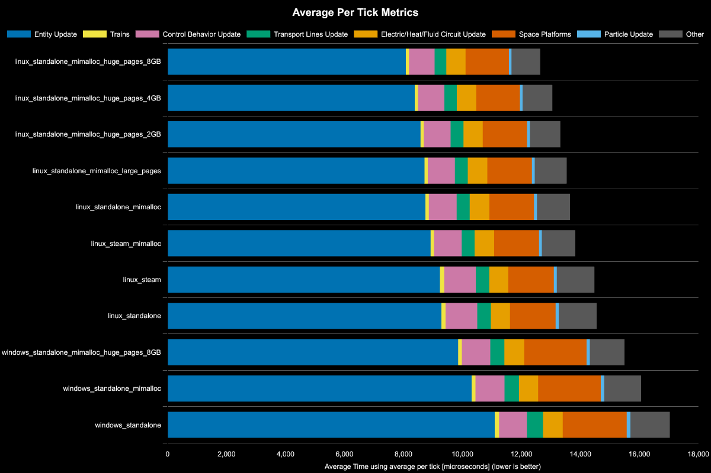

| Save File                                | Entity Update | Space Platforms | Control Behavior Update | Electric/Heat/Fluid Circuit Update | Transport Lines Update | Trains | Particle Update | Other | Whole Update | % Decrease from Previous | % Decrease from Best |
| ---------------------------------------- | ------------- | --------------- | ----------------------- | ---------------------------------- | ---------------------- | ------ | --------------- | ----- | ------------ | ------------------------ | -------------------- |
| linux_standalone_mimalloc_huge_pages_8GB | 8082          | 1470            | 868                     | 652                                | 400                    | 104    | 86              | 975   | 12637        |                          | 0%                   |
| linux_standalone_mimalloc_huge_pages_4GB | 8383          | 1484            | 896                     | 657                                | 423                    | 107    | 89              | 1008  | 13047        | -3.24%                   | -3.24%               |
| linux_standalone_mimalloc_huge_pages_2GB | 8576          | 1502            | 911                     | 657                                | 434                    | 111    | 93              | 1036  | 13321        | -2.1%                    | -5.41%               |
| linux_standalone_mimalloc_large_pages    | 8714          | 1509            | 917                     | 666                                | 435                    | 112    | 98              | 1087  | 13539        | -1.63%                   | -7.13%               |
| linux_standalone_mimalloc                | 8746          | 1512            | 946                     | 671                                | 438                    | 114    | 97              | 1121  | 13646        | -0.79%                   | -7.98%               |
| linux_steam_mimalloc                     | 8919          | 1517            | 941                     | 665                                | 436                    | 116    | 98              | 1135  | 13828        | -1.33%                   | -9.42%               |
| linux_steam                              | 9237          | 1549            | 1073                    | 640                                | 458                    | 142    | 101             | 1275  | 14474        | -4.68%                   | -14.54%              |
| linux_standalone                         | 9285          | 1547            | 1080                    | 649                                | 461                    | 140    | 102             | 1285  | 14549        | -0.51%                   | -15.13%              |
| windows_standalone                       | 11093         | 2167            | 941                     | 672                                | 547                    | 149    | 124             | 1337  | 17031        | -17.06%                  | -34.77%              |

**Observations**
- The "Whole Update" time is lowest for `linux_standalone_mimalloc_huge_pages_8GB` (12.637 ms), and highest for Windows (17.031 ms), a 34.8% difference.
- All Linux configs outperform Windows by a large margin

### Entity Update Time
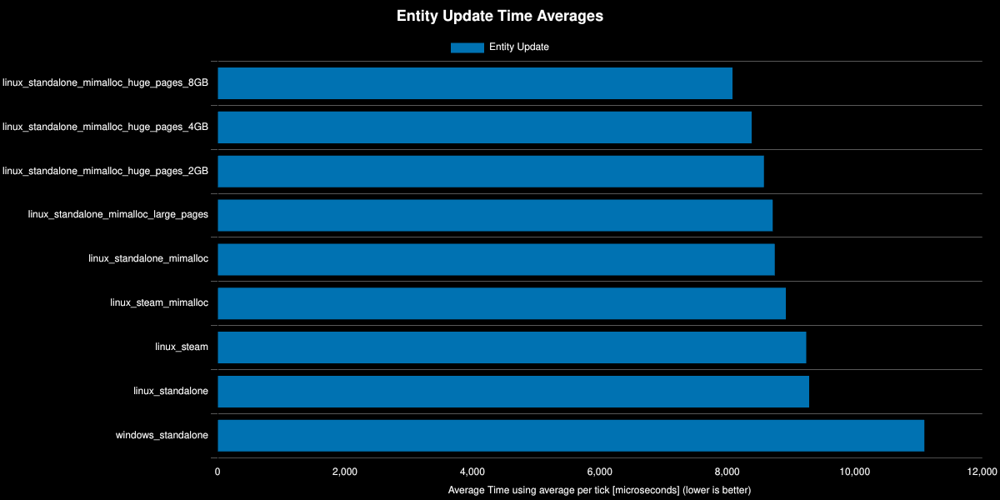

| Save File                                | Entity Update | % Decrease from Previous | % Decrease from Best |
| ---------------------------------------- | ------------- | ------------------------ | -------------------- |
| linux_standalone_mimalloc_huge_pages_8GB | 8082          |                          | 0%                   |
| linux_standalone_mimalloc_huge_pages_4GB | 8383          | -3.73%                   | -3.73%               |
| linux_standalone_mimalloc_huge_pages_2GB | 8576          | -2.3%                    | -6.12%               |
| linux_standalone_mimalloc_large_pages    | 8714          | -1.6%                    | -7.82%               |
| linux_standalone_mimalloc                | 8746          | -0.36%                   | -8.21%               |
| linux_steam_mimalloc                     | 8919          | -1.99%                   | -10.36%              |
| linux_steam                              | 9237          | -3.57%                   | -14.3%               |
| linux_standalone                         | 9285          | -0.51%                   | -14.89%              |
| windows_standalone                       | 11093         | -19.48%                  | -37.27%              |

This metric shows the largest improvement for Linux over Windows. Comparing only the standalone versions results in a 19.48% improvement of Linux over Windows.

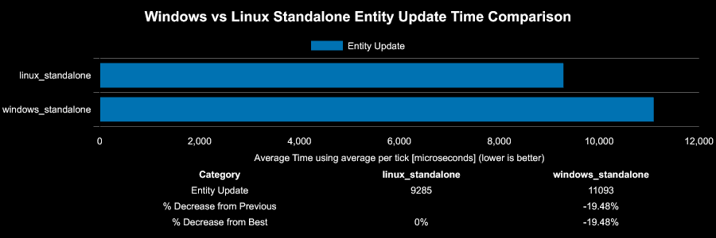

For the standalone version only in Linux, there is a clear improvement that comes from using mimalloc, especially with huge pages.

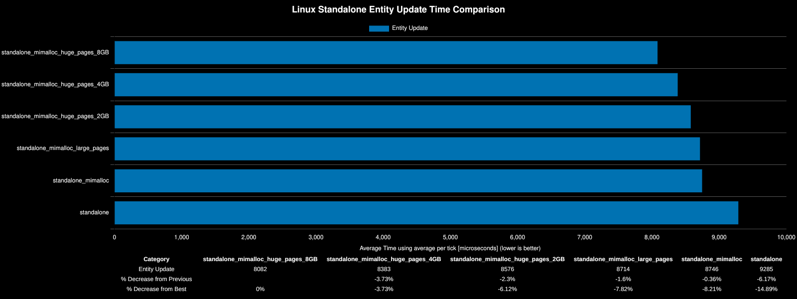

### Multi Threaded Metrics
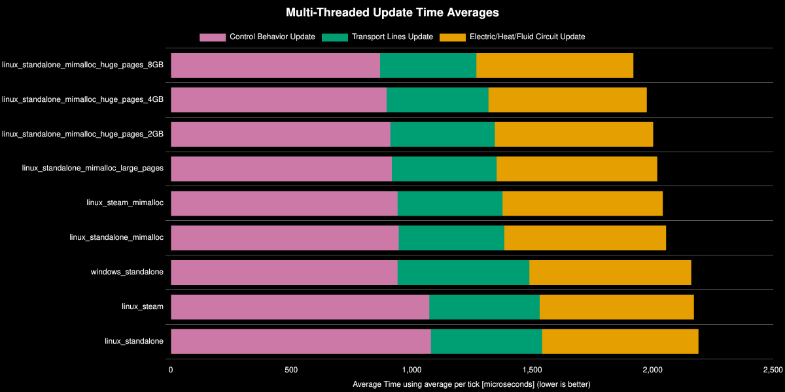
| Save File                                | Control Behavior Update | Electric/Heat/Fluid Circuit Update | Transport Lines Update | % Decrease from Previous | % Decrease from Best |
| ---------------------------------------- | ----------------------- | ---------------------------------- | ---------------------- | ------------------------ | -------------------- |
| linux_standalone_mimalloc_huge_pages_8GB | 868                     | 652                                | 400                    |                          | 0%                   |
| linux_standalone_mimalloc_huge_pages_4GB | 896                     | 657                                | 423                    | -2.92%                   | -2.92%               |
| linux_standalone_mimalloc_huge_pages_2GB | 911                     | 657                                | 434                    | -1.34%                   | -4.3%                |
| linux_standalone_mimalloc_large_pages    | 917                     | 666                                | 435                    | -0.83%                   | -5.16%               |
| linux_steam_mimalloc                     | 941                     | 665                                | 436                    | -1.16%                   | -6.38%               |
| linux_standalone_mimalloc                | 946                     | 671                                | 438                    | -0.67%                   | -7.09%               |
| windows_standalone                       | 941                     | 672                                | 547                    | -5.06%                   | -12.51%              |
| linux_steam                              | 1073                    | 640                                | 458                    | -0.51%                   | -13.09%              |
| linux_standalone                         | 1080                    | 649                                | 461                    | -0.86%                   | -14.07%              |

The results from these metrics were unexpected as the multi threaded performance in Linux was worse than windows using `malloc` as the memory allocator. Once `mimalloc` was introduced however, linux pulls ahead.


The following sections demonstrate this pattern as well in the breakdowns by individual multi threaded metric.

#### Control Behavior Update Time
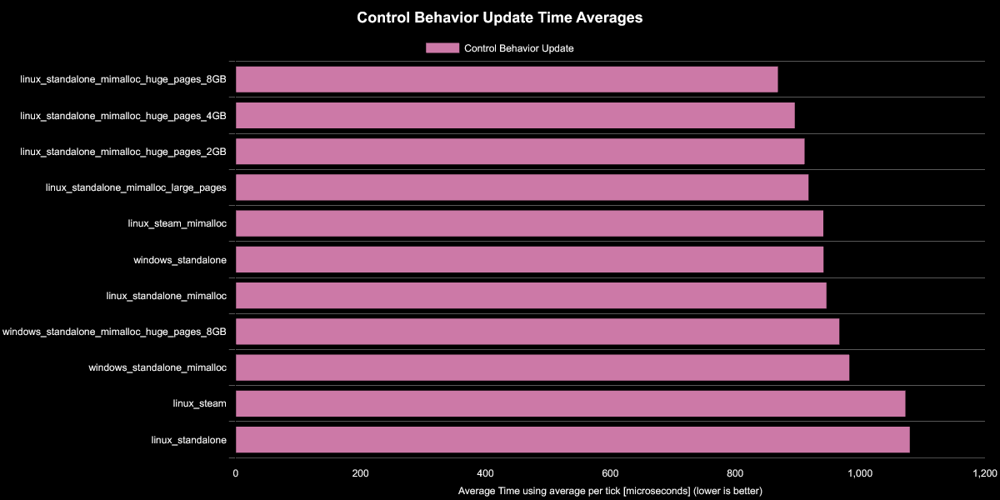
| Save File                                | Control Behavior Update | % Decrease from Previous | % Decrease from Best |
| ---------------------------------------- | ----------------------- | ------------------------ | -------------------- |
| linux_standalone_mimalloc_huge_pages_8GB | 868                     |                          | 0%                   |
| linux_standalone_mimalloc_huge_pages_4GB | 896                     | -3.14%                   | -3.14%               |
| linux_standalone_mimalloc_huge_pages_2GB | 911                     | -1.74%                   | -4.94%               |
| linux_standalone_mimalloc_large_pages    | 917                     | -0.67%                   | -5.65%               |
| linux_steam_mimalloc                     | 941                     | -2.6%                    | -8.4%                |
| windows_standalone                       | 941                     | -0.01%                   | -8.41%               |
| linux_standalone_mimalloc                | 946                     | -0.52%                   | -8.98%               |
| linux_steam                              | 1073                    | -13.37%                  | -23.55%              |
| linux_standalone                         | 1080                    | -0.65%                   | -24.35%              |

#### Electric / Heat / Fluid / Circuit Update Time
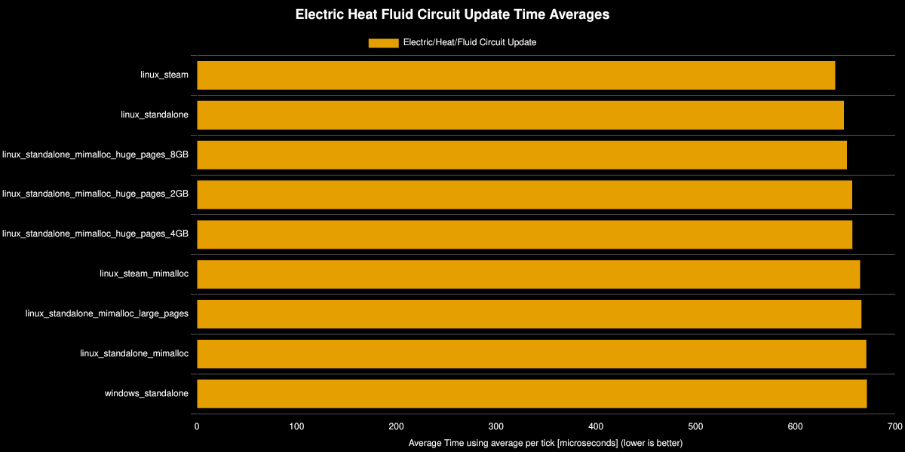
| Save File                                | Electric/Heat/Fluid Circuit Update | % Decrease from Previous | % Decrease from Best |
| ---------------------------------------- | ---------------------------------- | ------------------------ | -------------------- |
| linux_steam                              | 640                                |                          | 0%                   |
| linux_standalone                         | 649                                | -1.36%                   | -1.36%               |
| linux_standalone_mimalloc_huge_pages_8GB | 652                                | -0.47%                   | -1.83%               |
| linux_standalone_mimalloc_huge_pages_2GB | 657                                | -0.82%                   | -2.67%               |
| linux_standalone_mimalloc_huge_pages_4GB | 657                                | -0.02%                   | -2.68%               |
| linux_steam_mimalloc                     | 665                                | -1.19%                   | -3.91%               |
| linux_standalone_mimalloc_large_pages    | 666                                | -0.19%                   | -4.11%               |
| linux_standalone_mimalloc                | 671                                | -0.74%                   | -4.88%               |
| windows_standalone                       | 672                                | -0.08%                   | -4.97%               |

#### Transport Line Update Time
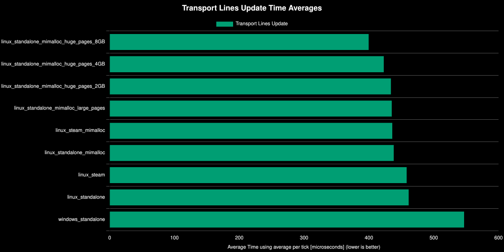
| Save File                                | Transport Lines Update | % Decrease from Previous | % Decrease from Best |
| ---------------------------------------- | ---------------------- | ------------------------ | -------------------- |
| linux_standalone_mimalloc_huge_pages_8GB | 400                    |                          | 0%                   |
| linux_standalone_mimalloc_huge_pages_4GB | 423                    | -5.82%                   | -5.82%               |
| linux_standalone_mimalloc_huge_pages_2GB | 434                    | -2.59%                   | -8.56%               |
| linux_standalone_mimalloc_large_pages    | 435                    | -0.3%                    | -8.88%               |
| linux_steam_mimalloc                     | 436                    | -0.19%                   | -9.09%               |
| linux_standalone_mimalloc                | 438                    | -0.54%                   | -9.68%               |
| linux_steam                              | 458                    | -4.53%                   | -14.66%              |
| linux_standalone                         | 461                    | -0.67%                   | -15.43%              |
| windows_standalone                       | 547                    | -18.53%                  | -36.82%              |


### Huge Pages Memory Size
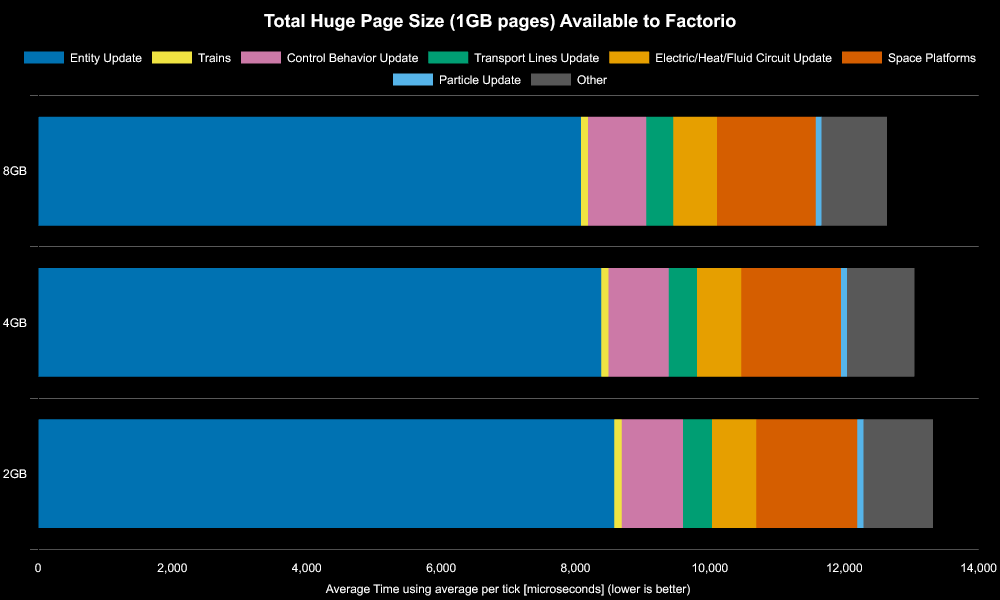

| Save File | Entity Update | Space Platforms | Control Behavior Update | Electric/Heat/Fluid Circuit Update | Transport Lines Update | Trains | Particle Update | Other | Whole Update | % Decrease from Previous | % Decrease from Best |
| --------- | ------------- | --------------- | ----------------------- | ---------------------------------- | ---------------------- | ------ | --------------- | ----- | ------------ | ------------------------ | -------------------- |
| 8GB       | 8082          | 1470            | 868                     | 652                                | 400                    | 104    | 86              | 975   | 12637        |                          | 0%                   |
| 4GB       | 8383          | 1484            | 896                     | 657                                | 423                    | 107    | 89              | 1008  | 13047        | -3.24%                   | -3.24%               |
| 2GB       | 8576          | 1502            | 911                     | 657                                | 434                    | 111    | 93              | 1036  | 13321        | -2.1%                    | -5.41%               |

Each step down in huge page size or mimalloc config increases the whole update time by 2–3%.

It is important to keep in mind that this save file is a very large save file with very high entity counts. This may explain why the performance increased linearly as huge pages assigned to factorio increased.

There are most likely diminishing returns for smaller save files which won't reflect this same performance. Additionally, the amount of RAM allocated to a save file is dependent on multiple factors:
1. mods enabled
2. the size of your blueprint library as that needs to be stored in memory

### Steam vs Standalone Distributions

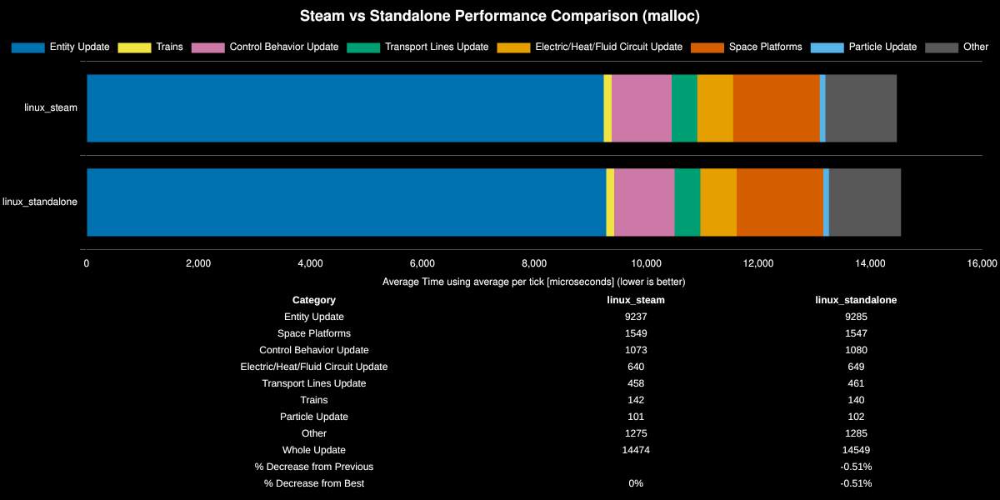

Both versions perform almost identically with no noticeable difference between the versions using `malloc`.

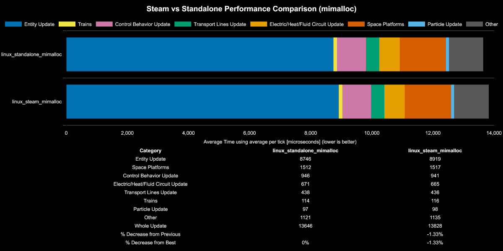

Once `mimalloc` is applied however, the `standalone` version performs better.

### Timeseries Graphs

Because they are beautiful. Ordered descending by performance.

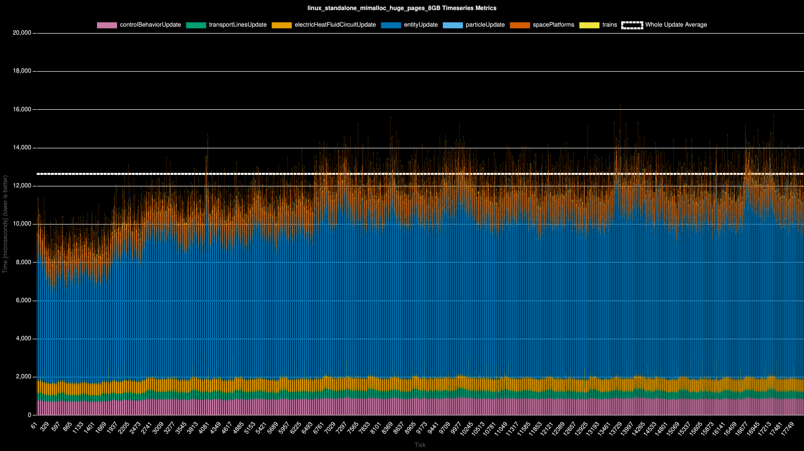
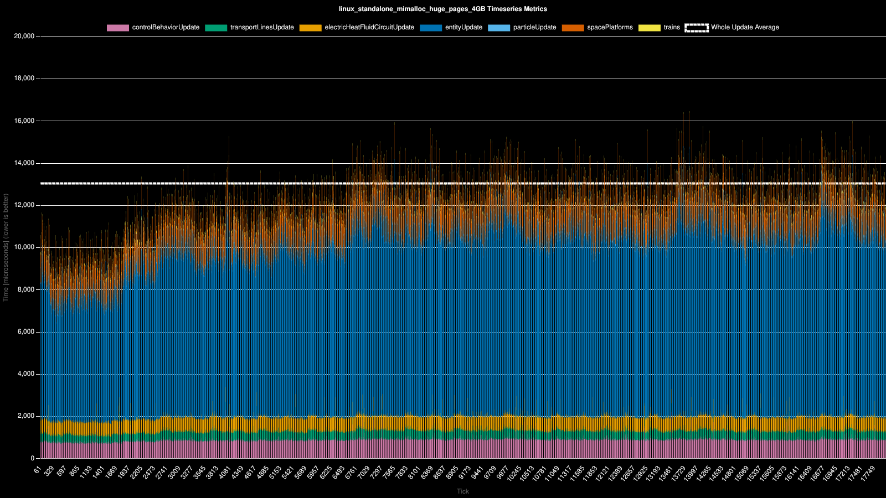
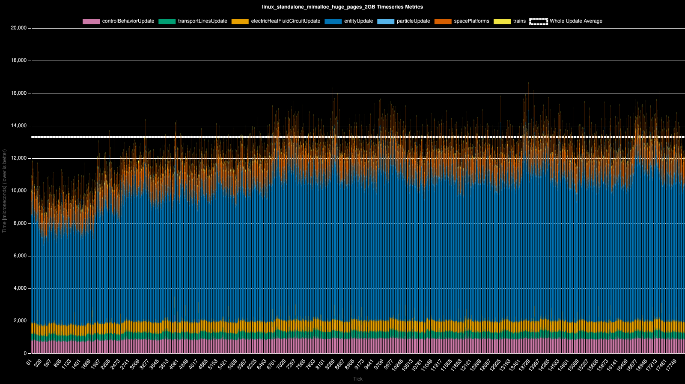
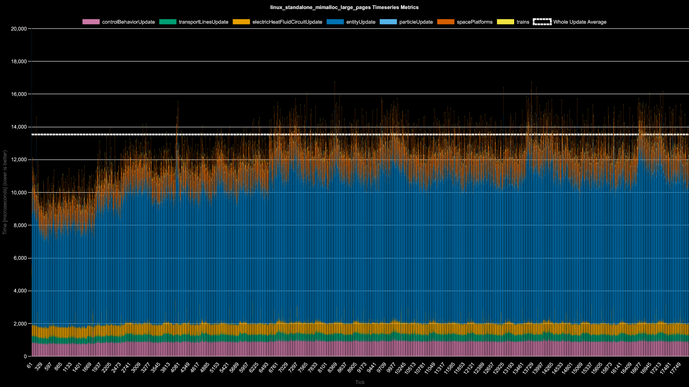
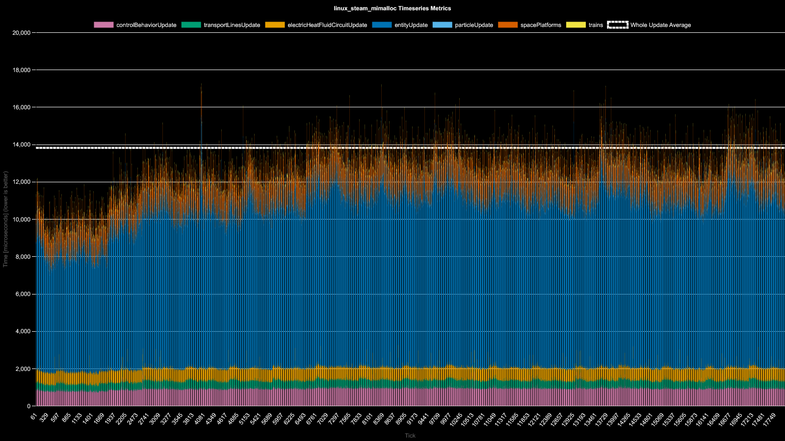
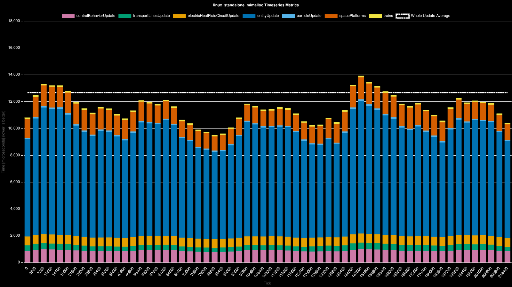
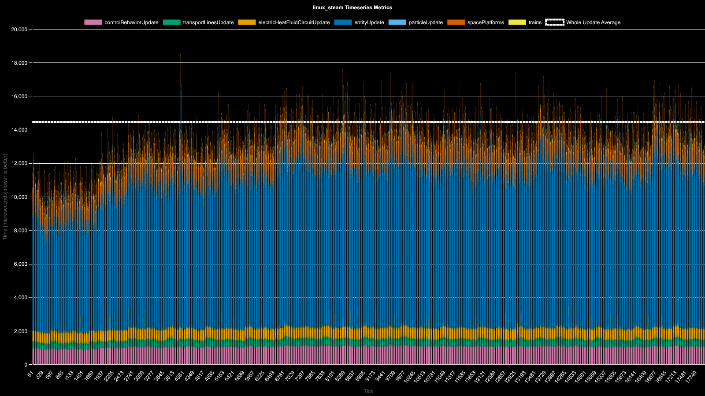
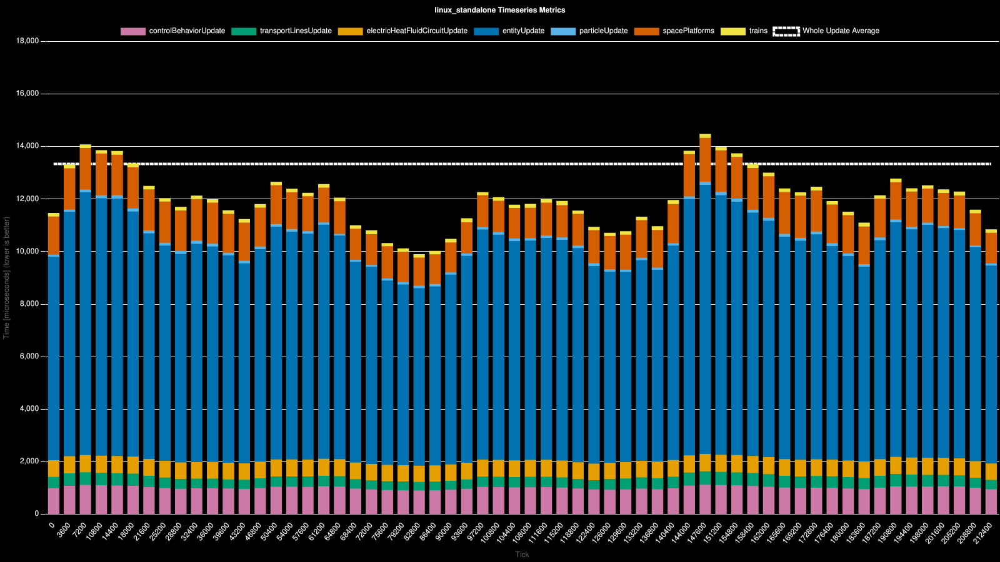
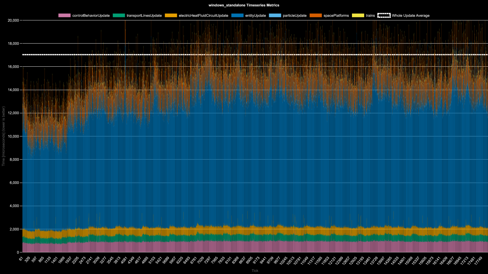


## Credits

A special thank you to [@florishafkenscheid](https://github.com/florishafkenscheid) and [@jfroy](https://github.com/jfroy) in the help configuring and setting up huge pages and general linux stuff.