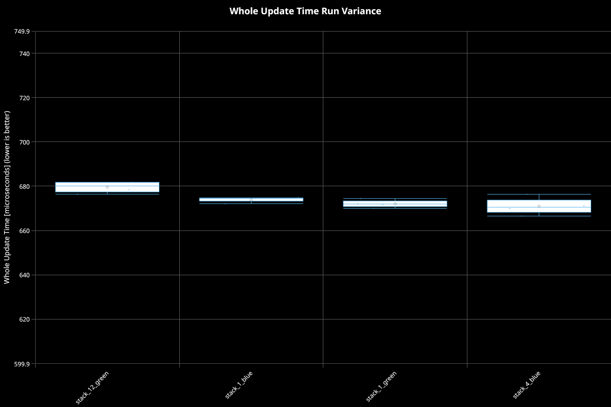
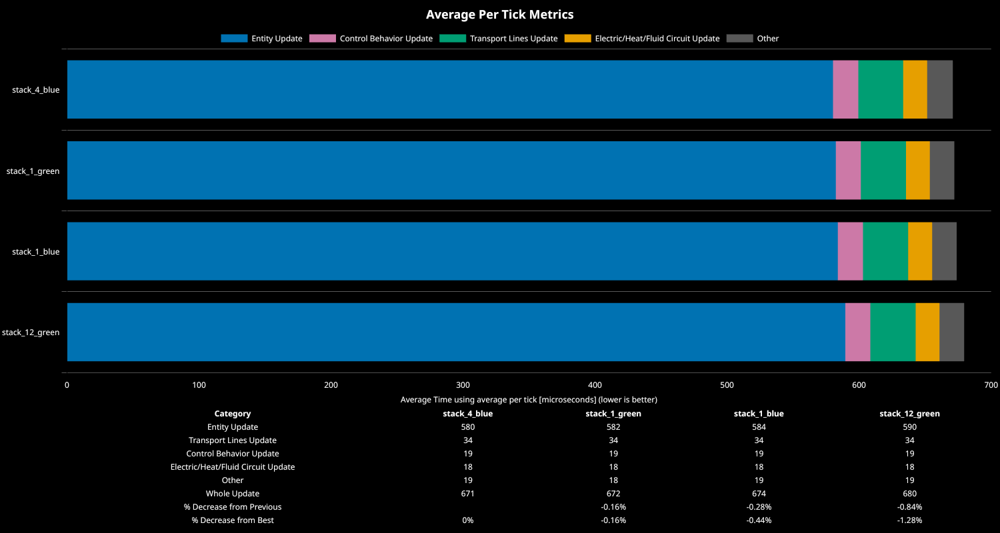
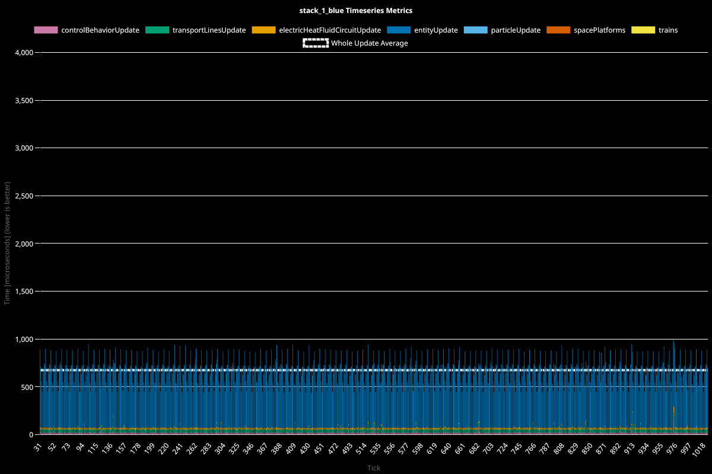
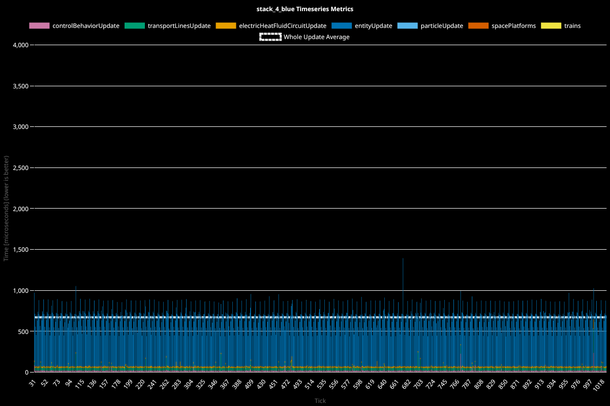

# Factorio Benchmark Results

**Platform:** linux-x86_64
**Factorio Version:** 2.0.73

## The Question
Does setting the stack size, or use of fast (blue) vs bulk (green) inserters for use in picking up asteroids, influence UPS in a measurable way?

## Conclusion
The results all fall within a single percent of eachother, not following the expected order, from which I conclude it all falls within the margin of error.

## Scenario
* Each save was tested for 60000 tick(s) and 16 run(s)

stack_x indicates the set stack size of the inserter. 
Blue means the use of a fast inserter, while green refers to bulk inserters.

## Run Distribution

## Results
| Metric            | Description                           |
| ----------------- | ------------------------------------- |
| **Mean UPS**      | Updates per second – higher is better |
| **Mean Avg (ms)** | Average frame time – lower is better  |
| **Mean Min (ms)** | Minimum frame time – lower is better  |
| **Mean Max (ms)** | Maximum frame time – lower is better  |

| Save | Avg (ms) | Min (ms) | Max (ms) | UPS | Execution Time (ms) | % Difference from base |
|------|----------|----------|----------|-----|---------------------|------------------------|
| stack_12_green | 0.681 | 0.412 | 53.067 | 1468 | 163446 | 0.00% |
| stack_1_blue | 0.676 | 0.415 | 52.644 | 1480 | 162090 | 0.84% |
| stack_1_green | 0.673 | 0.417 | 53.463 | 1484 | 161648 | 1.11% |
| stack_4_blue | 0.672 | 0.416 | 51.346 | **1487** | 161369 | 1.29% |

## Timeseries Charts

