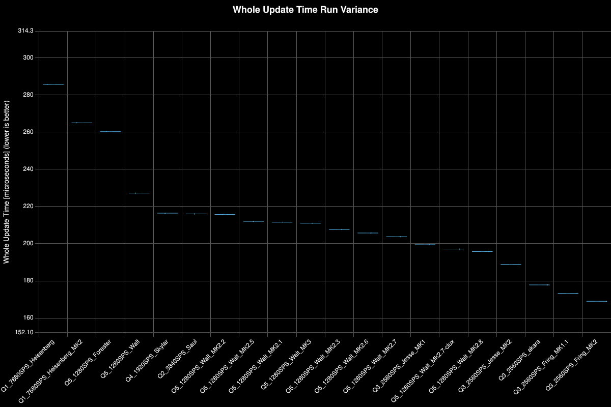
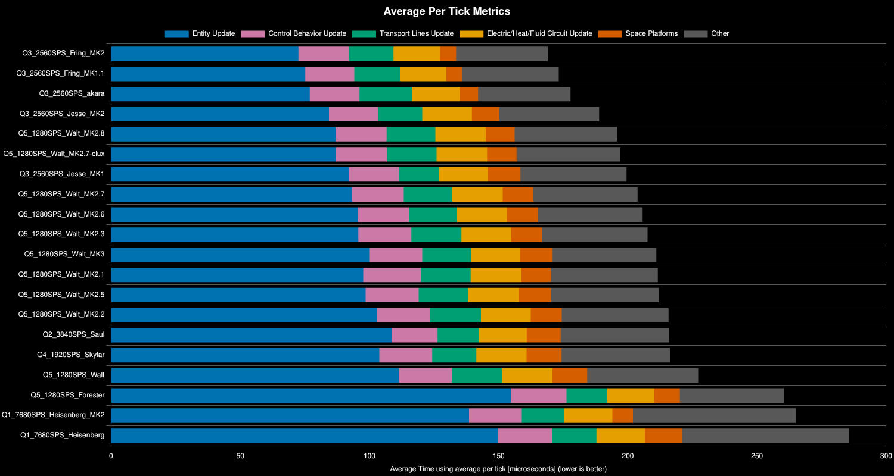
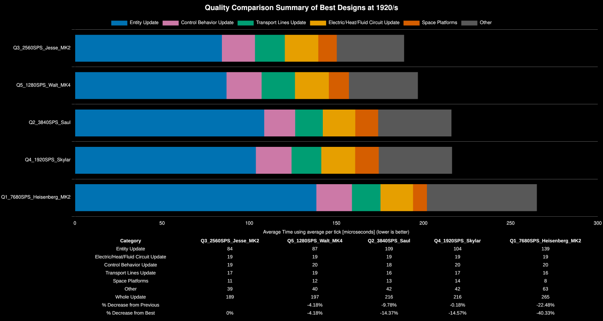
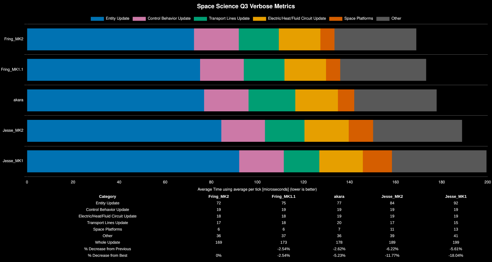
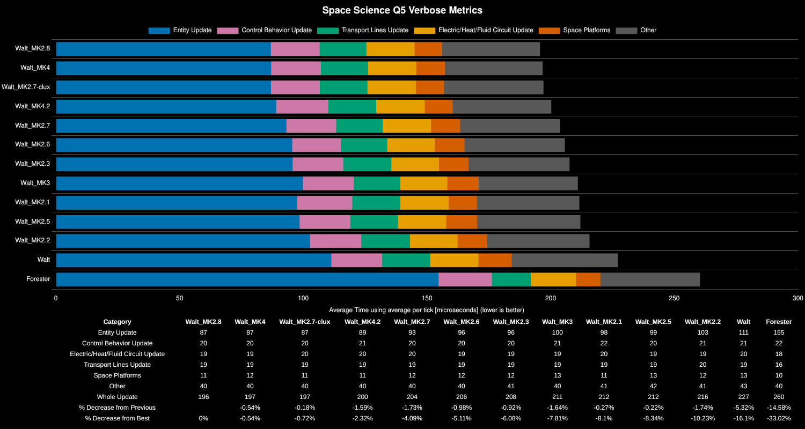
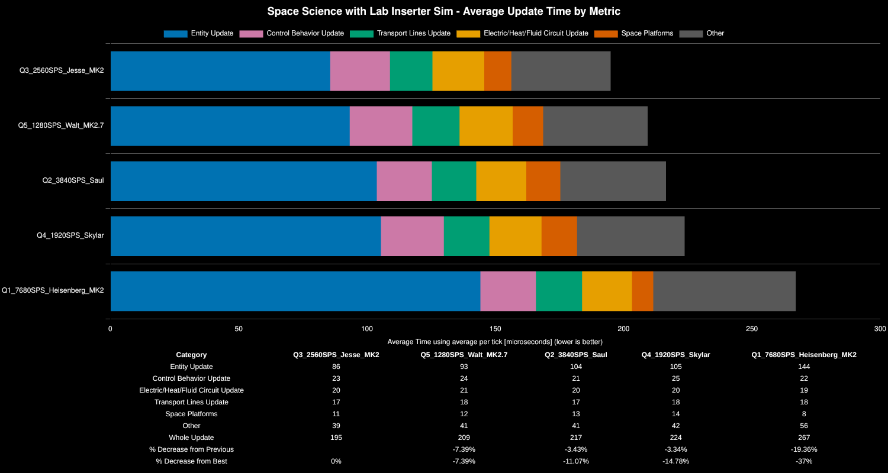

# Space Science Quality Comparison

**Platform:** linux-x86_64

**Factorio Version:** 2.0.76

**Date:** 2026-03-23

Special thanks to Yuu and Clux for the help refining Walt

## The Question
Which space science quality takes the least update time? The question is complex since each quality level requires more asteroid upcycling but reduces the number of buildings and inserters for producing the science. At the extreme, Q1 requires no upcycling but the most science assemblers. Q5 requires the most upcycling but the least number of production buildings.

A secondary goal is to answer if several small ships is better or having one large ship for space science.

## Conclusion

- Q3 is the sweet spot between science ingredient production and asteroid upcycling
- clocked lab inserters have little to no impact on the results
- Larger ships are better than smaller ships
- asteroid clocking makes an improvement
  - dependent on distnace in tiles between asteroid collectors
  - clocking collectors slower in less dense areas and faster in high density areas is better than only the faster fixed schedule for the entire trip
- clocking direct insert fusion cells is better

## Scenario

Blueprint book of all designs: https://factoriobin.com/post/o2k88b

- 1920/s ships in each quality are designed
  - Q1 produces 1920/s, legendary produces 320/s
- three 3840/s Q3 ships are used to check if number of ships matter
- Each save is tested for 648k ticks (3 hours)
- Lab inserter simulation tests are run for 324k ticks (see explanation below)

### Lab Simulation Tests

In order to simulate labs, 32 stack inserters are assigned per 120 science per second consumption. They are controlled with a clock respective to their simulated consumption rate at each science quality level. 
For example, Q1 science has each inserter swing once every 256 ticks. Q2 is double that at 512 and Q6 is six times every 1536 ticks. Strictly speaking, you will need 33 labs to consume a full 120 per second per lane, but for simplicity in the modeling this has been rounded down to 32 to keep the clock very simple.

The platforms are simulated for an hour until steady state is achieved. The inserters simulating the labs during this warm up period are unloading into infinity chests. The game is paused and all infinity chests are replaced with Q5 steel chests. This gives us 6400 seconds for normal quality per chest before the chests are full to run a simulation. Given this is the case, the benchmark is conducted for 324k ticks which is 90 minutes of simulation. This could be pushed up to 384k ticks, but 90 minutes is chosen due to it being easier to reason about than 107 and change minutes.

## Run Distribution

## Results
| Metric            | Description                           |
| ----------------- | ------------------------------------- |
| **Mean UPS**      | Updates per second – higher is better |
| **Mean Avg (ms)** | Average frame time – lower is better  |
| **Mean Min (ms)** | Minimum frame time – lower is better  |
| **Mean Max (ms)** | Maximum frame time – lower is better  |

## All Designs

## Quality Comparison

Q4 and Q2 perform almost identically. Q5 performs better, but Q3 even with less design iterations still outperforms the best Q5 variant the community could come up with.

| Save File                 | Entity Update | Electric/Heat/Fluid Circuit Update | Control Behavior Update | Transport Lines Update | Space Platforms | Other | Whole Update | % Decrease from Previous | % Decrease from Best |
| ------------------------- | ------------- | ---------------------------------- | ----------------------- | ---------------------- | --------------- | ----- | ------------ | ------------------------ | -------------------- |
| Q3_2560SPS_Jesse_MK2      | 84            | 19                                 | 19                      | 17                     | 11              | 39    | 189          |                          | 0%                   |
| Q5_1280SPS_Walt_MK4       | 87            | 19                                 | 20                      | 19                     | 12              | 40    | 197          | -4.18%                   | -4.18%               |
| Q2_3840SPS_Saul           | 109           | 19                                 | 18                      | 16                     | 13              | 42    | 216          | -9.78%                   | -14.37%              |
| Q4_1920SPS_Skylar         | 104           | 19                                 | 20                      | 17                     | 14              | 42    | 216          | -0.18%                   | -14.57%              |
| Q1_7680SPS_Heisenberg_MK2 | 139           | 19                                 | 20                      | 16                     | 8               | 63    | 265          | -22.48%                  | -40.33%              |

## Larger vs Smaller Ships

Q3 ships were scaled up to compete with the smaller 640/s Jesse ships to the larger 1280/s Fring variants.

The ship named "akara" was submitted by a community member many months prior to this experiment as a proof of concept, which initially proved that with less optimizations it performed better than the smaller ship.

This resulted in "The Fring" being born which takes the best optimizations learned from Q5. The final version Fring_MK2 added ice upcycling via water voiding which gave the last 2.5% delta.

The recommendation is to scale up the ship to meet the demand of your factory rather than deploying multiple smaller ships.

## Legendary Optimizations

Community discussions around Q5 yielded many optimizations to the original Walt MK1 design. Everyone wanted Q5 to win and dind't want to believe that Q3 was better so the majority of time was spent optimizing and refining Walt MK1 until the ultimate best versions of MK2.8 and MK4 which were almost identical (1 microsecond delta).

The following graph shows the optimizations over time:

The design "Forester" is the baseline design for Q5 that abucnasty originally created and wanted to refine. Walt is a complete deviation from this design.

The full changelog can be found here of each optimization: [walt changelog](changelogs/walt_q5.md)

## Simulating Lab Inserters
The question is if lab inserters make enough of a difference to justify the higher quality since they need to swing less often.

Even with the simulated inserters, the results remain unchanged.

# Conclusion

## Overview
- Q3 is the sweet spot between science ingredient production and asteroid upcycling
- Larger ships are better than smaller ships

## Community Discussion Highlights

The following insights emerged from community discussions during the benchmark development:

### Quality Level Observations
- **Q3 (Rare) emerged as the winner** — The sweet spot between production complexity and upcycling overhead
- **Q4 and Q2 performed nearly identically** — Both at 216μs despite different quality levels
- **Q1 was ~57% worse than Q3** — 265μs vs 169μs; the sheer number of production buildings and inserters at normal quality creates significant overhead
- **Q5 (Legendary) had high upcycling cost** — While requiring fewer assemblers, the asteroid reprocessing overhead negated the benefits

### Ship Scaling Insights
- **Larger ships outperform multiple smaller ships**
- **Each platform has its own independent circuit/electric network** — This isolation creates overhead that compounds with more ships
- **Recommendation: "Scale up the ship, don't copy it"** — When you need more throughput, expand an existing ship rather than duplicating

### Validated Design Optimizations

| Optimization                           | Before → After | Savings   |
| -------------------------------------- | -------------- | --------- |
| Collector clocking (1/22 ticks)        | 227→208μs      | 19μs (8%) |
| Q2 ice→Q3 upcycling via oxide crushing | MK1→MK2        | 4μs (2%)  |

- **Collector clocking**: Enabling collectors for only 1 out of every 22 ticks reduced entity update time significantly
- **Distance-based clocking refinement**: Adjusting from 1/40 to 1/30 ticks in low-density asteroid zones improved performance
- **Ice upcycling via oxide crushing**: Fring MK2's approach of crushing oxide asteroids for extra Q3 ice contributed to its victory
- **Accumulator-based fusion clocking**: Replacing solar panels with accumulators to clock fusion reactors
- **Belt sorting by highest available item**: Both Fring and Walt final versions implemented this for reprocessing efficiency

### Defense Considerations
- **Gun turrets over laser turrets** — Gun turret activation takes ~14 ticks vs ~21 for laser turrets, requiring fewer active ticks per kill
- Lasers were ignored due to the above fact in all of these tests

### Asteroid Processing Tips
- **Q4 crushing with quality modules** — Yields ~18.7% extra Q5 ore output compared to standard reprocessing. Similar results apply at lower quality levels to get more ice, but lower quality levels require more possible quality item outputs compared to only epic or legendary.
- **Ice asteroids to oxide** — Oxide gives 5 ice each with double processing speed, making it easier to handle with inserters